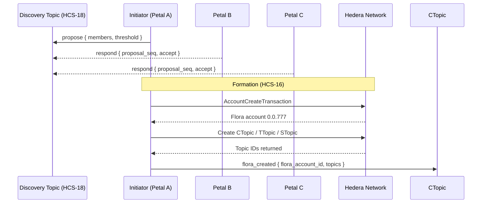
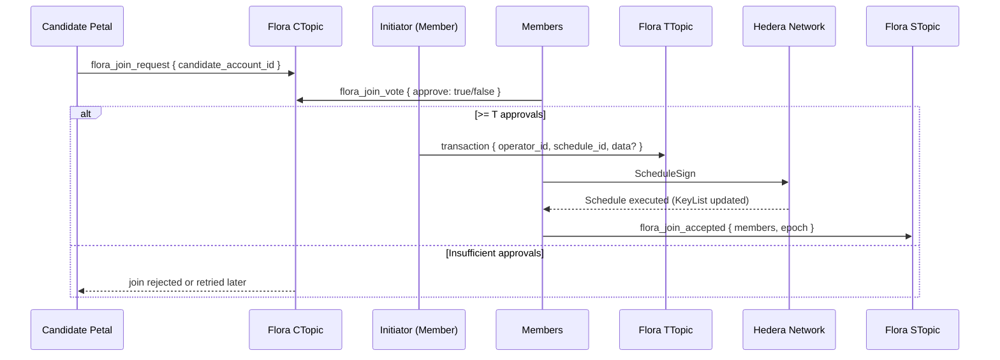

# HCS‑16 Standard: Floras: Coordinated Escrow, Communication, and Execution Accounts

### Status: **Draft**

### Version: **1.0**

---

## Table of Contents

1. [Authors](#authors)
2. [Abstract](#abstract)
3. [Motivation](#motivation)
4. [Terminology](#terminology)
5. [Specification](#specification)  
   5.1. [Prerequisites](#prerequisites)  
   5.2. [Flora Account Creation](#flora-account-creation)  
   5.3. [Flora Topics](#flora-topics)  
   5.4. [Profile Schema](#profile-schema)  
   5.5. [Message Protocol](#message-protocol)  
   5.6. [Lifecycle Flows](#lifecycle-flows)  
   5.7. [Reference Implementation](#reference-implementation)
6. [Security Considerations](#security-considerations)
7. [Versioning & Upgrades](#versioning--upgrades)
8. [References](#references)
9. [Change Log](#change-log)

---

## Authors

- **Patches** https://twitter.com/tmcc_patches
- **Kantorcodes** https://twitter.com/kantorcodes

---

## Abstract

Flora accounts extend the **HCS‑15 Petal / Profile account** concept to groups of two or more independent accounts that wish to transact and maintain shared state under a single on‑chain entity. 

A Flora account is controlled by a **threshold key** (or key list) composed of the public keys of its member Petal accounts, and is accompanied by three mandatory Hedera Consensus Service (HCS) topics: **communication**, **transaction**, and **state**, each protected by the same keylist (with varying thresholds). This standard defines:

- The canonical JSON schema for Flora metadata stored in account memos and HCS messages.
- The on‑chain and off‑chain message flows required to create, operate, and dissolve a Flora.
- Best‑practice security parameters for multi‑signature weights, membership changes, and data availability.

---

## Motivation

Modern autonomous agents and decentralized applications increasingly require **temporary, permissioned syndicates**: escrow wallets, joint ventures, working groups, or federated AI tasks. 

Manually deploying custom multisig contracts or ad‑hoc shared keys is error‑prone, expensive, and lacks discoverability. 

HCS‑16 solves this by:
1. **Discoverability & Negotiation** – Flora requests travel over existing HCS‑10 channels, leveraging the addressing and routing primitives agents already use.
2. **Native Multisig** – Hedera’s ThresholdKey is used directly; no Solidity bridges or custom bytecode are needed, reducing gas and audit surface.
3. **Topic‑Scoped State** – Flora’s dedicated topics isolate chat, scheduled transactions, and state attestations, preserving communication and concurrency.
4. **Composability** – Because each member is itself a Petal account, existing HCS‑15 tooling (profile resolution, escrow partitioning, etc.) works unchanged inside a Flora.

---

## Terminology

| Term                         | Meaning                                                                      |
| ---------------------------- | ---------------------------------------------------------------------------- |
| **Petal**                    | An HCS‑15 account that shares a private key with its Base account.           |
| **Member**                   | A Petal account that participates in a Flora.                                |
| **Flora**                    | The multisig account created under HCS‑16.                                   |
| **Threshold Key `T/M`**      | A key that requires `T` valid signatures out of `M` total keys.              |
| **CTopic / TTopic / STopic** | Shorthand for the Communication, Transaction, and State topics respectively. |

---

## Specification

### Prerequisites

A Flora **MUST** be composed of ≥ 2 Petal accounts that:
- Has a valid [HCS‑11](/docs/standards/hcs-11) Petal profile with an `inboundTopicId`.
- Is able to sign Hedera transactions with an **ECDSA/secp256k1** key (required for future encryption; ED25519 keys cannot encrypt data).

### Flora Account Creation

1. **Discovery ([HCS‑18](/docs/standards/hcs-18))** ‑ Pre‑formation negotiation occurs via the public HCS‑18 discovery topic using `announce`/`propose`/`respond`. The proposer references candidate announcements; candidates accept or reject. After initial acceptance, sensitive terms MAY move to [HCS‑10](/docs/standards/hcs-10) inbound topics for private negotiation. Output of discovery: agreed `memberAccounts`, `threshold` (`T` of `M`), and any funding expectations.
2. **Key Assembly** – A `KeyList` **MUST** be constructed containing each member’s **public key** with the agreed‐upon threshold.
3. **Account Create Tx** – Any member submits `AccountCreateTransaction` with:
   - `key = KeyList(threshold, keys[])`
   - `maxAutomaticTokenAssociations = -1` (recommended)
   - `initialBalance = X hbar` (funded by proposer)
4. **Topic Creation** – Immediately after account creation, three `ConsensusCreateTopicTransaction`s are created for the Flora account with:
   - `adminKey = KeyList with T/M threshold`
   - `submitKey = KeyList with 1/M threshold` (submitKeys should always be 1/M to allow all members to post to inter-flora communication channels)
   - `memo = "hcs-16:<flora account id>:<type enum>"` where `<type>` = `{0:communication,1:transaction,2:state}`
5. **Profile Publication** – A Flora **profile object** is uploaded to an HCS topic _or_ IPFS/Arweave, and the Flora account memo is set to:
   ```
   hcs-11:<resourceLocator>
   ```
6. **Member Acknowledgement** – Once a super‑majority (`≥T`) of members publish a `flora_created` message to CTopic or post member state to STopic, the Flora is considered **Active**.

<!-- > **NOTE**   If any step fails to reach `T` acknowledgements within `TTL` (default = 7 days), the initiator **SHOULD** recycle the partial resources and mark the Flora as **Aborted**. -->

### Internal Flora Topics

| Topic                            | Purpose                                                                                                                                                                                                                                 | Required | Memo Prefix           |
| -------------------------------- | --------------------------------------------------------------------------------------------------------------------------------------------------------------------------------------------------------------------------------------- | -------- | --------------------- |
| **Communication Topic (CTopic)** | Human / agent chat, off‑chain URL exchange, policy proposals, general communications. Future standards are planned to define task coordination.                                                                                         | ✅       | `hcs-16:${floraId}:0` |
| **Transaction Topic (TTopic)**   | Broadcast of pre‑signed ScheduledTxn IDs, token association proposals, contract calls.                                                                                                                                                  | ✅       | `hcs-16:${floraId}:1` |
| **State Topic (STopic)**         | Flora shared state that is needed for the Flora's purpose. Example: Periodic SHA‑256 hashes of shared state, vector clocks, membership attestations. This Topic is required for valid Floras even if not utilized intiially by members. | ✅       | `hcs-16:${floraId}:2` |

All three topics **SHOULD** share the exact same `adminKey` that is the same as the Flora's account key. `submitKey` **SHOULD** always be 1/M keylist threshold to allow each member to submit independently.

> **NOTE** HIP-991 custom fees can be added to require HBAR or a custom fungible token / NFT to submit messages on these topics. This should be agreed upon before Flora creation by member petals.

#### Topic Memo Format (canonical)

```
hcs-16:<flora_account_id>:<type>
```

- `<type>` is `0` = Communication, `1` = Transaction, `2` = State.

### Flora Memo Structure

Flora accounts use the HCS‑11 memo convention to reference their profile document. Do not duplicate that standard here; instead, see [HCS‑11](/docs/standards/hcs-11) for the canonical grammar and examples.

- Memo format (delegated to HCS‑11): `hcs-11:<resource>`
- `<resource>` may be an HCS HRL (`hcs://<standard>/<topicId>`) or another supported URI (IPFS/Arweave/HTTPS) as defined by HCS‑11.

### HCS-11 extended for HCS-16 Root Profile Schema

All profiles share these common fields:

| Field              | Type   | Required  | Description                                                                                                     |
| ------------------ | ------ | --------- | --------------------------------------------------------------------------------------------------------------- |
| version            | string | Yes       | Standard version (e.g., "1.0")                                                                                  |
| type               | number | Yes       | Profile type enum (0=personal [not officially supported yet], 1=ai_agent, 2=server, 3=flora, 4=bloom, 5=meadow) |
| display_name       | string | Yes       | Display name for the profile                                                                                    |
| **_members_**      | array  | **_Yes_** | **_Array of objects containing member petal account ids_**                                                      |
| **_threshold_**    | number | **_Yes_** | **_The number of private key signatures to sign valid transactions from the flora account_**                    |
| **_flora_topics_** | object | **_Yes_** | **_Object containing flora topic ids._**                                                                        |
| alias              | string | No        | Alternative identifier                                                                                          |
| bio                | string | No        | Brief description or biography                                                                                  |
| socials            | array  | No        | Array of social media links                                                                                     |
| profileImage       | string | No        | Protocol reference - either HRL for HCS protocols (e.g., "hcs://1/0.0.12345") or other URI formats              |
| properties         | object | No        | Additional unstructured profile properties                                                                      |
| inboundTopicId     | string | Yes       | [HCS-10](/docs/standards/hcs-10) inbound communication topic                                                    |
| outboundTopicId    | string | Yes       | [HCS-10](/docs/standards/hcs-10) action record topic                                                            |

### Profile Schema

The **Flora** object is an extension of HCS-11 and a HRL is stored inside the Flora memo that points to the location of the JSON:
**The Flora account requires valid HCS-10 Inbound and Outbound topics**

```json
{
  "$schema": "https://json-schema.org/draft/2020-12/schema",
  "title": "HCS-16 Flora Profile",
  "type": "object",
  "required": ["version", "display_name", "members", "threshold", "topics"],
  "properties": {
    "version": { "type": "string", "pattern": "^1\\.0$" },
    "display_name": { "type": "string", "maxLength": 64 },
    "members": {
      "type": "array",
      "minItems": 2,
      "items": {
        "type": "object",
        "required": ["accountId"],
        "properties": {
          "accountId": { "type": "string", "pattern": "^0\\.0\\.[0-9]+$" }
        }
      }
    },
    "threshold": { "type": "integer", "minimum": 1 },
    "topics": {
      "type": "object",
      "required": ["communication", "transaction", "state"],
      "properties": {
        "communication": { "type": "string" },
        "transaction": { "type": "string" },
        "state": { "type": "string" },
        "custom": {
          "type": "array",
          "items": {
            "type": "object",
            "required": ["name", "topicId"],
            "properties": {
              "name": { "type": "string" },
              "topicId": { "type": "string", "pattern": "^0\\.0\\.[0-9]+$" },
              "description": { "type": "string" }
            }
          }
        }
      }
    },
    "policies": { "type": "object", "additionalProperties": true },
    "properties": { "type": "object" }
  }
}
```

#### Example Profile Snippet

TODO: Confirm this format with team

```json
{
  "version": "1.0",
  "display_name": "🪷 Lotus‑Research Escrow #3",
  "type": 3,
  "members": [
    { "accountId": "0.0.1234" },
    { "accountId": "0.0.2345" },
    { "accountId": "0.0.3456" }
  ],
  "threshold": 2,
  "topics": {
    "communication": "0.0.481516",
    "transaction": "0.0.481517",
    "state": "0.0.481518",
    "custom": [
      {
        "name": "offChainHashes",
        "topicId": "0.0.792894",
        "description": "Used for attestation of offchain software"
      }
    ]
  },
  "policies": {
    "membershipChange": "2/3",
    "scheduleTxApproval": "all"
  }
}
```

### Message Protocol

All protocol messages **MUST** include property `"p":"hcs-16"` and **SHOULD** follow the envelope defined in HCS‑10 (`operator_id`, `m`, etc.). Pre‑formation negotiation is standardized in HCS‑18 and is out of scope for HCS‑16.

| `op`                  | Direction | Purpose                                       | Required Keys                               |
| --------------------- | --------- | --------------------------------------------- | ------------------------------------------- |
| `flora_created`       | CTopic    | Publish final Flora account & topic IDs.      | `flora_account_id`, `topics`                |
| `transaction`         | TTopic    | Propose a Scheduled Transaction for approval. | `operator_id`, `schedule_id`, `data?`, `m?` |
| `state_update`        | STopic    | Commit new state to STopic.                   | `hash`, `epoch`                             |
| `flora_join_request`  | CTopic    | External Petal asks to join.                  | `candidate_account_id`                      |
| `flora_join_vote`     | CTopic    | Member vote on a join request.                | `candidate_account_id`, `approve`           |
| `flora_join_accepted` | STopic    | Confirmed membership change.                  | `members`, `epoch`                          |

Notes

- For state attestation, implementations SHOULD prefer the [HCS‑17](/docs/standards/hcs-17) `state_hash` format posted to the STopic. If `state_update` is used, it MUST mirror the HCS‑17 fields.

#### Envelope & Memos

Envelope (canonical):

```json
{ "p": "hcs-16", "op": "…", "operator_id": "<signerAccountId>@<floraAccountId>", "m": "optional" }
```

Analytics transaction memo (recommended):

```
hcs-16:op:<operationEnum>[:<topicType>]
```

- `<topicType>` is optional and, when used, should be `0|1|2` to indicate Communication/Transaction/State.

Operation enum values

| Operation              | Enum |
| ---------------------- | ----:|
| `flora_created`        |    0 |
| `transaction`          |    1 |
| `state_update`         |    2 |
| `flora_join_request`   |    3 |
| `flora_join_vote`      |    4 |
| `flora_join_accepted`  |    5 |

#### Operation Methods

##### Transaction (TTopic)

Message shape

```json
{
  "p": "hcs-16",
  "op": "transaction",
  "operator_id": "0.0.123@0.0.777",
  "schedule_id": "0.0.999",
  "data": "Swap 1 HBAR for 10 XYZ",
  "m": "optional"
}
```

Fields

| Field         | Description                                              | Type    | Required |
| ------------- | -------------------------------------------------------- | ------- | -------- |
| `operator_id` | Signer account id with `@<floraAccountId>` suffix       | string  | Yes      |
| `schedule_id` | Hedera ScheduleId entity ID (e.g., `0.0.12345`)         | string  | Yes      |
| `data`        | Human description or reference (HRL/URL)                | string  | No       |
| `m`           | Optional memo for analytics/traceability                | string  | No       |

Transaction Memo: `hcs-16:op:1:1`

##### Flora Created (CTopic)

Message shape

```json
{
  "p": "hcs-16",
  "op": "flora_created",
  "flora_account_id": "0.0.777",
  "topics": {
    "communication": "0.0.888",
    "transaction": "0.0.889",
    "state": "0.0.890"
  },
  "m": "optional"
}
```

Fields

| Field               | Description                       | Type   | Required |
| ------------------- | --------------------------------- | ------ | -------- |
| `flora_account_id`  | Newly created Flora account id    | string | Yes      |
| `topics`            | The three Flora topics            | object | Yes      |
| `m`                 | Optional memo                     | string | No       |

Transaction Memo: `hcs-16:op:0:0`

##### State Update (STopic)

Message shape (if not using HCS‑17 directly)

```json
{
  "p": "hcs-16",
  "op": "state_update",
  "hash": "<stateHash>",
  "epoch": 12,
  "timestamp": "2025-09-15T12:00:00.000Z",
  "m": "optional"
}
```

Fields

| Field       | Description                                           | Type    | Required |
| ----------- | ----------------------------------------------------- | ------- | -------- |
| `hash`      | Canonical state hash (prefer HCS‑17 rules)            | string  | Yes      |
| `epoch`     | Monotonically increasing counter for state            | number  | No       |
| `timestamp` | ISO‑8601 timestamp                                    | string  | No       |
| `m`         | Optional memo                                         | string  | No       |

Transaction Memo: `hcs-16:op:2:2`

##### Join Request (CTopic)

Join requests are posted to the CTopic by a Flora member to get consensus from the Flora members on the new account requesting to join the Flora.

Message shape

```json
{
  "p": "hcs-16",
  "op": "flora_join_request",
  "candidate_account_id": "0.0.999",
  "m": "This account reached out and requested to join"
}
```

Fields

| Field                  | Description                    | Type   | Required |
| ---------------------- | ------------------------------ | ------ | -------- |
| `candidate_account_id` | Account requesting admission   | string | Yes      |
| `m`                    | Optional purpose/memo          | string | No       |

Transaction Memo: `hcs-16:op:3:0`

##### Join Vote (CTopic)

Message shape

```json
{
  "p": "hcs-16",
  "op": "flora_join_vote",
  "candidate_account_id": "0.0.999",
  "approve": true,
  "operator_id": "0.0.123@0.0.777",
  "m": "optional"
}
```

Fields

| Field                  | Description                                | Type    | Required |
| ---------------------- | ------------------------------------------ | ------- | -------- |
| `candidate_account_id` | Candidate under vote                       | string  | Yes      |
| `approve`              | Boolean decision                            | boolean | Yes      |
| `operator_id`          | Voting member (`<memberId>@<floraId>`)     | string  | Yes      |
| `m`                    | Optional memo                              | string  | No       |

Transaction Memo: `hcs-16:op:4:0`

##### Join Accepted (STopic)

Message shape

```json
{
  "p": "hcs-16",
  "op": "flora_join_accepted",
  "members": [
    "0.0.123",
    "0.0.456",
    "0.0.999"
  ],
  "epoch": 13,
  "m": "optional"
}
```

Fields

| Field      | Description                        | Type     | Required |
| ---------- | ---------------------------------- | -------- | -------- |
| `members`  | Full updated members list          | string[] | Yes      |
| `epoch`    | Incremented state counter          | number   | Yes      |
| `m`        | Optional memo                      | string   | No       |

Transaction Memo: `hcs-16:op:5:2`

#### Protocol Message Examples

- Flora activated — CTopic

```json
{
  "p": "hcs-16",
  "op": "flora_created",
  "flora_account_id": "0.0.777",
  "topics": {
    "communication": "0.0.888",
    "transaction": "0.0.889",
    "state": "0.0.890"
  }
}
```

- Share a scheduled swap — TTopic

```json
{
  "p": "hcs-16",
  "op": "transaction",
  "operator_id": "0.0.123@0.0.777",
  "schedule_id": "0.0.999",
  "data": "Swap 1 HBAR for 10 XYZ"
}
```

- Commit state hash — STopic

```json
{
  "p": "hcs-16",
  "op": "state_update",
  "hash": "0x9a1cfb…",
  "epoch": 12
}
```

- External Petal join — CTopic

```json
{
  "p": "hcs-16",
  "op": "flora_join_request",
  "candidate_account_id": "0.0.999",
  "m": "Would like to co‑fund 400 hbar to join"
}
```

#### **Flora Creation — Sequence Diagram**



---

### Lifecycle Flows

#### JSON Envelope Conventions

Every lifecycle message is valid UTF‑8 JSON and **MUST** include:

- `p:"hcs-16"` — protocol ID.
- `op` — operation type (see table above).
- `operator_id` — `<signatureKeyAccountId>@<floralAccountId>` when the signer is also a Flora member; or `<callerAccountId>` for external join requests.
- Optional human‑readable memo `m`.

##### Example lifecycle messages

```json
// Step 4
{
  "p": "hcs-16",
  "op": "flora_created",
  "flora_account_id": "0.0.777",
  "topics": {
    "communication": "0.0.888",
    "transaction": "0.0.889",
    "state": "0.0.890"
  }
}
```

```json
// Step 5
{
  "p": "hcs-16",
  "op": "state_update",
  "hash": "0x48b6…"
}
```

#### Creation (Happy Path)

1. Discovery ([HCS‑18](/docs/standards/hcs-18)): `propose` + `respond` on the Discovery Topic until acceptance is reached.
2. Formation (HCS‑16): Execute account & topic creation transactions on‑chain.
3. Publish `flora_created` to CTopic (includes Flora account ID and topic IDs).
4. Publish initial state on STopic (prefer HCS‑17 `state_hash`; otherwise `state_update`).

#### **Petal‑Initiated Join Request**

1. **Candidate** posts `flora_join_request` to the Flora’s **CTopic** (or any member’s HCS‑10 inbound topic if CTopic is private as recommended).
2. Existing members discuss and optionally cast `flora_join_vote` messages to CTopic.
3. On ≥ T approvals, any member posts a `transaction` (TTopic) containing a `ScheduleCreateTransaction` ID that appends the candidate key.
4. Members sign; when threshold met, transaction executes.
5. Updated member list is committed via `flora_join_accepted` (STopic) and a new profile HRL is published.
6. All internal topics Stopic, CTopic, TTopic should be updated with the new pub key of the new petal member. 

##### Example join sequence (JSON)

```json
// Request
{
  "p": "hcs-16",
  "op": "flora_join_request",
  "candidate_account_id": "0.0.999",
  "operator_id": "0.0.999",
  "m": "Request to join research escrow"
}
```

```json
// Vote
{
  "p": "hcs-16",
  "op": "flora_join_vote",
  "candidate_account_id": "0.0.999",
  "approve": true,
  "operator_id": "0.0.123@0.0.777"
}
```

```json
// Scheduled account‑update proposal
{
  "p": "hcs-16",
  "op": "transaction",
  "operator_id": "0.0.123@0.0.777",
  "schedule_id": "0.0.777@1711111111.000000007",
  "data": "Add 0.0.999 to KeyList (2/3)"
  "m": "Add 0.0.999; retain threshold 2"
}
```

```json
// Post‑execution acknowledgement
{
  "p": "hcs-16",
  "op": "flora_join_accepted",
  "members": ["0.0.123", "0.0.456", "0.0.999"]
}
```

#### Membership Change

- **Add Member** – Proposer submits a `transaction` message with `schedule_id` for a `ScheduleCreateTransaction` that updates the Flora KeyList and includes a human‑readable `data` rationale. Execution occurs when it collects `≥T` signatures.
- **Remove Member** – Same as _add_. **SHOULD** be accompanied by a `state_update` marking the member as _removed_ if successful.

#### Dissolution

- **Delete Flora** – Proposer submits a `transaction` message with `schedule_id` for a `ScheduleCreateTransaction` that deletes the Flora account. Execution occurs when it collects `≥T` signatures.

Members can decide that the Flora is no longer needed or useful. Utilizing the CTopic, members can agree upon where remaining assets are being moved from the Flora account and share transactions to remove assets on the TTopic. Once the Flora account is empty, a final transaction posted to TTopic to delete the account can be posted and signed.

> **Note**: Hedera accounts must delete all associations and remove all assets before deletion can occur.

If at any time the number of active members `< T`, the Flora enters **Read‑Only** mode.

#### Petal Join (Adding a New Member)

_This flow enables an external Petal account to request admission to an already‑active Flora while preserving the threshold‑key security model._

##### Sequence Diagram



##### Message Sequence (numbered)
TODO: Discuss: CTopics are explicitly only for flora communications. Either a HCS-10 for the main flora account, or HCS-10 messages to individual petal accounts should be used. 

Open to discuss a request topic for flora membership that’s public or HIP-991 fee usage to reduce spam of join requests 

1. Candidate → CTopic: `flora_join_request`
   - Announces intent to join; includes `candidate_account_id` and optional purpose/policies for evaluation.
2. Members → CTopic: `flora_join_vote`
   - Each existing member casts `{ candidate_account_id, approve: true/false }` to signal acceptance.
3. Initiator → TTopic: `transaction`
   - On ≥ T approvals, publishes `{ operator_id, schedule_id, data? }` for a `ScheduleCreateTransaction` that appends the candidate key (and optionally adjusts `threshold`).
4. Members → Network: `ScheduleSign`
   - Members locate the schedule by `schedule_id` and sign until the threshold is met.
5a. Network executes schedule
   - KeyList on the Flora account is updated; repeat for additional topics if required by the update agreement.
5b. Any member → STopic: `flora_join_accepted` (optional)
   - Confirms the new membership set and bumps `epoch` when a state feed is required.
6. Members update the Flora profile reference
   - Publish revised profile JSON (e.g., HCS‑1/other storage) and update the HRL/memo to reference the new members list.

> **NOTE:** Members lists in the JSON need to be updated and stay current. Because Petal accounts share the same public key as their base accounts, account ids are required for decentralized lookup of the exact account utilizing that public key inside this Flora.

##### Operational Rules

- The candidate **cannot** participate in multisig signing _until_ step 5a completes.
- Existing threshold `T` **SHOULD** be retained; if it changes, that new value must be encoded in the scheduled update referenced by the `transaction` message and acknowledged by `flora_join_vote` messages.
- A join request is uniquely identified by its sequence number on the Flora's Communication Topic (CTopic).
- All inter-flora new member join related messages **SHOULD** be published to the **Communication Topic (CTopic)**. The resulting transaction should be posted to the **Transaction Topic (TTopic)**.
- Members can skip `flora_join_vote` process and instead post a scheduled transaction of the new petal join / account key update, using signing as voting. The expiry date of the transaction can be used as the timetable for when voting must be completed.

##### Security Notes

- **Key List Consistency** – Before acceptance, members **SHOULD** verify the transaction is rotating the keylist to the agreed upon new state.
- **Resource Quota** – The initiating member should supply enough ℏ for the `AccountUpdateTransaction`.
- **Sybil Resistance** – Applications may impose an allow‑list, proof‑of‑work, required payments like fungible tokens or HBAR for the `flora_join_request` to resist spam.

---


### Reference Implementation

Below is an abridged TypeScript example that assembles a 2‑of‑3 Flora. **Error handling removed for brevity.**

```ts
// Collect member public keys
type Member = { accountId: AccountId; pubKey: PublicKey };
const members: Member[] = await fetchMemberInfo();
const threshold = 2;

// 1a. Build KeyList
const keyList = new KeyList();
keyList.setThreshold(threshold);

// 1b. Build Submit Threhold key (must be 1/M so all members can submit with 1 signature)
const submitKeyList = new KeyList();
submitKeyList.setThreshold(1);

for (const m of members) keyList.add(m.pubKey);

// 2. Create the Flora account
const floraReceipt = await new AccountCreateTransaction()
  .setKey(keyList)
  .setInitialBalance(new Hbar(20))
  .execute(client)
  .then((tx) => tx.getReceipt(client));
const floraId = floraReceipt.accountId!;

// 3. Create the three topics
await Promise.all([
  createTopic(`hcs-16:${floraId}:0`, keyList, submitKeyList), // comms
  createTopic(`hcs-16:${floraId}:1`, keyList, submitKeyList), // transactions
  createTopic(`hcs-16:${floraId}:2`, keyList, submitKeyList), // state
]);

// Helper
async function createTopic(
  memo: string,
  key: KeyList,
  submitKey: submitKeyList
): Promise<TopicId> {
  return new ConsensusTopicCreateTransaction()
    .setAdminKey(key)
    .setSubmitKey(submitKey)
    .setTopicMemo(memo)
    .execute(client)
    .then((tx) => tx.getReceipt(client))
    .then((r) => r.topicId!);
}
```

---

## Security Considerations

1. **Key Reuse Risk** – Because members usually reuse their Petal key inside Flora, compromise of that private key still spans all Petal & Flora accounts. **USE CAUTION** and utilize hardware wallets where possible.
2. **Threshold Selection** – For ≤ 4 members, `T = M − 1` is RECOMMENDED. For 5 + members, `T ≈ ⅔ M` balances liveness with safety.
3. **Membership Revocation** – Removing a malicious member is itself a multisig txn; set `membershipChange` policy to require `T+1` where feasible.
4. **Data Availability** – Off‑chain IPFS pointers MAY vanish; utilize [HCS‑1](/docs/standards/hcs-1) where possible.

## References

- [HCS‑2](/docs/standards/hcs-2) – Topic registries
- [HCS‑10](/docs/standards/hcs-10) – Message envelope & private routing
- [HCS‑11](/docs/standards/hcs-11) – Root profile schema
- [HCS‑15](/docs/standards/hcs-15) – Petal accounts
- [HCS‑17](/docs/standards/hcs-17) – State hash attestation
- [HCS‑18](/docs/standards/hcs-18) – Petal discovery and pre‑formation
