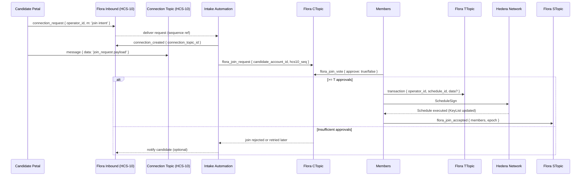

# HCS‑16 Standard: Floras: Coordinated Escrow, Communication, and Execution Accounts

### Status: **Draft**

### Version: **1.0**

---

## Table of Contents

1. [Authors](#authors)
2. [Abstract](#abstract)
3. [Motivation](#motivation)
4. [Terminology](#terminology)
5. [Specification](#specification)  
   5.1. [Prerequisites](#prerequisites)  
   5.2. [Flora Account Creation](#flora-account-creation)  
   5.3. [Flora Topics](#flora-topics)  
   5.4. [Profile Schema](#profile-schema)  
   5.5. [Message Protocol](#message-protocol)  
   5.6. [Lifecycle Flows](#lifecycle-flows)  
   5.7. [Reference Implementation](#reference-implementation)
6. [Security Considerations](#security-considerations)
7. [Versioning & Upgrades](#versioning--upgrades)
8. [References](#references)
9. [Change Log](#change-log)

---

## Authors

- **Patches** https://twitter.com/tmcc_patches
- **Kantorcodes** https://twitter.com/kantorcodes

---

## Abstract

Flora accounts extend the **HCS‑15 Petal / Profile account** concept to groups of two or more independent accounts that wish to transact and maintain shared state under a single on‑chain entity. 

A Flora account is controlled by a **threshold key** (or key list) composed of the public keys of its member Petal accounts, and is accompanied by three mandatory Hedera Consensus Service (HCS) topics: **communication**, **transaction**, and **state**, each protected by the same keylist (with varying thresholds). This standard defines:

- The canonical JSON schema for Flora metadata stored in account memos and HCS messages.
- The on‑chain and off‑chain message flows required to create, operate, and dissolve a Flora.
- Best‑practice security parameters for multi‑signature weights, membership changes, and data availability.

---

## Motivation

Modern autonomous agents and decentralized applications increasingly require **temporary, permissioned syndicates**: escrow wallets, joint ventures, working groups, or federated AI tasks. 

Manually deploying custom multisig contracts or ad‑hoc shared keys is error‑prone, expensive, and lacks discoverability. 

HCS‑16 solves this by:
1. **Discoverability & Negotiation** – Flora requests travel over existing HCS‑10 channels, leveraging the addressing and routing primitives agents already use.
2. **Native Multisig** – Hedera’s ThresholdKey is used directly; no Solidity bridges or custom bytecode are needed, reducing gas and audit surface.
3. **Topic‑Scoped State** – Flora’s dedicated topics isolate chat, scheduled transactions, and state attestations, preserving communication and concurrency.
4. **Composability** – Because each member is itself a Petal account, existing HCS‑15 tooling (profile resolution, escrow partitioning, etc.) works unchanged inside a Flora.

---

## Terminology

| Term                         | Meaning                                                                      |
| ---------------------------- | ---------------------------------------------------------------------------- |
| **Petal**                    | An HCS‑15 account that shares a private key with its Base account.           |
| **Member**                   | A Petal account that participates in a Flora.                                |
| **Flora**                    | The multisig account created under HCS‑16.                                   |
| **Threshold Key `T/M`**      | A key that requires `T` valid signatures out of `M` total keys.              |
| **CTopic / TTopic / STopic** | Shorthand for the Communication, Transaction, and State topics respectively. |

---

## Specification

### Prerequisites

A Flora **MUST** be composed of ≥ 2 Petal accounts that:
- Has a valid [HCS‑11](/docs/standards/hcs-11) Petal profile with an `inboundTopicId`.
- Is able to sign Hedera transactions with an **ECDSA/secp256k1** key (required for future encryption; ED25519 keys cannot encrypt data).

### Flora Account Creation

1. **Discovery ([HCS‑18](/docs/standards/hcs-18))** ‑ Pre‑formation negotiation occurs via the public HCS‑18 discovery topic using `announce`/`propose`/`respond`. The proposer references candidate announcements; candidates accept or reject. After initial acceptance, sensitive terms MAY move to [HCS‑10](/docs/standards/hcs-10) inbound topics for private negotiation. Output of discovery: agreed `memberAccounts`, `threshold` (`T` of `M`), and any funding expectations.
2. **Key Assembly** – A `KeyList` **MUST** be constructed containing each member’s **public key** with the agreed‐upon threshold.
3. **Account Create Tx** – Any member submits `AccountCreateTransaction` with:
   - `key = KeyList(threshold, keys[])`
   - `maxAutomaticTokenAssociations = -1` (recommended)
   - `initialBalance = X hbar` (funded by proposer)
4. **Topic Creation** – Immediately after account creation, three `ConsensusCreateTopicTransaction`s are created for the Flora account with:
   - `adminKey = KeyList with T/M threshold`
   - `submitKey = KeyList with 1/M threshold` (submitKeys should always be 1/M to allow all members to post to inter-flora communication channels)
   - `memo = "hcs-16:<flora account id>:<type enum>"` where `<type>` = `{0:communication,1:transaction,2:state}`
5. **Profile Publication** – A Flora **profile object** is uploaded to an HCS topic _or_ IPFS/Arweave, and the Flora account memo is set to:
   ```
   hcs-11:<resourceLocator>
   ```
6. **Member Acknowledgement** – Once a super‑majority (`≥T`) of members publish a `flora_created` message to CTopic or post member state to STopic, the Flora is considered **Active**.

<!-- > **NOTE**   If any step fails to reach `T` acknowledgements within `TTL` (default = 7 days), the initiator **SHOULD** recycle the partial resources and mark the Flora as **Aborted**. -->

### Internal Flora Topics

| Topic                            | Purpose                                                                                                                                                                                                                                 | Required | Memo Prefix           |
| -------------------------------- | --------------------------------------------------------------------------------------------------------------------------------------------------------------------------------------------------------------------------------------- | -------- | --------------------- |
| **Communication Topic (CTopic)** | Human / agent chat, off‑chain URL exchange, policy proposals, general communications. Future standards are planned to define task coordination.                                                                                         | ✅       | `hcs-16:${floraId}:0` |
| **Transaction Topic (TTopic)**   | Broadcast of pre‑signed ScheduledTxn IDs, token association proposals, contract calls.                                                                                                                                                  | ✅       | `hcs-16:${floraId}:1` |
| **State Topic (STopic)**         | Flora shared state that is needed for the Flora's purpose. Example: Periodic SHA‑256 hashes of shared state, vector clocks, membership attestations. This Topic is required for valid Floras even if not utilized intiially by members. | ✅       | `hcs-16:${floraId}:2` |

All three topics **SHOULD** share the exact same `adminKey` that is the same as the Flora's account key. `submitKey` **SHOULD** always be 1/M keylist threshold to allow each member to submit independently.

> **NOTE** HIP-991 custom fees can be added to require HBAR or a custom fungible token / NFT to submit messages on these topics. This should be agreed upon before Flora creation by member petals.

#### Topic Memo Format (canonical)

```
hcs-16:<flora_account_id>:<type>
```

- `<type>` is `0` = Communication, `1` = Transaction, `2` = State.

### Flora Memo Structure

Flora accounts use the HCS‑11 memo convention to reference their profile document. Do not duplicate that standard here; instead, see [HCS‑11](/docs/standards/hcs-11) for the canonical grammar and examples.

- Memo format (delegated to HCS‑11): `hcs-11:<resource>`
- `<resource>` may be an HCS HRL (`hcs://<standard>/<topicId>`) or another supported URI (IPFS/Arweave/HTTPS) as defined by HCS‑11.

### Profile Schema

Flora accounts extend the canonical [HCS‑11](/docs/standards/hcs-11) profile schema. Refer to that section for the authoritative definition of required fields such as `type`, `members`, `threshold`, and `topics`, as well as storage guidance. Flora memos must reference an HCS‑11-compliant profile document and the Flora account shall expose valid HCS‑10 inbound and outbound topics for coordination.

#### Example Profile Snippet

```json
{
  "version": "1.0",
  "display_name": "🪷 Lotus‑Research Escrow #3",
  "type": 3,
  "members": [
    { "accountId": "0.0.1234" },
    { "accountId": "0.0.2345" },
    { "accountId": "0.0.3456" }
  ],
  "threshold": 2,
  "topics": {
    "communication": "0.0.481516",
    "transaction": "0.0.481517",
    "state": "0.0.481518",
    "custom": [
      {
        "name": "offChainHashes",
        "topicId": "0.0.792894",
        "description": "Used for attestation of offchain software"
      }
    ]
  },
  "policies": {
    "membershipChange": "2/3",
    "scheduleTxApproval": "all"
  }
}
```

### Message Protocol

All protocol messages **MUST** include property `"p":"hcs-16"` and **SHOULD** follow the envelope defined in HCS‑10 (`operator_id`, `m`, etc.). Pre‑formation negotiation is standardized in HCS‑18 and is out of scope for HCS‑16.

| `op`                  | Direction | Purpose                                       | Required Keys                               |
| --------------------- | --------- | --------------------------------------------- | ------------------------------------------- |
| `flora_created`       | CTopic    | Publish final Flora account & topic IDs.      | `flora_account_id`, `topics`                |
| `transaction`         | TTopic    | Propose a Scheduled Transaction for approval. | `operator_id`, `schedule_id`, `data?`, `m?` |
| `state_update`        | STopic    | Commit new state to STopic.                   | `hash`, `epoch`                             |
| `flora_join_request`  | CTopic    | External Petal asks to join.                  | `candidate_account_id`                      |
| `flora_join_vote`     | CTopic    | Member vote on a join request.                | `candidate_account_id`, `approve`           |
| `flora_join_accepted` | STopic    | Confirmed membership change.                  | `members`, `epoch`                          |

Notes

- For state attestation, implementations SHOULD prefer the [HCS‑17](/docs/standards/hcs-17) `state_hash` format posted to the STopic. If `state_update` is used, it MUST mirror the HCS‑17 fields.

#### Envelope & Memos

Envelope (canonical):

```json
{ "p": "hcs-16", "op": "…", "operator_id": "<signerAccountId>@<floraAccountId>", "m": "optional" }
```

Analytics transaction memo (recommended):

```
hcs-16:op:<operationEnum>[:<topicType>]
```

- `<topicType>` is optional and, when used, should be `0|1|2` to indicate Communication/Transaction/State.

Operation enum values

| Operation              | Enum |
| ---------------------- | ----:|
| `flora_created`        |    0 |
| `transaction`          |    1 |
| `state_update`         |    2 |
| `flora_join_request`   |    3 |
| `flora_join_vote`      |    4 |
| `flora_join_accepted`  |    5 |

#### Operation Methods

##### Transaction (TTopic)

Message shape

```json
{
  "p": "hcs-16",
  "op": "transaction",
  "operator_id": "0.0.123@0.0.777",
  "schedule_id": "0.0.999",
  "data": "Swap 1 HBAR for 10 XYZ",
  "m": "optional"
}
```

Fields

| Field         | Description                                              | Type    | Required |
| ------------- | -------------------------------------------------------- | ------- | -------- |
| `operator_id` | Signer account id with `@<floraAccountId>` suffix       | string  | Yes      |
| `schedule_id` | Hedera ScheduleId entity ID (e.g., `0.0.12345`)         | string  | Yes      |
| `data`        | Human description or reference (HRL/URL)                | string  | No       |
| `m`           | Optional memo for analytics/traceability                | string  | No       |

Transaction Memo: `hcs-16:op:1:1`

##### Flora Created (CTopic)

Message shape

```json
{
  "p": "hcs-16",
  "op": "flora_created",
  "flora_account_id": "0.0.777",
  "topics": {
    "communication": "0.0.888",
    "transaction": "0.0.889",
    "state": "0.0.890"
  },
  "m": "optional"
}
```

Fields

| Field               | Description                       | Type   | Required |
| ------------------- | --------------------------------- | ------ | -------- |
| `flora_account_id`  | Newly created Flora account id    | string | Yes      |
| `topics`            | The three Flora topics            | object | Yes      |
| `m`                 | Optional memo                     | string | No       |

Transaction Memo: `hcs-16:op:0:0`

##### State Update (STopic)

Message shape (if not using HCS‑17 directly)

```json
{
  "p": "hcs-16",
  "op": "state_update",
  "hash": "<stateHash>",
  "epoch": 12,
  "timestamp": "2025-09-15T12:00:00.000Z",
  "m": "optional"
}
```

Fields

| Field       | Description                                           | Type    | Required |
| ----------- | ----------------------------------------------------- | ------- | -------- |
| `hash`      | Canonical state hash (prefer HCS‑17 rules)            | string  | Yes      |
| `epoch`     | Monotonically increasing counter for state            | number  | No       |
| `timestamp` | ISO‑8601 timestamp                                    | string  | No       |
| `m`         | Optional memo                                         | string  | No       |

Transaction Memo: `hcs-16:op:2:2`

##### Join Request (CTopic)

Join requests are posted to the CTopic by a Flora member to get consensus from the Flora members on the new account requesting to join the Flora.

Message shape

```json
{
  "p": "hcs-16",
  "op": "flora_join_request",
  "candidate_account_id": "0.0.999",
  "m": "This account reached out and requested to join"
}
```

Fields

| Field                  | Description                    | Type   | Required |
| ---------------------- | ------------------------------ | ------ | -------- |
| `candidate_account_id` | Account requesting admission   | string | Yes      |
| `m`                    | Optional purpose/memo          | string | No       |

Transaction Memo: `hcs-16:op:3:0`

##### Join Vote (CTopic)

Message shape

```json
{
  "p": "hcs-16",
  "op": "flora_join_vote",
  "candidate_account_id": "0.0.999",
  "approve": true,
  "operator_id": "0.0.123@0.0.777",
  "m": "optional"
}
```

Fields

| Field                  | Description                                | Type    | Required |
| ---------------------- | ------------------------------------------ | ------- | -------- |
| `candidate_account_id` | Candidate under vote                       | string  | Yes      |
| `approve`              | Boolean decision                            | boolean | Yes      |
| `operator_id`          | Voting member (`<memberId>@<floraId>`)     | string  | Yes      |
| `m`                    | Optional memo                              | string  | No       |

Transaction Memo: `hcs-16:op:4:0`

##### Join Accepted (STopic)

Message shape

```json
{
  "p": "hcs-16",
  "op": "flora_join_accepted",
  "members": [
    "0.0.123",
    "0.0.456",
    "0.0.999"
  ],
  "epoch": 13,
  "m": "optional"
}
```

Fields

| Field      | Description                        | Type     | Required |
| ---------- | ---------------------------------- | -------- | -------- |
| `members`  | Full updated members list          | string[] | Yes      |
| `epoch`    | Incremented state counter          | number   | Yes      |
| `m`        | Optional memo                      | string   | No       |

Transaction Memo: `hcs-16:op:5:2`

#### Protocol Message Examples

- Flora activated — CTopic

```json
{
  "p": "hcs-16",
  "op": "flora_created",
  "flora_account_id": "0.0.777",
  "topics": {
    "communication": "0.0.888",
    "transaction": "0.0.889",
    "state": "0.0.890"
  }
}
```

- Share a scheduled swap — TTopic

```json
{
  "p": "hcs-16",
  "op": "transaction",
  "operator_id": "0.0.123@0.0.777",
  "schedule_id": "0.0.999",
  "data": "Swap 1 HBAR for 10 XYZ"
}
```

- Commit state hash — STopic

```json
{
  "p": "hcs-16",
  "op": "state_update",
  "hash": "0x9a1cfb…",
  "epoch": 12
}
```

- External Petal join — CTopic

```json
{
  "p": "hcs-16",
  "op": "flora_join_request",
  "candidate_account_id": "0.0.999",
  "m": "Would like to co‑fund 400 hbar to join"
}
```

#### **Flora Creation — Sequence Diagram**

```mermaid
sequenceDiagram
    participant DT as Discovery Topic (HCS‑18)
    participant I as Initiator (Petal A)
    participant B as Petal B
    participant C as Petal C
    participant Net as Hedera Network

    I->>DT: propose { members, threshold }
    B-->>DT: respond { proposal_seq, accept }
    C-->>DT: respond { proposal_seq, accept }

    Note over I,Net: Formation (HCS‑16)
    I->>Net: AccountCreateTransaction
    Net-->>I: Flora account 0.0.777
    I->>Net: Create CTopic / TTopic / STopic
    Net-->>I: Topic IDs returned

    I->>CTopic: flora_created { flora_account_id, topics }
```



---

### Lifecycle Flows

#### JSON Envelope Conventions

Every lifecycle message is valid UTF‑8 JSON and **MUST** include:

- `p:"hcs-16"` — protocol ID.
- `op` — operation type (see table above).
- `operator_id` — `<signatureKeyAccountId>@<floralAccountId>` when the signer is also a Flora member; or `<callerAccountId>` for external join requests.
- Optional human‑readable memo `m`.

##### Example lifecycle messages

```json
// Step 4
{
  "p": "hcs-16",
  "op": "flora_created",
  "flora_account_id": "0.0.777",
  "topics": {
    "communication": "0.0.888",
    "transaction": "0.0.889",
    "state": "0.0.890"
  }
}
```

```json
// Step 5
{
  "p": "hcs-16",
  "op": "state_update",
  "hash": "0x48b6…"
}
```

#### Creation (Happy Path)

1. Discovery ([HCS‑18](/docs/standards/hcs-18)): `propose` + `respond` on the Discovery Topic until acceptance is reached.
2. Formation (HCS‑16): Execute account & topic creation transactions on‑chain.
3. Publish `flora_created` to CTopic (includes Flora account ID and topic IDs).
4. Publish initial state on STopic (prefer HCS‑17 `state_hash`; otherwise `state_update`).

#### Petal Join (Adding a New Member)

External Petals initiate membership via the HCS-10 connection workflow. The intake automation acknowledges the request, mirrors a summary onto the CTopic, and members vote using the standard Flora operations described below.

##### Sequence Diagram



##### Message Sequence (numbered)

1. Candidate → Flora Inbound HCS-10 topic: `connection_request`
   - Sent to the Flora’s [HCS-10](/docs/standards/hcs-10) inbound channel advertised through discovery ([HCS-18](/docs/standards/hcs-18)) or the Flora profile. The request follows the standard HCS-10 envelope (`p`, `op`, `operator_id`, optional `m`). Implementations **SHOULD** set `m` to a short hint such as `"join_request"` and MUST record the attempt on the candidate’s outbound topic.
2. Intake automation → Inbound HCS-10 topic: `connection_created`
   - Upon receiving the connection request, the Flora responds with `connection_created` to advertise an existing or newly created connection topic (per HCS-10 memo rules). This automated acknowledgement is required before detailed negotiation proceeds.
3. Candidate ↔ Connection Topic: `message`
   - The candidate submits an HCS-10 `message` operation whose `data` field is a JSON string describing the join proposal. Members may reply on the same connection topic for clarifications. Record the message sequence numbers (`connection_seq`) for provenance.
4. Intake automation → CTopic: `flora_join_request`
   - After parsing the connection-topic payload, the automation posts a summary to the CTopic referencing the inbound `connection_request` sequence (`hcs10_seq`) and the latest connection-topic message sequence (`connection_seq`) so other members can retrieve the raw payloads.
5. Members → CTopic: `flora_join_vote`
   - Each existing member casts `{ candidate_account_id, approve: true/false, hcs10_seq, connection_seq }` to record their decision on the Flora-only channel.
6. Any member → TTopic: `transaction`
   - On ≥ T approvals, publishes `{ operator_id, schedule_id, data? }` for a `ScheduleCreateTransaction` that appends the candidate key (and optionally adjusts `threshold`).
7. Members → Network: `ScheduleSign`
   - Members locate the schedule by `schedule_id` and sign until the threshold is met.
8a. Network executes schedule
   - KeyList on the Flora account is updated; repeat for additional topics if required by the update agreement.
8b. Any member → STopic: `flora_join_accepted` (optional)
   - Confirms the new membership set and bumps `epoch` when a state feed is required.
9. Members update the Flora profile reference
   - Publish revised profile JSON (e.g., HCS‑1/other storage) and update the HRL/memo to reference the new members list and revised topic pointers.

> **NOTE:** Members lists in the JSON need to be updated and stay current. Because Petal accounts share the same public key as their base accounts, account ids are required for decentralized lookup of the exact account utilizing that public key inside this Flora.

##### CTopic proxy summary example

```json
{
  "p": "hcs-16",
  "op": "flora_join_request",
  "candidate_account_id": "0.0.999",
  "hcs10_inbound_seq": 51234,
  "connection_topic_id": "0.0.912345",
  "connection_seq": 27,
  "summary": {
    "capabilities": ["escrow", "state-sync"],
    "profile_hrl": "hcs://1/0.0.777001",
    "hip991_fee_paid": true
  }
}
```

> **Payload Contract:** The HCS-10 `message.data` field on the connection topic **MUST** be a JSON string that matches:
> ```json
> {
>   "type": "join_request",
>   "data": {
>     "candidate_account_id": "0.0.x",
>     "petal_profile_hrl": "hcs://…",
>     "capabilities": ["escrow", "state-sync"],
>     "proof": { "type": "pow", "nonce": "…" },
>   }
> }
> ```
> Additional fields may be added inside `data` if they are documented in the Flora profile. Every follow-up `message` operation involved in the join workflow **MUST** echo the same structure (with updated context when necessary) so downstream tooling can parse join intents consistently.

##### Member Awareness Pattern

- **Automated Intake Proxy** – Floras SHOULD run an intake agent that monitors the inbound topic, issues `connection_created`, and mirrors approved join requests onto the CTopic. This prevents every member from scanning inbound traffic while still keeping the workflow responsive.
- **Join Summary Broadcast** – The intake agent MUST translate each validated request into a lightweight `flora_join_request` summary on the CTopic (step 4). The summary SHOULD include: candidate account ID, referenced HCS-10 sequence numbers, proposed capabilities, any escrow HRLs, and whether HIP-991 fees were satisfied. Downstream voters can trust the summary and only open the connection topic if they need the full payload.
- **Optional Digest Messages** – To aid discovery when many requests arrive, the intake agent MAY batch multiple candidates into periodic digest posts on the CTopic (e.g., hourly) while still linking to each individual connection-topic message. Digest posts SHOULD include a hash of each payload so independent tooling can verify integrity without re-reading the connection topic immediately.
- **Spam Mitigation** – Floras SHOULD enforce HIP-991 fees on both the inbound topic and the connection topic. This keeps the public intake path open while making denial-of-service attacks expensive. If the Flora also publishes a public HCS-18 discovery policy, it SHOULD disclose the current fee schedule so candidates can prepare the required payment.

##### Operational Rules

- The candidate **cannot** participate in multisig signing _until_ step 8a completes.
- Existing threshold `T` **SHOULD** be retained; if it changes, that new value must be encoded in the scheduled update referenced by the `transaction` message and acknowledged by `flora_join_vote` messages.
- A join request is referenced internally by its HCS-10 inbound sequence and the corresponding connection-topic message sequence, then mirrored on the Flora Communication Topic (CTopic) for provenance.
- External join intents **MUST** originate via the Flora's advertised HCS-10 inbound channel or by responding through [HCS-18](/docs/standards/hcs-18); only members post summaries/votes on the CTopic. The resulting transaction should be posted to the **Transaction Topic (TTopic)**.
- Members can skip `flora_join_vote` process and instead post a scheduled transaction of the new petal join / account key update, using signing as voting. The expiry date of the transaction can be used as the timetable for when voting must be completed.

##### Security Notes

- **Key List Consistency** – Before acceptance, members **SHOULD** verify the transaction is rotating the keylist to the agreed upon new state.
- **Resource Quota** – The initiating member should supply enough ℏ for the `AccountUpdateTransaction`.
- **Sybil Resistance** – Applications may impose an allow‑list, proof‑of‑work, required payments like fungible tokens or HBAR for the `flora_join_request` to resist spam.

#### Membership Change

- **Add Member** – Post a `transaction` message with a `ScheduleCreateTransaction` that updates the Flora KeyList and includes a clear rationale in the `data` field. Execution occurs when it collects `≥ T` signatures.
- **Remove Member** – Same as add. SHOULD be accompanied by a `state_update` marking the member as removed if successful.

#### Dissolution

- **Delete Flora** – Post a `transaction` message with a `ScheduleCreateTransaction` that deletes the Flora account. Execution occurs once signatures reach `≥ T`.

Members can coordinate asset drains and final actions on the CTopic/TTopic before issuing the deletion transaction. After a Flora account is emptied, submit the delete request; Hedera requires all associations and assets be cleared first. If at any time active members fall below `T`, the Flora becomes **Read-Only** until membership is restored.

---


### Reference Implementation

Below is an abridged TypeScript example that assembles a 2‑of‑3 Flora. **Error handling removed for brevity.**

```ts
// Collect member public keys
type Member = { accountId: AccountId; pubKey: PublicKey };
const members: Member[] = await fetchMemberInfo();
const threshold = 2;

// 1a. Build KeyList
const keyList = new KeyList();
keyList.setThreshold(threshold);

// 1b. Build Submit Threhold key (must be 1/M so all members can submit with 1 signature)
const submitKeyList = new KeyList();
submitKeyList.setThreshold(1);

for (const m of members) keyList.add(m.pubKey);

// 2. Create the Flora account
const floraReceipt = await new AccountCreateTransaction()
  .setKey(keyList)
  .setInitialBalance(new Hbar(20))
  .execute(client)
  .then((tx) => tx.getReceipt(client));
const floraId = floraReceipt.accountId!;

// 3. Create the three topics
await Promise.all([
  createTopic(`hcs-16:${floraId}:0`, keyList, submitKeyList), // comms
  createTopic(`hcs-16:${floraId}:1`, keyList, submitKeyList), // transactions
  createTopic(`hcs-16:${floraId}:2`, keyList, submitKeyList), // state
]);

// Helper
async function createTopic(
  memo: string,
  key: KeyList,
  submitKey: submitKeyList
): Promise<TopicId> {
  return new ConsensusTopicCreateTransaction()
    .setAdminKey(key)
    .setSubmitKey(submitKey)
    .setTopicMemo(memo)
    .execute(client)
    .then((tx) => tx.getReceipt(client))
    .then((r) => r.topicId!);
}
```

---

## Security Considerations

1. **Key Reuse Risk** – Because members usually reuse their Petal key inside Flora, compromise of that private key still spans all Petal & Flora accounts. **USE CAUTION** and utilize hardware wallets where possible.
2. **Threshold Selection** – For ≤ 4 members, `T = M − 1` is RECOMMENDED. For 5 + members, `T ≈ ⅔ M` balances liveness with safety.
3. **Membership Revocation** – Removing a malicious member is itself a multisig txn; set `membershipChange` policy to require `T+1` where feasible.
4. **Data Availability** – Off‑chain IPFS pointers MAY vanish; utilize [HCS‑1](/docs/standards/hcs-1) where possible.

## References

- [HCS‑2](/docs/standards/hcs-2) – Topic registries
- [HCS‑10](/docs/standards/hcs-10) – Message envelope & private routing
- [HCS‑11](/docs/standards/hcs-11) – Root profile schema
- [HCS‑15](/docs/standards/hcs-15) – Petal accounts
- [HCS‑17](/docs/standards/hcs-17) – State hash attestation
- [HCS‑18](/docs/standards/hcs-18) – Petal discovery and pre‑formation
