# HCS‑16 Standard: Floras - AppNet Accounts

## Status: **Draft**

## Version: **1.0**

## Table of Contents

1. [Authors](#authors)
2. [Abstract](#abstract)
3. [Motivation](#motivation)
4. [Terminology](#terminology)
5. [Specification](#specification)  
   5.1. [Prerequisites](#prerequisites)  
   5.2. [Flora Account Creation](#flora-account-creation)  
   5.3. [Flora Topics](#flora-topics)  
   5.4. [Profile Schema](#profile-schema)  
   5.5. [Message Protocol](#message-protocol)  
   5.6. [Lifecycle Flows](#lifecycle-flows)  
   5.7. [Reference Implementation](#reference-implementation)
6. [Security Considerations](#security-considerations)
7. [Versioning & Upgrades](#versioning--upgrades)
8. [References](#references)
9. [Change Log](#change-log)

---

## Authors

- **Patches** https://twitter.com/tmcc_patches
- **Kantorcodes** https://twitter.com/kantorcodes

---

## Abstract

**HCS‑16** defines **Flora accounts**: multi-signature coordination accounts for decentralized AppNets on Hiero. A Flora extends the [HCS‑15](/docs/standards/hcs-15) Petal account concept to groups of 2+ independent accounts that jointly control assets, maintain shared state, and coordinate actions through consensus.

### Key Components

A Flora account consists of:

1. **Multisig Account** – A Hiero account controlled by a threshold key (T-of-M) composed of member Petal public keys
2. **Three Mandatory HCS Topics**:
   - **Communication Topic (CTopic)** – Coordination, governance, and member chat
   - **Transaction Topic (TTopic)** – Scheduled transaction proposals and approvals
   - **State Topic (STopic)** – State commitments and membership changes
3. **HCS‑11 Profile** – Standardized metadata describing members, thresholds, topics, and policies

### What This Standard Defines

- Canonical JSON schema for Flora metadata and messages
- Complete lifecycle flows: creation, operation, membership changes, and dissolution
- Security parameters for threshold selection, membership management, and data availability
- Integration with HCS‑10 (messaging), HCS‑11 (profiles), HCS‑15 (Petals), and HCS‑17 (state attestation)

---

## Motivation

### The Challenge

Modern autonomous agents and decentralized applications require **multi-party coordination primitives**:

- **AI Agent Collectives** – Multiple AI agents pooling resources for shared tasks
- **Escrow Wallets** – Trusted intermediaries for marketplace transactions
- **Joint Ventures** – Temporary business collaborations with shared treasury
- **Working Groups** – Project-based teams with collective decision-making
- **Federated Services** – Distributed systems requiring consensus

**Current Limitations:**
- Manual multisig deployment is error-prone and expensive
- Custom smart contracts require audit overhead and lack standardization
- No native discovery mechanism for finding or joining multi-party accounts
- Poor tooling integration across different implementations

### The HCS‑16 Solution

Flora accounts solve these challenges through four core principles:

#### 1. Native Multisig
Uses Hiero's built-in `ThresholdKey` directly - no Solidity bridges, no custom bytecode, minimal gas costs, reduced audit surface.

#### 2. Structured Communication
Three dedicated HCS topics provide clear separation of concerns:
- **CTopic** – Human-readable coordination and governance
- **TTopic** – Machine-parseable transaction proposals  
- **STopic** – Cryptographic state commitments

#### 3. Standards Composability
Flora members are HCS‑15 Petal accounts, so existing tooling works unchanged:
- Profile resolution via HCS‑11
- Messaging via HCS‑10
- State attestation via HCS‑17

#### 4. Discoverability & Negotiation
Flora formation can leverage HCS‑10 channels, making multi-party coordination accessible to autonomous agents.

---

## Terminology

| Term                         | Definition                                                                                           |
| ---------------------------- | ---------------------------------------------------------------------------------------------------- |
| **Flora**                    | The multisig account created under HCS‑16; a decentralized AppNet coordination account               |
| **Petal**                    | An [HCS‑15](/docs/standards/hcs-15) account that shares a private key with its Base account          |
| **Member**                   | A Petal account that participates in a Flora                                                         |
| **Base Account**             | The original Hiero account from which a Petal derives its key material                               |
| **Threshold Key (T/M)**      | A cryptographic key requiring `T` valid signatures out of `M` total member keys                      |
| **CTopic**                   | **Communication Topic** – Human/agent coordination, governance, and general messaging                |
| **TTopic**                   | **Transaction Topic** – Scheduled transaction proposals and approval messaging + tracking                        |
| **STopic**                   | **State Topic** – State commitments, membership changes, and epoch transitions                       |
| **Operator ID**              | Identifier format `<signerAccountId>@<floraAccountId>` used to attribute actions to specific members |
| **Epoch**                    | Monotonically increasing counter marking state transitions or membership changes                     |

---

## Specification

### Prerequisites

#### Member Requirements

A Flora **MUST** be composed of **≥ 2 Petal accounts**, where each member:

1. **Has a valid [HCS‑11](/docs/standards/hcs-11) Petal profile** including:
   - Profile type set appropriately (type 1 for AI agents, type 0 for personal)
   - Valid `inboundTopicId` for [HCS‑10](/docs/standards/hcs-10) communication
   - Discoverable profile reference in account memo (`hcs-11:<resource>`)
   - Base account reference if using [HCS‑15](/docs/standards/hcs-15) Petal pattern

2. **Uses ECDSA/secp256k1 key cryptography**:
   - Required for future encryption capabilities
   - ED25519 keys are **NOT supported** (they lack encryption support)
   - Key must be accessible for signing Flora transactions

3. **Has sufficient HBAR balance** for:
   - Topic message submissions (≈$0.0001 per message)
   - Transaction fees (account creation, topic creation)
   - Initial Flora funding contribution (if agreed upon by members)
   - Ongoing operational costs

#### Pre-Formation Considerations

Before creating a Flora, prospective members **SHOULD** establish consensus on:

1. **Governance Parameters**:
   - Threshold value `T` (signatures required for execution)
   - Total members `M` (must be ≥ 2)
   - Membership change policies (who can propose, voting requirements)
   - Transaction approval requirements (all, majority, threshold)

2. **Financial Terms**:
   - Initial Flora account balance (recommended ≥ 20 HBAR)
   - Who funds the initial account creation
   - How operational costs are shared
   - Treasury management policies

3. **Communication Channels**:
   - Optional pre-negotiation via [HCS‑10](/docs/standards/hcs-10) inbound topics
   - Discovery via HCS‑18 (when implemented)
   - Any additional external communication methods members make outside of Flora topics

4. **Topic Configuration**:
   - Whether to implement HIP-991 custom fees on topics
   - Fee amounts (if applicable) for spam prevention
   - Transaction memo format preferences
   - Custom topic requirements beyond the three mandatory topics

## Flora / AppNet Account Creation

Flora creation follows a 6-step process that transforms independent Petal accounts into a coordinated multi-signature entity:

### Step 1: Decentralized Discovery (Optional)

Pre-formation negotiation can occur using [HCS‑10](/docs/standards/hcs-10) inbound topics for private negotiation:

- **Discovery Method**: Use `announce`/`propose`/`respond` messages
- **Proposer Actions**: References candidate announcements; candidates accept or reject
- **Output**: Agreed upon `memberAccounts`, `threshold` (`T` of `M`), and funding expectations

**Alternative**: Members may negotiate off-chain via traditional communication channels or discover via HCS‑18 (when implemented).

### Step 2: Key Assembly

After members and details are finalized, construct the Flora's cryptographic foundation:

1. Collect each member's **public key** (ECDSA/secp256k1)
2. Create a `KeyList` containing all member public keys
3. Set the `threshold` value (`T` signatures required)
4. Verify all members can access their private keys for signing

**Example** (TypeScript):
```typescript
const keyList = new KeyList();
keyList.setThreshold(threshold); // e.g., 2 for 2-of-3
for (const member of members) {
  keyList.add(member.pubKey);
}
```

### Step 3: Flora Account Creation

The proposer (or designated initiator) submits an `AccountCreateTransaction`:

**Required Parameters**:
- `key = KeyList(threshold, [PubKey1, PubKey2, ...])` – The T-of-M threshold key
- `maxAutomaticTokenAssociations = -1` – Recommended for flexibility
- `initialBalance = 20 HBAR` – Funded by proposer (adjustable based on agreement)

**Result**: Hiero network returns the new Flora account ID (e.g., `0.0.777`)

### Step 4: Topic Creation

Immediately after Flora account creation, create three `TopicCreateTransaction`s:

| Topic Type    | Enum | Purpose                        | Admin Key  | Submit Key | Memo Format           |
| ------------- | ---- | ------------------------------ | ---------- | ---------- | --------------------- |
| Communication | 0    | Coordination & governance      | T/M KeyList | 1/M KeyList | `hcs-16:0.0.777:0`    |
| Transaction   | 1    | Scheduled transaction proposals | T/M KeyList | 1/M KeyList | `hcs-16:0.0.777:1`    |
| State         | 2    | State commitments & membership | T/M KeyList | 1/M KeyList | `hcs-16:0.0.777:2`    |

**Key Configuration**:
- `adminKey` – Set to Flora's T/M threshold key (requires T signatures to modify topic)
- `submitKey` – Set to 1/M threshold (allows any single member to post messages)


>**Why 1/M for submitKey?** Enables any member to post messages without requiring threshold signatures for routine communication.


### Step 5: Profile Publication

Create and publish the Flora's [HCS‑11](/docs/standards/hcs-11) profile:

1. **Prepare Profile JSON** with:
   - `type: 3` (Flora profile type)
   - `members` array (account IDs of all Petal members)
   - `threshold` value
   - `topics` object (CTopic, TTopic, STopic IDs)
   - `policies` (optional governance rules)

2. **Upload Profile** to:
   - HCS topic (via [HCS‑1](/docs/standards/hcs-1)), or
   - IPFS/Arweave for persistent storage

3. **Set Flora Account Memo** to reference the profile:
   ```
   hcs-11:<resourceLocator>
   ```
   Example: `hcs-11:hcs://1/0.0.789103`

### Step 6: Member Acknowledgement

Each member confirms Flora activation by posting to CTopic:

**Acknowledgement Message**:
```json
{
  "p": "hcs-16",
  "op": "flora_created",
  "flora_account_id": "0.0.777",
  "topics": {
    "communication": "0.0.888",
    "transaction": "0.0.889",
    "state": "0.0.890"
  },
  "m": "Member acknowledgement"
}
```

**Activation Criteria**: Flora is considered **Active** when:
- Super-majority (`≥T`) of members publish `flora_created` message to CTopic, **OR**
- Members post initial state to STopic using [HCS‑17](/docs/standards/hcs-17) `state_hash` format

**Transaction Memo**: `hcs-16:op:0:0`

---

### Internal Flora Topics

Flora accounts utilize three mandatory HCS topics for structured coordination:

| Topic                            | Purpose                                                                                                                                                                                                                                 | Required | Topic Memo           | Topic Type Enum | Message Protocol |
| -------------------------------- | --------------------------------------------------------------------------------------------------------------------------------------------------------------------------------------------------------------------------------------- | -------- | --------------------- | --------------- | ---------------- |
| **Communication Topic (CTopic)** | Human / agent chat, off‑chain URL exchange, policy proposals, general communications. Future standards are planned to define task coordination.                                                                                         | ✅       | `hcs-16:${floraId}:0` | 0               | HCS-16           |
| **Transaction Topic (TTopic)**   | Broadcast of pre‑signed ScheduledTxn IDs, token association proposals, contract calls.                                                                                                                                                  | ✅       | `hcs-16:${floraId}:1` | 1               | HCS-16           |
| **State Topic (STopic)**         | Flora shared state that is needed for the Flora's purpose. State hash publications per [HCS-17](/docs/standards/hcs-17), membership attestations, epoch transitions. Required for valid Floras even if not utilized initially.          | ✅       | `hcs-16:${floraId}:2` | 2               | HCS-17           |

#### Topic Configuration Rules

**Admin Key**: All three topics **SHOULD** share the exact same `adminKey` as the Flora's account key (T/M threshold). This ensures:
- Topic modifications require consensus (T signatures)
- Topics cannot be unilaterally changed by a single member
- Consistent security model across Flora infrastructure

**Submit Key**: All topics **SHOULD** use 1/M keylist threshold to allow each member to submit independently. This enables:
- Any member can post messages without waiting for others
- Asynchronous communication and proposal submission
- Efficient day-to-day operations

**HIP-991 Custom Fees** (Optional): Custom fees can be added to require HBAR or custom fungible token/NFT to submit messages. This:
- Provides spam prevention mechanism
- Creates economic incentives for thoughtful participation
- Must be agreed upon before Flora creation

#### Topic Memo Format (Canonical)

```
hcs-16:<flora_account_id>:<type>
```

**Components**:
- `hcs-16` – Protocol identifier
- `<flora_account_id>` – The Flora account ID (e.g., `0.0.777`)
- `<type>` – Topic type enum: `0` = Communication, `1` = Transaction, `2` = State

**Examples**:
```
hcs-16:0.0.777:0  // Communication Topic for Flora 0.0.777
hcs-16:0.0.777:1  // Transaction Topic for Flora 0.0.777
hcs-16:0.0.777:2  // State Topic for Flora 0.0.777
```

### Flora / AppNet Account Memo Structure

Flora accounts use the [HCS‑11](/docs/standards/hcs-11) memo convention to reference their profile document. See HCS‑11 for the canonical grammar and examples.

**Memo Format** (delegated to HCS‑11):
```
hcs-11:<resource>
```

**Where `<resource>` can be**:
- HCS HRL: `hcs://<standard>/<topicId>` (e.g., `hcs://1/0.0.789103`)
- IPFS: `ipfs://QmT5NvUtoM5nWFfrQdVrFtvGfKFmG7AHE8P34isapyhCxX`
- Arweave: `ar://TQGxHPLpUcH7NG6rUYkzEnwD8_WqYQNPIoX5-0OoRXA`
- HTTPS: `https://example.com/flora-profile.json`

This approach provides flexibility in choosing the most appropriate storage mechanism for Flora metadata while maintaining a consistent reference pattern.

### Profile Schema

Flora accounts extend the canonical [HCS‑11](/docs/standards/hcs-11) profile schema. Refer to that standard for the authoritative definition of required fields such as `type`, `members`, `threshold`, and `topics`, as well as storage guidance.

**Key Requirements**:
- Flora account memos **MUST** reference an HCS‑11-compliant profile document
- Profile **MUST** set `type: 3` (Flora profile type)
- Flora account **SHALL** expose valid HCS‑10 inbound and outbound topics for coordination
- Profile **SHOULD** include `policies` object for governance rules

#### Example Profile Snippet

```json
{
  "version": "1.0",
  "display_name": "🪷 AppNet #3",
  "type": 3,
  "members": [
    { "accountId": "0.0.1234" },
    { "accountId": "0.0.2345" },
    { "accountId": "0.0.3456" }
  ],
  "threshold": 2,
  "topics": {
    "communication": "0.0.481516",
    "transaction": "0.0.481517",
    "state": "0.0.481518",
    "custom": [
      {
        "name": "offChainHashes",
        "topicId": "0.0.792894",
        "description": "Used for attestation of offchain software"
      }
    ]
  },
  "policies": {
    "membershipChange": "2/3",
    "scheduleTxApproval": "all"
  }
}
```

**Field Explanations**:
- `members` – Array of Petal account IDs participating in this Flora
- `threshold` – Number of signatures required (T in T/M)
- `topics.communication` – CTopic ID for coordination
- `topics.transaction` – TTopic ID for scheduled transactions
- `topics.state` – STopic ID for state commitments
- `topics.custom` – Optional additional topics for specialized purposes
- `policies` – Governance rules for operations (format is implementation-defined)

---

### Message Protocol

All Flora protocol messages follow a standardized envelope format and operation structure.

#### Protocol Operations

| Enum | `op` (operation)      | Direction | Purpose                                       | Protocol | Required Keys                                                                       |
| ---- | --------------------- | --------- | --------------------------------------------- | -------- | ----------------------------------------------------------------------------------- |
| 0    | `flora_created`       | CTopic    | Publish final Flora account & topic IDs.      | HCS-16   | `flora_account_id`, `topics`                                                        |
| 1    | `transaction`         | TTopic    | Propose a Scheduled Transaction for approval. | HCS-16   | `operator_id`, `schedule_id`, `data?`, `m?`                                         |
| 2    | `state_update`        | STopic    | Commit state hash (simple format)             | HCS-16   | `hash`, `epoch?`                                                                    |
| 3    | `flora_join_request`  | CTopic    | Post proxy of an external join request.       | HCS-16   | `account_id`, `connection_request_id`, `connection_topic_id`, `connection_seq`      |
| 4    | `flora_join_vote`     | CTopic    | Member vote on a join request.                | HCS-16   | `account_id`, `approve`, `operator_id`, `connection_request_id`, `connection_seq`   |
| 5    | `flora_join_accepted` | STopic    | Confirmed membership change.                  | HCS-16   | `members`, `epoch`                                                                  |
| 6    | `state_hash`          | STopic    | Commit state hash (HCS-17 standardized)       | HCS-17   | `state_hash`, `topics`, `account_id`, `epoch?`                                      |

**Notes**:
- **State Publications**: Flora STopics can use either HCS-16 `state_update` or [HCS‑17](/docs/standards/hcs-17) `state_hash` format
- **HCS-17 Benefits**: The HCS-17 format provides standardized hash calculation, topic list verification, and composite state support
- **Protocol Mixing**: STopic can receive both HCS-16 operations (2, 5) and HCS-17 operations (`state_hash`)
- All operations follow their respective protocol's envelope structure

### Envelope & Memos

**Canonical Message Envelope**:

```json
{ 
  "p": "hcs-16", 
  "op": "<op>", 
  "operator_id": "<signerAccountId>@<floraAccountId>", 
  "m": "optional" 
}
```

**Field Descriptions**:
- `p` – Protocol identifier, always `"hcs-16"`
- `op` – Operation type (see Operations table above)
- `operator_id` – Identity of the acting member in format `<signerAccountId>@<floraAccountId>`
- `m` – Optional human-readable memo for context

#### Transaction Memo Format (Recommended)

When executing transactions from the Flora account, it is **RECOMMENDED** to include a memo in this format for decentralized analytics and easier auditability of AppNet actions:

**Memo Template**:
```
hcs-16:op:<operationEnum>:<topicType>
```

**Components**:
- `hcs-16` – Protocol identifier
- `op` – Indicates this is an operation memo
- `<operationEnum>` – Numeric operation type (0-5, see table above)
- `<topicType>` – Topic type enum: `0` = CTopic, `1` = TTopic, `2` = STopic

**Examples**:
```
hcs-16:op:0:0  // flora_created on CTopic
hcs-16:op:1:1  // transaction on TTopic
hcs-16:op:2:2  // state_update on STopic
hcs-16:op:3:0  // flora_join_request on CTopic
hcs-16:op:4:0  // flora_join_vote on CTopic
hcs-16:op:5:2  // flora_join_accepted on STopic
hcs-17:op:6:2  // state_hash on STopic
```

This standardized memo format enables:
- Automated indexing and analytics of Flora operations
- Network-wide monitoring of AppNet activity
- Efficient filtering of Flora-related transactions
- Debugging and audit trail reconstruction

---

### Operation Methods

### Transaction (TTopic)

Proposes a scheduled transaction that requires member approval before execution.

**Message Shape**:

```json
{
  "p": "hcs-16",
  "op": "transaction",
  "operator_id": "0.0.123@0.0.777",
  "schedule_id": "0.0.999",
  "data": "Swap 1 HBAR for 10 XYZ",
  "m": "optional"
}
```

**Fields**:

| Field         | Description                                                                      | Type   | Required |
| ------------- | -------------------------------------------------------------------------------- | ------ | -------- |
| `operator_id` | Signer account ID with Flora account ID combined by @: `<signerAccountId>@<floraAccountId>` | string | Yes      |
| `schedule_id` | Hedera ScheduleId entity ID (e.g., `0.0.12345`)                                 | string | Yes      |
| `data`        | Human description or helpful data or reference to data (HRL/URL)                                        | string | No       |
| `m`           | Optional memo for analytics/traceability                                        | string | No       |

**Transaction Memo**: `hcs-16:op:1:1`

**Usage Pattern**:
1. Member creates a `ScheduleCreateTransaction` on Hiero network for desired execution from Flora account
2. Member posts `transaction` operation to TTopic with schedule ID of the new transaction
3. Other members review the transaction details
4. Members sign the scheduled transaction via `ScheduleSignTransaction`
5. Transaction executes automatically when threshold (T) signatures reached

### Flora Created (CTopic)

Announces the successful creation of a Flora and its associated topics. Each member posts this message during Flora activation.

**Message Shape**:

```json
{
  "p": "hcs-16",
  "op": "flora_created",
  "flora_account_id": "0.0.777",
  "topics": {
    "communication": "0.0.888",
    "transaction": "0.0.889",
    "state": "0.0.890"
  },
  "m": "optional"
}
```

**Fields**:

| Field              | Description                    | Type   | Required |
| ------------------ | ------------------------------ | ------ | -------- |
| `flora_account_id` | Newly created Flora account ID | string | Yes      |
| `topics`           | The three Flora topics         | object | Yes      |
| `m`                | Optional memo                  | string | No       |

**Transaction Memo**: `hcs-16:op:0:0`

**Purpose**: 
- Confirms member participation in the Flora
- Provides public record of Flora infrastructure
- Establishes consensus on topic IDs

### State Update (STopic)

Commits a new state hash to the State Topic. Flora implementations can choose between HCS-16 simple format or [HCS‑17](/docs/standards/hcs-17) standardized format.

#### Option 1: HCS-17 State Hash Format

**Message Shape**:

```json
{
  "p": "hcs-17",
  "op": "state_hash",
  "state_hash": "<hex-encoded-sha384-hash>",
  "topics": ["0.0.888", "0.0.889", "0.0.890"],
  "account_id": "0.0.777",
  "epoch": 12,
  "m": "Flora composite state update"
}
```

**Fields**: See [HCS‑17 Message Protocol](/docs/standards/hcs-17#message-protocol) for complete field definitions.

**Transaction Memo**: `hcs-16:op:2:2`

**Benefits**:
- Standardized state hash computation per HCS-17 methodology
- Inter-standard compatibility across HCS ecosystem
- Includes topic list for verification
- Built-in support for composite state hashes (Flora/Bloom)
- Consistent epoch management
- Deterministic calculation enables independent verification

**Use When**: You need standardized state verification, composite state aggregation, or interoperability with other HCS standards.

#### Option 2: HCS-16 State Update (Simple)

**Message Shape**:

```json
{
  "p": "hcs-16",
  "op": "state_update",
  "hash": "<stateHash>",
  "epoch": 12,
  "timestamp": "2025-09-15T12:00:00.000Z",
  "m": "optional"
}
```

**Fields**:

| Field       | Description                                | Type   | Required |
| ----------- | ------------------------------------------ | ------ | -------- |
| `hash`      | State hash (application-defined format)    | string | Yes      |
| `epoch`     | Monotonically increasing counter           | number | No       |
| `timestamp` | ISO‑8601 timestamp                         | string | No       |
| `m`         | Optional memo                              | string | No       |

**Transaction Memo**: `hcs-16:op:2:2`

**Benefits**:
- Simpler format for straightforward use cases
- Application-defined hash calculation
- Fewer required fields

**Use When**: You have simple state requirements and don't need standardized hash calculation or composite state aggregation.

### Join Request (CTopic)

A proxy message posted to the CTopic by a Flora's intake automation or member, representing an external Petal's request to join the Flora.

**Message Shape**:

```json
{
  "p": "hcs-16",
  "op": "flora_join_request",
  "account_id": "0.0.999",
  "connection_request_id": 51234,
  "connection_topic_id": "0.0.912345",
  "connection_seq": 27,
  "m": "This account reached out and requested to join"
}
```

**Fields**:

| Field                   | Description                                                                             | Type   | Required |
| ----------------------- | --------------------------------------------------------------------------------------- | ------ | -------- |
| `account_id`            | The account requesting admission. Members use this to look up the candidate's HCS-11 profile. | string | Yes      |
| `connection_request_id` | Sequence number of the HCS-10 `connection_request` on the Flora's inbound topic.        | number | Yes      |
| `connection_topic_id`   | The HCS-10 connection topic ID for this join request.                                   | string | Yes      |
| `connection_seq`        | Sequence number of the HCS-10 `message` on the connection topic containing the full join proposal. | number | Yes      |
| `m`                     | Optional purpose/memo.                                                                  | string | No       |

**Transaction Memo**: `hcs-16:op:3:0`

**Workflow Context**:
1. External Petal sends `connection_request` to Flora's HCS-10 inbound topic
2. Intake automation (or member) detects the request
3. Automation posts `flora_join_request` proxy to CTopic with references
4. Members retrieve full proposal from connection topic using `connection_seq`
5. Members vote using `flora_join_vote` operation

### Join Vote (CTopic)

Members cast votes on a `flora_join_request`. The vote references the specific request via HCS-10 sequence numbers to avoid ambiguity.

**Message Shape**:

```json
{
  "p": "hcs-16",
  "op": "flora_join_vote",
  "account_id": "0.0.999",
  "approve": true,
  "operator_id": "0.0.123@0.0.777",
  "connection_request_id": 51234,
  "connection_seq": 27,
  "m": "optional"
}
```

**Fields**:

| Field                   | Description                                                      | Type    | Required |
| ----------------------- | ---------------------------------------------------------------- | ------- | -------- |
| `account_id`            | Candidate under vote.                                            | string  | Yes      |
| `approve`               | Boolean decision (true = approve, false = reject).               | boolean | Yes      |
| `operator_id`           | Voting member (`<memberId>@<floraId>`).                          | string  | Yes      |
| `connection_request_id` | The `connection_request_id` from the corresponding `flora_join_request`. | number  | Yes      |
| `connection_seq`        | The `connection_seq` from the corresponding `flora_join_request`. | number  | Yes      |
| `m`                     | Optional memo.                                                   | string  | No       |

**Transaction Memo**: `hcs-16:op:4:0`

**Voting Rules**:
- Each member casts one vote per join request
- Vote is recorded on CTopic for transparency
- Threshold (T) of `approve: true` votes required for acceptance
- Members can change their vote by posting a new `flora_join_vote` message
- Final acceptance requires executing KeyList update transaction

### Join Accepted (STopic)

Confirms a successful membership change by posting the updated member list and incrementing the epoch counter.

**Message Shape**:

```json
{
  "p": "hcs-16",
  "op": "flora_join_accepted",
  "members": [
    "0.0.123",
    "0.0.456",
    "0.0.999"
  ],
  "epoch": 13,
  "m": "optional"
}
```

**Fields**:

| Field     | Description               | Type     | Required |
| --------- | ------------------------- | -------- | -------- |
| `members` | Full updated members list | string[] | Yes      |
| `epoch`   | Incremented state counter | number   | Yes      |
| `m`       | Optional memo             | string   | No       |

**Transaction Memo**: `hcs-16:op:5:2`

**Purpose**:
- Provides canonical record of current membership
- Enables state synchronization across members
- Marks transition point in Flora history
- Used for reconstructing Flora state from topic history

---

#### Protocol Message Examples

**Flora Activated — CTopic**:

```json
{
  "p": "hcs-16",
  "op": "flora_created",
  "flora_account_id": "0.0.777",
  "topics": {
    "communication": "0.0.888",
    "transaction": "0.0.889",
    "state": "0.0.890"
  }
}
```

**Share a Scheduled Swap — TTopic**:

```json
{
  "p": "hcs-16",
  "op": "transaction",
  "operator_id": "0.0.123@0.0.777",
  "schedule_id": "0.0.999",
  "data": "Swap 1 HBAR for 10 XYZ"
}
```

**Member Commit State Hash — STopic** (HCS-17 format):

```json
{
  "p": "hcs-17",
  "op": "state_hash",
  "state_hash": "a3f5b8c2d1e74f9a2b3c4d5e6f7a8b9c0d1e2f3a4b5c6d7e8f9a0b1c2d3e4f5a6b7c8d9e0f1a2b3c4d5e6f7a8b9c0d1e2f3a4b5c6d7e8f9a0b1c2d3e4f5a",
  "topics": ["0.0.888", "0.0.889", "0.0.890"],
  "account_id": "0.0.777",
  "epoch": 12
}
```

**External Petal Join — Internal CTopic Message**:

```json
{
  "p": "hcs-16",
  "op": "flora_join_request",
  "account_id": "0.0.999",
  "connection_request_id": 51234,
  "connection_topic_id": "0.0.912345",
  "connection_seq": 27,
  "m": "Account 0.0.999 is requesting to join and would like to co‑fund 400 hbar to join"
}
```

---

#### Flora Creation — Sequence Diagram

```mermaid
sequenceDiagram
    participant DT as Discovery Topic (HCS‑18)
    participant I as Initiator (Petal A)
    participant B as Petal B
    participant C as Petal C
    participant Net as Hedera Network
    participant CT as CTopic
    participant TT as TTopic
    participant ST as STopic

    Note over I,C: Optional Discovery Phase
    I->>DT: propose { members, threshold }
    B-->>DT: respond { proposal_seq, accept }
    C-->>DT: respond { proposal_seq, accept }

    Note over I,Net: Formation Phase (HCS‑16)
    I->>Net: AccountCreateTransaction
    Net-->>I: Flora account 0.0.777

    I->>Net: Create CTopic (memo: hcs-16:0.0.777:0)
    Net-->>I: CTopic ID 0.0.888

    I->>Net: Create TTopic (memo: hcs-16:0.0.777:1)
    Net-->>I: TTopic ID 0.0.889

    I->>Net: Create STopic (memo: hcs-16:0.0.777:2)
    Net-->>I: STopic ID 0.0.890

    Note over I: Upload Flora Profile

    I->>Net: Update account memo (hcs-11:hcs://1/0.0.xxx)

    Note over I,C: Activation Phase
    I->>CT: flora_created { flora_account_id, topics }
    B->>CT: flora_created { flora_account_id, topics }
    C->>CT: flora_created { flora_account_id, topics }

    Note over CT: Flora now ACTIVE (≥T acknowledgements)
```



---

### Lifecycle Flows

#### JSON Envelope Conventions

Every lifecycle message is valid UTF‑8 JSON and **MUST** include:

- `p:"hcs-16"` — Protocol identifier
- `op` — Operation type (see Operations table)
- `operator_id` — Format: `<signatureKeyAccountId>@<floraAccountId>` for members; or `<callerAccountId>` for external join requests
- `m` — Optional human‑readable memo

**Additional Requirements**:
- All timestamps **SHOULD** use ISO-8601 format.
- All topic IDs **MUST** use standard Hiero format (`0.0.x`)
- JSON **MUST** be valid and parseable
- String fields **SHOULD** be UTF-8 encoded

##### Example Lifecycle Messages

**Step 1: After Members Create the Flora**

```json
{
  "p": "hcs-16",
  "op": "flora_created",
  "flora_account_id": "0.0.777",
  "topics": {
    "communication": "0.0.888",
    "transaction": "0.0.889",
    "state": "0.0.890"
  }
}
```

**Step 2: Initial State Commitment** (HCS-17 format)

```json
{
  "p": "hcs-17",
  "op": "state_hash",
  "state_hash": "48b6c9d2e1f8a3b5c7d9e2f4a6b8c0d2e4f6a8b0c2d4e6f8a0b2c4d6e8f0a2b4c6d8e0f2a4b6c8d0e2f4a6b8c0d2e4f6a8b0c2d4e6f8a0b2c4d6e8f0a2b4",
  "topics": ["0.0.888", "0.0.889", "0.0.890"],
  "account_id": "0.0.777",
  "epoch": 0
}
```

#### Creation (Happy Path)

The standard Flora creation flow consists of three main phases:

**1. Formation (HCS‑16)**  
Execute account & topic creation transactions on‑chain:
- Create Flora multisig account with T/M threshold key
- Create three mandatory topics (CTopic, TTopic, STopic)
- Upload and reference HCS‑11 profile
- Set Flora account memo to profile reference

**2. Member Acknowledgement**  
Publish `flora_created` to CTopic:
- Each member posts `flora_created` message
- Message includes Flora account ID and topic IDs
- Confirms member awareness and acceptance
- Provides public record of Flora infrastructure

**3. Initial State Publication**  
Publish initial state on STopic:
- Prefer [HCS‑17](/docs/standards/hcs-17) `state_hash` format
- Alternative: use HCS‑16 `state_update` operation
- Establishes initial epoch (epoch 0 or 1)
- Enables state synchronization across members

**Flora Activation**: Flora is considered **ACTIVE** when super-majority (≥T) of members complete Step 2 or 3.

##### Security Notes

**Key List Consistency**  
Before acceptance, members **SHOULD** verify:
- The KeyList contains correct public keys for all members
- Threshold value matches agreed-upon value
- No unauthorized keys have been added
- Transaction hash matches expected format

**Resource Quota**  
The initiating member should supply enough ℏ for:
- `AccountCreateTransaction` (≈0.10 HBAR)
- Three `TopicCreateTransaction`s (≈0.01 HBAR each)
- Initial Flora account balance (recommended ≥20 HBAR)
- Profile publication costs (if using HCS-1)

**Sybil Resistance**  
Applications **MAY** impose additional requirements:
- Allow-list of approved Petal accounts
- Proof-of-work challenges
- Required payments (HBAR or fungible tokens) for `flora_join_request`
- Reputation scores or stake requirements
- Rate limiting on join requests

#### Membership Change

##### Add Member

To add a new member to a Flora:

**Step 1: Voting Phase (if required)**
- New candidate sends `connection_request` to Flora's or a members HCS-10 inbound topic
- Intake automation posts `flora_join_request` to CTopic
- Members cast votes using `flora_join_vote` operation
- Track votes until threshold (≥T) reached

**Step 2: KeyList Update Transaction**
- Any member posts `transaction` operation to TTopic with:
  - `schedule_id` referencing a `ScheduleCreateTransaction`
  - `data` field containing rationale (e.g., "Adding member 0.0.999 per vote")
- The scheduled transaction **MUST** contain:
  - `AccountUpdateTransaction` for Flora account
  - Updated KeyList including new member's public key
  - Optionally updated threshold value (if agreed upon)

**Step 3: Member Signing**
- Members sign the scheduled transaction via `ScheduleSignTransaction`
- Execution occurs automatically when ≥T signatures collected
- Network updates Flora account KeyList

**Step 4: State Commitment**
- Member posts `flora_join_accepted` to STopic with:
  - Updated `members` array
  - Incremented `epoch` value
- Update Flora profile (HCS-11) to reflect new membership

**Transaction Memo**: `hcs-16:op:1:1` (for KeyList update transaction)

##### Remove Member

Removing a member follows the same process as adding:

**Key Differences**:
- KeyList update **removes** the member's public key
- Threshold may need adjustment (ensure T ≤ remaining members)
- `flora_join_accepted` **SHOULD** still be posted to mark the transition
- Consider updating topic submit keys if member should lose access

**Security Consideration**: Removing a malicious member is itself a multisig transaction. For critical Floras, set `membershipChange` policy to require `T+1` signatures where feasible.

#### Dissolution

To permanently delete a Flora:

**Pre-Dissolution Checklist**:
1. **Asset Drainage** – Transfer all HBAR and tokens out of Flora account
2. **Token Dissociation** – Dissociate all tokens from Flora account
3. **Topic Cleanup** – Optionally delete or transfer admin keys for topics
4. **Final State Commit** – Post final state to STopic for historical record
5. **Member Coordination** – Confirm all members agree on dissolution

**Deletion Process**:

**Step 1: Coordinate on CTopic/TTopic**
- Members discuss and confirm dissolution plan
- Agree on asset distribution
- Execute all necessary cleanup transactions

**Step 2: Post Deletion Transaction**
- Member posts `transaction` operation to TTopic with:
  - `schedule_id` referencing `ScheduleCreateTransaction`
  - `data` field: "Flora dissolution per member agreement"
- Scheduled transaction contains `AccountDeleteTransaction`

**Step 3: Member Signing**
- Members sign scheduled transaction
- Execution occurs when signatures reach ≥T

**Step 4: Network Execution**
- Hiero network deletes Flora account
- Remaining balance (if any) transferred to beneficiary account
- Flora account becomes permanently inaccessible

**Read-Only State**: If at any time active members fall below `T`, the Flora becomes **Read-Only** until membership is restored. This means:
- No transactions can execute (insufficient signatures)
- Topic messages can still be posted (1/M submit key)
- Account balance remains but is inaccessible
- Recovery requires adding new members (which itself requires ≥T signatures from existing members)

**Important**: Hiero requires all token associations and assets be cleared before account deletion. The deletion transaction will fail if:
- Account holds any fungible tokens
- Account holds any NFTs
- Account has active token associations
- Account has scheduled transactions pending

---

### Reference Implementation

Below is an abridged TypeScript example that assembles a 2‑of‑3 Flora. **Error handling removed for brevity.**

```ts
import {
  AccountCreateTransaction,
  KeyList,
  Hbar,
  TopicCreateTransaction,
  TopicId,
  Client,
  AccountId,
  PublicKey
} from "@hashgraph/sdk";

// Define member structure
type Member = { 
  accountId: AccountId; 
  pubKey: PublicKey;
};

// Configuration
const members: Member[] = await fetchMemberInfo(); // Retrieve from HCS-11 profiles
const threshold = 2; // 2-of-3 signatures required
const client = Client.forTestnet(); // Or mainnet

// Step 1a: Build Flora KeyList (T/M threshold)
const keyList = new KeyList();
keyList.setThreshold(threshold);
for (const m of members) {
  keyList.add(m.pubKey);
}

// Step 1b: Build Submit KeyList (1/M threshold for topics)
const submitKeyList = new KeyList();
submitKeyList.setThreshold(1);
for (const m of members) {
  submitKeyList.add(m.pubKey);
}

// Step 2: Create the Flora account
const floraReceipt = await new AccountCreateTransaction()
  .setKey(keyList)
  .setInitialBalance(new Hbar(20))
  .setMaxAutomaticTokenAssociations(-1)
  .execute(client)
  .then((tx) => tx.getReceipt(client));

const floraId = floraReceipt.accountId!;
console.log(`Flora account created: ${floraId}`);

// Step 3: Create the three mandatory topics
const [cTopicId, tTopicId, sTopicId] = await Promise.all([
  createTopic(`hcs-16:${floraId}:0`, keyList, submitKeyList), // CTopic
  createTopic(`hcs-16:${floraId}:1`, keyList, submitKeyList), // TTopic
  createTopic(`hcs-16:${floraId}:2`, keyList, submitKeyList), // STopic
]);

console.log(`Topics created:
  CTopic: ${cTopicId}
  TTopic: ${tTopicId}
  STopic: ${sTopicId}
`);

// Step 4: Create and upload Flora profile (HCS-11)
const profile = {
  version: "1.0",
  display_name: "Example Flora",
  type: 3,
  members: members.map(m => ({ accountId: m.accountId.toString() })),
  threshold: threshold,
  topics: {
    communication: cTopicId.toString(),
    transaction: tTopicId.toString(),
    state: sTopicId.toString()
  },
  policies: {
    membershipChange: "2/3",
    scheduleTxApproval: "threshold"
  }
};

// Upload profile using HCS-1 (implementation not shown)
const profileTopicId = await uploadProfileToHCS1(profile);

// Step 5: Update Flora account memo
await new AccountUpdateTransaction()
  .setAccountId(floraId)
  .setAccountMemo(`hcs-11:hcs://1/${profileTopicId}`)
  .execute(client)
  .then((tx) => tx.getReceipt(client));

console.log("Flora creation complete!");

// Helper function to create topics
async function createTopic(
  memo: string,
  adminKey: KeyList,
  submitKey: KeyList
): Promise<TopicId> {
  return new TopicCreateTransaction()
    .setAdminKey(adminKey)
    .setSubmitKey(submitKey)
    .setTopicMemo(memo)
    .execute(client)
    .then((tx) => tx.getReceipt(client))
    .then((receipt) => receipt.topicId!);
}
```

**Additional Implementation Notes**:

1. **Member Discovery**: Use HCS-11 profile resolution to retrieve member public keys
2. **Key Management**: Ensure all members securely store their private keys
3. **Error Handling**: Production implementations should handle network failures, insufficient funds, and invalid keys
4. **Profile Storage**: Choose appropriate storage mechanism (HCS-1, IPFS, Arweave) based on requirements
5. **Activation Monitoring**: Implement listeners to track `flora_created` messages for activation confirmation

---

## Security Considerations

### 1. Key Reuse Risk

**Risk**: Members typically reuse their Petal key inside Flora. Compromise of that private key affects **all** accounts using that key (Base account, Petal account, and all Flora memberships).

**Mitigations**:
- **USE CAUTION** when managing private keys
- Utilize hardware wallets (Ledger, Trezor) for key storage
- Implement key rotation policies where possible
- Consider using separate keys for high-value Floras
- Monitor account activity for unauthorized transactions

**Impact**: Single key compromise can lead to:
- Unauthorized Flora transactions (if attacker gains ≥T keys)
- Theft of assets from Base and Petal accounts
- Reputation damage if malicious actions are taken

### 2. Threshold Selection

Choosing the right threshold (T) value is critical for balancing security and operational efficiency.

**Recommendations**:

| Member Count (M) | Recommended Threshold (T) | Rationale                                  |
| ---------------- | ------------------------- | ------------------------------------------ |
| 2                | 2                         | Both members must agree (100% consensus)   |
| 3                | 2                         | Allows one member to be offline           |
| 4                | 3                         | Majority + 1, prevents 50/50 deadlock     |
| 5-7              | ⌈⅔ M⌉                     | Supermajority, balances liveness & safety |
| 8+               | ⌈⅔ M⌉                     | Supermajority, ensures strong consensus   |

**General Rule**: For ≤ 4 members, `T = M − 1` is RECOMMENDED. For 5+ members, `T ≈ ⅔ M` balances liveness with safety.

**Considerations**:
- **Too Low**: Easier for malicious minority to execute unauthorized transactions
- **Too High**: Increases risk of operational gridlock if members become unavailable
- **Liveness**: Consider likelihood of members being offline
- **Safety**: Consider trust level and potential for collusion

### 3. Membership Revocation

Removing a malicious or compromised member is itself a multisig transaction requiring ≥T signatures.

**Challenges**:
- Attacker with T−1 colluding members can block their own removal
- Removal process can be slow if members are unresponsive
- KeyList update requires coordination of honest members

**Mitigations**:
- Set `membershipChange` policy to require `T+1` signatures where feasible
- Implement emergency procedures for rapid member removal
- Maintain off-chain communication channels for crisis coordination
- Consider time-locks on membership changes for additional security
- Require higher threshold for removing founding members

**Best Practice**: Document clear procedures for handling compromised members, including:
- Detection criteria (suspicious transactions, unresponsive members)
- Emergency contact methods
- Required evidence for removal votes
- Asset protection measures during removal process

### 4. Data Availability

**Risk**: Off‑chain storage (IPFS, Arweave, HTTPS) may become unavailable, making Flora metadata inaccessible.

**Mitigations**:
- **Prefer [HCS‑1](/docs/standards/hcs-1)** for critical metadata (guaranteed availability on Hiero)
- For IPFS: Pin files on multiple nodes (your own + pinning services)
- For Arweave: Ensure proper funding for permanent storage
- For HTTPS: Use reliable hosting with backups
- Maintain local copies of all Flora metadata
- Document alternative resolution paths in case of primary storage failure

**Availability Guarantees by Storage Type**:

| Storage Type | Availability    | Permanence | Cost       | Recommendation            |
| ------------ | --------------- | ---------- | ---------- | ------------------------- |
| HCS-1        | Very High       | Permanent  | Low        | ✅ Recommended for critical data |
| IPFS         | Medium-High     | Variable   | Very Low   | ⚠️ Requires active pinning |
| Arweave      | High            | Permanent  | Medium     | ✅ Good for large data    |
| HTTPS        | Variable        | Variable   | Low        | ❌ Not recommended        |

### 5. Topic Access Control

**Risk**: Improper topic configuration can lead to unauthorized message submission or topic modification.

**Best Practices**:
- **Admin Key**: Always set to Flora's T/M threshold key
- **Submit Key**: Set to 1/M for routine operations, higher threshold for sensitive topics
- **Monitor**: Implement automated monitoring for unauthorized topic messages
- **HIP-991 Fees**: Consider adding custom fees to prevent spam
- **Key Updates**: Require ≥T signatures for any topic key changes

### 6. Scheduled Transaction Security

**Risk**: Malicious members could create scheduled transactions with misleading descriptions in the `data` field.

**Mitigations**:
- Always verify scheduled transaction contents on Hiero network before signing
- Don't rely solely on `data` field descriptions
- Implement automated transaction analysis tools
- Set expiration times on scheduled transactions (e.g., 7 days)
- Require multiple members to verify high-value transactions
- Use standardized transaction templates for common operations

**Verification Checklist**:
- [ ] Schedule ID matches the one in TTopic message
- [ ] Transaction type is as described
- [ ] Amounts and recipients are correct
- [ ] No unauthorized changes to Flora keys
- [ ] Expiration time is reasonable
- [ ] Transaction follows Flora policies

---

### Profile Updates

Flora profiles can be updated by:
1. Uploading new profile JSON to storage
2. Updating Flora account memo to reference new profile
3. Posting `state_update` or similar notification to STopic

**Backward Compatibility**: New profiles SHOULD maintain compatibility with previous versions where possible. Add new fields rather than removing existing ones.


## References

- [HCS‑1](/docs/standards/hcs-1) – Static file storage on HCS
- [HCS‑2](/docs/standards/hcs-2) – Topic registries
- [HCS‑10](/docs/standards/hcs-10) – Message envelope & private routing
- [HCS‑11](/docs/standards/hcs-11) – Root profile schema
- [HCS‑15](/docs/standards/hcs-15) – Petal accounts
- [HCS‑17](/docs/standards/hcs-17) – State hash attestation
- [HCS‑18](/docs/standards/hcs-18) – Petal discovery and pre‑formation
- [HIP-991](https://hips.hedera.com/hip/hip-991) – Custom fees on HCS topics
