# HCS‑16 Standard: Floras - AppNet Accounts

### Status: **Draft**

### Version: **1.0**

---

## Table of Contents

1. [Authors](#authors)
2. [Abstract](#abstract)
3. [Motivation](#motivation)
4. [Terminology](#terminology)
5. [Specification](#specification)  
   5.1. [Prerequisites](#prerequisites)  
   5.2. [Flora Account Creation](#flora-account-creation)  
   5.3. [Flora Topics](#flora-topics)  
   5.4. [Profile Schema](#profile-schema)  
   5.5. [Message Protocol](#message-protocol)  
   5.6. [Lifecycle Flows](#lifecycle-flows)  
   5.7. [Reference Implementation](#reference-implementation)
6. [Security Considerations](#security-considerations)
7. [Versioning & Upgrades](#versioning--upgrades)
8. [References](#references)
9. [Change Log](#change-log)

---

## Authors

- **Patches** https://twitter.com/tmcc_patches
- **Kantorcodes** https://twitter.com/kantorcodes

---

## Abstract

Flora accounts extend the **HCS‑15 Petal / Profile account** concept to groups of two or more independent accounts that wish to transact and maintain shared state under a single on‑chain entity. This is a standard that details how to create decentralized AppNets using Hiero. 

A Flora account is controlled by a **threshold key** (or key list) composed of the public keys of its member Petal accounts, and is accompanied by three mandatory Hedera Consensus Service (HCS) topics: **communication**, **transaction**, and **state**, each protected by the same keylist (with varying thresholds). This standard defines:

- The canonical JSON schema for Flora metadata stored in account memos and HCS messages.
- The message flows required to create, operate, and dissolve a Flora.
- Best‑practice security parameters for multi‑signature weights, membership changes, and data availability.

---

## Motivation

Modern autonomous agents and decentralized applications increasingly require **temporary, permissioned syndicates**: escrow wallets, joint ventures, working groups, or federated AI tasks. 

Manually deploying custom multisig contracts or ad‑hoc shared keys is error‑prone, expensive, and lacks discoverability. 

HCS‑16 solves this by:
1. **Discoverability & Negotiation** – Flora requests travel over existing HCS‑10 channels, leveraging the addressing and routing primitives agents can easily use.
2. **Native Multisig** – Hiero's ThresholdKey is used directly; no Solidity bridges or custom bytecode are needed, reducing gas and audit surface.
3. **Topic‑Scoped State** – Flora’s dedicated topics isolate chat, scheduled transactions, and state attestations, preserving communication and concurrency.
4. **Composability** – Because each member is itself a Petal account, existing HCS‑15 tooling (profile resolution, escrow partitioning, etc.) works unchanged inside a Flora.

---

## Terminology

| Term                         | Meaning                                                                      |
| ---------------------------- | ---------------------------------------------------------------------------- |
| **Petal**                    | An HCS‑15 account that shares a private key with its Base account.           |
| **Member**                   | A Petal account that participates in a Flora.                                |
| **Flora**                    | The multisig account created under HCS‑16.                                   |
| **Threshold Key `T/M`**      | A key that requires `T` (# for threshold) valid signatures out of `M` (# of total members) keys.              |
| **CTopic / TTopic / STopic** | Shorthand for the Communication, Transaction, and State topics respectively. |

---

## Specification

### Prerequisites

A Flora **MUST** be composed of ≥ 2 Petal accounts that:
- Has a valid [HCS‑11](/docs/standards/hcs-11) Petal profile with an `inboundTopicId`.
- Is able to sign Hiero transactions with an **ECDSA/secp256k1** key (required for future encryption; ED25519 keys cannot encrypt data).

### Flora / AppNet Account Creation

1. **Decentralized Discovery (optional)** ‑ Pre‑formation negotiation can occur using [HCS‑10](/docs/standards/hcs-10) inbound topics for private negotiation with `announce`/`propose`/`respond` messages. The proposer references candidate announcements; candidates accept or reject. Output of discovery: agreed `memberAccounts`, `threshold` (`T` of `M`), and any funding expectations.
2. **Key Assembly** – After the members and details are decided on, a `KeyList` **MUST** be constructed containing each member’s **public key** with the agreed‐upon threshold.
3. **Flora Account Create Tx** – To create the Flora, proposer then submits `AccountCreateTransaction` with:
   - `key = KeyList(threshold, keys[PubKey1, PubKey2, etc..])`
   - `maxAutomaticTokenAssociations = -1` (recommended)
   - `initialBalance = 20 hbar` (funded by proposer, can be any amount)
4. **Topic Creation** – Immediately after the Flora account creation, three `TopicCreateTransaction`s are created by the proposer for the Flora account with:
   - `adminKey = KeyList with T/M threshold`
   - `submitKey = KeyList with 1/M threshold` (submitKeys should always be 1/M to allow all members to post to inter-flora communication channels)
   - `memo = "hcs-16:<flora account id>:<type enum>"` where `<type>` = `{0:communication,1:transaction,2:state}`
5. **Profile Publication** – A Flora **profile object** is uploaded to an HCS topic _or_ IPFS/Arweave, and the Flora account memo is set to:
   ```
   hcs-11:<resourceLocator>
   ```
6. **Member Acknowledgement** – Once the topics are created, each member should submit a `flora_created` transactions to the CTopic. After a super‑majority (`≥T`) of members publish a `flora_created` message to CTopic or post member state to STopic (The member state process is defined in [HCS‑17](/docs/standards/hcs-17)), the Flora is considered **Active**.

<!-- > **NOTE**   If any step fails to reach `T` acknowledgements within `TTL` (default = 7 days), the initiator **SHOULD** recycle the partial resources and mark the Flora as **Aborted**. -->

### Internal Flora Topics

| Topic                            | Purpose                                                                                                                                                                                                                                 | Required | Memo Prefix           |
| -------------------------------- | --------------------------------------------------------------------------------------------------------------------------------------------------------------------------------------------------------------------------------------- | -------- | --------------------- |
| **Communication Topic (CTopic)** | Human / agent chat, off‑chain URL exchange, policy proposals, general communications. Future standards are planned to define task coordination.                                                                                         | ✅       | `hcs-16:${floraId}:0` |
| **Transaction Topic (TTopic)**   | Broadcast of pre‑signed ScheduledTxn IDs, token association proposals, contract calls.                                                                                                                                                  | ✅       | `hcs-16:${floraId}:1` |
| **State Topic (STopic)**         | Flora shared state that is needed for the Flora's purpose. Example: Periodic SHA‑256 hashes of shared state, vector clocks, membership attestations. This Topic is required for valid Floras even if not utilized intiially by members. | ✅       | `hcs-16:${floraId}:2` |

All three topics **SHOULD** share the exact same `adminKey` that is the same as the Flora's account key. `submitKey` **SHOULD** always be 1/M keylist threshold to allow each member to submit independently.

> **NOTE** HIP-991 custom fees can be added to require HBAR or a custom fungible token / NFT to submit messages on these topics. This should be agreed upon before Flora creation by member petals.

#### Topic Memo Format (canonical)

```
hcs-16:<flora_account_id>:<type>
```

- `<type>` is `0` = Communication, `1` = Transaction, `2` = State.

### Flora / AppNet Account Memo Structure

Flora accounts use the HCS‑11 memo convention to reference their profile document. Do not duplicate that standard here; instead, see [HCS‑11](/docs/standards/hcs-11) for the canonical grammar and examples.

- Memo format (delegated to HCS‑11): `hcs-11:<resource>`
- `<resource>` may be an HCS HRL (`hcs://<standard>/<topicId>`) or another supported URI (IPFS/Arweave/HTTPS) as defined by HCS‑11.

### Profile Schema

Flora accounts extend the canonical [HCS‑11](/docs/standards/hcs-11) profile schema. Refer to that section for the authoritative definition of required fields such as `type`, `members`, `threshold`, and `topics`, as well as storage guidance. Flora memos must reference an HCS‑11-compliant profile document and the Flora account shall expose valid HCS‑10 inbound and outbound topics for coordination.

#### Example Profile Snippet

```json
{
  "version": "1.0",
  "display_name": "🪷 Lotus‑Research Escrow #3",
  "type": 3,
  "members": [
    { "accountId": "0.0.1234" },
    { "accountId": "0.0.2345" },
    { "accountId": "0.0.3456" }
  ],
  "threshold": 2,
  "topics": {
    "communication": "0.0.481516",
    "transaction": "0.0.481517",
    "state": "0.0.481518",
    "custom": [
      {
        "name": "offChainHashes",
        "topicId": "0.0.792894",
        "description": "Used for attestation of offchain software"
      }
    ]
  },
  "policies": {
    "membershipChange": "2/3",
    "scheduleTxApproval": "all"
  }
}
```

### Message Protocol

<!-- All protocol messages **MUST** include property `"p":"hcs-16"` and **SHOULD** follow the envelope defined in HCS‑10 (`operator_id`, `m`, etc.). Pre‑formation negotiation is standardized in HCS‑18 and is out of scope for HCS‑16. -->

| Enum | `op` (operation)                 | Direction | Purpose                                       | Required Keys                               |
| ---- | --------------------- | --------- | --------------------------------------------- | ------------------------------------------- |
| 0    | `flora_created`       | CTopic    | Publish final Flora account & topic IDs.      | `flora_account_id`, `topics`                |
| 1    | `transaction`         | TTopic    | Propose a Scheduled Transaction for approval. | `operator_id`, `schedule_id`, `data?`, `m?` |
| 2    | `state_update`        | STopic    | Commit new state to STopic.                   | `hash`, `epoch?`                            |
| 3    | `flora_join_request`  | CTopic    | Post proxy of an external join request.       | `account_id`, `connection_request_id`, `connection_topic_id`, `connection_seq` |
| 4    | `flora_join_vote`     | CTopic    | Member vote on a join request.                | `account_id`, `approve`, `operator_id`, `connection_request_id`, `connection_seq` |
| 5    | `flora_join_accepted` | STopic    | Confirmed membership change.                  | `members`, `epoch`                          |

Notes

- For state attestation, implementations SHOULD prefer the [HCS‑17](/docs/standards/hcs-17) `state_hash` format posted to the STopic. If `state_update` operations is used, it MUST mirror the HCS‑17 fields. 

#### Envelope & Memos

Envelope (canonical):

```json
{ 
  "p": "hcs-16", 
  "op": "<op>", 
  "operator_id": "<signerAccountId>@<floraAccountId>", 
  "m": "optional" 
}
```

### Transaction memo (recommended):

When executing transactions from the Flora account, it is recommended to include a memo in this format for decntralized analytics and easier auditability of AppNet actions.

- `<topicType>` is optional and, when used, should be `0|1|2` to indicate Communication/Transaction/State.

Memo template:
```
hcs-16:op:<operationEnum>:<topicType>
```

Example of a flora created transaction:
```
hcs-16:op:1:1
```

#### Operation Methods

##### Transaction (TTopic)

Message shape

```json
{
  "p": "hcs-16",
  "op": "transaction",
  "operator_id": "0.0.123@0.0.777",
  "schedule_id": "0.0.999",
  "data": "Swap 1 HBAR for 10 XYZ",
  "m": "optional"
}
```

Fields

| Field         | Description                                              | Type    | Required |
| ------------- | -------------------------------------------------------- | ------- | -------- |
| `operator_id` | Signer account id with flora account Id combined by @: `<signerAccountId>@<floraAccountId>` suffix       | string  | Yes      |
| `schedule_id` | Hedera ScheduleId entity ID (e.g., `0.0.12345`)         | string  | Yes      |
| `data`        | Human description or reference (HRL/URL)                | string  | No       |
| `m`           | Optional memo for analytics/traceability                | string  | No       |

Transaction Memo: 
`hcs-16:op:1:1`

##### Flora Created (CTopic)

Message shape

```json
{
  "p": "hcs-16",
  "op": "flora_created",
  "flora_account_id": "0.0.777",
  "topics": {
    "communication": "0.0.888",
    "transaction": "0.0.889",
    "state": "0.0.890"
  },
  "m": "optional"
}
```

Fields

| Field               | Description                       | Type   | Required |
| ------------------- | --------------------------------- | ------ | -------- |
| `flora_account_id`  | Newly created Flora account id    | string | Yes      |
| `topics`            | The three Flora topics            | object | Yes      |
| `m`                 | Optional memo                     | string | No       |

Transaction Memo: `hcs-16:op:0:0`

##### State Update (STopic)

Message shape (if not using HCS‑17 directly)

```json
{
  "p": "hcs-16",
  "op": "state_update",
  "hash": "<stateHash>",
  "epoch": 12,
  "timestamp": "2025-09-15T12:00:00.000Z",
  "m": "optional"
}
```

Fields

| Field       | Description                                           | Type    | Required |
| ----------- | ----------------------------------------------------- | ------- | -------- |
| `hash`      | Canonical state hash (prefer HCS‑17 rules)            | string  | Yes      |
| `epoch`     | Monotonically increasing counter for state            | number  | No       |
| `timestamp` | ISO‑8601 timestamp                                    | string  | No       |
| `m`         | Optional memo                                         | string  | No       |

Transaction Memo: `hcs-16:op:2:2`

##### Join Request (CTopic)

A `flora_join_request` is a proxy message for an external Petal's request to join, posted to the CTopic by a Flora's intake automation or a member. It provides pointers to the full context of the join request, which members can use to verify the candidate and their proposal.

Message shape

```json
{
  "p": "hcs-16",
  "op": "flora_join_request",
  "account_id": "0.0.999",
  "connection_request_id": 51234,
  "connection_topic_id": "0.0.912345",
  "connection_seq": 27,
  "m": "This account reached out and requested to join"
}
```

Fields

| Field                  | Description                                                                                      | Type   | Required |
| ---------------------- | ------------------------------------------------------------------------------------------------ | ------ | -------- |
| `account_id` | The account requesting admission. Members use this to look up the candidate's HCS-11 profile. | string | Yes      |
| `connection_request_id`    | Sequence number of the HCS-10 `connection_request` on the Flora's inbound topic.                 | number | Yes      |
| `connection_topic_id`  | The HCS-10 connection topic ID for this join request.                                            | string | Yes      |
| `connection_seq`       | Sequence number of the HCS-10 `message` on the connection topic containing the full join proposal. | number | Yes      |
| `m`                    | Optional purpose/memo.                                                                           | string | No       |

Transaction Memo: `hcs-16:op:3:0`

##### Join Vote (CTopic)

Members cast votes on a `flora_join_request`. The vote must reference the specific request via HCS-10 sequence numbers to avoid ambiguity.

Message shape

```json
{
  "p": "hcs-16",
  "op": "flora_join_vote",
  "account_id": "0.0.999",
  "approve": true,
  "operator_id": "0.0.123@0.0.777",
  "connection_request_id": 51234,
  "connection_seq": 27,
  "m": "optional"
}
```

Fields

| Field                  | Description                                                                  | Type    | Required |
| ---------------------- | ---------------------------------------------------------------------------- | ------- | -------- |
| `account_id` | Candidate under vote.                                                        | string  | Yes      |
| `approve`              | Boolean decision.                                                            | boolean | Yes      |
| `operator_id`          | Voting member (`<memberId>@<floraId>`).                                      | string  | Yes      |
| `connection_request_id`    | The `connection_request_id` from the corresponding `flora_join_request`.         | number  | Yes      |
| `connection_seq`       | The `connection_seq` from the corresponding `flora_join_request`.            | number  | Yes      |
| `m`                    | Optional memo.                                                               | string  | No       |

Transaction Memo: `hcs-16:op:4:0`

##### Join Accepted (STopic)

Message shape

```json
{
  "p": "hcs-16",
  "op": "flora_join_accepted",
  "members": [
    "0.0.123",
    "0.0.456",
    "0.0.999"
  ],
  "epoch": 13,
  "m": "optional"
}
```

Fields

| Field      | Description                        | Type     | Required |
| ---------- | ---------------------------------- | -------- | -------- |
| `members`  | Full updated members list          | string[] | Yes      |
| `epoch`    | Incremented state counter          | number   | Yes      |
| `m`        | Optional memo                      | string   | No       |

Transaction Memo: `hcs-16:op:5:2`

#### Protocol Message Examples

- Flora activated — CTopic

```json
{
  "p": "hcs-16",
  "op": "flora_created",
  "flora_account_id": "0.0.777",
  "topics": {
    "communication": "0.0.888",
    "transaction": "0.0.889",
    "state": "0.0.890"
  }
}
```

- Share a scheduled swap — TTopic

```json
{
  "p": "hcs-16",
  "op": "transaction",
  "operator_id": "0.0.123@0.0.777",
  "schedule_id": "0.0.999",
  "data": "Swap 1 HBAR for 10 XYZ"
}
```

- Member Commit state hash — STopic

```json
{
  "p": "hcs-16",
  "op": "state_update",
  "account_id": "0.0.123456",
  "hash": "0x9a1cfb…",
  "epoch": 12
}
```

- External Petal join — Internal CTopic Message:

```json
{
  "p": "hcs-16",
  "op": "flora_join_request",
  "account_id": "0.0.999",
  "connection_request_id": 51234,
  "connection_topic_id": "0.0.912345",
  "connection_seq": 27,
  "m": "Account 0.0.999 is requesting to join and would like to co‑fund 400 hbar to join"
}
```

#### **Flora Creation — Sequence Diagram**

```mermaid
sequenceDiagram
    participant DT as Discovery Topic (HCS‑18)
    participant I as Initiator (Petal A)
    participant B as Petal B
    participant C as Petal C
    participant Net as Hedera Network

    I->>DT: propose { members, threshold }
    B-->>DT: respond { proposal_seq, accept }
    C-->>DT: respond { proposal_seq, accept }

    Note over I,Net: Formation (HCS‑16)
    I->>Net: AccountCreateTransaction
    Net-->>I: Flora account 0.0.777
    I->>Net: Create CTopic / TTopic / STopic
    Net-->>I: Topic IDs returned

    I->>CTopic: flora_created { flora_account_id, topics }
```



---

### Lifecycle Flows

#### JSON Envelope Conventions

Every lifecycle message is valid UTF‑8 JSON and **MUST** include:

- `p:"hcs-16"` — protocol ID.
- `op` — operation type (see table above).
- `operator_id` — `<signatureKeyAccountId>@<floralAccountId>` when the signer is also a Flora member; or `<callerAccountId>` for external join requests.
- `m` - optional human‑readable memo 

##### Example lifecycle messages

```json
// Step 1 (after members have created the Flora)
{
  "p": "hcs-16",
  "op": "flora_created",
  "flora_account_id": "0.0.777",
  "topics": {
    "communication": "0.0.888",
    "transaction": "0.0.889",
    "state": "0.0.890"
  }
}
```

```json
// Step 2
{
  "p": "hcs-16",
  "op": "state_update",
  "hash": "0x48b6…"
}
```

#### Creation (Happy Path)

<!-- 1. Discovery ([HCS‑18](/docs/standards/hcs-18)): `propose` + `respond` on the Discovery Topic until acceptance is reached. -->
1. Formation (HCS‑16): Execute account & topic creation transactions on‑chain.
2. Publish `flora_created` to CTopic (includes Flora account ID and topic IDs).
3. Publish initial state on STopic (prefer [HCS‑17](/docs/standards/hcs-17) `state_hash`; otherwise `state_update`).


##### Security Notes

- **Key List Consistency** – Before acceptance, members **SHOULD** verify the transaction is rotating the keylist to the agreed upon new state.
- **Resource Quota** – The initiating member should supply enough ℏ for the `AccountUpdateTransaction`.
- **Sybil Resistance** – Applications may impose an allow‑list, proof‑of‑work, required payments like fungible tokens or HBAR for the `flora_join_request` to resist spam.

#### Membership Change

- **Add Member** – Post a `transaction` message with a `ScheduleCreateTransaction` that updates the Flora KeyList and includes a clear rationale in the `data` field. Execution occurs when it collects `≥ T` signatures.
- **Remove Member** – Same. SHOULD be accompanied by a `state_update` marking the member as removed if successful.

#### Dissolution

- **Delete Flora** – Post a `transaction` message with a `ScheduleCreateTransaction` that deletes the Flora account. Execution occurs once signatures reach `≥ T`.

Members can coordinate asset drains and final actions on the CTopic/TTopic before issuing the deletion transaction. After a Flora account is emptied, submit the delete request; Hiero requires all associations and assets be cleared first. 

If at any time active members fall below `T`, the Flora becomes **Read-Only** until membership is restored.

---


### Reference Implementation

Below is an abridged TypeScript example that assembles a 2‑of‑3 Flora. **Error handling removed for brevity.**

```ts
// Collect member public keys
type Member = { accountId: AccountId; pubKey: PublicKey };
const members: Member[] = await fetchMemberInfo();
const threshold = 2;

// 1a. Build KeyList
const keyList = new KeyList();
keyList.setThreshold(threshold);

// 1b. Build Submit Threhold key (must be 1/M so all members can submit with 1 signature)
const submitKeyList = new KeyList();
submitKeyList.setThreshold(1);

for (const m of members) keyList.add(m.pubKey);

// 2. Create the Flora account
const floraReceipt = await new AccountCreateTransaction()
  .setKey(keyList)
  .setInitialBalance(new Hbar(20))
  .execute(client)
  .then((tx) => tx.getReceipt(client));
const floraId = floraReceipt.accountId!;

// 3. Create the three topics
await Promise.all([
  createTopic(`hcs-16:${floraId}:0`, keyList, submitKeyList), // comms
  createTopic(`hcs-16:${floraId}:1`, keyList, submitKeyList), // transactions
  createTopic(`hcs-16:${floraId}:2`, keyList, submitKeyList), // state
]);

// Helper
async function createTopic(
  memo: string,
  key: KeyList,
  submitKey: submitKeyList
): Promise<TopicId> {
  return new ConsensusTopicCreateTransaction()
    .setAdminKey(key)
    .setSubmitKey(submitKey)
    .setTopicMemo(memo)
    .execute(client)
    .then((tx) => tx.getReceipt(client))
    .then((r) => r.topicId!);
}
```

---

## Security Considerations

1. **Key Reuse Risk** – Because members usually reuse their Petal key inside Flora, compromise of that private key still spans all Petal & Flora accounts. **USE CAUTION** and utilize hardware wallets where possible.
2. **Threshold Selection** – For ≤ 4 members, `T = M − 1` is RECOMMENDED. For 5 + members, `T ≈ ⅔ M` balances liveness with safety.
3. **Membership Revocation** – Removing a malicious member is itself a multisig txn; set `membershipChange` policy to require `T+1` where feasible.
4. **Data Availability** – Off‑chain IPFS pointers MAY vanish; utilize [HCS‑1](/docs/standards/hcs-1) where possible.

## References

- [HCS‑2](/docs/standards/hcs-2) – Topic registries
- [HCS‑10](/docs/standards/hcs-10) – Message envelope & private routing
- [HCS‑11](/docs/standards/hcs-11) – Root profile schema
- [HCS‑15](/docs/standards/hcs-15) – Petal accounts
- [HCS‑17](/docs/standards/hcs-17) – State hash attestation
- [HCS‑18](/docs/standards/hcs-18) – Petal discovery and pre‑formation