# HCS‑16 Standard: Floras: Coordinated Escrow, Communication, and Execution Accounts

### Status: **Draft**

### Version: **1.0**

---

## Table of Contents

1. [Authors](#authors)
2. [Abstract](#abstract)
3. [Motivation](#motivation)
4. [Terminology](#terminology)
5. [Specification](#specification)  
   5.1. [Prerequisites](#prerequisites)  
   5.2. [Flora Account Creation](#flora-account-creation)  
   5.3. [Flora Topics](#flora-topics)  
   5.4. [Profile Schema](#profile-schema)  
   5.5. [Message Protocol](#message-protocol)  
   5.6. [Lifecycle Flows](#lifecycle-flows)  
   5.7. [Reference Implementation](#reference-implementation)
6. [Security Considerations](#security-considerations)
7. [Versioning & Upgrades](#versioning--upgrades)
8. [References](#references)
9. [Change Log](#change-log)

---

## Authors

- **Patches** https://twitter.com/tmcc_patches

---

## Abstract

Flora accounts extend the **HCS‑21 Petal account** concept to groups of two or more independent accounts that wish to transact and maintain shared state under a single on‑chain entity. A Flora account is controlled by a **threshold key** (or key list) composed of the public keys of its member Petal accounts, and is accompanied by three mandatory Hedera Consensus Service (HCS) topics: **communication**, **transaction**, and **state**, each protected by the same keylist (with varying thresholds). This standard defines:

- The canonical JSON schema for Flora metadata stored in account memos and HCS messages.
- The on‑chain and off‑chain message flows required to create, operate, and dissolve a Flora.
- Best‑practice security parameters for multi‑signature weights, membership changes, and data availability.

---

## Motivation

Modern autonomous agents and decentralized applications increasingly require **temporary, permissioned syndicates**: escrow wallets, joint ventures, working groups, or federated AI tasks. Manually deploying custom multisig contracts or ad‑hoc shared keys is error‑prone, expensive, and lacks discoverability. HCS‑22 solves this by:

1. **Discoverability & Negotiation** – Flora requests travel over existing HCS‑10 channels, leveraging the addressing and routing primitives agents already use.
2. **Native Multisig** – Hedera’s ThresholdKey is used directly; no Solidity bridges or custom bytecode are needed, reducing gas and audit surface.
3. **Topic‑Scoped State** – Flora’s dedicated topics isolate chat, scheduled transactions, and state attestations, preserving privacy and concurrency.
4. **Composability** – Because each member is itself a Petal account, existing HCS‑21 tooling (profile resolution, escrow partitioning, etc.) works unchanged inside a Flora.

---

## Terminology

| Term                         | Meaning                                                                      |
| ---------------------------- | ---------------------------------------------------------------------------- |
| **Petal**                    | An HCS‑21 account that shares a private key with its Base account.           |
| **Member**                   | A Petal account that participates in a Flora.                                |
| **Flora**                    | The multisig account created under HCS‑22.                                   |
| **Threshold Key `T/M`**      | A key that requires `T` valid signatures out of `M` total keys.              |
| **CTopic / TTopic / STopic** | Shorthand for the Communication, Transaction, and State topics respectively. |

---

## Specification

### Prerequisites

A Flora **MUST** be composed of ≥ 2 Petal accounts that:

- Expose a valid **HCS‑11** Petal profile with an `inboundTopicId`.
- Are able to sign Hedera transactions with a **ECDSA/secp256k1** key (This is required for future encryption, as ED25519 keys cannot encrypt data)

### Flora Account Creation

1. **Discovery** ‑ Members negotiate over HCS‑10 using the message protocol to agree on:
   - `memberAccounts` – list of Account IDs.
   - `threshold` – `T` out of `M` signature requirement.
   - Initial funding **ℏ** & (optional) fungible tokens funding amount.
2. **Key Assembly** – A `KeyList` **MUST** be constructed containing each member’s **public key** with the agreed‐upon threshold.
3. **Account Create Tx** – Any member submits `AccountCreateTransaction` with:
   - `key = KeyList(threshold, keys[])`
   - `maxAutomaticTokenAssociations = -1` (recommended)
   - `initialBalance = X hbar` (funded by proposer)
4. **Topic Creation** – Immediately after account creation, three `ConsensusCreateTopicTransaction`s are created for the Flora account with:
   - `adminKey = KeyList with T/M threshold`
   - `submitKey = KeyList with 1/M threshold` (submitKeys should always be 1/M to allow all members to post to inter-flora communication channels)
   - `memo = "hcs-22:<flora account id>:<type enum>"` where `<type>` = `{0:communication,1:transaction,2:state}`
5. **Profile Publication** – A Flora **profile object** is uploaded to an HCS topic _or_ IPFS/Arweave, and the Flora account memo is set to:
   ```
   hcs-11:<resourceLocator>
   ```
6. **Member Acknowledgement** – Once a super‑majority (`≥T`) of members publish a `flora_created` message to CTopic or post member state to STopic, the Flora is considered **Active**.

<!-- > **NOTE**   If any step fails to reach `T` acknowledgements within `TTL` (default = 7 days), the initiator **SHOULD** recycle the partial resources and mark the Flora as **Aborted**. -->

### Internal Flora Topics

| Topic                            | Purpose                                                                                                                                                                                                                                 | Required | Memo Prefix           |
| -------------------------------- | --------------------------------------------------------------------------------------------------------------------------------------------------------------------------------------------------------------------------------------- | -------- | --------------------- |
| **Communication Topic (CTopic)** | Human / agent chat, off‑chain URL exchange, policy proposals, general communications. Future standards are planned to define task coordination.                                                                                         | ✅       | `hcs-22:${floraId}:0` |
| **Transaction Topic (TTopic)**   | Broadcast of pre‑signed ScheduledTxn IDs, token association proposals, contract calls.                                                                                                                                                  | ✅       | `hcs-22:${floraId}:1` |
| **State Topic (STopic)**         | Flora shared state that is needed for the Flora's purpose. Example: Periodic SHA‑256 hashes of shared state, vector clocks, membership attestations. This Topic is required for valid Floras even if not utilized intiially by members. | ✅       | `hcs-22:${floraId}:2` |

All three topics **SHOULD** share the exact same `adminKey` that is the same as the Flora's account key. `submitKey` **SHOULD** always be 1/M keylist threshold to allow each member to submit indepently.

> **NOTE** HIP-991 custom fees can be added to require HBAR or a custom fungible token / NFT to submit messages on these topics. This should be agreed upon before Flora creation by member petals.

### Flora Memo Structure

The flora account memo follows a standardized format to indicate where the profile data is stored:

```
hcs-11:<protocol_reference>
```

Where:

- `hcs-11` is the protocol identifier
- `<protocol_reference>` can be either:
  - A [Hashgraph Resource Locator (HRL)](../definitions.md#hashgraph-resource-locator) for HCS protocols
  - Other URI formats for non-HCS protocols (IPFS, Arweave, HTTPS)

Examples of valid hcs-22 account memo formats:

```
# HRL references (HCS protocols)
hcs-11:hcs://1/0.0.8768762
hcs-11:hcs://2/0.0.8768762
hcs-11:hcs://7/0.0.8768762

# Non-HCS protocol references
hcs-11:ipfs://QmT5NvUtoM5nWFfrQdVrFtvGfKFmG7AHE8P34isapyhCxX
hcs-11:ar://TQGxHPLpUcH7NG6rUYkzEnwD8_WqYQNPIoX5-0OoRXA
```

### HCS-11 extended for HCS-16 Root Profile Schema

All profiles share these common fields:

| Field              | Type   | Required  | Description                                                                                                     |
| ------------------ | ------ | --------- | --------------------------------------------------------------------------------------------------------------- |
| version            | string | Yes       | Standard version (e.g., "1.0")                                                                                  |
| type               | number | Yes       | Profile type enum (0=personal [not officially supported yet], 1=ai_agent, 2=server, 3=flora, 4=bloom, 5=meadow) |
| display_name       | string | Yes       | Display name for the profile                                                                                    |
| **_members_**      | array  | **_Yes_** | **_Array of objects containing member petal account ids_**                                                      |
| **_threshold_**    | number | **_Yes_** | **_The number of private key signatures to sign valid transactions from the flora account_**                    |
| **_flora_topics_** | object | **_Yes_** | **_Object containing flora topic ids._**                                                                        |
| alias              | string | No        | Alternative identifier                                                                                          |
| bio                | string | No        | Brief description or biography                                                                                  |
| socials            | array  | No        | Array of social media links                                                                                     |
| profileImage       | string | No        | Protocol reference - either HRL for HCS protocols (e.g., "hcs://1/0.0.12345") or other URI formats              |
| properties         | object | No        | Additional unstructured profile properties                                                                      |
| inboundTopicId     | string | Yes       | [HCS-10](/docs/standards/hcs-10) inbound communication topic                                                    |
| outboundTopicId    | string | Yes       | [HCS-10](/docs/standards/hcs-10) action record topic                                                            |

### Profile Schema

The **Flora** object is an extension of HCS-11 and a HRL is stored inside the Flora memo that points to the location of the JSON:
**The Flora account requires valid HCS-10 Inbound and Outbound topics**

```json
{
  "$schema": "https://json-schema.org/draft/2020-12/schema",
  "title": "HCS-16 Flora Profile",
  "type": "number",
  "required": ["version", "display_name", "members", "threshold", "topics"],
  "properties": {
    "version": {"type": "string", "pattern": "^1\\.0$"},
    "display_name": {"type": "string", "maxLength": 64},
    "members": {
      "type": "array",
      "minItems": 2,
      "items": {
        "type": "object",
        "required": ["accountId"],
        "properties": {
          "accountId": {"type": "string", "pattern": "^0\\.0\\.[0-9]+$"},
        }
      }
    },
    "topics": {
      "type": "array",
      "required": ["communication", "transaction", "state"],
      "properties": {
        "communication": {"type": "string"}, // communication topic id
        "transaction": {"type": "string"}, // transaction topic id
        "state": {"type": "string"}, // state topic id
        "custom": {"type", "array"} // Any additional topic ids the Flora utilizes for it's purpose
      }
    },
    "policies": {
      "type": "object",
      "additionalProperties": true
    },
    "properties": {"type": "object"}
  }
}
```

#### Example Profile Snippet

TODO: Talk to Kantor about this format

```json
{
  "version": "1.0",
  "display_name": "🪷 Lotus‑Research Escrow #3",
  "type": 3,
  "members": [
    { "accountId": "0.0.1234" },
    { "accountId": "0.0.2345" },
    { "accountId": "0.0.3456" }
  ],
  "threshold": 2,
  "topics": {
    "communication": "0.0.481516",
    "transaction": "0.0.481517",
    "state": "0.0.481518",
    "custom": [
      {
        "name": "offChainHashes",
        "topicId": "0.0.792894",
        "description": "Used for attestation of offchain software"
      }
    ]
  },
  "policies": {
    "membershipChange": "2/3",
    "scheduleTxApproval": "all"
  }
}
```

### Message Protocol

All protocol messages **MUST** include property `"p":"hcs-22"` and **SHOULD** follow the envelope defined in HCS‑10 (`operator_id`, `m`, etc.).

| `op`                    | Direction               | Purpose                                                | Required Keys                             |
| ----------------------- | ----------------------- | ------------------------------------------------------ | ----------------------------------------- |
| `flora_create_request`  | → prospective member(s) | Propose a Flora with `members[]`, `threshold`, seed ℏ. | `operator_id`, `members`, `threshold`     |
| `flora_create_accepted` | → proposer              | Acknowledge willingness to join.                       | `operator_id`, `topic_id:sequence_number` |
| `flora_created`         | ← proposer              | Publish final Flora account & topic IDs.               | `flora_account_id`, `topics`              |
| `tx_proposal`           | ↔ all                   | Share ScheduledTx ID + description for signing.        | `scheduled_tx_id`, `description`          |
| `state_update`          | ↔ all                   | Commit new state to STopic.                            | `hash`, `epoch`                           |
| `flora_join_request`    | → CTopic                | External Petal asks to join.                           | `candidate_account_id`                    |
| `flora_join_vote`       | ↔ CTopic                | Member vote on a join request.                         | `candidate_account_id`, `approve`         |
| `flora_join_accepted`   | ↔ STopic                | Confirmed membership change.                           | `members`, `epoch`                        |

All messages **SHOULD** be UTF‑8 JSON.

#### **Protocol Message Examples**

| Scenario                 | Topic                                      | Example                                                                                                                                                                                   |
| ------------------------ | ------------------------------------------ | ----------------------------------------------------------------------------------------------------------------------------------------------------------------------------------------- |
| Initiator proposes Flora | _Each candidate’s HCS‑10 `inboundTopicId`_ | `json { "p":"hcs-22", "op":"flora_create_request", "operator_id":"0.0.111@0.0.222", "members":["0.0.111","0.0.333","0.0.444"], "threshold":2, "initial_hbar":20, "m":"Research escrow"} ` |
| Candidate accepts        | Same topic as request                      | `json { "p":"hcs-22", "op":"flora_create_accepted", "operator_id":"0.0.333@0.0.222", "topic_seq":"0.0.555:42" } `                                                                         |
| Flora activated          | **CTopic**                                 | `json { "p":"hcs-22", "op":"flora_created", "flora_account_id":"0.0.777", "topics":{"communication":"0.0.888","transaction":"0.0.889","state":"0.0.890"} } `                              |
| Share a scheduled swap   | **TTopic**                                 | `json { "p":"hcs-22", "op":"tx_proposal", "scheduled_tx_id":"0.0.777@1710101010.000000001", "description":"Swap 1 HBAR for 10 XYZ"} `                                                     |
| Commit state hash        | **STopic**                                 | `json { "p":"hcs-22", "op":"state_update", "hash":"0x9a1cfb…" } `                                                                                                                         |
| External Petal join      | **CTopic**                                 | `json { "p":"hcs-22", "op":"flora_join_request", "candidate_account_id":"0.0.999", "message":"Would like to co‑fund 400 hbar to join"} `                                                  |

#### **Flora Creation — Sequence Diagram**

```mermaid
sequenceDiagram
    participant I as Initiator (Petal A)
    participant B as Petal B
    participant C as Petal C
    participant Net as Hedera Network

    I->>B: flora_create_request (HCS‑10 inbound)
    I->>C: flora_create_request
    B-->>I: flora_create_accepted
    C-->>I: flora_create_accepted

    I->>Net: AccountCreateTransaction
    Net-->>I: Flora account 0.0.777

    I->>Net: Create CTopic / TTopic / STopic
    Net-->>I: Topic IDs returned

    I->>B: flora_created (CTopic)
    I->>C: flora_created (CTopic)

    B->>CTopic: flora_created ack
    C->>CTopic: flora_created ack
```



---

### Lifecycle Flows

#### JSON Envelope Conventions

Every lifecycle message is valid UTF‑8 JSON and **MUST** include:

- `p:"hcs-22"` — protocol ID.
- `op` — operation type (see table above).
- `operator_id` — `<signatureKeyAccountId>@<floralAccountId>` when the signer is also a Flora member; or `<callerAccountId>` for external join requests.
- Optional human‑readable memo `m`.

#### Creation (Happy Path)

1. **flora_create_request** (HCS‑10 inbound)
2. **flora_create_accepted** (HCS‑10 inbound)
3. Account & topic creation (on‑chain).
4. **flora_created** broadcast to CTopic.
5. First **state_update** of membership list to STopic.

##### Example lifecycle messages

```json
// Step 1
{
  "p": "hcs-22",
  "op": "flora_create_request",
  "members": ["0.0.1", "0.0.2"],
  "threshold": 2,
  "operator_id": "0.0.1@0.0.0"
}
```

```json
// Step 4
{
  "p": "hcs-22",
  "op": "flora_created",
  "flora_account_id": "0.0.777",
  "topics": {
    "communication": "0.0.888",
    "transaction": "0.0.889",
    "state": "0.0.890"
  }
}
```

```json
// Step 5
{
  "p": "hcs-22",
  "op": "state_update",
  "hash": "0x48b6…"
}
```

#### Creation (Happy Path)

1. **Initiator** sends `flora_create_request` to each petal candidate’s `inboundTopicId`.
2. Each **candidate** verifies the member list & threshold, then replies `flora_create_accepted`.
3. When `≥T` accepts collected, **initiator** executes the account & topic creation transactions.
4. **Initiator** publishes `flora_created` to each candidate Petal's inbound or connection topic id. This message **MUST** include the newly created Flora account Id and the Flora's topic ids.
5. Members push a new **state update** to STopic. (If no shared state / consensus in Flora, members should instead post `flora_created` messages to STopic)

#### **Petal‑Initiated Join Request**

1. **Candidate** posts `flora_join_request` to the Flora’s **CTopic** (or any member’s HCS‑10 inbound topic if CTopic is unknown).
2. Existing members discuss and optionally cast `flora_join_vote` messages to CTopic.
3. On ≥ T approvals, any member posts a `tx_proposal` (TTopic) containing a `ScheduledAccountUpdateTransaction` that appends the candidate key.
4. Members sign; when threshold met, transaction executes.
5. Updated member list is committed via `flora_join_accepted` (STopic) and a new profile HRL is published.

##### Example join sequence (JSON)

```json
// Request
{
  "p": "hcs-22",
  "op": "flora_join_request",
  "candidate_account_id": "0.0.999",
  "operator_id": "0.0.999",
  "m": "Request to join research escrow"
}
```

```json
// Vote
{
  "p": "hcs-22",
  "op": "flora_join_vote",
  "candidate_account_id": "0.0.999",
  "approve": true,
  "operator_id": "0.0.123@0.0.777"
}
```

```json
// Scheduled account‑update proposal
{
  "p": "hcs-22",
  "op": "tx_proposal",
  "scheduled_tx_id": "0.0.777@1711111111.000000007",
  "m": "Add 0.0.999; retain threshold 2"
}
```

```json
// Post‑execution acknowledgement
{
  "p": "hcs-22",
  "op": "flora_join_accepted",
  "members": ["0.0.123", "0.0.456", "0.0.999"]
}
```

#### Membership Change

- **Add Member** – Proposer submits `tx_proposal` that encodes an `ScheduleAccountUpdateTransaction` with an updated KeyList and description of account to be added and why. The transaction is executed when it collects `≥T` signatures.
- **Remove Member** – Same as _add_. **SHOULD** be accompanied by a `state_update` marking the member as _removed_ if successful.

#### Dissolution

- **Delete Flora** – Proposer submits `tx_proposal` that encodes an `ScheduleAccountDeleteTransaction`. The transaction is executed when it collects `≥T` signatures.

Members can decide that the Flora is no longer needed or useful. Utilizing the CTopic, members can agree upon where remaining assets are being moved from the Flora account and share transactions to remove assets on the TTopic. Once the Flora account is empty, a final transaction posted to TTopic to delete the account can be posted and signed.

> **Note**: Hedera accounts must delete all associations and remove all assets before deletion can occur.

If at any time the number of active members `< T`, the Flora enters **Read‑Only** mode.

#### Petal Join (Adding a New Member)

_This flow enables an external Petal account to request admission to an already‑active Flora while preserving the threshold‑key security model._

##### Message Sequence

| #   | Actor          | Message (`op`)        | Purpose                                                                                                                                                                                                                                                                                      |
| --- | -------------- | --------------------- | -------------------------------------------------------------------------------------------------------------------------------------------------------------------------------------------------------------------------------------------------------------------------------------------- | -------- |
| 1   | **Candidate**  | `flora_join_request`  | Announces intent to join. Includes `candidate_account_id` and flexible properties to convey intent, policies, etc for the Flora.                                                                                                                                                             |
| 2   | **Members**    | `flora_join_vote`     | Each existing member casts `{candidate_account_id, approve: true                                                                                                                                                                                                                             | false}`. |
| 3   | **Initiator**  | `tx_proposal`         | On `≥ T` approvals, a `ScheduledAccountUpdateTransaction` is created that appends the candidate key to the Flora KeyList (and, optionally, updates `threshold`). The transaction ID is published to TTopic for the member Petal's to sign.                                                   |
| 4   | **Members**    | -                     | Members sign the scheduled transaction until it meets the needed threshold. Members sign by looking up the transaction by schedule ID and signing with their key natively                                                                                                                    |
| 5a  | **Network**    | —                     | Transaction executes; Flora account now reference the updated KeyList. Repeat these steps for **all three topics**, unless otherwise specified in the update agreement.                                                                                                                      |
| 5b  | **Any Member** | `flora_join_accepted` | (optional) If this Flora requires state hashes, each member broadcast confirmation with refreshed `members` array and incremented `epoch` in STopic.                                                                                                                                         |
| 6   | **Members**    | -                     | A new Flora profile JSON needs to be uploaded to a new HCS-1 file (or other decentralized storage), and a new `ScheduledAccountUpdateTransaction` updating the HRL to point to the new file that contains the new members account id in the members field, and any other neccessary changes. |

> **NOTE:** Members lists in the JSON need to be updated and stay current. Because Petal accounts share teh same public key as their base accounts, account ids are required for decentralized lookup of the exact account utilizing that public key inside of this Flora.

##### Operational Rules

- The candidate **cannot** participate in multisig signing _until_ step 5a completes.
- Existing threshold `T` **SHOULD** be retained; if it changes, that new value must be encoded inside the `tx_proposal` and acknowledged by `flora_join_vote` messages.
- A join request is uniquely identified by its sequence number on the Flora's Inbound topic.
- All inter-flora new member join related messages **SHOULD** be published to the **Communication Topic (CTopic)**. The resulting transaction should be posted to the **Transaction Topic (TTopic)**.
- Members can skip `flora_join_vote` process and instead post a scheduled transaction of the new petal join / account key update, using signing as voting. The expiry date of the transaction can be used as the timetable for when voting must be completed.

##### Security Notes

- **Key List Consistency** – Before acceptance, members **SHOULD** verify the transaction is rotating the keylist to the agreed upon new state.
- **Resource Quota** – The initiating member should supply enough ℏ for the `AccountUpdateTransaction`.
- **Sybil Resistance** – Applications may impose an allow‑list, proof‑of‑work, required payments like fungible tokens or HBAR for the `flora_join_request` to resist spam.

---

### Reference Implementation

Below is an abridged TypeScript example that assembles a 2‑of‑3 Flora. **Error handling removed for brevity.**

```ts
// Collect member public keys
type Member = { accountId: AccountId; pubKey: PublicKey };
const members: Member[] = await fetchMemberInfo();
const threshold = 2;

// 1a. Build KeyList
const keyList = new KeyList();
keyList.setThreshold(threshold);

// 1b. Build Submit Threhold key (must be 1/M so all members can submit with 1 signature)
const submitKeyList = new KeyList();
submitKeyList.setThreshold(1);

for (const m of members) keyList.add(m.pubKey);

// 2. Create the Flora account
const floraReceipt = await new AccountCreateTransaction()
  .setKey(keyList)
  .setInitialBalance(new Hbar(20))
  .execute(client)
  .then((tx) => tx.getReceipt(client));
const floraId = floraReceipt.accountId!;

// 3. Create the three topics
await Promise.all([
  createTopic(`hcs-22:${floraId}:0`, keyList, submitKeyList), // comms
  createTopic(`hcs-22:${floraId}:1`, keyList, submitKeyList), // transactions
  createTopic(`hcs-22:${floraId}:2`, keyList, submitKeyList), // state
]);

// Helper
async function createTopic(
  memo: string,
  key: KeyList,
  submitKey: submitKeyList
): Promise<TopicId> {
  return new ConsensusTopicCreateTransaction()
    .setAdminKey(key)
    .setSubmitKey(submitKey)
    .setTopicMemo(memo)
    .execute(client)
    .then((tx) => tx.getReceipt(client))
    .then((r) => r.topicId!);
}
```

---

## Security Considerations

1. **Key Reuse Risk** – Because members usually reuse their Petal key inside Flora, compromise of that private key still spans all Petal & Flora accounts. **USE CAUTION** and utilize hardware wallets where possible.
2. **Threshold Selection** – For ≤ 4 members, `T = M − 1` is RECOMMENDED. For 5 + members, `T ≈ ⅔ M` balances liveness with safety.
3. **Membership Revocation** – Removing a malicious member is itself a multisig txn; set `membershipChange` policy to require `T+1` where feasible.
4. **Data Availability** – Off‑chain IPFS pointers MAY vanish; Utilize HCS-1 where possible.

## References

- [HCS‑10] – Message Envelope & Routing
- [HCS‑11] – Root Profile Schema
- [HCS‑21] – Petal Accounts
