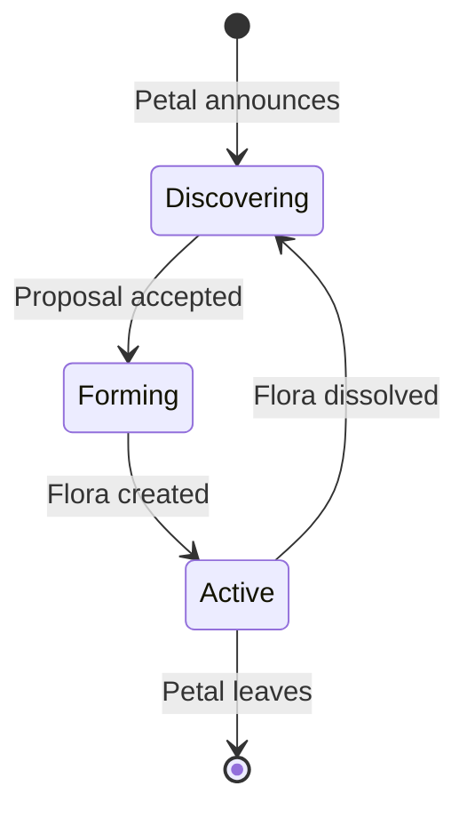
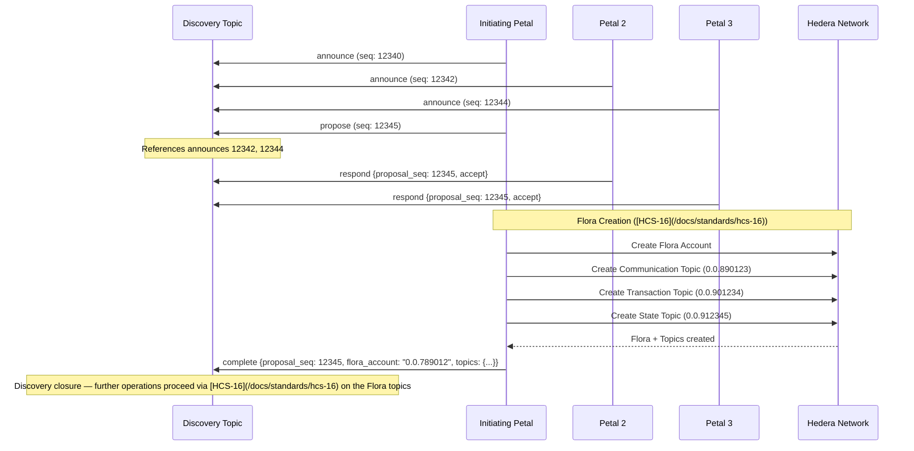
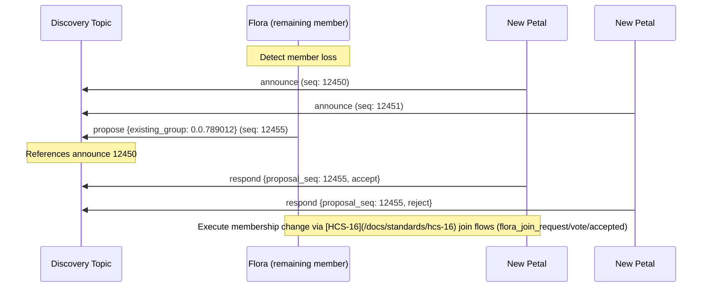
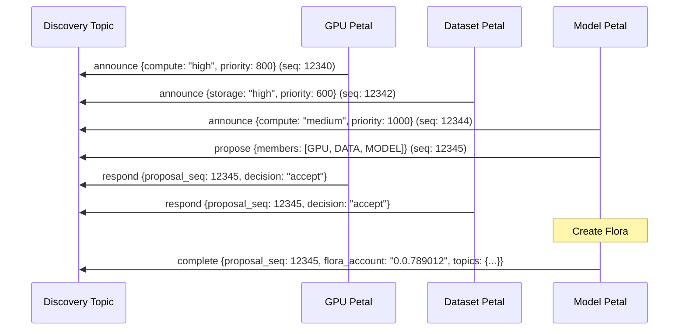

# HCS-18 Standard: Flora Discovery Protocol

### Status: **Draft**

### Version: **1.0**

---

## Table of Contents

1. [Authors](#authors)
2. [Abstract](#abstract)
3. [Motivation](#motivation)
4. [Terminology](#terminology)
5. [Specification](#specification)  
   5.1. [Discovery Broadcast Topic](#discovery-broadcast-topic)  
   5.2. [Message Protocol](#message-protocol)  
   5.3. [Discovery Lifecycle](#discovery-lifecycle)  
   5.4. [Formation States](#formation-states)  
   5.5. [Conflict Resolution](#conflict-resolution)  
   5.6. [Privacy Considerations](#privacy-considerations)
6. [Security Model](#security-model)
7. [Implementation Requirements](#implementation-requirements)
8. [Examples](#examples)
9. [References](#references)
10. [Change Log](#change-log)

---

## Authors

- **Kantorcodes** https://twitter.com/kantorcodes

---

## Abstract

HCS-18 extends the HCS-2 topic registry standard to enable decentralized discovery of Petals and pre‑formation coordination for Floras. It establishes a permissionless broadcast mechanism where Petal accounts can advertise their availability, discover compatible partners, and coordinate initial acceptance.

Scope
- Discovery‑layer only: `announce`/`propose`/`respond`/`withdraw` happen on a public discovery topic.
- Formation and ongoing governance are defined by [HCS‑16](/docs/standards/hcs-16). The `complete` event here is a discovery‑layer closure that references the formed Flora.

---

## Motivation

Multi-party collaborative systems typically assume participants already know each other's communication endpoints and have agreed on parameters. In practice, autonomous accounts need:

1. **Discovery** - Finding other Petals with compatible goals and capabilities
2. **Formation** - Coordinating Flora creation without prior relationships
3. **Membership** - Managing Flora composition over time

Without a standardized discovery mechanism, Flora formation requires out-of-band coordination, limiting the potential for autonomous, permissionless networks.

---

## Terminology

- **Discovery Topic**: A publicly readable HCS topic for discovery messages
- **Announcement**: A Petal's declaration of availability and capabilities
- **Proposal Sequence**: The HCS sequence number of a proposal message, used as a unique identifier
- **Priority**: A Petal's preference value (0-1000) for Flora coordination, inspired by MongoDB replica set priorities. Higher values indicate preference for leading Flora formation

---

## Specification

### Discovery Topic

Implementations MAY use a canonical Discovery Topic per network, listed in an [HCS‑2](/docs/standards/hcs-2) registry; otherwise, application‑specific discovery topics can be used for testing or private deployments.

| Network | Topic ID    | Status             |
| ------- | ----------- | ------------------ |
| Mainnet | `0.0.XXXXX` | Pending DAO vote   |
| Testnet | `0.0.XXXXX` | Pending deployment |

**Topic Configuration (recommended):**

- **Submit Key**: None (open submission)
- **Admin Key**: DAO multisig (for emergency suspension only)
- **Auto-renew Account**: DAO treasury
- **Memo Format**: `hcs-18:0:300`

### Memo Configuration

The discovery topic uses a standardized memo format:

`hcs-18:0`

| Field               | Description                                    | Example Value |
| ------------------- | ---------------------------------------------- | ------------- |
| `protocol_standard` | Protocol identifier for this standard          | `hcs-18`      |
| `indexed`           | Topic is indexed - all messages should be read | `0`           |

**Example Topic Memo**: `hcs-18:0`

### Operations

The following operations are available for discovery:

| Operation  | Description                                    | Required Fields                 |
| ---------- | ---------------------------------------------- | ------------------------------- |
| `announce` | Petal advertises availability and capabilities | `petal`, `capabilities`         |
| `propose`  | Proposes Flora formation to specific Petals    | `members`, `config`             |
| `respond`  | Response to a Flora proposal                   | `proposal_seq`, `decision`      |
| `complete` | Announces successful Flora formation           | `proposal_seq`, `flora_account` |
| `withdraw` | Petal withdraws from discovery                 | `announce_seq`                  |

### Message Protocol

All messages SHALL be valid UTF-8 JSON with the following structure:

#### Base Message Structure

```json
{
  "p": "hcs-18", // Protocol
  "op": "operation_type", // Operation
  "data": {} // Operation-specific data
}
```

Transaction memo (recommended analytics):

```
hcs-18:op:<operationEnum>
```

Operation enum values

| Operation  | Enum |
| ---------- | ----:|
| `announce` |    0 |
| `propose`  |    1 |
| `respond`  |    2 |
| `complete` |    3 |
| `withdraw` |    4 |

#### Operation: `announce`

Petal advertises its availability and capabilities.

##### Field Breakdown

| Field                                             | Type   | Required | Description                                                             |
| ------------------------------------------------- | ------ | -------- | ----------------------------------------------------------------------- |
| `petal`                                           | object | Yes      | Petal identification and metadata                                       |
| `petal.account`                                   | string | Yes      | Hedera account ID of the Petal                                          |
| `petal.name`                                      | string | Yes      | Human-readable name for the Petal                                       |
| `petal.priority`                                  | number | Yes      | Priority value (0-1000) for Flora coordination preference               |
| `uaid`                                            | string | No       | Optional UAID (HCS‑14) for resolvable identity                          |
| `capabilities`                                    | object | Yes      | Technical and operational capabilities                                  |
| `capabilities.protocols`                          | array  | Yes      | List of supported protocols for Flora operations                        |
| `capabilities.resources`                          | object | No       | Available computational resources                                       |
| `capabilities.resources.compute`                  | string | No       | Compute capacity: "high", "medium", or "low"                            |
| `capabilities.resources.storage`                  | string | No       | Storage capacity: "high", "medium", or "low"                            |
| `capabilities.resources.bandwidth`                | string | No       | Network capacity: "high", "medium", or "low"                            |
| `capabilities.group_preferences`                  | object | No       | Preferred group configurations                                          |
| `capabilities.group_preferences.sizes`            | array  | No       | Acceptable group member counts (e.g., [3, 5, 7])                        |
| `capabilities.group_preferences.threshold_ratios` | array  | No       | Acceptable consensus threshold ratios (e.g., [0.67, 0.75])              |
| `valid_for`                                       | number | No       | Number of HCS messages this announcement remains valid (default: 10000) |

**Example**:

```json
{
  "p": "hcs-18",
  "op": "announce",
  "data": {
    "petal": {
      "account": "0.0.123456",
      "name": "Node-Alpha-1",
      "priority": 750 // 0-1000, higher = preferred for Flora coordination
    },
    "uaid": "uaid:aid:z...", // Optional: HCS‑14 universal agent id
    "capabilities": {
      "protocols": ["hcs-11", "custom-consensus-v1"], // Any protocols the participant supports
      "resources": {
        "compute": "high|medium|low",
        "storage": "high|medium|low",
        "bandwidth": "high|medium|low"
      },
      "group_preferences": {
        "sizes": [3, 5, 7],
        "threshold_ratios": [0.67, 0.75]
      }
    },
    "valid_for": 10000 // Announcement valid for next 10k messages
  }
}
```

Transaction Memo: `hcs-18:op:0`

#### Operation: `propose`

Proposes Flora formation to specific Petals. The HCS sequence number of this message becomes the proposal identifier.

##### Field Breakdown

| Field                    | Type   | Required    | Description                                                         |
| ------------------------ | ------ | ----------- | ------------------------------------------------------------------- |
| `members`                | array  | Yes         | List of proposed Flora members                                      |
| `members[].account`      | string | Yes         | Hedera account ID of the member                                     |
| `members[].announce_seq` | number | Conditional | Sequence number of member's announcement (required for new members) |
| `members[].priority`     | number | Yes         | Member's priority value from their announcement                     |
| `members[].status`       | string | No          | "existing" or "proposed" (for replacements)                         |
| `config`                 | object | Yes         | Flora configuration parameters                                      |
| `config.name`            | string | Yes         | Human-readable Flora name                                           |
| `config.threshold`       | number | Yes         | Number of signatures required for Flora operations                  |
| `config.purpose`         | string | No          | Description of Flora's intended use                                 |
| `config.reason`          | string | No          | Reason for proposal (e.g., for replacements)                        |
| `existing_flora`         | string | No          | Account ID of existing Flora (for member replacement)               |

**Example (New Flora)**:

```json
{
  "p": "hcs-18",
  "op": "propose",
  "data": {
    "members": [
      { "account": "0.0.234567", "announce_seq": 12340, "priority": 500 },
      { "account": "0.0.345678", "announce_seq": 12342, "priority": 750 },
      { "account": "0.0.456789", "announce_seq": 12344, "priority": 1000 }
    ],
    "config": {
      "name": "ConsensusFlora-Beta",
      "threshold": 2, // 2 of 3 required for decisions
      "purpose": "Distributed ML training"
    }
  }
}
```

// This message gets sequence number 12345, which becomes the proposal ID

Transaction Memo: `hcs-18:op:1`

**Example (Member Replacement)**:

```json
{
  "p": "hcs-18",
  "op": "propose",
  "data": {
    "existing_flora": "0.0.789012", // Optional: indicates this is for an existing Flora
    "members": [
      { "account": "0.0.234567", "priority": 500, "status": "existing" },
      { "account": "0.0.345678", "priority": 750, "status": "existing" },
      {
        "account": "0.0.999999",
        "announce_seq": 12350,
        "priority": 600,
        "status": "proposed"
      }
    ],
    "config": {
      "threshold": 2,
      "reason": "replacing_0.0.456789"
    }
  }
}
```

#### Operation: `respond`

Response to a Flora proposal, referencing it by HCS sequence number.

##### Field Breakdown

| Field          | Type   | Required | Description                                                           |
| -------------- | ------ | -------- | --------------------------------------------------------------------- |
| `proposal_seq` | number | Yes      | HCS sequence number of the proposal being responded to                |
| `decision`     | string | Yes      | "accept" or "reject"                                                  |
| `reason`       | string | No       | Explanation for rejection (recommended for "reject")                  |
| `accepted_seq` | number | No       | Sequence number of accepted proposal (when rejecting due to conflict) |

**Example**:

```json
{
  "p": "hcs-18",
  "op": "respond",
  "data": {
    "proposal_seq": 12345, // Sequence number of the proposal message
    "decision": "accept" // or "reject"
  }
}
```

Transaction Memo: `hcs-18:op:2`

#### Operation: `complete`

Announces successful Flora formation, referencing the original proposal.

##### Field Breakdown

| Field                  | Type   | Required | Description                                  |
| ---------------------- | ------ | -------- | -------------------------------------------- |
| `proposal_seq`         | number | Yes      | HCS sequence number of the original proposal |
| `flora_account`        | string | Yes      | Newly created Flora account ID               |
| `topics`               | object | Yes      | HCS topic IDs for Flora operations           |
| `topics.communication` | string | Yes      | Communication topic ID for the Flora         |
| `topics.transaction`   | string | Yes      | Transaction coordination topic ID            |
| `topics.state`         | string | Yes      | State synchronization topic ID               |

**Example**:

```json
{
  "p": "hcs-18",
  "op": "complete",
  "data": {
    "proposal_seq": 12345, // Original proposal sequence number
    "flora_account": "0.0.789012",
    "topics": {
      "communication": "0.0.890123",
      "transaction": "0.0.901234",
      "state": "0.0.912345"
    }
  }
}
```

Transaction Memo: `hcs-18:op:3`

#### Operation: `withdraw`

Participant withdraws from discovery, invalidating their announcement.

##### Field Breakdown

| Field          | Type   | Required | Description                                                           |
| -------------- | ------ | -------- | --------------------------------------------------------------------- |
| `announce_seq` | number | Yes      | HCS sequence number of the announcement to withdraw                   |
| `reason`       | string | No       | Optional reason for withdrawal (e.g., "maintenance", "capacity_full") |

**Example**:

```json
{
  "p": "hcs-18",
  "op": "withdraw",
  "data": {
    "announce_seq": 12340,
    "reason": "entering_maintenance"
  }
}
```

Transaction Memo: `hcs-18:op:4`

### Discovery Lifecycle



### Formation Flow



### Member Replacement Flow

When a Flora loses a member, the remaining members use the same `propose` operation:



### Conflict Resolution

When a Petal receives multiple Flora proposals:

1. **Sequence Order**: The proposal with the lower sequence number takes precedence
2. **Explicit Rejection**: Petals MUST respond with reject to later proposals:
   ```json
   {
     "p": "hcs-18",
     "op": "respond",
     "data": {
       "proposal_seq": 12347,
       "decision": "reject",
       "reason": "accepted_earlier_proposal",
       "accepted_seq": 12345
     }
   }
   ```

### Privacy Considerations

Flora discovery is inherently public on HCS. Implementations SHOULD:

1. **Minimize Public Data**: Only publish essential capabilities in announcements; include pointers rather than full identity (e.g., UAID (HCS‑14) or HCS‑11 profile topic)
2. **Use HCS‑10 for Details**: Negotiate sensitive terms via private inbound topics after initial discovery ([HCS‑10](/docs/standards/hcs-10))
3. **Separate Concerns**: Detailed configurations belong in the Flora's operational layer, not discovery messages

---

## Security Model

### Threat Model

1. **Spam**: Flooding discovery topic with messages
2. **Impersonation**: Claiming false capabilities or identities
3. **Griefing**: Accepting proposals without intent to form

### Mitigations

1. **Account Verification**: All messages are tied to Hedera accounts with verifiable on-chain history
2. **Account Verification**: All messages are tied to Hedera accounts with verifiable on-chain history
3. **Reputation**: Off-chain services MAY track formation success rates
4. **Fee-based Rate Limiting**: Discovery topics MAY implement HIP-991 custom fees if spam becomes problematic

---

## Implementation Requirements

### Mandatory Features

1. **Message Validation**

   - Verify submitter is a valid Hedera account
   - Validate message format matches operation schema
   - Ensure flora_id uniqueness for proposals

2. **State Management**
   - Track active Flora proposals
   - Record proposal responses
   - Monitor Flora formation completions

### Recommended Features

1. **Intelligent Matching**

   ```typescript
   interface CompatibilityScore {
     protocols: number; // Supported protocol overlap
     resources: number; // Resource compatibility
     priority: number; // Priority-based preference
   }
   ```

2. **Analytics**
   - Formation success rates
   - Common Flora configurations
   - Network topology visualization

---

## Examples

### Example 1: Three Petals Forming an AI Training Flora



### Example 2: Flora Member Replacement

```typescript
// When a Flora needs to replace a member
class FloraCoordinator {
  async replaceMember(
    failedMember: string,
    candidateAnnouncements: Map<string, number>
  ) {
    // Use the same propose operation, with existing_group field
    const members = [
      ...this.existingMembers.map((m) => ({ ...m, status: 'existing' })),
      ...Array.from(candidateAnnouncements).map(([account, seq]) => ({
        account,
        announce_seq: seq,
        status: 'proposed',
      })),
    ];

    const proposalMsg = await this.sendToDiscoveryTopic({
      p: 'hcs-18',
      op: 'propose',
      data: {
        existing_flora: this.floraAccount,
        members,
        config: {
          threshold: this.currentThreshold,
          reason: `replacing_${failedMember}`,
        },
      },
    });

    // proposalMsg.sequence_number becomes the proposal ID
    this.trackProposal(proposalMsg.sequence_number);
  }
}
```

### Example 3: Handling Conflicting Proposals

```typescript
// When Petal receives multiple Flora proposals
function handleProposals(proposals: HCSMessage[]): number {
  // HCS messages already ordered by sequence number
  // Accept the first valid proposal
  const accepted = proposals[0];

  // Reject all later proposals
  for (let i = 1; i < proposals.length; i++) {
    sendResponse({
      p: 'hcs-18',
      op: 'respond',
      data: {
        proposal_seq: proposals[i].sequence_number,
        decision: 'reject',
        reason: 'accepted_earlier_proposal',
        accepted_seq: accepted.sequence_number,
      },
    });
  }

  return accepted.sequence_number;
}
```

### Example 4: Sequence-Based State Management

```typescript
class FloraDiscovery {
  private lastProcessedSeq = 0;
  private activeAnnouncements = new Map<number, Announcement>();

  async processMessage(msg: HCSMessage) {
    if (msg.sequence_number <= this.lastProcessedSeq) return;

    switch (msg.message.op) {
      case 'announce':
        // Store announcement by its sequence number
        this.activeAnnouncements.set(msg.sequence_number, {
          account: msg.payer_account_id,
          data: msg.message.data,
          consensus_timestamp: msg.consensus_timestamp,
        });
        break;

      case 'propose':
        // Validate referenced announcements exist
        const valid = msg.message.data.members.every((m) =>
          this.activeAnnouncements.has(m.announce_seq)
        );
        if (valid) {
          this.handleProposal(msg.sequence_number, msg.message.data);
        }
        break;

      case 'complete':
        // Clean up announcements for completed Flora
        this.cleanupCompletedProposal(msg.message.data.proposal_seq);
        break;
    }

    this.lastProcessedSeq = msg.sequence_number;
  }
}
```

---

## Conclusion

HCS-18 provides a permissionless discovery mechanism for Petals to find each other and coordinate Flora formation through Hedera Consensus Service. By leveraging HCS sequence numbers for natural ordering and HCS-2 for topic registries, the standard enables autonomous Flora formation without central coordination or pre-existing relationships.

---

## References

- [HCS‑2](/docs/standards/hcs-2): Topic registries for topic-based discovery
- [HCS‑10](/docs/standards/hcs-10): Agent communication protocol for private negotiation channels
- [HCS‑11](/docs/standards/hcs-11): Profile standard with inbound topics for post-discovery communication
- [HCS‑16](/docs/standards/hcs-16): Formation and governance of Floras
- [HCS‑17](/docs/standards/hcs-17): State hash format used on Flora state topics
