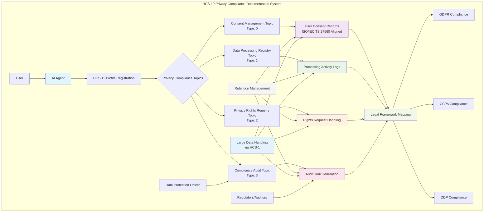
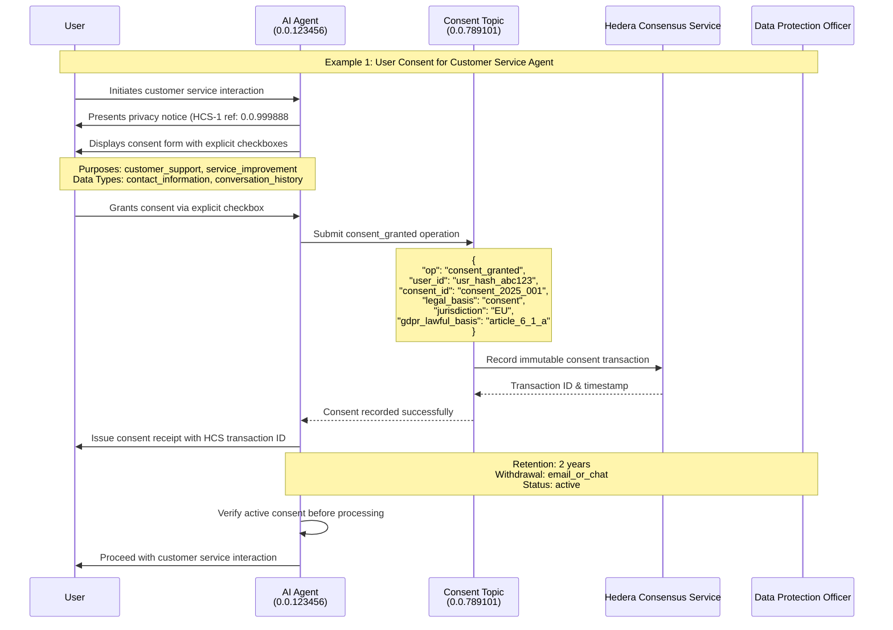
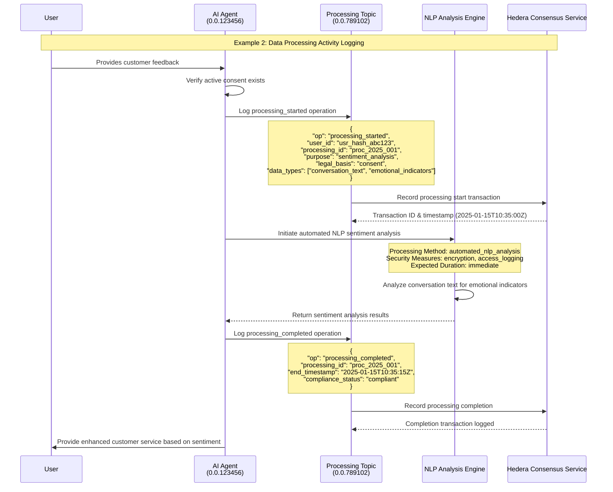
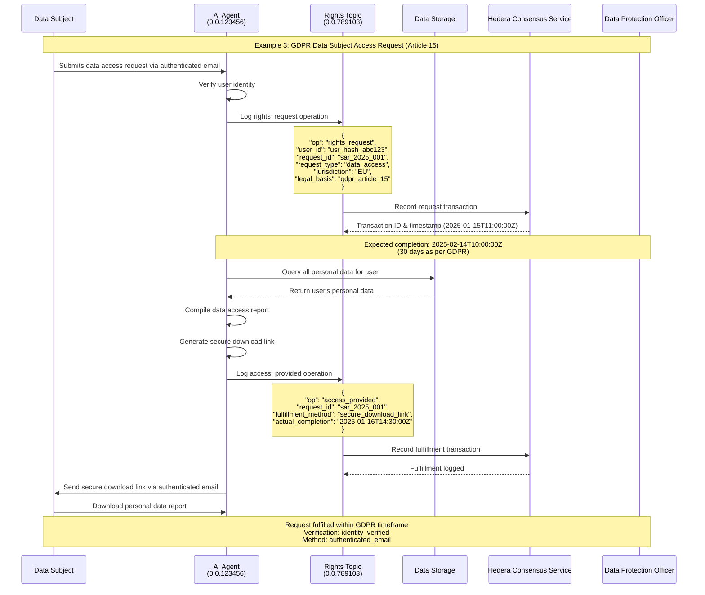
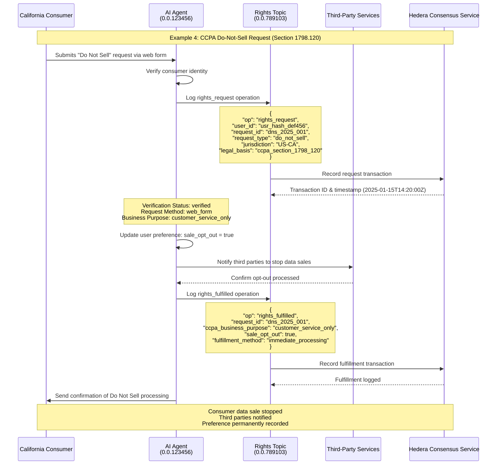
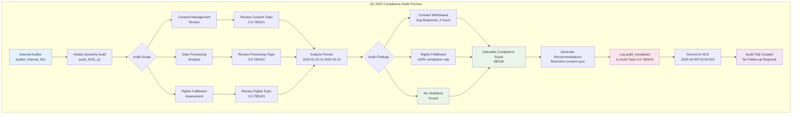

# HCS‑19 Standard: AI Agent Privacy Compliance

### Status: Draft

### Version: 1.0 (aligns with ISO/IEC TS 27560:2023)

### Table of Contents

<!-- omit in toc -->

* [Authors](#authors)
* [Abstract](#abstract)
* [Motivation](#motivation)
* [Specification](#specification)

  * [Architecture Overview](#architecture-overview)
  * [Topic System](#topic-system)

    * [Topic Types and Formats](#topic-types-and-formats)
    * [Topic Memo Formats](#topic-memo-formats)
  * [Operation Reference](#operation-reference)

    * [Consent Management Operations](#consent-management-operations)
    * [Data Processing Operations](#data-processing-operations)
    * [Privacy Rights Operations](#privacy-rights-operations)
    * [Audit and Compliance Operations](#audit-and-compliance-operations)
  * [Privacy Compliance Schema](#privacy-compliance-schema)

    * [User Consent Record](#user-consent-record)
    * [Data Processing Activity](#data-processing-activity)
    * [Privacy Rights Request](#privacy-rights-request)
    * [Compliance Audit Entry](#compliance-audit-entry)
  * [Legal Framework Integration](#legal-framework-integration)

    * [GDPR Compliance Fields](#gdpr-compliance-fields)
    * [CCPA Compliance Fields](#ccpa-compliance-fields)
    * [DDP Compliance Fields](#ddp-compliance-fields)
  * [Integration with HCS‑11 Profiles](#integration-with-hcs-11-profiles)
  * [Large Data Handling](#large-data-handling)
  * [Retention and Archival](#retention-and-archival)
* [Implementation Workflow](#implementation-workflow)

  * [Step 1: Privacy Topic Setup](#step-1-privacy-topic-setup)
  * [Step 2: Agent Registration](#step-2-agent-registration)
  * [Step 3: User Consent Collection](#step-3-user-consent-collection)
  * [Step 4: Ongoing Compliance Monitoring](#step-4-ongoing-compliance-monitoring)
* [Security Considerations](#security-considerations)
* [Examples](#examples)

  * [Example 1: User Consent for Customer‑Service Agent](#example-1-user-consent-for-customer-service-agent)
  * [Example 2: Data‑Processing Activity Logging](#example-2-data-processing-activity-logging)
  * [Example 3: GDPR Data‑Subject Access Request](#example-3-gdpr-data-subject-access-request)
  * [Example 4: CCPA Do‑Not‑Sell Request](#example-4-ccpa-do-not-sell-request)
  * [Example 5: Compliance Audit Trail](#example-5-compliance-audit-trail)
* [Conclusion](#conclusion)

---

## Authors

* **[Roy Smith](https://www.linkedin.com/company/privacycheq)**
* **[Andrew Smith](https://www.linkedin.com/in/andrew-hyde-smith/)**

## Abstract

HCS‑19 defines a comprehensive framework for AI agents to document and manage
privacy compliance through Hedera Consensus Service (HCS) topics. The
ISO/IEC TS 27560:2023 aligned standard enables auditable consent management,
data‑processing records, privacy‑rights fulfilment and regulatory‑compliance
documentation for major privacy laws (GDPR, CCPA, DDP). By leveraging immutable,
timestamped records on HCS and a consent‑record structure compatible with
ISO 27560, AI agents can demonstrate compliance, issue verifiable consent
receipts and build user trust through transparent privacy practices.

## Motivation

As AI agents increasingly handle personal data, robust privacy‑compliance
documentation is critical. Current systems often lack transparency,
immutability and auditability demanded by modern regulations. HCS‑19 addresses
these challenges by:

**Regulatory Compliance** – Meets complex privacy‑law obligations with unified,
ISO‑standard consent records.

**User Trust & Transparency** – Immutable HCS records provide unprecedented
visibility into data practices.

**Auditable Consent Management** – Tamper‑proof recording and lifecycle
tracking of each consent instance.

**Automated Compliance Monitoring** – Real‑time logging and reporting of
compliance activities.

**Decentralised Privacy** – Removes single points of failure through Hedera’s
distributed ledger.

## Specification

### Architecture Overview

HCS‑19 leverages Hedera Consensus Service to create a complete privacy‑compliance
documentation system. Components:



1. **Privacy‑Compliance Topics** – Dedicated HCS topics for consent, processing,
   rights and audit logs.
2. **Agent Registration** – HCS‑11 profiles identify compliant AI agents.
3. **Legal Framework Mapping** – Built‑in support for multiple privacy laws.
4. **Audit‑Trail Generation** – Comprehensive ledger of all privacy activities.
5. **Retention Management** – Automated lifecycle rules for retention/deletion.
6. **Standardised Consent Records** – JSON structure fully conformant with
   ISO/IEC TS 27560:2023 for interoperability and verifiability.

### Topic System

#### Topic Types and Formats

| Topic Type                   | Description                                 | Key Configuration             | Enum |
| ---------------------------- | ------------------------------------------- | ----------------------------- | ---- |
| **Consent Management**       | Records user consents and withdrawals       | Submit key (agent)            | 0    |
| **Data‑Processing Registry** | Logs data‑processing events                 | Submit key (agent)            | 1    |
| **Privacy‑Rights Registry**  | Handles rights requests / responses         | Submit key (agent)            | 2    |
| **Compliance Audit**         | Stores compliance monitoring and audit logs | Submit key (agent + auditors) | 3    |

#### Topic Memo Formats

**Consent Management Memo**

```
hcs-19:0:{ttl}:{topic_type}:{agent_account_id}:{jurisdiction}
```

Other memo formats follow the same pattern, replacing {topic_type} with the appropriate enum as required.


### Operation Reference

#### Consent Management Operations

| Operation           | Description                                     |
| ------------------- | ----------------------------------------------- |
| `consent_granted`   | Record user consent for data processing         |
| `consent_withdrawn` | Record withdrawal of previously‑granted consent |
| `consent_updated`   | Record modified consent preferences             |
| `consent_verified`  | Verify current consent status                   |

**Consent Granted Example**

```json
{
  "p": "hcs-19",
  "op": "consent_granted",
  "operator_id": "0.0.12345@0.0.4456",
  "user_id": "user_12345",
  "consent_id": "consent_67890",
  "purposes": ["service_delivery", "personalization"],
  "legal_basis": "consent",
  "jurisdiction": "EU",
  "consent_method": "explicit_opt_in",
  "data_types": ["personal_identifiers", "communication_data"],
  "retention_period": "2_years",
  "notice_reference": "hcs://1/0.0.999888#",
  "timestamp": "2025-01-15T10:30:00Z",
  "m": "User consent granted for customer service interactions"
}
```

#### Data Processing Operations

| Operation              | Description                             |
| ---------------------- | --------------------------------------- |
| `processing_started`   | Log start of a processing activity      |
| `processing_completed` | Log completion of a processing activity |
| `data_shared`          | Record data sharing with third parties  |
| `data_deleted`         | Record deletion of personal data        |

#### Privacy Rights Operations

| Operation                 | Description                              |
| ------------------------- | ---------------------------------------- |
| `rights_request`          | Log incoming privacy‑rights request      |
| `rights_fulfilled`        | Record fulfilment of a rights request    |
| `access_provided`         | Log provision of data access to the user |
| `rectification_completed` | Record completion of data rectification  |
| `erasure_completed`       | Record completion of data erasure        |

#### Audit and Compliance Operations

| Operation            | Description                       |
| -------------------- | --------------------------------- |
| `compliance_check`   | Record automated compliance check |
| `violation_detected` | Log detected compliance violation |
| `audit_initiated`    | Record start of an audit          |
| `audit_completed`    | Record completion of an audit     |

### Privacy Compliance Schema

#### User Consent Record

```jsonc
{
  "consent_id": "string",           // Unique consent identifier
  "user_id": "string",              // Pseudonymised user identifier
  "agent_id": "string",             // AI agent (PII controller) account ID
  "jurisdiction": "string",         // ISO‑3166‑1‑alpha‑2 code
  "legal_basis": "string",          // Lawful basis for processing
  "purposes": ["string"],           // Processing purposes
  "data_types": ["string"],         // Categories of data processed
  "consent_method": "string",       // How consent was obtained
  "consent_timestamp": "string",    // ISO 8601 timestamp
  "expiry_date": "string",          // Consent expiry date (if any)
  "retention_period": "string",     // Data‑retention period
  "withdrawal_method": "string",    // How user can withdraw consent
  "status": "string",               // "active" | "withdrawn"
  "notice_reference": "string",     // URI / HCS-1 ref of privacy notice version
  "granular_permissions": {
    "analytics": "boolean",
    "marketing": "boolean",
    "personalization": "boolean"
  }
}
```

#### Data Processing Activity

```jsonc
{
  "processing_id": "string",
  "user_id": "string",
  "agent_id": "string",
  "purpose": "string",
  "legal_basis": "string",
  "data_types": ["string"],
  "processing_method": "string",
  "duration": "string",
  "third_parties": ["string"],
  "security_measures": ["string"],
  "start_timestamp": "string",
  "end_timestamp": "string",
  "compliance_status": "string"
}
```

#### Privacy Rights Request

```jsonc
{
  "request_id": "string",
  "user_id": "string",
  "agent_id": "string",
  "request_type": "string",
  "jurisdiction": "string",
  "legal_basis": "string",
  "request_timestamp": "string",
  "verification_method": "string",
  "fulfillment_method": "string",
  "expected_completion": "string",
  "actual_completion": "string",
  "response_method": "string",
  "compliance_notes": "string"
}
```

#### Compliance Audit Entry

```jsonc
{
  "audit_id": "string",
  "agent_id": "string",
  "audit_type": "string",
  "auditor_id": "string",
  "audit_scope": ["string"],
  "audit_period": { "start_date": "string", "end_date": "string" },
  "findings": ["string"],
  "compliance_score": "number",
  "violations": ["string"],
  "recommendations": ["string"],
  "follow_up_required": "boolean",
  "follow_up_date": "string",
  "audit_timestamp": "string"
}
```

### Legal Framework Integration

#### GDPR Compliance Fields

```jsonc
{
  "gdpr_lawful_basis": "string",
  "special_category_basis": "string",
  "data_controller": "string",
  "data_processor": "string",
  "dpo_contact": "string",
  "transfer_mechanism": "string",
  "retention_justification": "string",
  "automated_decision_making": "boolean",
  "profiling_activities": ["string"]
}
```

#### CCPA Compliance Fields

```jsonc
{
  "business_purpose": "string",
  "commercial_purpose": "string",
  "sale_opt_out": "boolean",
  "categories_sold": ["string"],
  "categories_disclosed": ["string"],
  "third_party_recipients": ["string"],
  "retention_justification": "string",
  "consumer_rights_provided": ["string"]
}
```

#### DDP Compliance Fields

```jsonc
{
  "collection_method": "string",
  "notification_provided": "boolean",
  "purpose_limitation": "boolean",
  "data_minimization": "boolean",
  "accuracy_measures": ["string"],
  "storage_limitation": "string",
  "security_measures": ["string"],
  "accountability_measures": ["string"]
}
```

### Integration with HCS‑11 Profiles

AI agents **MUST** maintain a valid HCS‑11 profile including privacy‑compliance
metadata:

```jsonc
{
  "version": "1.0",
  "type": 1,
  "display_name": "Privacy‑Compliant Customer Service Agent",
  "privacy_compliance": {
    "standards": ["gdpr", "ccpa", "ddp"],
    "jurisdictions": ["EU", "US-CA", "US"],
    "consent_topic_id": "0.0.789101",
    "processing_topic_id": "0.0.789102",
    "rights_topic_id": "0.0.789103",
    "audit_topic_id": "0.0.789104",
    "dpo_contact": "dpo@example.com",
    "privacy_policy_url": "https://example.com/privacy",
    "retention_policy": "2_years_default"
  },
  "inboundTopicId": "0.0.123456",
  "outboundTopicId": "0.0.123457"
}
```

### Large Data Handling

Where consent‑related documents (e.g., full privacy notice) exceed HCS message
size, reference the content stored under **HCS‑1**:

```jsonc
{
  "p": "hcs-19",
  "op": "consent_granted",
  "operator_id": "0.0.123456",
  "user_id": "user_12345",
  "consent_data": "hcs://1/0.0.999888",
  "m": "Large notice stored via HCS‑1"
}
```

Referencing the exact notice version satisfies ISO 27560’s requirement to retain
the presented notice alongside the consent record.

### Retention and Archival

HCS‑19 supports automated retention management:

```jsonc
{
  "p": "hcs-19",
  "op": "retention_check",
  "operator_id": "0.0.123456",
  "records_reviewed": 1500,
  "records_archived": 150,
  "records_deleted": 25,
  "retention_policies_applied": ["2_year_default", "1_year_marketing"],
  "compliance_status": "compliant",
  "next_review_date": "2025-04-15T10:00:00Z",
  "m": "Quarterly retention review completed"
}
```

## Implementation Workflow

### Step 1: Privacy Topic Setup

1. Create four HCS topics (consent, processing, rights, audit).
2. Apply memo formats and set submit keys.
3. Register topic IDs in the agent’s HCS‑11 profile.

### Step 2: Agent Registration

1. Update HCS‑11 profile with privacy‑compliance block.
2. List supported jurisdictions and standards.
3. Provide controller and DPO contact details.

### Step 3: User Consent Collection

1. Present a clear privacy notice (ISO 29184 guidance) and collect explicit
   consent via UI controls.
2. Log consent events (`consent_granted`, etc.) on the Consent topic.
3. Verify active consent prior to any data processing.
4. **Issue a Consent Receipt** – after consent is recorded, provide the user a
   machine‑ and human‑readable receipt summarising consent ID, controller,
   purposes, notice reference and timestamp. The receipt includes the HCS
   transaction ID so users (or auditors) can independently verify authenticity.

### Step 4: Ongoing Compliance Monitoring

1. Record processing events in real time.
2. Respond to privacy‑rights requests within statutory deadlines.
3. Conduct and log periodic compliance audits.
4. Execute automated retention/deletion routines.

## Security Considerations

1. **Data Minimisation** – only include data necessary for compliance.
2. **Pseudonymisation** – use hashed or tokenised user IDs.
3. **Access Control & Authenticity** – restrict topic submission to authorised
   keys and digitally sign messages to guarantee integrity and origin.
4. **Encryption** – encrypt sensitive payloads before submission.
5. **Retention Limits** – automatically purge expired records.
6. **Audit Logging** – maintain a complete, immutable log of compliance
   activities.

## Examples

### Example 1: User Consent for Customer‑Service Agent

```jsonc
{
  "p": "hcs-19",
  "op": "consent_granted",
  "operator_id": "0.0.123456",
  "user_id": "usr_hash_abc123",
  "consent_id": "consent_2025_001",
  "purposes": ["customer_support", "service_improvement"],
  "legal_basis": "consent",
  "jurisdiction": "EU",
  "consent_method": "explicit_checkbox",
  "data_types": ["contact_information", "conversation_history"],
  "retention_period": "2_years",
  "gdpr_lawful_basis": "article_6_1_a",
  "withdrawal_method": "email_or_chat",
  "notice_reference": "hcs://1/0.0.999888#v1.3",
  "status": "active",
  "timestamp": "2025-01-15T10:30:00Z",
  "m": "Customer granted consent for AI customer service"
}
```



### Example 2: Data‑Processing Activity Logging

```jsonc
{
  "p": "hcs-19",
  "op": "processing_started",
  "operator_id": "0.0.123456",
  "user_id": "usr_hash_abc123",
  "processing_id": "proc_2025_001",
  "purpose": "sentiment_analysis",
  "legal_basis": "consent",
  "data_types": ["conversation_text", "emotional_indicators"],
  "processing_method": "automated_nlp_analysis",
  "expected_duration": "immediate",
  "security_measures": ["encryption", "access_logging"],
  "timestamp": "2025-01-15T10:35:00Z",
  "m": "Started sentiment analysis for customer feedback"
}
```





### Example 3: GDPR Data‑Subject Access Request

```jsonc
{
  "p": "hcs-19",
  "op": "rights_request",
  "operator_id": "0.0.123456",
  "user_id": "usr_hash_abc123",
  "request_id": "sar_2025_001",
  "request_type": "data_access",
  "jurisdiction": "EU",
  "legal_basis": "gdpr_article_15",
  "request_method": "authenticated_email",
  "verification_status": "identity_verified",
  "expected_completion": "2025-02-14T10:00:00Z",
  "fulfillment_method": "secure_download_link",
  "timestamp": "2025-01-15T11:00:00Z",
  "m": "GDPR Article 15 subject access request received"
}
```




### Example 4: CCPA Do‑Not‑Sell Request

```jsonc
{
  "p": "hcs-19",
  "op": "rights_request",
  "operator_id": "0.0.123456",
  "user_id": "usr_hash_def456",
  "request_id": "dns_2025_001",
  "request_type": "do_not_sell",
  "jurisdiction": "US-CA",
  "legal_basis": "ccpa_section_1798_120",
  "request_method": "web_form",
  "verification_status": "verified",
  "ccpa_business_purpose": "customer_service_only",
  "sale_opt_out": true,
  "timestamp": "2025-01-15T14:20:00Z",
  "m": "CCPA Do Not Sell request processed"
}
```




### Example 5: Compliance Audit Trail

```jsonc
{
  "p": "hcs-19",
  "op": "audit_completed",
  "operator_id": "0.0.123456",
  "audit_id": "audit_2025_q1",
  "audit_type": "internal_quarterly",
  "auditor_id": "auditor_internal_001",
  "audit_scope": ["consent_management", "data_processing", "rights_fulfillment"],
  "audit_period": {
    "start_date": "2025-01-01T00:00:00Z",
    "end_date": "2025-03-31T23:59:59Z"
  },
  "compliance_score": 98,
  "findings": ["consent_withdrawal_avg_response_2_hours", "100_percent_rights_fulfillment"],
  "violations": [],
  "recommendations": ["implement_real_time_consent_sync"],
  "follow_up_required": false,
  "timestamp": "2025-04-05T16:00:00Z",
  "m": "Q1 2025 privacy compliance audit completed"
}
```




## Conclusion

HCS‑19 delivers an immutable, transparent and automated privacy‑compliance
framework for AI agents on Hedera. Alignment with **ISO/IEC TS 27560:2023**
ensures each consent record and user receipt follows a globally standardised
structure, improving interoperability, verifiability and regulatory trust. The
standard empowers proactive compliance, user control and auditable proof while
keeping implementation lightweight and decentralised—transforming privacy
governance from a burden into a competitive advantage.
