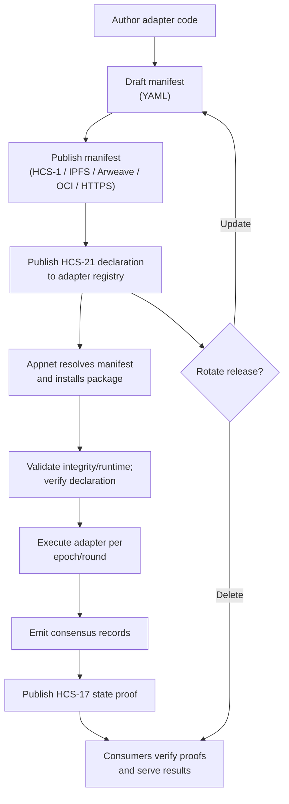
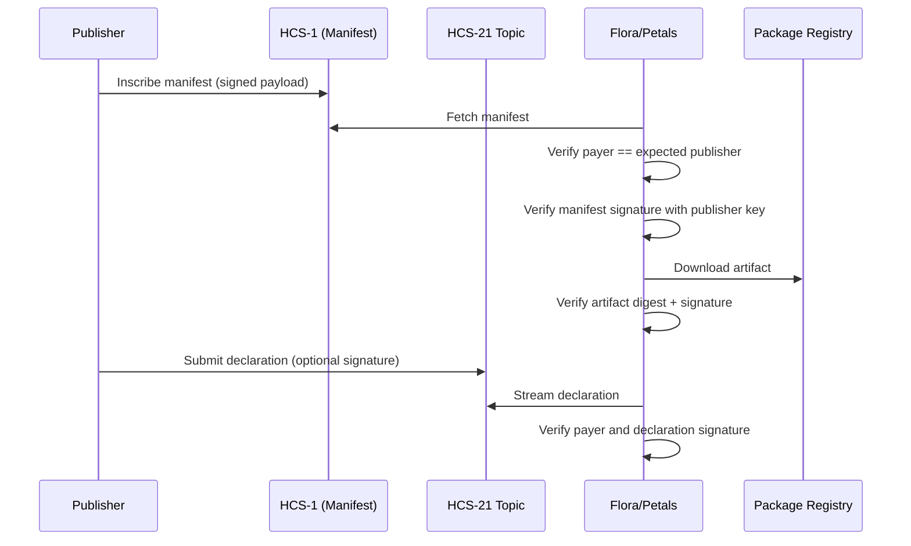
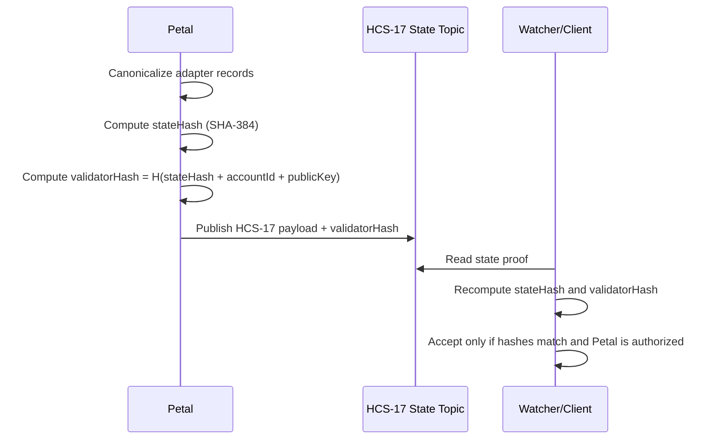
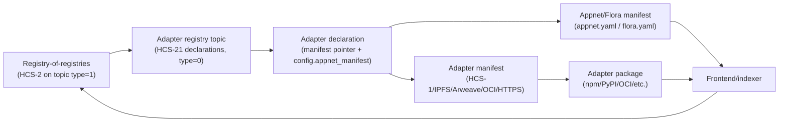
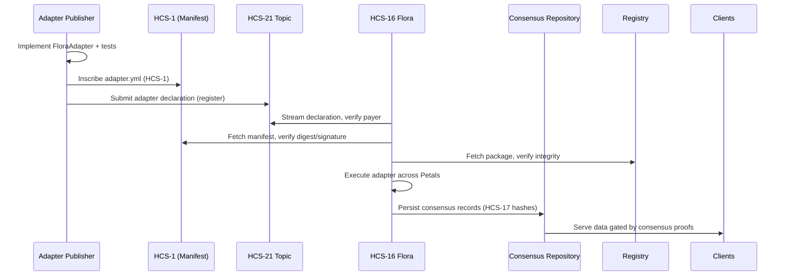

# HCS-21 Standard: Adapter Registry

### Status: Draft

### Version: 2.0

### Table of Contents

- [HCS-21 Standard: Adapter Registry](#hcs-21-standard-adapter-registry)
    - [Status: Draft](#status-draft)
    - [Version: 2.0](#version-20)
    - [Table of Contents](#table-of-contents)
  - [Authors](#authors)
  - [Abstract](#abstract)
  - [Motivation](#motivation)
  - [Normative Language](#normative-language)
  - [Terminology](#terminology)
  - [Architecture Overview](#architecture-overview)
  - [Adapter Lifecycle](#adapter-lifecycle)
  - [Topic System](#topic-system)
  - [Message Format](#message-format)
    - [Adapter Declaration Schema](#adapter-declaration-schema)
      - [Operations](#operations)
      - [State Model Identifiers](#state-model-identifiers)
  - [Adapter Manifest (inscribed or pinned metadata)](#adapter-manifest-inscribed-or-pinned-metadata)
    - [Registry metadata (HCS-1)](#registry-metadata-hcs-1)
    - [Manifest Fields](#manifest-fields)
    - [Example Manifest](#example-manifest)
  - [Flora Adapter Set Declarations](#flora-adapter-set-declarations)
    - [YAML schema (minimum fields)](#yaml-schema-minimum-fields)
    - [Guidelines](#guidelines)
  - [Registry-of-Registries (HCS-2 Discovery)](#registry-of-registries-hcs-2-discovery)
  - [Adapter Runtime Contract](#adapter-runtime-contract)
  - [Consensus Evidence Model](#consensus-evidence-model)
    - [Adapter records](#adapter-records)
    - [ConsensusBatch schema](#consensusbatch-schema)
    - [ConsensusBatchRecord schema](#consensusbatchrecord-schema)
    - [Storage and consumption rules](#storage-and-consumption-rules)
    - [State proof structure (HCS-17)](#state-proof-structure-hcs-17)
    - [Signature and hash handling (how to use them)](#signature-and-hash-handling-how-to-use-them)
      - [Signature/hash verification flow](#signaturehash-verification-flow)
      - [State proof hash flow](#state-proof-hash-flow)
  - [Reference Flow](#reference-flow)
    - [Frontend registry resolution (discovery → manifest → adapter set)](#frontend-registry-resolution-discovery--manifest--adapter-set)
  - [Implementation Workflow](#implementation-workflow)
  - [Validation](#validation)
  - [Security Considerations](#security-considerations)
  - [Conclusion](#conclusion)

## Authors

- Kantorcodes - [https://twitter.com/kantorcodes](https://twitter.com/kantorcodes)
- Patches - [https://twitter.com/tmcc_patches](https://twitter.com/tmcc_patches)

## Abstract

**HCS-21** defines a registry standard for **Adapters**, deterministic software packages that appnets (for example, Floras) use to achieve consensus about a specific entity type (agents, datasets, marketplaces, etc.). Each adapter release publishes a concise declaration, a signed manifest that can be inscribed via [HCS-1](/docs/standards/hcs-1) **or** any verifiable pointer (IPFS, Arweave, HTTP with integrity, OCI layer digest), and a verifiable package (npm, PyPI, crates.io, Maven/Gradle, OCI, IPFS, etc.) that implements the adapter contract defined in this standard (TypeScript reference provided; any language is acceptable). Appnets may rely on [HCS-16](/docs/standards/hcs-16) and [HCS-17](/docs/standards/hcs-17) or equivalent coordination/hashing layers; HCS-21 supplies the missing layer that tells participants _which_ adapter code to run, _what_ entity schema it validates, and _how_ to reconcile outputs during consensus.

## Motivation

1. **Composable governance:** Appnets (including Floras) need to swap or upgrade adapters (e.g., discovery pipelines, trust signals, billing flows) without redeploying multisig or coordination infrastructure.
2. **Deterministic consensus artifacts:** Downstream services require reproducible hashes per adapter so [HCS-17](/docs/standards/hcs-17) (or an equivalent) can be audited. Adapters SHOULD name a canonicalization profile (`state_model`) to make this explicit.
3. **Decentralized distribution:** Adapters are published as signed packages on any deterministic registry (npm, PyPI, crates.io, Maven Central, OCI, IPFS, Arweave, HTTP with SRI, etc.) and resolved through signed manifests, allowing machine-verifiable provenance without centralized app stores.
4. **Operational clarity:** Petals must know runtime prerequisites, rate limits, fee policies, and state topics before participating in consensus. Encoding this information in an inscribed manifest removes guesswork and reduces misconfiguration.
5. **Open participation:** A public adapter interface lets third-party developers describe any data source (agent registries, PGA scores, governance feeds, etc.) so Floras can add new consensus targets without rewriting infrastructure

## Normative Language

The key words “MUST”, “MUST NOT”, “SHOULD”, and “MAY” are to be interpreted as described in RFC 2119 and RFC 8174.

## Terminology

| Term                    | Definition                                                                                                                                                                       |
| ----------------------- | -------------------------------------------------------------------------------------------------------------------------------------------------------------------------------- |
| **Adapter**             | Deterministic software module that ingests data for a specific entity type and emits consensus-ready records for a Flora.                                                        |
| **Adapter Package**     | The distributable artifact (for example, npm/PyPI/crates.io/OCI/IPFS) that exports the adapter factory defined in this standard (TypeScript reference provided for clarity).     |
| **Adapter Manifest**    | YAML document, inscribed via [HCS-1](/docs/standards/hcs-1), that describes metadata, runtime requirements, capabilities, and consensus bindings for a specific adapter release. |
| **Adapter Declaration** | HCS-21 topic message that links an adapter ID to its manifest, package coordinates, and Flora context.                                                                           |
| **Entity Type**         | Logical type managed by an adapter (e.g., `agent`, `dataset`, `marketplace`).                                                                                                    |
| **Appnet**              | A coordinated set of participants that reach consensus (for example, Floras per [HCS-16](/docs/standards/hcs-16)).                                                               |
| **Flora**               | A specific appnet type defined in [HCS-16](/docs/standards/hcs-16); executes adapters to reach consensus.                                                                        |
| **Petal**               | Member account of a Flora, defined in [HCS-15](/docs/standards/hcs-15), that runs adapter code.                                                                                  |
| **UAID**                | Universal identifier concept (for example, UAID from certain AI catalogs) that some registries use to deduplicate records.                                                       |
| **Consensus Evidence**  | Tuple of epoch, [HCS-17](/docs/standards/hcs-17) state hash, participants, and adapter payload hash proving that a Flora agreed on a record.                                     |

## Architecture Overview

1. **Publishers** release adapter packages to their preferred registry (npm, PyPI, crates.io, Maven, OCI, etc.) and publish a signed manifest (HCS-1 recommended; IPFS/Arweave/HTTP/OCI digests also allowed) as outlined below.
2. **Adapter Registry Topic** stores small JSON declarations (`≤1024` bytes) that reference the manifest pointer, package coordinates, and appnet context.
3. **Appnets** (Floras or other formations) monitor the adapter topic, resolve manifests, install the declared package, and validate that every participant executes the same adapter version.
4. **Consensus services** ingest adapter outputs, persist consensus evidence, and gate downstream API responses with those proofs ([HCS-17](/docs/standards/hcs-17) or equivalent hashes).
5. **Indexers & marketplaces** read the same adapter topic to understand which adapters govern a Flora, enabling trust in external results.
6. **Adapter set manifests (`appnet.yaml` / `flora.yaml`)** list the adapter IDs (and optional config overrides) that every participant must run; the file references HCS-21 declarations so matchmaking services can verify compatibility before forming an appnet.

## Adapter Lifecycle



1. **Authoring:** Implement the adapter contract (see [Adapter Runtime Contract](#adapter-runtime-contract)) in your chosen language. The reference TypeScript definition illustrates the required methods (`createFloraAdapter`, `buildConsensusRecords`, etc.), but any language/runtime MAY be used as long as the exported API matches. Package metadata MUST follow semver and include typings or schema definitions where applicable (mirroring VS Code’s manifest guidance [1]).
2. **Manifest drafting:** Create a YAML manifest (see below) describing runtime requirements, dependencies, consensus schemas, and the adapter’s capabilities. Include `meta.spec_version` and, optionally, `meta.minimum_flora_version` (or equivalent appnet compatibility) to enforce compatibility, mirroring plugin ecosystems such as Dify [3].
3. **Inscription / publication:** Upload the manifest via [HCS-1](/docs/standards/hcs-1) **or** publish it to another immutable store (IPFS, Arweave, HTTP with SRI, OCI image label). Keep the pointer (e.g., `hcs://1/<topic>` or `ipfs://<cid>`). Participants later resolve this pointer.
4. **Declaration:** Submit an HCS-21 message referencing the adapter manifest, package, target Flora, and supported entity types.
5. **Verification:** Participants download the package, verify integrity hashes, and ensure their runtime environment (for example, Node.js ≥20, Python ≥3.11, WASM-compatible host, OCI runtime) matches the requirements declared in the manifest. They MAY check the manifest signature against the payer recorded on the declaration when present.
6. **Consensus operation:** Each Petal executes the adapter, emits deterministic `AdapterConsensusRecord`s, and uses [HCS-17](/docs/standards/hcs-17) hashes to publish state on the Flora’s STopic. A compliant consensus service persists those proofs.
7. **Updates or removals:** Publishers issue `update` or `delete` operations on the adapter topic. Appnets SHOULD treat the latest declaration per adapter ID as canonical.

## Topic System

| Memo Format                            | Description                 | Notes                                                                                                                                                                                                                                                                                                                                                                                       |
| -------------------------------------- | --------------------------- | ------------------------------------------------------------------------------------------------------------------------------------------------------------------------------------------------------------------------------------------------------------------------------------------------------------------------------------------------------------------------------------------- |
| `hcs-21:<indexed>:<ttl>:<type>:<meta>` | Adapter-related topic memos | `indexed` is `0` (full history) or `1` (tail-only caches). `ttl` hints desired cache duration in seconds. `type` enums: `0` = adapter registry topic (holds HCS-21 declarations), `1` = registry-of-registries topic (lists adapter registries via HCS-2). `meta` (optional) is a pointer to registry metadata (HCS-1 topic ID preferred; IPFS/Arweave/HTTP/OCI allowed when short enough). |

## Message Format

### Adapter Declaration Schema

Each message MUST be UTF-8 JSON ≤1024 bytes.

| Field               | Type   | Required         | Description                                                                                                                                                                                                                                                               |
| ------------------- | ------ | ---------------- | ------------------------------------------------------------------------------------------------------------------------------------------------------------------------------------------------------------------------------------------------------------------------- |
| `p`                 | string | Yes              | MUST equal `"hcs-21"`.                                                                                                                                                                                                                                                    |
| `op`                | string | Yes              | `"register"`, `"update"`, or `"delete"`.                                                                                                                                                                                                                                  |
| `adapter_id`        | string | Yes              | Canonical identifier `namespace/name@version`. The namespace SHOULD match the package ecosystem (e.g., `npm`, `pypi`, `crate`, `oci`, `maven`).                                                                                                                           |
| `entity`            | string | Yes              | Entity type handled by this adapter (`agent`, `dataset`, ...).                                                                                                                                                                                                            |
| `package`           | object | Yes              | See `package` schema below. Contains registry coordinates and integrity.                                                                                                                                                                                                  |
| `manifest`          | string | Yes              | Resolvable pointer to the manifest (e.g., `hcs://1/<topic>`, `ipfs://<cid>`, `ar://<txid>`, `oci://<repo>@<digest>`, `https://...` with integrity).                                                                                                                       |
| `manifest_sequence` | number | No               | Optional explicit sequence number if the manifest pointer is an HCS-1 topic and a specific message needs to be pinned.                                                                                                                                                    |
| `config`            | object | Yes              | See `config` schema below. Describes the appnet context.                                                                                                                                                                                                                  |
| `state_model`       | string | No (recommended) | Identifier of the [HCS-17](/docs/standards/hcs-17) canonicalization profile the adapter uses (e.g., `hcs-21.generic@1`, `hcs-21.agent-consensus@1`). Recommended for auditability; appnets MAY accept declarations without it if they explicitly trust the payload shape. |
| `signature`         | string | No               | Optional detached signature over the JSON payload for additional provenance.                                                                                                                                                                                              |

**`package` object**

| Field       | Type   | Required | Description                                                                                                            |
| ----------- | ------ | -------- | ---------------------------------------------------------------------------------------------------------------------- |
| `registry`  | string | Yes      | Registry identifier or scheme (`npm`, `pypi`, `crate`, `maven`, `oci`, `ipfs`, `https`, etc.).                         |
| `name`      | string | Yes      | Package name in that registry (e.g., `@hol-org/adapter-binance`).                                                      |
| `version`   | string | Yes      | SemVer or registry-appropriate version.                                                                                |
| `integrity` | string | Yes      | Base64 SHA-384 (or registry-native digest) of the distributable artifact (tarball, wheel, crate, JAR, OCI layer, etc). |

**`config` object**

| Field             | Type   | Required | Description                                                                                                                                                                      |
| ----------------- | ------ | -------- | -------------------------------------------------------------------------------------------------------------------------------------------------------------------------------- |
| `type`            | string | Yes      | Appnet type (e.g., `"flora"`, `"custom"`).                                                                                                                                       |
| `account`         | string | No       | Conditional for `type: "flora"`: Flora account ID (or appnet-specific identifier for other types).                                                                               |
| `threshold`       | string | No       | Conditional for `type: "flora"`: threshold description (e.g., `2-of-3`).                                                                                                         |
| `ctopic`          | string | No       | Conditional for `type: "flora"`: coordination/communication topic per [HCS-16](/docs/standards/hcs-16).                                                                          |
| `ttopic`          | string | No       | Conditional for `type: "flora"`: transaction topic per [HCS-16](/docs/standards/hcs-16).                                                                                         |
| `stopic`          | string | No       | Conditional for `type: "flora"`: state topic per [HCS-16](/docs/standards/hcs-16).                                                                                               |
| `appnet_manifest` | string | No       | Optional pointer (HCS-1/IPFS/Arweave/OCI/HTTPS with integrity) to the adapter set manifest (`appnet.yaml` / `flora.yaml`) that defines the required adapter set for this appnet. |
| `extra`           | object | No       | Free-form appnet parameters (discovery endpoints, quorum rules, Docker image references, etc.).                                                                                  |
| `[key: str]`      | any    | No       | Deployments MAY add additional deterministic fields so other runtimes can coordinate without extending the core schema.                                                          |

#### Operations

| `op`       | Purpose                                                                                                           |
| ---------- | ----------------------------------------------------------------------------------------------------------------- |
| `register` | First declaration for `adapter_id`. Establishes manifest + package pointer and Flora bindings.                    |
| `update`   | Rotates package version, manifest pointer, or Flora parameters while retaining the adapter ID.                    |
| `delete`   | Signals that a release must not be used. Consumers MUST stop loading deleted adapters and purge cached manifests. |

#### State Model Identifiers

The `state_model` field names the canonicalization profile an adapter uses when producing HCS-17 hashes. It is recommended (for auditability) but appnets MAY omit it if they explicitly trust the payload shape.

Practical use:

- **Name:** Prefer `hcs-21.<entity>-consensus@<version>` (e.g., `hcs-21.agent-consensus@1`). A generic fallback like `hcs-21.generic@1` can simply mean “canonicalize JSON via HCS-17 defaults (sorted keys, SHA-384).”
- **Publish:** Put the profile doc somewhere immutable (HCS-1 topic, IPFS, Arweave, or in this repo). It should specify required/optional fields, normalization (sorting, number handling), SHA-384 hashing per HCS-17, and SHOULD embed or link a JSON Schema for the payload shape.
- **Verify:** Petals/consumers SHOULD fetch the profile (`profile_uri` in the manifest), canonicalize records exactly as described, and recompute the hash. Appnets MAY accept declarations without a `state_model` if they operate in a trustful/lax mode.
- **Evolve:** Bump the `@version` when changing fields or ordering. Consumers MAY reject profiles they do not recognize unless explicitly configured to accept them.

When present, `state_model` in the declaration MUST align with `consensus.state_model` in the manifest, and `consensus.profile_uri` SHOULD resolve to the canonicalization profile + JSON Schema so verifiers know exactly how to validate payloads without guessing.

## Adapter Manifest (inscribed or pinned metadata)

YAML manifests SHOULD be published immutably (HCS-1 recommended; IPFS/Arweave/OCI/HTTPS with SRI also acceptable) to keep adapters human-auditable while remaining deterministic. Large plugin ecosystems (GitHub Actions, VS Code extensions) use declarative metadata files to encode runtime requirements [1][2]; HCS-21 follows the same pattern so appnets can bootstrap adapters without centralized configuration tools.

### Registry metadata (HCS-1)

Adapter registries SHOULD publish a lightweight HCS-1 document that describes their scope and operator details. When present, the topic memo’s `<meta>` slot SHOULD point to this metadata topic ID.

| Field         | Type     | Required | Description                                                     |
| ------------- | -------- | -------- | --------------------------------------------------------------- |
| `version`     | string   | Yes      | Schema version (e.g., `1.0`).                                   |
| `name`        | string   | Yes      | Human-readable registry name.                                   |
| `description` | string   | Yes      | Brief summary of what the registry indexes (entities, domains). |
| `operator`    | object   | Yes      | Operator info: `account`, optional `name`, optional `contact`.  |
| `entityTypes` | string[] | Yes      | Entity types covered (e.g., `agent`, `dataset`, `marketplace`). |
| `categories`  | string[] | No       | Registry-defined categories to group adapters.                  |
| `tags`        | string[] | No       | Freeform tags.                                                  |
| `links`       | object   | No       | URLs for docs, website, community, source, or support.          |

`operator.account` MUST be a Hedera account ID; other operator fields are optional.

### Manifest Fields

| Section                      | Required         | Description                                                                                                                                                        |
| ---------------------------- | ---------------- | ------------------------------------------------------------------------------------------------------------------------------------------------------------------ |
| `meta.spec_version`          | Yes              | Version of this manifest schema (e.g., `1.0`). Enables backward compatibility similar to Dify’s manifest versioning [3].                                           |
| `meta.adapter_version`       | Yes              | SemVer of the adapter package. MUST match the package version referenced in the declaration.                                                                       |
| `meta.minimum_flora_version` | No               | Compatibility hint for Flora/appnet implementations. Omit if not applicable.                                                                                       |
| `meta.generated`             | Yes              | ISO timestamp when the manifest was produced.                                                                                                                      |
| `adapter.name`               | Yes              | Human-readable name.                                                                                                                                               |
| `adapter.id`                 | Yes              | Matches `adapter_id` in the HCS-21 message.                                                                                                                        |
| `adapter.maintainers`        | Yes              | Array of `{name, contact}` objects.                                                                                                                                |
| `adapter.license`            | Yes              | SPDX identifier or `SEE LICENSE IN ...`.                                                                                                                           |
| `package.registry`           | Yes              | Registry identifier or scheme (e.g., `npm`, `pypi`, `crate`, `maven`, `oci`, `ipfs`, `https`).                                                                     |
| `package.dist_tag`           | No               | Optional channel name understood by the registry (e.g., npm `latest`, PyPI `rc`, Maven `-SNAPSHOT`).                                                               |
| `package.artifacts`          | Yes              | Array of `{url, digest, signature}` entries for tarballs, wheels, crates, JARs, WASM bundles, OCI layers, etc.                                                     |
| `runtime.platforms`          | Yes              | Array describing supported runtime families (e.g., `node>=20`, `python>=3.11`, `wasm32-wasi`, `rust>=1.79`, `oci:image`).                                          |
| `runtime.primary`            | Yes              | Name of the reference platform used by the publisher (e.g., `node`, `python`, `wasm`).                                                                             |
| `runtime.entry`              | Yes              | Module path exported by the package (e.g., `dist/index.js`).                                                                                                       |
| `runtime.dependencies`       | No               | Peer dependencies (e.g., `@hashgraphonline/standards-sdk`).                                                                                                        |
| `runtime.env`                | No               | Required environment variables (names only; no secrets).                                                                                                           |
| `capabilities.discovery`              | Yes      | Boolean indicating if the adapter discovers new entities.                                                                                                          |
| `capabilities.discovery_tags`         | No       | Optional tags describing discovery domains (e.g., `agents`, `datasets`, `marketplaces`) for UI filtering/search.                                                   |
| `capabilities.communication`          | Yes      | Boolean for chat/routing support.                                                                                                                                  |
| `capabilities.communication_channels` | No       | Optional list of supported channels/transports (e.g., `text`, `voice`, `x402`, `webrtc`, `grpc`).                                                                  |
| `capabilities.protocols`              | Yes      | Array of protocol identifiers handled.                                                                                                                             |
| `capabilities.extras`                 | No       | Free-form key/value map for additional capability metadata (e.g., rate limits, locales, auth modes) that frontends can index.                                      |
| `consensus.state_model`      | No (recommended) | Name of the canonicalization profile (e.g., `hcs-21.agent-consensus@1`) matching the declaration’s `state_model`.                                                  |
| `consensus.profile_uri`      | No (recommended) | Resolvable pointer (HCS-1/IPFS/Arweave/HTTPS/OCI) to the profile document containing canonicalization rules **and a JSON Schema or equivalent** for payload shape. |
| `consensus.entity_schema`    | No (recommended) | Identifier describing the payload schema hashed under [HCS-17](/docs/standards/hcs-17); SHOULD match or embed the schema referenced by `profile_uri`.              |
| `consensus.required_fields`  | Yes              | Array of field names each Petal MUST supply in consensus payloads.                                                                                                 |
| `consensus.hashing`          | Yes              | Hash algorithm (MUST be `sha384`).                                                                                                                                 |

### Example Manifest

```yaml
meta:
  spec_version: 1.0
  adapter_version: 1.3.2
  generated: 2025-02-12T18:11:00Z
adapter:
  id: oci/@hashgraphonline/x402-bazaar-adapter@1.3.2
  name: X402 Bazaar Agent Adapter
  maintainers:
    - name: Hashgraph Online
      contact: ops@hashgraph.online
  license: Apache-2.0
package:
  registry: oci
  dist_tag: stable
  artifacts:
    - url: oci://registry.hashgraph.online/hashgraphonline/x402-bazaar-adapter:1.3.2
      digest: sha384-2ab4...
      signature: 3044...
runtime:
  platforms:
    - node>=20.10.0
    - wasm32-wasi
  primary: node
  entry: dist/index.js
  dependencies:
    - '@hashgraphonline/standards-sdk@^1.8.0'
  env:
    - X402_API_KEY
capabilities:
  discovery: true
  discovery_tags:
    - agents
    - marketplaces
  communication: true
  communication_channels:
    - text
    - x402
  protocols:
    - x402
    - uaid
  extras:
    locales:
      - en
      - es
    rate_limit:
      requests_per_minute: 120
consensus:
  state_model: hcs-21.generic@1
  profile_uri: ipfs://bafy... # points to canonicalization + JSON Schema
  entity_schema: hcs-21.entity-consensus@1
  required_fields:
    - entity_id
    - registry
    - state_hash
    - epoch
  hashing: sha384
```

## Flora Adapter Set Declarations

Every Flora publishes a configuration document (commonly `flora.yaml`) that declares which adapters must be active before a Petal can join consensus. This file references HCS-21 declarations so matchmaking services can verify compatibility automatically.

### YAML schema (minimum fields)

```yaml
flora:
  account: 0.0.9876
  threshold: 2-of-3
adapters:
  - adapter_id: oci/@hashgraphonline/x402-bazaar-adapter@1.3.2
    required: true
    version_range: ^1.3.0
    config_overrides:
      rateLimit.requestsPerMinute: 60
      source.region: us-east-1
  - adapter_id: pypi/community/pga-tour-adapter@0.4.0
    required: false
    notes: 'Adds PGA leaderboard data for sidecar contracts'
```

**Storage/links:** The adapter set manifest is not embedded in HCS-21 declarations. Publish it immutably (HCS-1 topic, IPFS/Arweave, OCI label, or HTTPS with integrity) and optionally reference it from registry metadata (`links.manifest`) or onboarding docs.

### Guidelines

- **Adapter references:** MUST point to the canonical `adapter_id` (namespace/name@version) from the HCS-21 declaration. Optional `version_range` lets a Flora accept maintenance releases.
- **Required flag:** Petals MUST run adapters marked `required: true` before joining the Flora. Optional adapters MAY be enabled for enhanced data sets.
- **Config overrides:** Provide deterministic overrides (env var names, rate limits, or secrets placeholders). Sensitive values SHOULD reference secret names rather than raw credentials.
- **Linkage:** A registry or declaration MAY also carry a pointer to this manifest (for example, `config.appnet_manifest`) so consumers can correlate on-chain declarations with the appnet’s adapter set.
- **Discovery:** Matchmaking services can compare their local adapter inventory with `flora.yaml` to ensure they can satisfy the requested set before committing to consensus.
- **Extensibility:** Because adapters describe arbitrary data sources, Floras can mix existing registries (for example, AI agent catalogs) with any external API (sports data, DAO votes, etc.) while still using the same manifest and consensus proof format.

## Registry-of-Registries (HCS-2 Discovery)

To help consumers find adapter registries for a given domain, HCS-21 leverages [HCS-2](/docs/standards/hcs-2) to publish a **registry of registries**:

- Create an HCS topic with memo `hcs-21:0:<ttl>:1:<meta>` to serve as the discovery topic (type `1`).
- Post `hcs-2` `register` operations to that topic, where each entry points to an adapter registry topic (`t_id`) and, optionally, its metadata HCS-1 topic (`metadata` field in the HCS-2 payload).
- Consumers stream the registry-of-registries topic to enumerate available adapter registries, then subscribe to the adapter registry topics (type `0`) to receive HCS-21 declarations.

**HCS-2 payload for registry-of-registries entry**

```json
{
  "p": "hcs-2",
  "op": "register",
  "t_id": "<adapter_registry_topic_id>",
  "metadata": "hcs://1/<metaTopicId>", // optional pointer to registry metadata
  "m": "adapter-registry"
}
```

This approach mirrors the discovery pattern used in HCS-10, providing a structured way to bootstrap adapter discovery without hardcoding registry endpoints.

## Adapter Runtime Contract

Adapter packages MUST expose the following surface. The interface below is expressed in TypeScript for clarity, but implementations MAY provide equivalent exports in any language as long as the same semantics are preserved:

```ts
export interface AdapterConsensusRecord {
  adapterId: string;
  entityId: string;
  uaid?: string;
  registry: string;
  epoch: number;
  stateHash: string; // HCS-17 compliant hash
  payload: unknown; // Deterministic, canonical JSON payload
}

export interface AdapterRuntime {
  readonly adapterId: string;
  readonly entity: string;
  buildConsensusRecords(): Promise<AdapterConsensusRecord[]>;
  verifyRecord(record: AdapterConsensusRecord): Promise<boolean>;
}

export type CreateAdapter = (
  options?: Record<string, unknown>
) => Promise<AdapterRuntime>;
```

Implementations MAY extend `ProtocolAdapter` with project-specific helpers, but MUST provide `buildConsensusRecords()` (for aggregator jobs) and `verifyRecord()` (for Petal-to-Petal validation). Packages SHOULD publish language-appropriate type metadata (for example, `.d.ts` files, JSON schemas, or protobuf definitions) so downstream Floras can validate usage.

## Consensus Evidence Model

Floras need a portable way to prove that every Petal agreed on the same adapter output. This section only maps adapter outputs onto existing [HCS-17](/docs/standards/hcs-17) proofs—no extra topics beyond the Flora’s existing coordination/state topics are introduced. HCS-21 introduces three nested data structures that cover the workflow:

1. **Adapter records** – Deterministic per-entity payloads gathered from each adapter.
2. **Broker consensus payload** – A batch of adapter records plus metadata (epoch, participants, fingerprints).
3. **State proof** – The HCS-17-compliant envelope that publishes the batch hash, validator hashes, and participant attestations on-chain.

Implementations SHOULD follow these steps for each adapter run:

1. Collect the adapter’s deterministic records via `buildConsensusRecords()`.
2. Canonicalize each record’s payload (stable key ordering, normalized dates, etc.) and compute each adapter’s `sourceFingerprint`.
3. Wrap the records in a `ConsensusBatch` payload.
4. Compute the dataset hash (see [State proof structure (HCS-17)](#state-proof-structure-hcs-17)) using SHA-384 and build the validator hashes.
5. Publish the resulting state proof on the Flora’s STopic (HCS-17 memo + payload) and persist the canonical adapter records plus proof material locally so downstream consumers can request or rebuild the batch payload.
6. Store each record by the entity identifier so a consensus gate can later verify and mark it consumed.

### Adapter records

An adapter record captures the canonical data emitted by a single adapter for a single entity. Implementers MUST normalize timestamps, metadata, and array ordering consistently so every Petal derives identical payloads (see the canonicalization rules above). Tooling MAY provide helper libraries for canonicalization, but the resulting JSON must remain deterministic across all Petals.

| Field               | Type             | Description                                                                                                                                                                                                                                                                                   |
| ------------------- | ---------------- | --------------------------------------------------------------------------------------------------------------------------------------------------------------------------------------------------------------------------------------------------------------------------------------------- |
| `adapterId`         | string or number | Stable identifier assigned to the adapter within the appnet.                                                                                                                                                                                                                                  |
| `entityId`          | string           | Canonical identifier for the indexed entity (for example, UAID for agents, dataset ID for other sources, etc.).                                                                                                                                                                               |
| `payload`           | object           | Canonical JSON payload containing registry, capabilities, metadata, etc. Keys MUST be sorted and nested values normalized (dates → ISO strings). Arrays MUST preserve a deterministic order chosen by the adapter so that all Petals see the same sequence.                                   |
| `timestamp`         | string           | ISO-8601 timestamp representing the record’s freshness (`updatedAt` > `createdAt`).                                                                                                                                                                                                           |
| `sourceFingerprint` | string           | Opaque, deterministic fingerprint string that allows verifiers to detect when adapter code or configuration differs between Petals. It SHOULD be derived from stable adapter metadata (for example, name, version, and settings) but MAY be computed differently by specific implementations. |

**Recommended source fingerprint formula**

Implementations MAY choose any deterministic scheme for `sourceFingerprint`. One recommended pattern is:

```
sourceFingerprint = SHA384(JSON.stringify({
  adapterName,
  adapterVersion,
  settings: canonicalize(settings),
}))
```

This produces one fingerprint per adapter configuration. Other deployments MAY instead derive per-record fingerprints (for example, hashing `{ adapterId, entityId, payload }`) as long as the value remains deterministic across Petals.

### ConsensusBatch schema

| Field          | Type                     | Description                                                                       |
| -------------- | ------------------------ | --------------------------------------------------------------------------------- |
| `epoch`        | number                   | Monotonic counter representing the Flora’s current decision round.                |
| `stateHash`    | string                   | SHA-384 hash representing the Flora state (per [HCS-17](/docs/standards/hcs-17)). |
| `participants` | string[]                 | Hedera account IDs (or aliases) of the Petals that signed this round.             |
| `timestamp`    | string                   | ISO-8601 timestamp when the payload was finalized.                                |
| `records`      | `ConsensusBatchRecord[]` | The adapter outputs being attested.                                               |

### ConsensusBatchRecord schema

| Field               | Type             | Description                                                               |
| ------------------- | ---------------- | ------------------------------------------------------------------------- |
| `adapterId`         | number or string | Identifier assigned to the adapter within the Flora.                      |
| `entityId`          | string           | Canonical identifier for the entity being recorded (for example, UAID).   |
| `timestamp`         | string           | ISO-8601 timestamp for the individual record.                             |
| `sourceFingerprint` | string           | Optional reference to the upstream registry version or crawl fingerprint. |
| `payload`           | object           | Deterministic JSON object emitted by the adapter.                         |

### Storage and consumption rules

- Implementations SHOULD index persisted records by the entity identifier and any additional keys needed for their use case (for example, `(epoch, adapterId, entityId)`), so an entity’s latest proof or a specific epoch can be retrieved without scanning the entire payload.
- The stored value SHOULD include the SHA-384 hash of the canonical payload so clients can re-derive it.
- When a downstream consumer (API, relay, etc.) serves an entity, it MUST verify the record is present, unconsumed, and tied to the expected epoch/state hash before honoring it.
- After serving, the consumer MAY mark the record as consumed to prevent replay.

### State proof structure (HCS-17)

After building a `ConsensusBatch`, the Flora participants produce an HCS-17 state proof that can be published to the Flora’s state topic. A compliant implementation MUST perform the following steps:

1. Sort adapter records by `adapterId` then `entityId`.
2. Canonicalize each record payload and strip any non-deterministic fields.
3. Compute the dataset hash:
   ```
   stateHash = SHA384(JSON.stringify({
     records: canonicalRecords,
     thresholdFingerprint,
   }))
   ```
4. Compute the validator hash for the publishing Petal (and optionally every participant) by hashing `{ stateHash, accountId, publicKey }`.
5. Record the unique set of `sourceFingerprint` values as `adapterFingerprints`.

| Field                                     | Type                                        | Description                                                                                  |
| ----------------------------------------- | ------------------------------------------- | -------------------------------------------------------------------------------------------- |
| `epoch`                                   | number                                      | Same epoch value from the broker consensus payload.                                          |
| `round`                                   | number                                      | Incrementing counter within the epoch.                                                       |
| `stateHash`                               | string                                      | Dataset hash from step 3 (SHA-384).                                                          |
| `validatorHash`                           | string                                      | Hash of `{ stateHash, petalAccountId, petalPublicKey }`.                                     |
| `adapterFingerprints`                     | string[]                                    | Unique `sourceFingerprint` values proving identical adapter configuration across Petals.     |
| `thresholdFingerprint`                    | string                                      | Deterministic hash of the Flora threshold key (see HCS-17’s threshold fingerprint guidance). |
| `petalAccountId` / `petalPublicKey`       | string                                      | Identity of the Petal that published the proof.                                              |
| `leaderAccountId` / `nextLeaderAccountId` | string                                      | Leader rotation information so other Petals know who should publish next.                    |
| `participantHashes`                       | `{ accountId, publicKey, validatorHash }[]` | Optional array emitted by the leader showing every participant’s validator hash.             |

State proofs are serialized with an `hcs17:<epoch>:<round>:<stateHashPrefix>` memo and JSON payload, then submitted to the Flora’s state topic. Consensus watchers listen for matching `thresholdFingerprint` and `validatorHash` values to confirm quorum.

### Signature and hash handling (how to use them)

- **Manifest signatures:** The HCS-1 manifest SHOULD be signed by the publisher. Consumers verify the signature with the payer key from the manifest inscription transaction; mismatches indicate the manifest was tampered with or uploaded by an unexpected account.
- **Package artifact signatures and digests:** Each artifact’s `digest` (SHA-384) and optional `signature` MUST be checked before execution. Resolve the artifact from the declared registry, compute the digest, and verify the signature with the publisher’s public key (or registry-provided signing key) that matches the declaration payer.
- **Declaration `signature` field:** When present, it is a detached signature over the exact JSON payload of the declaration (canonicalized with stable key ordering). Verifiers first ensure the payer on the HCS-21 message matches the expected publisher account, then validate this signature to prevent relay/rewrap attacks.
- **`stateHash` and `validatorHash`:** Petals recompute `stateHash` from the canonicalized `ConsensusBatch`. Each Petal signs `{ stateHash, accountId, publicKey }` to emit `validatorHash`. A watcher only accepts a proof when the published `validatorHash` matches the recomputed value and comes from a Petal listed in `participants`.
- **Registry-of-registries topics:** Apply the same checks: verify the payer, validate declaration signatures when present, and recompute state hashes for any downstream proofs referenced by the registry entries.
- **Trust model reminder:** These checks prove consistency (the manifest and declaration came from the same payer/key and the artifact matches its digest). They do **not** attest to the safety or quality of the adapter code itself. Deployments SHOULD layer additional trust/reputation or code review before execution.

#### Signature/hash verification flow



#### State proof hash flow



## Reference Flow

### Frontend registry resolution (discovery → manifest → adapter set)





## Implementation Workflow

1. **Generate manifest:** Produce `adapter.yml`, sign it, and upload via [HCS-1](/docs/standards/hcs-1).
2. **Declare release:** Post an HCS-21 `register` message referencing the manifest and package.
3. **Automate installation:** Petals subscribe to the topic and auto-install or upgrade adapters when new messages appear.
4. **Publish consensus proofs:** Run the adapter within the Flora, emit canonical adapter records, wrap them in a `ConsensusBatch`, and publish the resulting HCS-17 state proof to the Flora’s state topic. Persist the payload so downstream services can audit it on demand.
5. **Audit & remove if necessary:** If vulnerabilities are found, issue a `delete` message so Floras stop executing the affected release.

## Validation

1. Payload is UTF-8, ≤1024 bytes, and includes `p = "hcs-21"`.
2. `adapter_id` matches a SemVer tag and equals `manifest.adapter.id`.
3. Package integrity hash matches the tarball downloaded from the declared registry.
4. Manifest pointer resolves to YAML that conforms to the schema above and whose transaction payer equals the declaration payer.
5. When provided, `state_model` names the [HCS-17](/docs/standards/hcs-17) schema (or versioned profile) that consumers should use when validating the adapter’s consensus payload; `consensus.profile_uri` SHOULD resolve to that profile + JSON Schema. Adapters MUST produce SHA-384 hashes that conform to the HCS-17 rules for whichever schema they reference.
6. When `config.type = "flora"`, the `threshold` value aligns with the actual Flora key list (`T/M`).
7. `buildConsensusRecords()` outputs canonical JSON with stable ordering so payload hashes are reproducible across Petals.
8. `verifyRecord()` rejects records whose entity identifier lacks a consensus entry or whose payload hash diverges from the stored value.
9. `sourceFingerprint` values are deterministic across Petals for a given adapter and configuration, and consumers verify that fingerprints match across proofs so configuration mismatches are immediately detectable.
10. Topic memos follow `hcs-21:<indexed>:<ttl>:<type>:<meta>` with `type` in `{0,1}` and, when present, `<meta>` pointing to HCS-1 registry metadata. Registry-of-registries topics MUST carry `type = 1` and use `hcs-2` messages to list adapter registry topics.

## Security Considerations

- Treat the Hedera payer on both the manifest inscription and adapter declaration as the source of truth for ownership.
- Require SHA-384 integrity hashes for packages and verify them before execution.
- Enforce runtime and dependency constraints from the manifest to avoid running malicious builds on unsupported platforms.
- Petals SHOULD sandbox adapter execution (e.g., Node.js `vm` contexts, Python virtual environments, or WASM sandboxes) to limit blast radius if a package is compromised.
- Implement HIP-991 submit keys or fees on the adapter topic to deter spam.
- Monitor `delete` operations and immediately stop executing removed adapters.
- Store consensus proofs in append-only databases so retroactive tampering is detectable.

## Conclusion

HCS-21 now formalizes Flora-ready adapters: deterministic packages discoverable through Hedera topics, described by inscribed manifests, and enforced by the contract defined in this document (expressed in TypeScript but applicable to any language). Together with [HCS-15](/docs/standards/hcs-15) Petals, [HCS-16](/docs/standards/hcs-16) Floras, and [HCS-17](/docs/standards/hcs-17) state hashing, this standard gives registries a portable way to agree on “who discovered what” while keeping adapter upgrades transparent, auditable, and decentralized.
