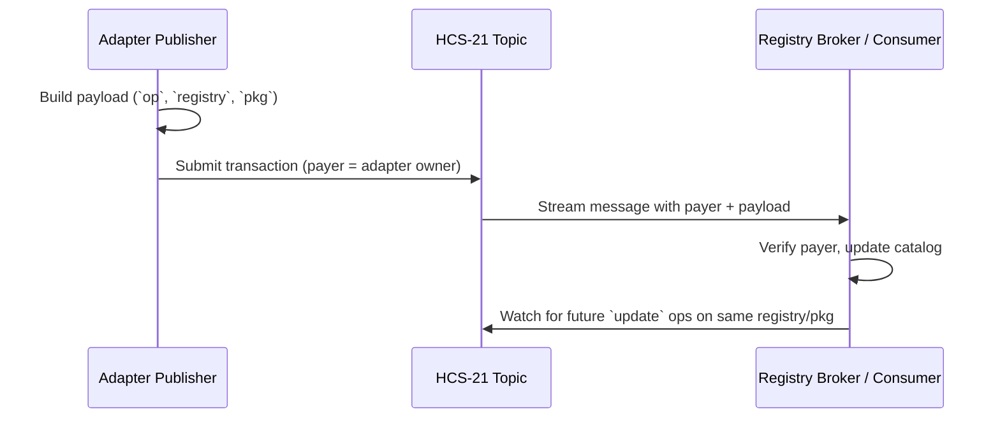

# HCS-21 Standard: Adapter Declaration Registry

### Status: Draft

### Version: 1.0

### Table of Contents

- [HCS-21 Standard: Adapter Declaration Registry](#hcs-21-standard-adapter-declaration-registry)
    - [Status: Draft](#status-draft)
    - [Version: 1.0](#version-10)
    - [Table of Contents](#table-of-contents)
  - [Authors](#authors)
  - [Abstract](#abstract)
  - [Motivation](#motivation)
  - [Normative Language](#normative-language)
  - [Specification](#specification)
    - [Architecture Overview](#architecture-overview)
    - [Topic System](#topic-system)
    - [Message Format](#message-format)
    - [Operations Reference](#operations-reference)
    - [Reference Flow](#reference-flow)
  - [Validation](#validation)
  - [Security Considerations](#security-considerations)
  - [Conclusion](#conclusion)

## Authors

- Kantorcodes — [https://twitter.com/kantorcodes](https://twitter.com/kantorcodes)

## Abstract

HCS-21 defines the adapter declaration registry. Each declaration records which package registry (NPM or PyPI) an adapter targets, the package coordinate (including version), and is implicitly attributed to the Hedera transaction payer. Consumers such as the Registry Broker can ingest these declarations straight from Hedera Consensus Service to enable third-party adapters without maintaining a manual allowlist.

## Motivation

The Registry Broker curates adapters for multiple ecosystems (OpenRouter, MCP, NANDA, A2A, Virtuals, etc.). Allowing platforms to register adapters themselves requires a simple, verifiable payload that names the upstream package while inheriting provenance from the Hedera payer signature. HCS-21 keeps the declaration surface small—just registry + package—so consumers can validate adapters without parsing bespoke manifests or per-operator signatures.

## Normative Language

The key words “MUST”, “MUST NOT”, “SHOULD”, and “MAY” are to be interpreted as described in RFC 2119 and RFC 8174.

## Specification

### Architecture Overview

1. **Publisher** — The adapter operator submits the declaration transaction from the Hedera account that owns the adapter listing.
2. **Declaration topic** — A dedicated HCS topic stores the JSON declarations following the memo grammar below.
3. **Consumer** — Registry Broker or any compatible indexer streams the topic, verifies the transaction payer, and records the registry/package combination for routing.

### Topic System

| Memo Format                | Description               | Notes                                                                                                                                      |
| -------------------------- | ------------------------- | ------------------------------------------------------------------------------------------------------------------------------------------ |
| `hcs-21:<indexed>:<ttl>:0` | Adapter declaration topic | `indexed` is `0` (full history) or `1` (tail-only caches). `ttl` is a cache hint in seconds. The trailing `0` marks the HCS-21 topic type. |

### Message Format

Each declaration is JSON and MUST be ≤ 1024 bytes when serialized.

| Field      | Type   | Required | Description                                                                                                                              |
| ---------- | ------ | -------- | ---------------------------------------------------------------------------------------------------------------------------------------- |
| `p`        | string | Yes      | Protocol identifier. MUST equal `"hcs-21"`.                                                                                              |
| `op`       | string | Yes      | Operation: `"register"` or `"update"` (matching HCS-2 terminology).                                                                      |
| `registry` | string | Yes      | Package registry. MUST be `"npm"` or `"pypi"`.                                                                                           |
| `pkg`      | string | Yes      | Package coordinate including version (e.g., `"@scope/adapter@2.3.0"`, `"requests==2.32.0"`).                                             |
| `name`     | string | Yes      | Human-readable adapter name.                                                                                                             |
| `kind`     | string | No       | Declares whether the adapter interacts with a `"web2"` or `"web3"` upstream.                                                             |
| `metadata` | string | No       | Optional HCS-1 pointer (HRL `hcs://1/<topicId>/<sequence>`) containing extended metadata such as contact info or capability descriptors. |

The transaction payer recorded by Hedera is the canonical adapter owner. Consumers MUST verify the payer account instead of trusting inline identity data.

### Operations Reference

| Code       | Name     | Description                                                                                                                            |
| ---------- | -------- | -------------------------------------------------------------------------------------------------------------------------------------- |
| `register` | Register | First declaration for a given package coordinate. Consumers record the registry + package and associate it with the transaction payer. |
| `update`   | Update   | Subsequent declaration for the same registry + package. Used to refresh metadata or announce a new package version.                    |

### Reference Flow

## Validation

1. Message payload is valid UTF-8 and ≤ 1024 bytes.
2. `p` equals `hcs-21`; `op` is `register` or `update`.
3. `registry` is `npm` or `pypi`.
4. `pkg` contains the package coordinate and version.
5. Transaction payer is treated as the authoritative adapter owner; consumers MUST use the payer recorded by Hedera for provenance.

## Security Considerations

- Drop messages that fail basic validation (unknown registry, payload > 1 KB, missing `p = hcs-21`).
- Enforce submit keys or fee gates on the topic to deter spam and Sybil attacks.
- Treat the Hedera transaction payer as the canonical adapter owner; reject declarations from unauthorized payers if the registry has an allowlist.
- Maintain an audit log of processed declarations so operators can trace how a package was introduced or updated.

## Conclusion

HCS-21 provides a lightweight registry surface for adapter listings by reusing Hedera’s built-in authenticity (transaction payer) and limiting the payload to package coordinates. This allows registries such as the Registry Broker to scale community-maintained adapters without bespoke review funnels, while still verifying provenance via HCS.
