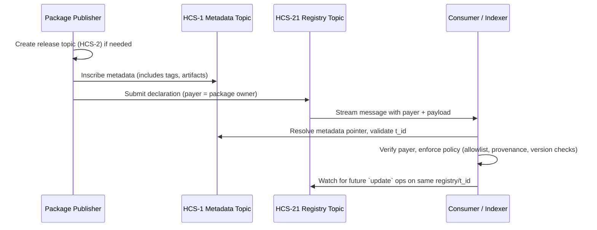

# HCS-21 Standard: Package Declaration Registry

### Status: Draft

### Version: 1.0

### Table of Contents

- [Authors](#authors)
- [Abstract](#abstract)
- [Motivation](#motivation)
- [Normative Language](#normative-language)
- [Specification](#specification)
  - [Architecture Overview](#architecture-overview)
  - [Topic System](#topic-system)
  - [Registry Namespace Reference](#registry-namespace-reference)
  - [Message Format](#message-format)
    - [Package Identity and Versioning](#package-identity-and-versioning)
    - [Metadata Profile (HCS-1)](#metadata-profile-hcs-1)
  - [Operations Reference](#operations-reference)
  - [Reference Flow](#reference-flow)
- [Implementation Workflow](#implementation-workflow)
- [Validation](#validation)
- [Security Considerations](#security-considerations)
- [Conclusion](#conclusion)

## Authors

- Kantorcodes - [https://twitter.com/kantorcodes](https://twitter.com/kantorcodes)

## Abstract

HCS-21 defines a generic package declaration registry. Each declaration records which package registry (e.g., npm, PyPI, OCI) a package targets, the package’s HCS-2 topic (`t_id`) that tracks releases, and a concise human summary. Tooling across ecosystems (package mirrors, plugin markets, bot registries, supply-chain scanners, the Registry Broker, or Hedera Package Manager (HPM)) can ingest these declarations directly from Hedera Consensus Service to bootstrap ecosystem-specific indices without maintaining bespoke allowlists.

## Motivation

Package ecosystems routinely need an authoritative ledger that states “who published what,” whether they are forwarding packages to Registry Broker, mirroring CLI plugins, tracking container images, or gating access to enterprise package lists. Hashgraph Online already explored this pattern in the Hedera Package Manager (HPM), which ties per-package HCS-2 topics to short JSON payloads describing the package. Without a shared declaration primitive, each consumer re-creates the same ingestion logic with centralized databases and ad-hoc signatures.

HCS-21 codifies the same minimal, verifiable payload: (a) name the upstream registry and the package’s HCS-2 topic ID, (b) include a short summary (`n`, `d`, `a`, `tags`) so humans can browse declarations directly from the registry topic, (c) optionally hang richer metadata off-chain via HCS-1, and (d) inherit provenance from the Hedera payer signature. By keeping the surface area focused on the HPM-style tuple (registry + topic + summary), HCS-21 can back any package-type registry while still letting downstream systems layer on their own policy.

## Normative Language

The key words “MUST”, “MUST NOT”, “SHOULD”, and “MAY” are to be interpreted as described in RFC 2119 and RFC 8174.

## Specification

### Architecture Overview

1. **Publisher** - The package maintainer submits the declaration transaction from the Hedera account that owns the package listing. Provenance is derived from the payer account.
2. **Declaration topic** - A dedicated HCS topic stores the JSON declarations following the memo grammar below. Ecosystems MAY run per-domain topics (e.g., npm vs. OCI) or share one topic with `indexed` variations.
3. **Consumer** - Any compatible indexer (Registry Broker, plugin portals, supply-chain scanners, package mirrors) streams the topic, verifies the transaction payer, and records the `(registry, t_id)` pair for routing or compliance checks.

### Topic System

| Memo Format                | Description                 | Notes                                                                                                                                                         |
| -------------------------- | --------------------------- | ------------------------------------------------------------------------------------------------------------------------------------------------------------- |
| `hcs-21:<indexed>:<ttl>:0` | Package declaration topic   | `indexed` is `0` (full history) or `1` (tail-only caches). `ttl` is a cache hint in seconds. The trailing `0` marks the HCS-21 topic type defined in HCS-2.   |

### Registry Namespace Reference

Governance determines the canonical registry namespaces. The table below lists the initial set derived from HPM research. Additional namespaces MAY be added through the HCS-4 process without modifying the payload schema.

| Namespace | Ecosystem        | Coordinate Example                     | Notes                                                                                  |
| --------- | ---------------- | -------------------------------------- | -------------------------------------------------------------------------------------- |
| `npm`     | Node.js          | `@scope/tooling@2.3.1`                 | Uses the `name@version` grammar.                                                       |
| `pypi`    | Python           | `requests==2.32.0`                     | Mirrors `pip` install strings.                                                         |
| `oci`     | Containers       | `ghcr.io/hashgraph/agent:v1.2.0`       | Use the canonical `image:tag` reference.                                               |
| `composer`| PHP              | `laravel/framework:11.7.0`             | Colon separates version per Composer norms.                                            |
| `packagist` | PHP           | `hashgraph/observer:0.5.0`             | Allows mirroring Packagist packages that are not in Composer.                          |
| `cargo`   | Rust             | `serde@1.0.217`                        | Uses crates.io semantics.                                                              |
| `nuget`   | .NET             | `Hashgraph.AgentSdk/1.3.0`             | Follow NuGet’s casing rules.                                                           |
| `maven`   | JVM              | `com.hashgraph:agent-registry:1.1.0`   | Use the `<groupId>:<artifactId>:<version>` coordinate.                                 |
| `rubygems`| Ruby             | `rails-8.0.1`                          | Dash-separated version suffix.                                                         |
| `helm`    | Kubernetes       | `hashgraph/agent-bundle@1.0.2`         | Reuse Helm chart syntax.                                                               |
| `go`      | Go Modules       | `github.com/hashgraph/sdk@v1.44.0`     | Entire module path plus version.                                                       |

### Message Format

Each declaration is JSON and MUST be ≤ 1024 bytes when serialized. Field names mirror the compact structure used in Hedera Package Manager (HPM).

| Field      | Type     | Required          | Description                                                                                                                                     |
| ---------- | -------- | ----------------- | ----------------------------------------------------------------------------------------------------------------------------------------------- |
| `p`        | string   | Yes               | Protocol identifier. MUST equal `"hcs-21"`.                                                                                                     |
| `op`       | string   | Yes               | Operation: `"register"` or `"update"` (matching HCS-2 terminology).                                                                             |
| `registry` | string   | Yes               | Package registry namespace from the governance list above. Unsupported namespaces MUST be rejected by consumers.                               |
| `t_id`     | string   | Yes (register)    | HCS-2 topic ID that stores the package’s release/version stream. `register` MUST include `t_id`; `update` MAY reference it to rotate topics.    |
| `n`        | string   | Yes               | Human-readable package name, matching the display seen in HPM.                                                                                  |
| `d`        | string   | Yes               | Short description of the package.                                                                                                               |
| `a`        | string   | Yes               | Author or maintainer attribution (name, Hedera account, or handle).                                                                             |
| `tags`     | string[] | No                | Keyword list for discovery.                                                                                                                     |
| `metadata` | string   | No                | Optional HCS-1 pointer (HRL `hcs://1/<topicId>/<sequence>`) storing richer content such as docs, binaries, or SPDX manifests.                    |

The transaction payer recorded by Hedera is the canonical package owner. Consumers MUST verify the payer account instead of trusting inline identity data. Metadata stored off-chain via HCS-1 inherits the same provenance once the pointer is published.

#### Package Identity and Versioning

- `registry + t_id` uniquely identifies a package stream. `register` SHOULD be used the first time that tuple appears; `update` reuses the tuple.
- The package’s concrete versions live inside the `t_id` topic (usually an HCS-2 registry topic per package, just as HPM does today). Version naming conventions follow the upstream registry and SHOULD be encoded in the topic memo or individual release messages.
- Publishers MAY include digest or build metadata inside the HCS-1 bundle pointed to by `metadata` to help downstream scanners verify artifacts.
- Registries MAY enforce additional validation (semantic version ranges, naming policies, typosquatting detection) but should surface violations through `update` operations.

#### Metadata Profile (HCS-1)

Because HCS-21 payloads must remain ≤ 1024 bytes, rich metadata SHOULD live in an HCS-1 inscription referenced via the `metadata` pointer. The recommended JSON schema aligns with the structure used in HPM today.

| Field            | Type                    | Required | Description                                                                                                  |
| ---------------- | ----------------------- | -------- | ------------------------------------------------------------------------------------------------------------ |
| `schema`         | string                  | Yes      | Schema identifier (e.g., `"hcs-21/metadata@1.0"`).                                                            |
| `t_id`           | string                  | No       | Optional copy of the package’s HCS-2 topic ID (helpful when metadata is indexed independently).               |
| `description`    | string                  | No       | Extended description, release notes, or changelog references.                                                |
| `maintainers`    | array of strings        | No       | List of maintainers or Hedera account IDs.                                                                    |
| `website`        | string                  | No       | Homepage URL.                                                                                                 |
| `docs`           | string                  | No       | Documentation URL.                                                                                            |
| `source`         | string                  | No       | Repository URL.                                                                                               |
| `support`        | string                  | No       | Support channel or contact email.                                                                             |
| `tags`           | string[]                | No       | Keywords/categories (used by HPM search today).                                                               |
| `artifacts`      | Artifact[]              | No       | Array of downloadable artifacts. Each entry SHOULD include `type`, `url`, `digest`, and optional `signature`. |
| `capabilities`   | string[]                | No       | Features the package exposes (e.g., `"search"`, `"transfer"`, `"cli"`).                                        |
| `dependencies`   | `Record<string,string>` | No       | Map of dependency name → version constraint.                                                                  |

`Artifact` entries take the following form:

```json
{
  "type": "bundle" | "container" | "script" | "config",
  "url": "https://registry.example.com/downloads/pkg-1.2.3.tgz",
  "digest": "sha256-<base64 digest>",
  "signature": "optional Hedera signature or key reference"
}
```

Metadata SHOULD also embed any package-topic mapping (`t_id`) that an implementation such as HPM requires so that consumers can compute full version history directly from HCS-2.

### Operations Reference

| Code       | Name     | Description                                                                                                                                                              |
| ---------- | -------- | ------------------------------------------------------------------------------------------------------------------------------------------------------------------------ |
| `register` | Register | First declaration for a given `(registry, t_id)` pair. Consumers record that tuple and associate it with the transaction payer (the authoritative maintainer).            |
| `update`   | Update   | Subsequent declaration for the same registry + package. Used to refresh metadata (new HCS-1 pointer), rotate ownership, publish new versions, or cross-link release topics. |

### Reference Flow



## Implementation Workflow

1. **Inscribe metadata** - Use HCS-1 (e.g., via the `standards-sdk` inscriber) to persist the metadata schema above. Include a `t_id` if you use the HPM-style per-package topic pattern.
2. **Create the registry topic** - Provision an HCS topic with the memo `hcs-21:<indexed>:<ttl>:0`. Submit keys or HIP-991 fees MAY be used to throttle spam.
3. **Register the package** - Submit a `register` operation with `registry`, `t_id`, human context (`n`, `d`, `a`, `tags`), and optional `metadata`. Hedera records the payer, which downstream consumers treat as the canonical maintainer.
4. **Publish updates** - Use `update` to rotate metadata pointers, refresh human context, change ownership, or repoint `t_id`. Consumers SHOULD treat the latest message for a tuple as authoritative.
5. **Index and distribute** - Consumers such as Registry Broker, HPM, or supply-chain scanners stream the topic, filter by namespace, and hydrate metadata using the HCS-1 pointer.

## Validation

1. Message payload is valid UTF-8 and ≤ 1024 bytes.
2. `p` equals `hcs-21`; `op` is `register` or `update`.
3. `registry` matches an approved namespace (see table above). Unsupported registries MUST be rejected or quarantined.
4. `t_id` is present on `register` operations and is a valid HCS-2 topic ID following the memo guidance in HCS-2.
5. `n`, `d`, and `a` are non-empty UTF-8 strings.
6. `tags`, when provided, are arrays of UTF-8 strings ≤ 32 characters each.
7. `metadata`, when present, matches the `hcs://1/<topic>/<sequence>` format and resolves to a manifest with consistent `t_id` and payer information.
8. Transaction payer is treated as the authoritative package owner; consumers MUST use the payer recorded by Hedera for provenance and flag conflicts.

## Security Considerations

- Drop messages that fail basic validation (unknown registry, payload > 1 KB, missing `p = hcs-21`), and quarantine tuples that oscillate between owners until a governance review resolves conflicts.
- Enforce submit keys, HIP-991 fees, or throttling on the topic to deter spam and Sybil attacks. Public registries SHOULD still monitor payer diversity.
- Treat the Hedera transaction payer as the canonical package owner; reject declarations from unauthorized payers if the registry has an allowlist. For public registries, implement allowlist/denylist policies similar to HPM.
- Validate metadata pointers before hydrating them. Verify digests/signatures declared inside `artifacts` and ensure URLs use HTTPS.
- If metadata references a release topic, confirm the memo matches the package tuple and ensure consumers follow HCS-2’s migration rules when topics rotate.
- Maintain tamper-evident audit logs of processed declarations so operators can trace how a package was introduced or updated and correlate metadata HRLs with downstream scanners.

## Conclusion

HCS-21 provides a lightweight registry surface for any package ecosystem by reusing Hedera’s built-in authenticity (transaction payer) and limiting the payload to the same compact tuple HPM already uses (`registry`, `t_id`, and a short human summary). This lets registries ranging from CLI plugin catalogs to container attestations to the Registry Broker or HPM scale community-maintained packages without bespoke review funnels, while still verifying provenance via Hedera Consensus Service and linking into richer HCS-1 metadata streams when desired.
