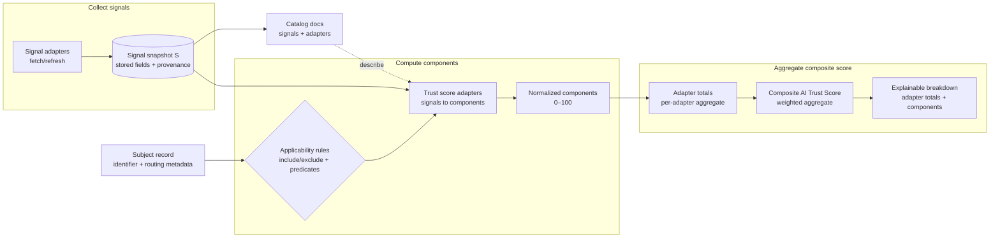
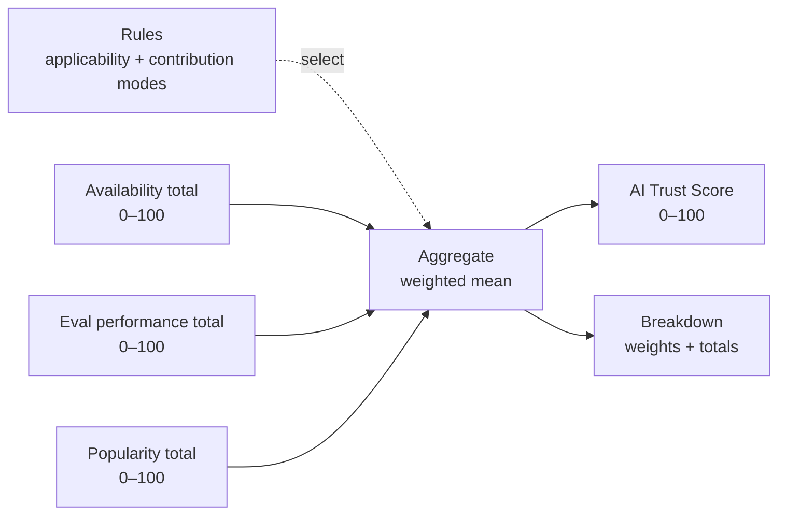

# HCS-25 Standard: AI Trust Score Methodology

### Status: Draft

### Version: 1.0

### Table of Contents

- [Authors](#authors)
  - [Primary Author](#primary-author)
  - [Additional Authors](#additional-authors)
- [Abstract](#abstract)
- [Motivation](#motivation)
- [Terminology](#terminology)
- [Architecture Overview (Informative)](#architecture-overview-informative)
- [Adapter Types (Informative)](#adapter-types-informative)
- [Relationship to HCS-14 (Informative)](#relationship-to-hcs-14-informative)
- [Design Goals](#design-goals)
- [Specification](#specification)
  - [Scope](#scope)
  - [Inputs](#inputs)
  - [Trust Adapters](#trust-adapters)
    - [Applicability](#applicability)
    - [Contribution Modes](#contribution-modes)
    - [Weights](#weights)
  - [Trust Signals](#trust-signals)
    - [Signal Identifier Namespacing](#signal-identifier-namespacing)
    - [Signal Status Codes](#signal-status-codes)
    - [Signal Provenance](#signal-provenance)
    - [Signal Taxonomy (Informative)](#signal-taxonomy-informative)
  - [Normalization](#normalization)
    - [Component Keys](#component-keys)
    - [Score Range and Rounding](#score-range-and-rounding)
    - [Missing and Stale Data](#missing-and-stale-data)
    - [Recommended Normalization Patterns (Informative)](#recommended-normalization-patterns-informative)
  - [Aggregation](#aggregation)
    - [Adapter Total](#adapter-total)
    - [Composite AI Trust Score](#composite-ai-trust-score)
    - [Confidence (Optional)](#confidence-optional)
    - [Versioning](#versioning)
- [Rationale](#rationale)
- [Backwards Compatibility](#backwards-compatibility)
- [Security Considerations](#security-considerations)
- [Privacy Considerations](#privacy-considerations)
- [Test Vectors](#test-vectors)
- [Appendix A: Example Configuration (Informative)](#appendix-a-example-configuration-informative)
- [Future Work (Informative)](#future-work-informative)
- [Conformance](#conformance)
- [References](#references)
- [Governance Record (fill at publication)](#governance-record-fill-at-publication)
- [License](#license)

## Authors

### Primary Author

- Michael Kantor [https://twitter.com/kantorcodes](https://twitter.com/kantorcodes)

### Additional Authors

None.

## Abstract

This standard defines a platform-agnostic methodology for computing an **AI Trust Score** for an AI system (an “agent”, “model”, “tool”, or other AI endpoint), whether that system is exposed via a traditional web service, a marketplace, or a decentralized network. The methodology is based on:

1. collecting **trust signals** from one or more sources;
2. transforming signals into normalized **trust components** in the range **0–100** using deterministic **trust adapters**; and
3. computing a weighted **composite score** that is reproducible, explainable, and extensible.

This standard specifies the **algorithm** for normalization, missing-data handling, weighting, and aggregation. It does **not** mandate specific vendors, networks, registries, protocols, databases, refresh schedules, or caching layers.

## Motivation

AI systems are increasingly used as critical infrastructure. Consumers, integrators, and marketplaces need a simple, comparable way to understand trust-relevant properties such as:

- operational reliability (availability, latency);
- demonstrated capability (eval performance for scoped tasks);
- ecosystem signals (adoption, incident history);
- identity and accountability (operator provenance, attestations); and
- user feedback (quality, safety, helpfulness).

At the same time, trust is multi-dimensional. Single metrics are brittle and can be gamed. A composite score must therefore:

- remain explainable via a stable breakdown;
- support multiple signals without coupling to any one platform;
- allow signals to be excluded when inapplicable; and
- preserve forward compatibility as new trust metrics emerge.

## Terminology

- **Subject**: The AI system being scored (e.g., agent, model, tool endpoint).
- **Trust Signal**: A raw measurement or observation used to inform scoring (e.g., uptime, benchmark result, repository popularity, response time).
- **Signal Snapshot**: The set of trust signals currently known for a subject at scoring time.
- **Signal Adapter**: A process that collects or refreshes trust signals for a subject and writes them into the subject’s signal snapshot.
- **Trust Score Adapter**: A deterministic scoring function that maps one or more signals into one or more normalized components.
- **Trust Adapter / Adapter**: Synonym for trust score adapter in this document.
- **Component**: A single normalized score (0–100) produced by a trust adapter (e.g., `availability.uptime`).
- **Adapter Total**: A per-adapter aggregate derived from that adapter’s component set.
- **Composite AI Trust Score**: The final score (0–100) computed from adapter totals with weights.
- **Applicability**: Whether a trust adapter is meaningful for a given subject (and thus eligible to contribute).
- **Contribution Mode**: An adapter policy describing whether the adapter participates in the composite denominator when it is applicable and/or when it produced output.
- **Denominator**: The set of adapter weights used in the composite weighted mean.
- **Registry**: An optional namespace representing the catalog or discovery domain that lists the subject. When the subject uses a UAID, this aligns with the `registry` parameter defined in HCS-14.
- **Protocol**: An optional transport or interoperability protocol used by the subject (e.g., HTTP-based, message-based, mailbox-based). When the subject uses a UAID, this aligns with the `proto` parameter defined in HCS-14.

Normative language such as **MUST**, **SHOULD**, and **MAY** is to be interpreted as in RFC 2119.

## Architecture Overview (Informative)



This diagram reflects the separation of **collection** (signal adapters) from **scoring** (trust score adapters) and the way applicability rules determine which adapters participate in the composite score.

### Composite score at a glance (Informative)



For a given subject, the composite score is computed as a weighted mean over the eligible adapter totals:

- Eligible set `E` is determined by applicability and contribution-mode rules.
- `score = round2( sum(w_i * total_i) / sum(w_i) )` for `i` in `E`.

## Adapter Types (Informative)

This standard separates **collection** from **scoring**:

- **Signal adapters** collect raw data (signals). They are expected to perform I/O and may fail due to missing data, timeouts, or upstream errors.
- **Trust score adapters** compute normalized scores from signals. They are expected to be deterministic and inexpensive (CPU-bound).

One common pattern is:

1. A signal adapter fetches a provider’s raw data and stores a compact, versioned signal record (plus provenance).
2. A trust score adapter reads that signal record and emits one or more components in `[0,100]`.
3. The composite score aggregates adapter totals using weights and contribution modes.

This document intentionally does not mandate specific signal names. When publishing a concrete trust-score system, implementations SHOULD publish:

- a signal catalog (what is collected and in what shape), and
- an adapter catalog (how each adapter maps signals into components).

See:

- [Adapter catalog](./hcs-25/adapters/index.md) — index + per-adapter docs
- [Signal catalog](./hcs-25/signals/index.md) — index + per-signal docs (includes [Simple eval methodology](./hcs-25/signals/simple-evals.md))

Implementation note (informative): Hashgraph Online’s Registry Broker uses an HCS-25-style system in production. Public endpoints for inspection include:

- OpenAPI: `https://hol.org/registry/api/v1/openapi.json`
- Search: `https://hol.org/registry/api/v1/search`
- Agent record: `https://hol.org/registry/api/v1/agents/{uaid}`

## Relationship to HCS-14 (Informative)

HCS-25 defines a scoring methodology that can be applied to any identifier scheme. If an ecosystem already uses **UAIDs** as defined by **HCS-14**, implementations MAY reuse UAID routing parameters to drive HCS-25 applicability decisions:

- `registry` (HCS-14) can be treated as the subject’s **Registry** for adapter include/exclude lists.
- `proto` (HCS-14) can be treated as the subject’s **Protocol** for adapter applicability predicates.

This document does not require UAIDs, but it is designed to be compatible with UAID-based catalogs.

## Design Goals

1. **Platform-agnostic**: The methodology MUST be usable whether the subject is hosted on centralized infrastructure, decentralized infrastructure, or any hybrid deployment model.
2. **Explainability**: Implementations MUST be able to produce a stable breakdown of component scores used to compute the composite.
3. **Extensibility**: New signals and adapters MUST be introduced without breaking existing subjects, consumers, or stored data.
4. **Applicability-aware**: Inapplicable metrics MUST NOT distort the composite score.
5. **Reproducibility**: Given the same input snapshot and config version, the score computation MUST be deterministic.

## Specification

### Scope

This standard defines a scoring methodology for a **Subject**. Implementations MAY apply this methodology to any of the following subject classes:

- AI agent endpoints (interactive systems, tool agents, chat agents);
- model identifiers (hosted or self-hosted);
- protocol adapters (connectivity layers, routers);
- marketplaces/catalog entries; and
- composite entities representing multiple endpoints.

This standard defines **how to compute** scores, not how to store or transport them.

### Inputs

An implementation MUST compute a score from:

- a **Subject** record (at minimum: a stable identifier; optionally: registry, protocol, class);
- a **Signal Snapshot** `S`, representing the current known set of trust signals for the subject; and
- a **Scoring Configuration** `C`, defining adapter applicability, contribution modes, weights, and normalization functions.

`C` MUST be versioned (see [Versioning](#versioning)).

### Trust Adapters

A trust adapter is a deterministic scoring function that maps a signal snapshot to one or more normalized components.

Trust adapters MUST declare:

- a stable adapter identifier (`adapterId`);
- a component naming strategy (see [Component Keys](#component-keys));
- an applicability rule (see [Applicability](#applicability));
- a contribution mode (see [Contribution Modes](#contribution-modes));
- an optional weight (see [Weights](#weights)); and
- a normalization function for each component (see [Normalization](#normalization)).

#### Adapter Identifier Namespacing

Adapter identifiers MUST be stable, namespaced strings so that independently-defined adapters do not collide.

Conforming implementations MUST use a hyphen-separated namespace convention with the following pattern:

- `adapterId = segment *( "-" segment )`
- `segment = /[a-z][a-z0-9]*/`

Equivalent regular expression:

```
^[a-z][a-z0-9]*(?:-[a-z][a-z0-9]*)*$
```

Implementations SHOULD treat the first segment as a stable namespace when the adapter is ecosystem-specific (e.g., a marketplace or provider name).

Adapter identifiers MUST be unique within a given scoring configuration version.

#### Applicability

Trust adapters MUST support applicability constraints so that nonsensical metrics do not distort scores.

An adapter SHOULD support at least:

- `includeRegistries`: allow-list of registries where the adapter applies;
- `excludeRegistries`: deny-list of registries where the adapter never applies; and
- `appliesTo(subject)`: a predicate based on subject metadata (e.g., protocol, subject class).

If an adapter is not applicable to a subject, it MUST NOT contribute to the score, and MUST NOT be included in the composite denominator.

#### Contribution Modes

For each applicable adapter, an implementation MUST determine how it participates in the composite denominator. This standard defines three contribution modes:

- `universal`: included in the denominator for all applicable subjects; if the adapter produces no output for an applicable subject, it contributes a deterministic `0` using `defaultComponentKey`.
- `scoped`: included in the denominator only when it is applicable (as determined by applicability rules); if it is applicable but produces no output, it contributes a deterministic `0` using `defaultComponentKey`.
- `conditional` (default): included in the denominator only when it produces an output map (i.e., at least one component).

Implementations SHOULD use `universal` or `scoped` for in-scope requirements that should penalize missingness (e.g., protocol compliance checks). Implementations SHOULD use `conditional` for ecosystem-dependent signals that are sparse or unevenly available.

#### Weights

Each adapter MAY specify a non-negative weight `w(a) ≥ 0`. Weights MUST be treated as pure coefficients in a weighted mean (see [Composite AI Trust Score](#composite-ai-trust-score)).

If an adapter weight is not specified, it MUST default to `1`.

Adapters with `w(a) = 0` MUST NOT affect the score and SHOULD be treated as “informational only” (i.e., excluded from the denominator).

### Trust Signals

Trust signals are raw measurements collected from sources. This standard does not require any particular source, but it requires each signal to have:

- a stable **signal identifier**;
- a **status** indicating freshness/availability; and
- optional structured **provenance**.

#### Signal Identifier Namespacing

Signal identifiers MUST be stable, namespaced strings so that independently-defined signals do not collide.

Conforming implementations MUST use dot-separated namespaces with the following pattern:

- `signalId = segment "." segment *( "." segment )`
- `segment = /[a-z][a-z0-9_-]*/`

Equivalent regular expression:

```
^[a-z][a-z0-9_-]*(\\.[a-z][a-z0-9_-]*)+$
```

The first segment SHOULD identify a stable namespace such as:

- an ecosystem or routing namespace (e.g., `erc8004`, `agentverse`), and/or
- a provider or dataset (e.g., `openrouter`, `openlm`, `huggingface`), and/or
- a trust adapter identifier (recommended when practical).

Implementations MUST document their chosen namespaces in a published signal catalog.

#### Signal Status Codes

Signal adapters MUST assign one of the following status codes:

- `ok`: signal was collected successfully and is fresh.
- `missing`: no signal is available for this subject (e.g., source has no data).
- `timeout`: the source did not respond within the configured time budget.
- `error`: collection failed for any non-timeout reason.
- `stale`: a previously collected signal exists but is older than the implementation’s freshness policy.

Implementations MAY add more detailed status information but MUST be mappable to the above.

#### Signal Provenance

When available, a signal SHOULD include provenance, such as:

- source name and URL(s);
- subject identifier(s) used at the source;
- `fetchedAt` timestamp; and
- any aggregation parameters used during ingestion (e.g., timeframe, window).

#### Signal Taxonomy (Informative)

This standard intentionally does not enumerate a fixed required signal set. Implementations SHOULD consider a mix of signals across the following categories (non-exhaustive), to reduce brittleness and gaming:

- **Operational**: availability, latency, error rates, incident frequency, “last seen”, redundancy.
- **Security**: audit attestations, disclosed vulnerabilities, dependency risk, SBOM, abuse reports.
- **Capability / Quality**: scoped evals, protocol compliance checks, regression stability.
- **Safety / Policy**: refusal correctness, prompt-injection resilience, sandbox behavior, policy transparency.
- **Reputation / Adoption**: usage volume, ecosystem adoption, maintainer/org reputation, community engagement.
- **Feedback**: user ratings, verified feedback, dispute rates (with anti-sybil controls).
- **Transparency / Accountability**: documentation quality, changelog cadence, operator identity/attestation, contact/support channels.

### Normalization

#### Component Keys

Components MUST use stable string keys. Keys SHOULD use dot-separated namespaces:

```
{adapterId}.{componentName}
```

Examples:

- `availability.uptime`
- `reputation.stars`
- `evals.simple_math`

Component keys MUST NOT use whitespace and SHOULD be ASCII. Implementations SHOULD prefer lowercase.

The overall composite score MUST be included as `trustScores.total`.

#### Score Range and Rounding

All component scores MUST be normalized to the range **0–100** inclusive.

Implementations MUST:

- clamp component values into `[0,100]`;
- compute totals using finite numeric arithmetic; and
- round values to a stable precision (RECOMMENDED: 2 decimals).

#### Missing and Stale Data

For a given adapter component `k`, let the adapter’s normalization function be `normalize_k(S, subject, C)`.

The output of `normalize_k` MUST be a tuple:

- `value` (number in `[0,100]`); and
- `status` (one of the signal status codes).

An implementation MUST apply the following rules:

1. If a component’s status is `ok`, its `value` MUST be used as-is.
2. If a component’s status is `stale`, its `value` MUST be multiplied by a **staleness multiplier** `m_stale ∈ [0,1]`. If `m_stale` is not configured, it MUST default to `1`.
3. If a component’s status is `missing`, `timeout`, or `error`, its `value` MUST be `0`, unless the adapter explicitly specifies that the component is **non-scorable** when unavailable.

If a component is non-scorable when unavailable, it MUST be omitted from the adapter’s component set for aggregation, and MUST be reported as unavailable in the breakdown.

#### Recommended Normalization Patterns (Informative)

Implementations SHOULD prefer monotonic transforms that are robust to outliers and hard to game. Common patterns include:

- **Bounded ratio**: for `x ∈ [0,1]`, `score = 100 * x`.
- **Thresholded step**: score 0 below a minimum threshold, then linear up to a cap.
- **Log scaling**: for counts (stars/downloads), `score = 100 * clamp(log(1+x)/log(1+cap), 0, 1)`.
- **Sigmoid scaling**: for unbounded scores (Elo-like), `score = 100 * sigmoid((x - μ)/s)`, where `μ` and `s` are chosen per snapshot/config.
- **Rank-based scaling**: map percentile rank to `[0,100]`, optionally with a concave curve to emphasize top ranks.

### Aggregation

#### Adapter Total

For a given adapter `a` and subject:

- Let `K_a` be the set of components produced by `a` after applying non-scorable omission (see [Missing and Stale Data](#missing-and-stale-data)).
- If `K_a` is empty, the adapter total `total(a)` MUST be `0`.
- Otherwise, the adapter total MUST be the arithmetic mean:

```
total(a) = (Σ value(k)) / |K_a|
```

An adapter MAY specify a custom within-adapter aggregation (e.g., component weights), but it MUST be deterministic, MUST remain in the range `[0,100]`, and MUST be explainable using the emitted component breakdown.

#### Composite AI Trust Score

The composite AI Trust Score MUST be computed as a weighted mean of adapter totals over the set of adapters included in the denominator.

- Let `A_applicable` be the set of adapters applicable to the subject (see [Applicability](#applicability)).
- Let `A_denominator` be the subset of `A_applicable` included by contribution mode:
  - if `contributionMode(a) = universal`, then `a ∈ A_denominator`;
  - if `contributionMode(a) = scoped`, then `a ∈ A_denominator`;
  - if `contributionMode(a) = conditional`, then `a ∈ A_denominator` iff `a` produced a non-empty component map.
- For each `a ∈ A_denominator`, let `total(a)` be its adapter total (0–100) and `w(a) ≥ 0` be its weight.

Then:

```
trustScore = (Σ (total(a) * w(a))) / (Σ w(a))
```

If `A_denominator` is empty, `trustScore` MUST be `0`.

The composite score MUST be stored as `trustScores.total`. Implementations MAY also mirror it to a top-level `trustScore`.

#### Confidence (Optional)

Implementations MAY compute an additional `trustConfidence` value in `[0,1]` to communicate uncertainty due to missingness and staleness.

If present, a conforming implementation SHOULD compute confidence deterministically from the same inputs as the score. One RECOMMENDED approach is:

```
trustConfidence = (Σ (w(a) * c(a))) / (Σ w(a))
```

Where `c(a) ∈ [0,1]` is an adapter confidence derived from:

- fraction of `ok` components vs missing/unavailable; and
- freshness of signal provenance (`fetchedAt`) if present.

Confidence MUST NOT be used to alter the numeric trust score unless explicitly specified in configuration, and MUST be reported separately from `trustScores.total`.

#### Versioning

Implementations MUST version their scoring configuration using a monotonically increasing `trustScoreConfigVersion`.

The score record MUST include:

- `trustScoreUpdatedAt` (timestamp); and
- `trustScoreConfigVersion` (integer).

If an implementation changes normalization functions, adapter weights, applicability rules, contribution modes, or component definitions, it MUST increment `trustScoreConfigVersion`.

Implementations SHOULD preserve the ability to recompute historical trust scores for a given version when possible.

## Rationale

This methodology separates:

- **signal collection** (heterogeneous and potentially expensive) from
- **score computation** (deterministic and explainable).

The contribution modes plus component non-scorable omission lets ecosystems choose between:

- penalizing missingness for in-scope requirements (`always` + missing→0); and
- avoiding bias against subjects where a signal is structurally unavailable (`onlyWhenPresent` and/or omit non-scorable components).

## Backwards Compatibility

This standard is additive and configuration-versioned. Consumers MUST NOT assume two trust scores are comparable unless they share the same `trustScoreConfigVersion` (or the implementation declares compatibility between versions).

Implementations SHOULD provide access to the configuration version alongside any displayed trust score.

## Security Considerations

Trust scores can be gamed. Implementations SHOULD consider:

- Sybil resistance for reputation and feedback signals.
- Limits and validation for all external signal inputs.
- Auditability of configuration changes (configuration version bumps SHOULD be logged).
- Attestation mechanisms (e.g., signed signal snapshots, verifiable credentials) when trust scores drive high-stakes decisions.

## Privacy Considerations

Trust scoring may involve:

- user feedback and session metadata;
- account identifiers and operator identities; and
- network telemetry (latency, availability).

Implementations SHOULD:

- avoid storing raw user identifiers when aggregated metrics suffice;
- publish only aggregated signal outputs where possible; and
- document retention policies for trust signals.

## Test Vectors

The following test vectors are illustrative and intended to validate deterministic computation and missing-data behavior.

### Test Vector 1: Missingness Penalized (Scoped Contribution)

**Configuration (C):**

- Adapters (all applicable) use `contributionMode: scoped`:
  - `availability` (`weight = 1`), components: `availability.uptime`
  - `simple_evals` (`weight = 2`), components: `simple_evals.math`, `simple_evals.science`
  - `reputation` (`weight = 1`), components: `reputation.stars`
- Stale multiplier: `m_stale = 1`

**Snapshot (S) produces components (already normalized):**

- `availability.uptime = 90` (`ok`)
- `simple_evals.math = 100` (`ok`)
- `simple_evals.science` is `missing` → value `0`
- `reputation.stars = 40` (`ok`)

**Adapter totals:**

- `total(availability) = 90`
- `total(simple_evals) = (100 + 0) / 2 = 50`
- `total(reputation) = 40`

**Composite:**

```
trustScore = (90*1 + 50*2 + 40*1) / (1 + 2 + 1)
           = (90 + 100 + 40) / 4
           = 57.5
```

### Test Vector 2: Sparse Signals Do Not Bias (Conditional Contribution)

Same as Test Vector 1, except `reputation` uses `contributionMode: conditional` and produces no output:

- `reputation.stars` is `missing` → adapter returns no component map

Then `reputation` is excluded from the denominator and:

- `trustScore = (90*1 + 50*2) / (1 + 2) = 63.33…` → `63.33` (rounded to 2 decimals).

## Conformance

An implementation is conformant with HCS-25 if it satisfies all MUST-level requirements in this document, including:

- normalizes all component values to `[0,100]` with stable rounding;
- supports the defined signal status codes and applies missing/stale rules as specified;
- enforces adapter applicability and denominator policies as specified;
- computes adapter totals and composite trust score as specified; and
- emits `trustScores.total` plus `trustScoreUpdatedAt` and `trustScoreConfigVersion`.

## References

- RFC 2119: Key words for use in RFCs to Indicate Requirement Levels
- RFC 8174: Ambiguity of Uppercase vs Lowercase in RFC 2119 Key Words
- HCS-14: Universal Agent ID Standard (`./hcs-14.md`) (informative)
- NIST AI Risk Management Framework (AI RMF 1.0) (informative)
- W3C Verifiable Credentials Data Model (informative)

## Appendix A: Example Configuration (Informative)

This appendix provides an **example configuration** to make the abstract parts of HCS-25 concrete. It is **informative only** and does not constrain conforming HCS-25 implementations.

### A.1 Example adapter set

| Adapter ID | Contribution mode | Suggested weight | Typical applicability |
| --- | --- | --- | --- |
| [`availability`](./hcs-25/adapters/availability.md) | `universal` | `1` | Runtime endpoints where “reachable” is meaningful |
| [`ethos`](./hcs-25/adapters/ethos.md) | `universal` | `1` | Ecosystems with a credible third-party reputation source |
| [`acp`](./hcs-25/adapters/acp.md) | `scoped` | `2` | ACP/Virtuals-style marketplaces (job performance + rating) |
| [`erc8004-feedback`](./hcs-25/adapters/erc8004-feedback.md) | `scoped` | `1` | ERC-8004-style marketplaces (rating + volume) |
| [`x402`](./hcs-25/adapters/x402.md) | `scoped` | `1` | Payment-backed services (volume + trades) |
| [`oss-popularity`](./hcs-25/adapters/oss-popularity.md) | `scoped` | `0.7` | OSS artifacts (stars + downloads) |
| [`simple-math`](./hcs-25/adapters/simple-math.md) | `scoped` | `0.5` | Interactive agents/models where baseline correctness is expected |
| [`simple-science`](./hcs-25/adapters/simple-science.md) | `scoped` | `0.5` | Interactive agents/models where baseline correctness is expected |
| [`agentverse-insights`](./hcs-25/adapters/agentverse-insights.md) | `scoped` | `1` | Marketplaces exposing “insights”/quality metadata |
| [`agentverse-verifier`](./hcs-25/adapters/agentverse-verifier.md) | `conditional` | `1` | Marketplaces exposing verifier counters (only when present) |
| [`connectivity`](./hcs-25/adapters/connectivity.md) | `conditional` | `1` | Optional independent connectivity probes (implementation-specific) |
| [`openrouter-evals`](./hcs-25/adapters/openrouter-evals.md) | `scoped` | `0.5` | Model catalogs with provider-defined benchmark/ranking signals |
| [`chatbot-arena`](./hcs-25/adapters/chatbot-arena.md) | `scoped` | `6` | Preference leaderboards (high weight if primary ranking signal) |
| [`huggingface-model-index`](./hcs-25/adapters/huggingface-model-index.md) | `conditional` | `0.8` | Model-index/popularity sources (only when coverage exists) |
| [`openllm-leaderboard`](./hcs-25/adapters/openllm-leaderboard.md) | `conditional` | `1` | Open benchmark leaderboards (only when coverage exists) |
| [`model-tier`](./hcs-25/adapters/model-tier.md) | `conditional` | `2` | Fallback heuristic for sparse external-eval coverage |

### A.2 Example signal adapter set

An example collection layer that can support the adapter set above includes signal adapters for:

- feedback summaries (e.g., average rating + count);
- third-party reputation (e.g., Ethos-style);
- usage volume/trade counts (e.g., x402-style);
- OSS popularity (e.g., GitHub stars and package downloads);
- model leaderboards (e.g., preference leaderboards and benchmark tables); and
- SimpleMath/SimpleScience eval results (see [Simple eval methodology](./hcs-25/signals/simple-evals.md)).

## Future Work (Informative)

Implementations SHOULD publish ecosystem-specific extensions to the HCS-25 catalogs when they introduce new signals, naming conventions, or applicability rules.

Next: Optionally expand the signal catalog with more ecosystem-specific signal schemas and mapping tables.

## Governance Record (fill at publication)

- Poll topic: `hcs://8/<topicId>` (or Mirror Node link)
- Outcome: PASS | FAIL on YYYY-MM-DD (UTC)
- Reference: (txn id or final tally link)

## License

This document is licensed under Apache-2.0.
