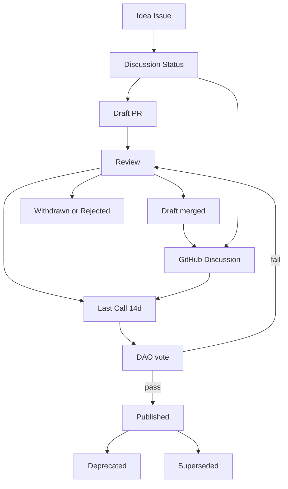

# HCS-4 Standard: HCS Standardization Process

### Status: Draft

### Version: 1.0

Discussion: (URL to GitHub Discussion)

## Authors

- Kantorcodes [https://twitter.com/kantorcodes](https://twitter.com/kantorcodes)
- Gaurang Torvekar [https://github.com/gaurangtorvekar](https://github.com/gaurangtorvekar)
- Patches [https://twitter.com/TMCC_Patches](https://twitter.com/TMCC_Patches)
- May Chan [https://x.com/may_hashpack](https://x.com/may_hashpack)

### Table of Contents

- [HCS-4 Standard: HCS Standardization Process](#hcs-4-standard-hcs-standardization-process)
    - [Status: Draft](#status-draft)
    - [Version: 1.0](#version-10)
  - [Authors](#authors)
    - [Table of Contents](#table-of-contents)
  - [Scope](#scope)
  - [Normative Language](#normative-language)
  - [Document Types](#document-types)
  - [Lifecycle and Status States](#lifecycle-and-status-states)
  - [Process Overview (Mermaid)](#process-overview-mermaid)
  - [Roles and Responsibilities (Minimal)](#roles-and-responsibilities-minimal)
  - [Submission and Review Workflow](#submission-and-review-workflow)
  - [Communication Channels and Cadence](#communication-channels-and-cadence)
  - [Governance Gate (DAO Vote)](#governance-gate-dao-vote)
  - [Number Assignment Policy (Stewarded Range)](#number-assignment-policy-stewarded-range)
  - [Acceptance Criteria](#acceptance-criteria)
  - [Required Document Structure](#required-document-structure)
  - [Change Management](#change-management)
  - [Supersession and Deprecation](#supersession-and-deprecation)
  - [Repository Conventions](#repository-conventions)
  - [Security, Privacy, and Interoperability Checks](#security-privacy-and-interoperability-checks)
  - [Templates](#templates)
    - [A Minimal Spec Template (all document types)](#a-minimal-spec-template-all-document-types)
    - [B Standard Track Template (with Topics, Memos, and Operations)](#b-standard-track-template-with-topics-memos-and-operations)
  - [HCS Conventions: Topic Memos and Operations (Normative)](#hcs-conventions-topic-memos-and-operations-normative)
  - [Glossary](#glossary)
  - [Acknowledgments](#acknowledgments)
  - [License](#license)

---

## Scope

This process standard defines how Hashgraph Consensus Standards (HCS) are created, reviewed, finalized, and maintained. It exists to ensure consistency across specifications (e.g., HCS‑1, HCS‑2, HCS‑10, HCS‑12) and to codify expectations for contributors, editors, and implementers. It draws on best practices from the IETF (BCP 9/14), W3C Process, and the EIP/BIP ecosystems while tailoring requirements to the Hashgraph Online community.

This is a Process document. It governs how all Standard Track and Informational HCS documents are authored and maintained.

## Normative Language

The key words “MUST”, “MUST NOT”, “REQUIRED”, “SHALL”, “SHALL NOT”, “SHOULD”, “SHOULD NOT”, “RECOMMENDED”, “NOT RECOMMENDED”, “MAY”, and “OPTIONAL” in this document are to be interpreted as described in IETF BCP 14 (RFC 2119 and RFC 8174).

## Document Types

- **Standard Track**: Normative specifications that define protocols, formats, or behaviors intended for broad adoption (e.g., HCS‑1, HCS‑2, HCS‑10, HCS‑12).
- **Informational**: Non‑normative guidance, background, or rationale that aids implementers but does not define conformance and carries **no implementation requirement** unless explicitly stated.
- **Process**: Documents that define how the standards program operates (this document).

## Lifecycle and Status States

Every HCS document moves through these states. State changes MUST be recorded in the document’s header.

1. **Idea (optional)**

   - A short Issue describing motivation and scope.
   - No number assigned. Use the “proposal” label.

2. **Discussion**

   - A pull request (PR) or draft branch introduces the specification outline under `docs/standards/drafts/<slug>.md` so numbered files remain scoped to published work.
   - No number assigned. Designated Numbering Stewards open a GitHub Discussion and coordinate early feedback across forums (GitHub, Telegram, calls).

3. **Draft**

   - Numbering Stewards assign the next available number within the approved range before the document enters Draft. The file is renamed accordingly (`hcs-<number>.md` or `hcs-<number>/index.md`).
   - A pull request (PR) adds a full draft following the template below.

4. **Review**

   - Open community review on the PR. Substantive changes are expected.
   - Editors MUST identify domain reviewers and solicit cross‑standard feedback for referenced HCS documents.

5. **Merged Draft (optional)**

   - Editors MAY merge a Draft into the main branch prior to publication for broader visibility and iteration. The document’s header MUST remain `Status: Draft` until ratified.
   - Post‑merge changes continue via normal PRs.
   - A GitHub Discussion SHOULD be opened/linked for focused community feedback. Use a clear title such as `HCS-<number> Discussion: <short title>`.

6. **Last Call**

   - Editors announce a “Last Call” (minimum 14 calendar days).
   - Substantive new features MAY proceed only when paired with a version increment plan (see Repository Conventions) that preserves prior published versions; otherwise changes SHOULD be limited to clarifications or critical fixes.

7. **DAO Vote & Publication**

   - After Last Call, the Hashgraph Online DAO conducts a governance vote (see Governance Gate below).
   - If the vote PASSES per DAO rules, editors set `Status: Published` and MAY create a release/tag. If the vote FAILS, the spec returns to Review.
   - Published specs MAY accrue errata or non‑substantive clarifications without changing status; track via patch‑level `Version` increments and an errata list. Any change to conformance MUST follow “Change Management”.

8. **Deprecated**

   - The standard SHOULD NOT be used for new work; provide migration guidance.

9. **Superseded**

   - Replaced by a newer HCS. The document MUST clearly name its successor.

10. **Withdrawn/Rejected**
   - A proposal that will not proceed. The rationale SHOULD be recorded for posterity.

## Process Overview (Mermaid)



## Roles and Responsibilities (Minimal)

- **Author/Champion**: Drafts the spec, responds to feedback, opens/links a GitHub Discussion, and coordinates any reference/independent implementations (for Standard Track).
- **Editors**: Guard process quality (numbering, format, links), manage status changes, schedule/announce Last Call, and move to Published only after a DAO vote PASS.
- **Numbering Stewards**: Maintain the bounded number ledger, assign numbers as proposals exit Discussion, enforce reserved ranges, and coordinate cross-channel announcements.
- **Community Reviewers**: Provide technical/editorial feedback via PR comments and the linked Discussion; no formal approval power required.
- **DAO Governance**: Runs the on‑chain governance vote and records/pass-fail outcome.

Editors SHOULD be listed in CODEOWNERS or documentation. At least two editors SHOULD approve the transition to Last Call; editors set `Status: Published` only after a DAO vote PASS is recorded.

## Submission and Review Workflow

1. **Open an Idea**: Create a GitHub Issue titled `HCS Proposal: <title>` with motivation, scope, and links to related HCS documents.
2. **Enter Discussion**: Fork/branch and submit an initial PR placing the content in `docs/standards/drafts/<slug>.md`. Summarize progress in the linked GitHub Discussion and share updates across agreed channels (GitHub, Telegram, community calls).
3. **Request Number Assignment**: When the outline is stable, Numbering Stewards (elected via the DAO) assign the next available number within the approved range and guide the rename/move to `docs/standards/hcs-<number>.md` (or `.../index.md`). Numbers outside the range, and culturally sensitive numbers such as 69 and 420, remain steward-reserved.
4. **Draft the Document**: Continue iterating on the numbered PR using “Required Document Structure” and “Repository Conventions”. Set `Status: Draft`.
5. **Community Review**: Keep discussion in the PR and the linked GitHub Discussion thread. Substantive design changes SHOULD be captured as commits with rationale, and major updates SHOULD be cross-posted to Telegram for broader visibility.
6. **Test Vectors & Implementations** (Standard Track): Provide at least one reference implementation and one independent implementation (minimum two total) demonstrating interoperability on Testnet or Mainnet. Include test vectors. Informational and Process documents are exempt unless they introduce normative requirements.
7. **Merged Draft (optional)**: Editors MAY merge the Draft prior to publication for wider review. The header stays `Status: Draft`. Maintain the GitHub Discussion titled `HCS-<number> Discussion: <short title>` and link it from the document (e.g., a short “Discussion” line near the top).
8. **Last Call (≥14 days)**: Editors announce Last Call on the PR, in Telegram, and during community syncs. Gather final feedback and address issues. Breaking changes reset the Last Call clock.
9. **DAO Governance Vote**: Submit the proposal to the Hashgraph Online DAO per its governance rules. If PASSED, proceed to Publish; if FAILED, return to Review with rationale.
10. **Publish**: Editors set `Status: Published`, and optionally create a release/tag. The canonical location is the merged document path.
11. **Post‑Publication Care**: Track errata via Issues; apply editorial updates via PRs per “Change Management”. Substantive changes REQUIRE a new HCS.

## Communication Channels and Cadence

- **Canonical record**: GitHub Issues, PRs, and Discussions remain the authoritative history. Summaries from other channels SHOULD be linked back to the Discussion thread.
- **Real-time coordination**: Telegram is the default synchronous backchannel for editors, stewards, and authors. Major updates (status transitions, Last Call announcements) SHALL be cross-posted there.
- **Community presentations**: Authors are encouraged to present proposals during Hashgraph Online community calls. Recording links SHOULD be added to the GitHub Discussion so late reviewers can catch up.
- **Steward touchpoints**: Numbering Stewards coordinate transitions from Discussion → Draft and ensure announcements are mirrored across channels.
- **Accessibility**: When external media (videos, decks) are produced, include transcripts or notes in the repository or linked Discussion to maintain public accessibility.

## Governance Gate (DAO Vote)

- Vote SHOULD use HCS‑8 (Poll Topic) with HCS‑9 metadata to ensure on‑chain auditability.
- Quorum/threshold/eligibility follow Hashgraph Online DAO governance; this process defers to those rules.
- The merged document MUST include a short Governance Record linking to the poll topic and result.
- If the vote fails, the proposal returns to Review; substantial changes SHOULD restart Last Call.

## Number Assignment Policy (Stewarded Range)

- **Bounded range**: HCS numbers MUST fall within 1–999. Numbers above 999 or explicitly reserved (e.g., 69, 420, culturally sensitive values) are unavailable without DAO approval.
- **Steward assignment**: Numbering Stewards, elected by the DAO, assign the next available number when a proposal exits Discussion. Authors SHALL NOT self-assign numbers.
- **Uniqueness and logging**: Stewards maintain a ledger of assigned and reserved numbers. Once a number is issued, it SHALL NOT be reused, even if the document later becomes Withdrawn or Superseded.
- **File renaming**: Upon assignment, the stewards or author (under steward guidance) relocate the draft from `docs/standards/drafts/<slug>.md` to `docs/standards/hcs-<number>.md` (or `hcs-<number>/index.md`) within the same PR, retaining Git history.
- **Reserved blocks**: Stewards MAY allocate contiguous ranges for programmatic series (e.g., wallets, tokens) when approved by DAO vote to reduce confusion.

## Acceptance Criteria

For transition from Review → Published:

- **Clarity**: Motivation and scope are clearly stated; non‑goals are listed if helpful.
- **Completeness**: All required sections are present with sufficient detail for interoperable implementation.
- **Conformance**: The document defines testable requirements (MUST/SHOULD) and explicit error handling where applicable.
- **Interoperability**: For Standard Track, at least two independent implementations demonstrate interoperability using shared test vectors.
- **Security & Privacy**: Security considerations are present. If personal data is involved, privacy considerations MUST be included (see HCS‑19 alignment where applicable).
- **Backwards Compatibility**: Migration/compat guidance provided, or rationale for breaking changes.
- **References**: Cites related HCS documents and relevant external standards.
- **Governance**: For publication, a recorded DAO vote result (PASS) with an on‑chain reference (e.g., HCS‑8 poll topic) is provided.

## Required Document Structure

Every HCS specification MUST contain the following sections (additional sections are allowed):

- Title block with frontmatter (title, description, `sidebar_position`) and an H1 mirroring the title.
- Status and Version.
- Authors (with optional contact/links).
- Abstract.
- Motivation.
- Specification (normative): including formats, algorithms, state machines, memo structures, or APIs, as appropriate.
- Rationale (informative): design trade‑offs and alternatives considered.
- Backwards Compatibility and Migration.
- Security Considerations (and Privacy Considerations where applicable).
- Test Vectors (where applicable) and Reference Implementation links.
- Conformance: explicit statements of what an implementation MUST/SHOULD support and how to validate.
- References (normative/informative), Glossary (optional).
- License statement.

## Change Management

Changes after publication fall into three classes:

- **Editorial** (typos, formatting, non‑substantive clarifications): MAY be merged by editors with brief PR description. Status remains Published.
- **Clarification** (tightens language without changing conformance): REQUIRES reviewer confirmation. Update a `Version` patch number and record in a Changelog.
- **Substantive** (changes conformance or interoperability): REQUIRES a new HCS number. The new document SHOULD state “Supersedes HCS‑N”. The prior document becomes Superseded or Deprecated.

All changes MUST be via PR with clear summaries. Editors SHALL reject PRs that alter normative behavior without following this process.

When publishing a new version of an existing HCS, archive the previously published document in the numbered folder per the Repository Conventions and update `index.md` (or the root file) to reflect the latest version.

## Supersession and Deprecation

- A successor HCS MUST explicitly list the prior HCS it supersedes and provide migration guidance.
- Superseded documents remain in the repository for historical reference with a banner linking to the successor.
- Deprecated documents SHOULD provide rationale and alternatives.

## Repository Conventions

- File location: `docs/standards/hcs-<number>.md` for single‑file specs, or `docs/standards/hcs-<number>/index.md` for multi‑file specs.
- Discussion drafts: Unnumbered work-in-progress lives under `docs/standards/drafts/<slug>.md` until a number is assigned.
- Version history: When publishing an updated version, snapshot the prior canonical document under `docs/standards/hcs-<number>/v<major>.<minor>.md` (with `index.md` referencing the latest) so past releases remain accessible.
- Frontmatter keys: `title`, `description`, `sidebar_position` (numeric ordering only).
- Cross‑references: use relative links between HCS docs, e.g., `../hcs-2.md` or `../hcs-12/index.md`.
- Examples and images SHOULD live near the spec (e.g., `docs/standards/hcs-<number>/assets/*`).
- Discussions: When a draft is merged, create a GitHub Discussion for ongoing feedback and reference it in the spec. Suggested title format: `HCS-<number> Discussion: <short title>`.

Example structures:

```
docs/standards/
├── hcs-11.md
└── hcs-14.md

docs/standards/
├── hcs-11/
│   ├── index.md        # latest (v1.1)
│   ├── v1.0.md
│   └── assets/
└── hcs-14/
    ├── index.md        # latest (v2.0)
    ├── v1.0.md
    └── v1.1.md
```

## Security, Privacy, and Interoperability Checks

Before entering Last Call, Standard Track documents MUST include:

- Threat model summary and Security Considerations.
- Privacy Considerations if user or personal data is processed (align with HCS‑19 where possible).
- Interoperability plan and test vectors.
- Backwards compatibility and migration notes.

## Templates

Use the following templates when drafting a new HCS document.

### A Minimal Spec Template (all document types)

```md
---
title: HCS-<number> — <short title>
description: <one-sentence description>
sidebar_position: <number>
---

# HCS-<number> Standard: <long title>

### Status: Draft

### Version: 1.0

### Table of Contents

- [Authors](#authors)
- [Abstract](#abstract)
- [Motivation](#motivation)
- [Specification](#specification)
- [Rationale](#rationale)
- [Backwards Compatibility](#backwards-compatibility)
- [Security Considerations](#security-considerations)
- [Privacy Considerations](#privacy-considerations)
- [Test Vectors](#test-vectors)
- [Conformance](#conformance)
- [References](#references)
- [License](#license)

## Authors

- <name/link>

## Abstract

<short summary>

## Motivation

<problem statement>

## Specification

<normative content with MUST/SHOULD/MAY>

## Rationale

<design trade-offs>

## Backwards Compatibility

<impact and migration>

## Security Considerations

<threats and mitigations>

## Privacy Considerations

<if applicable>

## Test Vectors

<inputs/outputs>

## Conformance

<what an implementation MUST do>

## References

<normative and informative>

## Governance Record (fill at publication)

- Poll topic: hcs://8/<topicId> (or Mirror Node link, Hashgraph.vote Link)
- Outcome: PASS | FAIL on YYYY-MM-DD (UTC)
- Reference: <txn or final tally/info link>

## License

This document is licensed under Apache-2.0.
```

### B Standard Track Template (with Topics, Memos, and Operations)

This template matches patterns used across HCS-1, HCS-2, HCS-10, and HCS-12.

````md
---
title: HCS-<number> — <short title>
description: <one-sentence description>
sidebar_position: <number>
---

# HCS-<number> Standard: <long title>

### Status: Draft

### Version: 1.0

Discussion: <URL to GitHub Discussion>

### Table of Contents

- [Authors](#authors)
- [Abstract](#abstract)
- [Motivation](#motivation)
- [Specification](#specification)
  - [Architecture Overview](#architecture-overview)
  - [Topic System](#topic-system)
    - [Topic Types and Enums](#topic-types-and-enums)
    - [Topic Memo Formats](#topic-memo-formats)
  - [Operation Reference](#operation-reference)
    - [`<operation-1>`](#operation-1)
    - [`<operation-2>`](#operation-2)
  - [Schemas](#schemas)
  - [Validation](#validation)
- [Rationale](#rationale)
- [Backwards Compatibility](#backwards-compatibility)
- [Security Considerations](#security-considerations)
- [Privacy Considerations](#privacy-considerations)
- [Test Vectors](#test-vectors)
- [Conformance](#conformance)
- [References](#references)
- [License](#license)

## Authors

- <name/link>

## Abstract

<short summary>

## Motivation

<problem statement>

## Specification

### Architecture Overview

<diagrams and narrative>

### Topic System

#### Topic Types and Enums

Define numeric enums (stable once published). New types are appended; values are never reused or renumbered.

| Enum | Name     | Description |
| ---- | -------- | ----------- |
| 0    | <Type A> | ...         |
| 1    | <Type B> | ...         |

#### Topic Memo Formats

Topic memos are UTF‑8 strings optimized for fast identification. Use a colon‑delimited format consistent with HCS‑2/HCS‑10:
```
hcs-<number>:<indexed>:<ttl>:<type>[:<param1>[:<param2>...]]
```

- `hcs-<number>`: literal identifier for this standard.
- `indexed`: 0 or 1, as defined by HCS‑2 (0 = read all messages; 1 = read latest only).
- `ttl`: cache time in seconds (use 0 if not applicable).
- `type`: numeric enum from Topic Types and Enums.
- Additional parameters are defined per topic type and MUST be ordered and documented.

Example (Type=3 Registry):
```
hcs-<number>:0:60:3:0.0.998877
```

Optional: Transaction Memos for Analytics (pattern from HCS‑10)

If your standard benefits from analytics on submitted operations, define a transaction memo pattern using numeric enums, for example:

```
hcs-<number>:op:{operation_enum}:{topic_type_enum}
```

Document the operation and topic type enums alongside the Operation Reference. If you do not define enums, omit this facility.

### Operation Reference

All operations MUST include the protocol and operation identifiers used across existing HCS specs:

```json
{
  "p": "hcs-<number>",
  "op": "<operation>",
  "...": "operation-specific fields"
}
```

Field rules (aligns with HCS‑2, HCS‑10, HCS‑12, HCS‑20):

- `p` (string, REQUIRED): Protocol identifier (e.g., `"hcs-10"`).
- `op` (string, REQUIRED): Operation name (lowercase, hyphenated if needed).
- `m` (string, OPTIONAL): Free‑form memo/context. Keep ≤500 chars when practical.
- Operation‑specific fields MUST be explicitly defined per operation. Common conventions used in existing specs include:
  - `t_id` (string): Hedera Topic ID (e.g., `"0.0.123456"`).
  - `uid` (string|number): Sequence number referencing a prior `register` message.
  - `account_id` (string): Hedera account ID.
  - `operator_id` (string): Composite identifier `inboundTopicId@accountId` (HCS‑10).
  - `metadata` (string): HIP‑412 pointer or human‑readable notes, where applicable.
  - Hash fields like `hash`, `wasm_hash`, `js_hash` (HCS‑12) MUST state the algorithm in the spec text (e.g., SHA‑256).

#### `<operation-1>`

Description and rules.

Request payload example (use only fields your standard needs):

```json
{
  "p": "hcs-<number>",
  "op": "register",
  "t_id": "0.0.123456",
  "name": "...",
  "m": "optional context"
}
```

#### `<operation-2>`

Description and rules.

### Schemas

If you provide JSON Schemas, include `$schema`/`$id` and keep field names consistent with the spec. Schemas are OPTIONAL unless your standard declares them normative.

### Validation

Define MUST/SHOULD rules and explicit invalid cases. Validation SHOULD reference existing field conventions (e.g., `t_id` must match Hedera Topic ID format; `uid` must reference an existing sequence).

## Rationale

<design trade-offs>

## Backwards Compatibility

<impact and migration>

## Security Considerations

Threats, mitigations, replay handling, integrity checks.

## Privacy Considerations

Personal data handling and links to HCS‑19 guidance if applicable.

## Test Vectors

Provide at least: topic memo strings, canonical JSON inputs, integrity hashes, and expected validation outcomes.

## Conformance

List testable MUST/SHOULD statements and minimal feature set to claim compliance.

## References

HCS‑1 (file/memo), HCS‑2 (registries/indexing), HCS‑10 (memo/ops patterns), others.

## Governance Record (fill at publication)

- Poll topic: hcs://8/<topicId> (or Mirror Node link)
- Outcome: PASS | FAIL on YYYY-MM-DD (UTC)
- Reference: <txn or final tally/info link>

## License

Apache-2.0

````

## HCS Conventions: Topic Memos and Operations (Normative)

To promote cross‑standard consistency, new Standard Track documents SHALL follow these conventions unless a well‑justified deviation is documented in Rationale:

1. **Topic Memo Format**: Use colon‑delimited memos beginning with `hcs-<number>`. Define `indexed` and `ttl` in this order (per HCS‑2). If your standard uses per‑topic `type` enums (like HCS‑10), specify `hcs-<number>:<indexed>:<ttl>:<type>[:params…]` and define all params.
2. **Type Enums**: If used, publish a stable numeric table. Never reuse or renumber values; append new ones.
3. **Operation Fields**: Operations MUST include `p` and `op`. Optional `m` MAY provide human context. All other fields are operation‑specific and MUST be defined explicitly (see HCS‑2, HCS‑10, HCS‑12, HCS‑20 patterns).
4. **Common Names**: Prefer established names when applicable (`t_id`, `uid`, `account_id`, `operator_id`, `metadata`, `hash`, `wasm_hash`, `js_hash`).
5. **HRL References**: When referencing on‑graph resources, use HRL format `hcs://{protocol_number}/{topic_id}` as used elsewhere in this repo.
6. **Test Vectors**: Provide deterministic vectors for memos and operations so independent implementations can reproduce exact results.

## Glossary

- **Editors**: Individuals designated to manage the standards process, numbering, status changes, and quality control.
- **Last Call**: Timeboxed period for final public review prior to publication.
- **Standard Track**: A normative specification intended for interoperable adoption.
- **Informational**: Non‑normative guidance; no conformance requirements.
- **Process**: A document defining how the program operates (this HCS‑4).

## Acknowledgments

This process incorporates proven patterns from the IETF, W3C, and major public‑chain proposal systems (EIPs/BIPs), adapted for the Hashgraph Online community’s needs.

## License

This document is licensed under [Apache‑2.0](https://www.apache.org/licenses/LICENSE-2.0).

---
