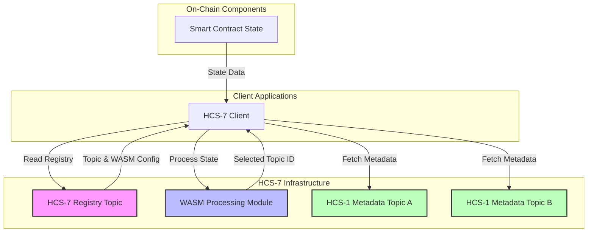
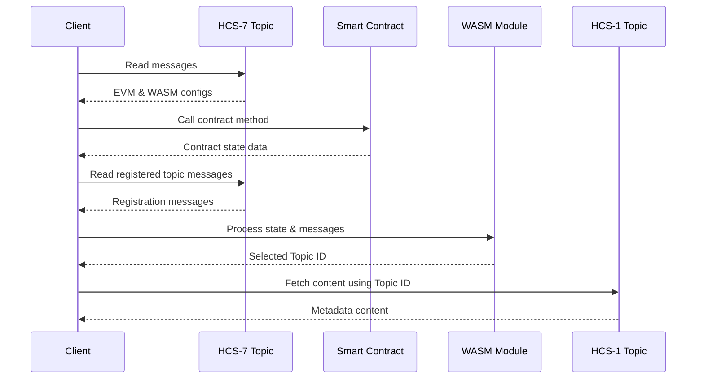
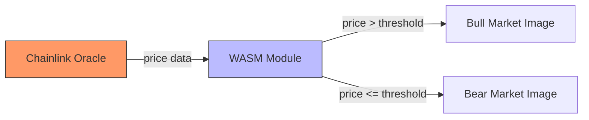
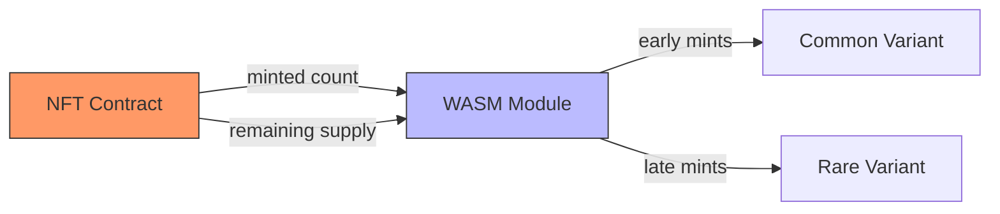
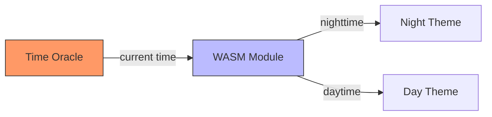
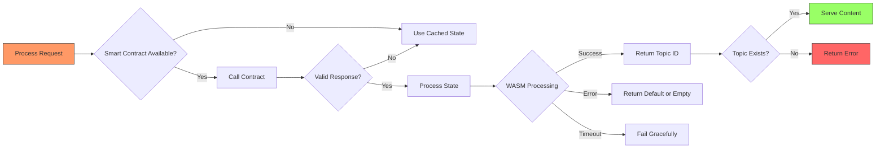
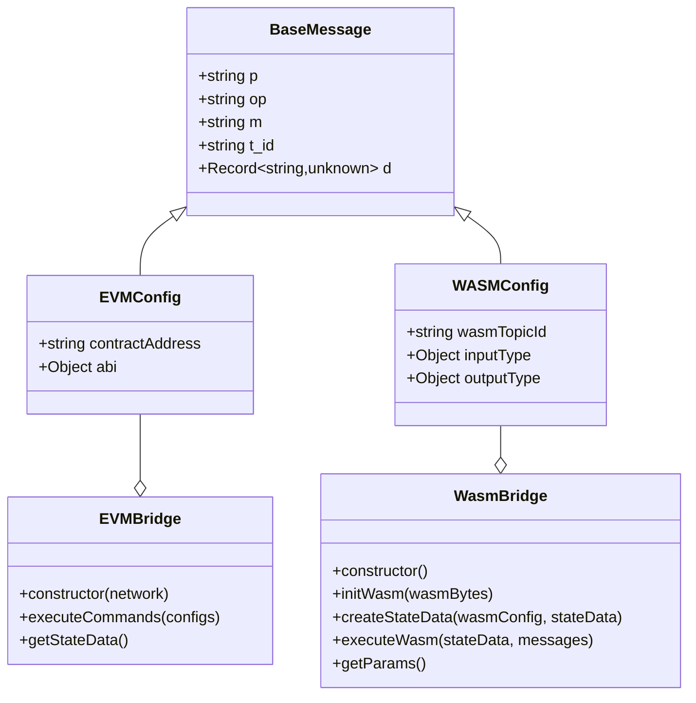
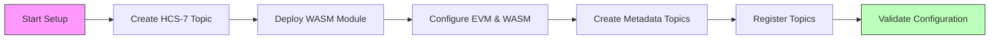

# HCS-7: Smart Hashinals - A Micro-DSL for Deterministic Topic Selection

### **Status:** Draft

### **Table of Contents**

- [HCS-7: Smart Hashinals - A Micro-DSL for Deterministic Topic Selection](#hcs-7-smart-hashinals---a-micro-dsl-for-deterministic-topic-selection)
  - [**Status:** Draft](#status-draft)
  - [**Table of Contents**](#table-of-contents)
  - [**Authors**](#authors)
  - [**Abstract**](#abstract)
  - [**Motivation**](#motivation)
  - [**Architecture Overview**](#architecture-overview)
    - [**Key Components**](#key-components)
    - [**Processing Flow**](#processing-flow)
  - [**Common Use Cases**](#common-use-cases)
    - [**Price-Reactive NFTs**](#price-reactive-nfts)
    - [**Mint Progress NFTs**](#mint-progress-nfts)
    - [**Time-Based NFTs**](#time-based-nfts)
  - [**Specification**](#specification)
    - [**Topic System**](#topic-system)
      - [**Topic Types**](#topic-types)
      - [**Topic Memo Formats**](#topic-memo-formats)
    - [**Message Types and Fields**](#message-types-and-fields)
      - [**1. EVM Configuration**](#1-evm-configuration)
      - [**2. WASM Configuration**](#2-wasm-configuration)
      - [**3. Metadata Registration**](#3-metadata-registration)
    - [**Error Handling**](#error-handling)
    - [**Implementation Bridge Classes**](#implementation-bridge-classes)
  - [**Implementation Workflow**](#implementation-workflow)
    - [**Step 1: Setup Phase**](#step-1-setup-phase)
    - [**Step 2: Processing Requirements**](#step-2-processing-requirements)
    - [**Step 3: Extended WASM Capabilities**](#step-3-extended-wasm-capabilities)
    - [**Step 4: Chainlink Oracle Integration**](#step-4-chainlink-oracle-integration)
  - [**Limitations**](#limitations)
    - [**Smart Contract Limitations**](#smart-contract-limitations)
    - [**WASM Limitations**](#wasm-limitations)
    - [**Infrastructure Requirements**](#infrastructure-requirements)
  - [**Reference Implementation**](#reference-implementation)
  - [**Conclusion**](#conclusion)

---

## **Authors**

- Kantorcodes [https://twitter.com/kantorcodes](https://twitter.com/kantorcodes)

---

## **Abstract**

HCS-7 is a sub-standard of [HCS-6](./hcs-6.md) that introduces a powerful mechanism for creating dynamic NFTs (Hashinals) whose metadata automatically updates based on smart contract state. By combining on-chain data with WebAssembly (WASM) processing, HCS-7 enables trustless, programmatic, and verifiable metadata selection without requiring additional transactions for each update.

The standard defines a micro domain-specific language (DSL) for deterministic topic selection, allowing smart contracts to drive the appearance and behavior of NFTs. This enables rich, interactive experiences such as evolving artwork, price-reactive visuals, and state-dependent functionality.

---

## **Motivation**

HCS-6 introduced dynamic metadata updates for Hashinals through sequence number registration. However, many use cases require switching metadata based on complex on-chain conditions:

- Number of minted NFTs in a collection
- Uniswap V3 pool price thresholds
- Token balance requirements
- Time-weighted average prices
- Complex mathematical calculations

These scenarios would traditionally require submitting many messages and maintaining off-chain state. HCS-7 solves this through trustless, programmatic, verifiable execution by combining on-chain state with WASM processing.

---

## **Architecture Overview**

HCS-7 creates a framework where NFT metadata is automatically selected based on smart contract state, without requiring additional transactions for updates. The architecture leverages HCS topics, smart contracts, and WASM for deterministic processing.

### **Key Components**

| Component                 | Description                                           | Role in HCS-7                                                  |
| ------------------------- | ----------------------------------------------------- | -------------------------------------------------------------- |
| **HCS-7 Registry Topic**  | Central topic storing configuration and registrations | Contains EVM configs, WASM configs, and metadata registrations |
| **WASM Module**           | WebAssembly code for processing state data            | Evaluates contract state and returns appropriate Topic ID      |
| **Smart Contract**        | On-chain source of state data                         | Provides real-time data that determines metadata selection     |
| **HCS-1 Metadata Topics** | Topics containing actual metadata content             | Stores the variant content that will be displayed              |
| **HCS-7 Client**          | Software implementing the standard                    | Orchestrates the flow between components                       |



### **Processing Flow**

The HCS-7 system follows a deterministic processing flow:



This architecture allows for deterministic, trustless selection of metadata based on on-chain conditions, without requiring additional transactions for metadata updates.

---

## **Common Use Cases**

HCS-7 enables a variety of dynamic NFT experiences through its flexible architecture.

### **Price-Reactive NFTs**

NFTs that change appearance based on asset prices from oracles:



### **Mint Progress NFTs**

NFTs that evolve as collection minting progresses:



### **Time-Based NFTs**

NFTs that update based on time of day or other temporal factors:



Other popular use cases include:

- **Balance-Dependent NFTs**: Artwork that changes based on user's token balance
- **Game State NFTs**: NFTs that reflect in-game achievements or status

---

## **Specification**

### **Topic System**

#### **Topic Types**

HCS-7 uses the following topic types to manage dynamic metadata selection:

| Topic Type                | Description                             | Key Configuration                                           |
| ------------------------- | --------------------------------------- | ----------------------------------------------------------- |
| **HCS-7 Registry Topic**  | Central configuration and routing topic | No admin key (as per [HCS-2](/docs/standards/hcs-2))        |
| **HCS-1 Metadata Topics** | Topics containing variant metadata      | [HCS-1](/docs/standards/hcs-1) standard for content storage |
| **WASM Module Topic**     | Topic containing the WASM code          | [HCS-1](/docs/standards/hcs-1) format for binary storage    |

#### **Topic Memo Formats**

Each topic type uses a specific memo format in its HCS topic creation transaction to indicate its purpose and configuration. For a comprehensive overview of topic memos across all HCS standards, see the [Topic Memos](../definitions.md#topic-memos) definition.

**HCS-7 Registry Topic Memo Format**

The HCS-7 Registry Topic serves as the central configuration hub for dynamic metadata selection:

```
hcs-7:indexed:{ttl}
```

| Field     | Description                                                          | Example Value |
| --------- | -------------------------------------------------------------------- | ------------- |
| `hcs-7`   | Standard identifier                                                  | `hcs-7`       |
| `indexed` | Literal "indexed" indicating all messages should be read and indexed | `indexed`     |
| `ttl`     | Time-to-live in seconds for caching                                  | `3600`        |

**Metadata Format**

HCS-7 metadata follows the HCS-5 standard with protocol number `7`:

| Format Type      | Format Structure              | Example               |
| ---------------- | ----------------------------- | --------------------- |
| **HRL Format**   | `hcs://7/{topicId}`           | `hcs://7/0.0.1234567` |
| **Requirements** | Valid HCS-7 Registry Topic ID | Must exist on network |

### **Message Types and Fields**

HCS-7 defines three primary message types:

#### **1. EVM Configuration**

EVM Configuration messages define smart contract interactions to retrieve state:

```json
{
  "p": "hcs-7",
  "op": "register-config",
  "t": "evm",
  "c": {
    "contractAddress": "0x1d67aaf7f7e8d806bbeba24c4dea24808e1158b8",
    "abi": {
      "inputs": [],
      "name": "minted",
      "outputs": [
        {
          "name": "",
          "type": "uint64"
        }
      ],
      "stateMutability": "view",
      "type": "function"
    }
  },
  "m": "LaunchPage Test Mint"
}
```

| Field                   | Type   | Description                                | Required |
| ----------------------- | ------ | ------------------------------------------ | -------- |
| `p`                     | string | Protocol identifier (must be "hcs-7")      | Yes      |
| `op`                    | string | Operation type (must be "register-config") | Yes      |
| `t`                     | string | Configuration type (must be "evm")         | Yes      |
| `c.contractAddress`     | string | Ethereum contract address                  | Yes      |
| `c.abi`                 | object | Contract ABI with function details         | Yes      |
| `c.abi.name`            | string | Method name to call                        | Yes      |
| `c.abi.inputs`          | array  | Array of input parameters                  | Yes      |
| `c.abi.outputs`         | array  | Array of return types                      | Yes      |
| `c.abi.stateMutability` | string | Must be "view" or "pure"                   | Yes      |
| `c.abi.type`            | string | Must be "function"                         | Yes      |
| `m`                     | string | Message description                        | No       |

#### **2. WASM Configuration**

WASM Configuration messages define the processing logic:

```json
{
  "p": "hcs-7",
  "op": "register-config",
  "t": "wasm",
  "c": {
    "wasmTopicId": "0.0.5263817",
    "inputType": {
      "stateData": {
        "minted": "number",
        "tokensRemaining": "number"
      }
    },
    "outputType": {
      "type": "string",
      "format": "topic-id"
    }
  },
  "m": "minted-even-odd-router"
}
```

| Field                   | Type   | Description                                | Required |
| ----------------------- | ------ | ------------------------------------------ | -------- |
| `p`                     | string | Protocol identifier (must be "hcs-7")      | Yes      |
| `op`                    | string | Operation type (must be "register-config") | Yes      |
| `t`                     | string | Configuration type (must be "wasm")        | Yes      |
| `c.wasmTopicId`         | string | Topic ID containing WASM module            | Yes      |
| `c.inputType`           | object | JSON Schema for input data                 | Yes      |
| `c.inputType.stateData` | object | Contract return value types                | Yes      |
| `c.outputType`          | object | Output specification                       | Yes      |
| `c.outputType.type`     | string | Output data type (must be "string")        | Yes      |
| `c.outputType.format`   | string | Output format (must be "topic-id")         | Yes      |
| `m`                     | string | Message description                        | No       |

**Required WASM Functions:**

The WASM module must implement two functions:

1. `process_state(state_json: &str, messages_json: &str) -> String`

   - Processes the state data and messages to determine the output topic ID
   - `state_json`: JSON string containing the state data from EVM calls
   - `messages_json`: JSON string containing the array of registered messages
   - Returns: A valid topic ID as a string

2. `get_params() -> String`
   - Returns a JSON string describing the required parameters and their types
   - Example return value:
     ```json
     {
       "minted": "number",
       "tokensRemaining": "number"
     }
     ```

**Example WASM Implementation:**

```rust
#[wasm_bindgen]
pub fn process_state(state_json: &str, messages_json: &str) -> String {
    // Parse JSON inputs
    let state: Value = match serde_json::from_str(state_json) {
        Ok(data) => data,
        Err(_) => return String::new(),
    };

    let messages: Vec<Value> = match serde_json::from_str(messages_json) {
        Ok(data) => data,
        Err(_) => return String::new(),
    };

    // Get minted from state, return empty if invalid
    let minted = match parse_minted(&state) {
        Some(p) => p,
        None => return String::new()
    };

    // Process data - check if minted is even/odd
    let is_even = minted % 2u32 == BigUint::from(0u32);

    let topic_id = if is_even {
        // Find first matching even registration
        messages.iter()
            .find(|msg| {
                msg.get("t_id").is_some() &&
                msg.get("d")
                    .and_then(|d| d.get("tags"))
                    .and_then(|tags| tags.as_array())
                    .map(|tags| tags.iter().any(|t| t.as_str() == Some("even")))
                    .unwrap_or(false)
            })
            .and_then(|msg| msg.get("t_id").and_then(|id| id.as_str()))
            .map(|s| s.to_string())
    } else {
        // Find first matching odd registration
        messages.iter()
            .find(|msg| {
                msg.get("t_id").is_some() &&
                msg.get("d")
                    .and_then(|d| d.get("tags"))
                    .and_then(|tags| tags.as_array())
                    .map(|tags| tags.iter().any(|t| t.as_str() == Some("odd")))
                    .unwrap_or(false)
            })
            .and_then(|msg| msg.get("t_id").and_then(|id| id.as_str()))
            .map(|s| s.to_string())
    };

    // Return topic ID or empty string if none found
    topic_id.unwrap_or_default()
}
```

#### **3. Metadata Registration**

Metadata Registration messages link HCS-1 topics to selection tags:

```json
{
  "p": "hcs-7",
  "op": "register",
  "t_id": "0.0.3717738",
  "m": "blue",
  "d": {
    "weight": 1,
    "tags": ["odd"]
  }
}
```

| Field      | Type   | Description                           | Required |
| ---------- | ------ | ------------------------------------- | -------- |
| `p`        | string | Protocol identifier (must be "hcs-7") | Yes      |
| `op`       | string | Operation type (must be "register")   | Yes      |
| `t_id`     | string | HCS-1 topic ID containing metadata    | Yes      |
| `m`        | string | Message description                   | No       |
| `d`        | object | Additional routing data               | Yes      |
| `d.weight` | number | Priority if multiple matches          | Yes      |
| `d.tags`   | array  | Routing identifiers                   | Yes      |

### **Error Handling**

HCS-7 defines a robust error handling strategy to manage failures at different stages:



| Error Type                | Handling Strategy  | Fallback                 |
| ------------------------- | ------------------ | ------------------------ |
| **Smart Contract Errors** | Skip state update  | Use cached state         |
| **Network Issues**        | Retry with backoff | Use cached state         |
| **Contract Not Found**    | Fail validation    | Return error             |
| **WASM Invalid Input**    | Return empty       | Default topic            |
| **WASM Timeout**          | Fail gracefully    | Default topic            |
| **No Matching Tag**       | Return default     | Empty string             |
| **Topic Not Found**       | Fail validation    | Return error             |
| **Invalid Format**        | Skip registration  | Continue with valid data |
| **Network Issues**        | Use cache          | Retry with backoff       |

### **Implementation Bridge Classes**

HCS-7 defines a set of classes to implement the standard:



---

## **Implementation Workflow**

### **Step 1: Setup Phase**



| Step | Action                 | Description                                                      |
| ---- | ---------------------- | ---------------------------------------------------------------- |
| 1    | Create HCS-7 Topic     | Create an indexed topic with memo format `hcs-7:indexed:{ttl}`   |
| 2    | Deploy WASM Module     | Deploy WASM module to a separate topic for processing state data |
| 3    | Configure EVM & WASM   | Submit EVM and WASM configuration messages                       |
| 4    | Create Metadata Topics | Create HCS-1 topics for each metadata variant (e.g., odd/even)   |
| 5    | Register Topics        | Register each HCS-1 topic with appropriate tags and weights      |
| 6    | Validate Configuration | Ensure all configurations are properly submitted and indexed     |

### **Step 2: Processing Requirements**

The HCS-7 processing model has specific requirements to ensure proper operation:

| Requirement          | Description                 | Notes                             |
| -------------------- | --------------------------- | --------------------------------- |
| Smart Contract Calls | Must be view/pure functions | No state mutations allowed        |
| WASM Execution       | Limited to 50ms             | Prevents excessive resource usage |
| Topic ID Validation  | Must return valid ID        | Empty for no match                |
| Error Handling       | Must implement fallbacks    | See Error Handling section        |

### **Step 3: Extended WASM Capabilities**

WASM modules can implement complex processing logic:

```rust
// Combining multiple state values
let minted = parse_number(&state, "minted").unwrap_or_default();
let tokens_remaining = parse_number(&state, "tokensRemaining").unwrap_or_default();

// Calculate combined value for decision making
let combined_value = minted.clone() * tokens_remaining;
let is_even = combined_value % 2u32 == BigUint::from(0u32);
```

WASM processing allows for:

- Mathematical operations on state data
- Complex conditional logic
- Multi-factor decision making
- State variable combination

### **Step 4: Chainlink Oracle Integration**

HCS-7 supports integration with Chainlink oracles using this configuration:

```json
{
  "p": "hcs-7",
  "op": "register-config",
  "t": "evm",
  "c": {
    "contractAddress": "0x59bC155EB6c6C415fE43255aF66EcF0523c92B4a",
    "abi": {
      "inputs": [],
      "name": "latestRoundData",
      "outputs": [
        {
          "name": "roundId",
          "type": "uint80"
        },
        {
          "name": "answer",
          "type": "int256"
        },
        {
          "name": "startedAt",
          "type": "uint256"
        },
        {
          "name": "updatedAt",
          "type": "uint256"
        },
        {
          "name": "answeredInRound",
          "type": "uint80"
        }
      ],
      "stateMutability": "view",
      "type": "function"
    }
  },
  "m": "Chainlink HBAR Price Feed"
}
```

This enables price-reactive NFTs that can change based on real-world asset prices.

---

## **Limitations**

### **Smart Contract Limitations**

| Limitation        | Description                        | Mitigation                                 |
| ----------------- | ---------------------------------- | ------------------------------------------ |
| View/Pure Only    | Must be public view/pure functions | Use read-only methods for state            |
| No State Mutation | Cannot change state                | Design for read-only operations            |
| Verification      | Must be verified and accessible    | Deploy contracts through verified channels |
| Gas Costs         | Gas costs affect performance       | Optimize contracts for minimal gas usage   |

### **WASM Limitations**

| Limitation      | Description                   | Mitigation                           |
| --------------- | ----------------------------- | ------------------------------------ |
| Processing Time | 50ms processing limit         | Optimize WASM code for performance   |
| Error Handling  | Must handle all error cases   | Implement comprehensive error checks |
| Topic Selection | Limited to topic ID selection | Design within the constraints        |
| Memory          | Memory constraints            | Optimize memory usage                |

### **Infrastructure Requirements**

| Requirement         | Description                   | Implementation                |
| ------------------- | ----------------------------- | ----------------------------- |
| Cache Management    | Cache state and results       | Implement TTL-based caching   |
| Network Reliability | Maintain network connectivity | Use retry logic and fallbacks |
| State Consistency   | Ensure state consistency      | Implement validation checks   |
| Error Recovery      | Plan for failures             | Design failure recovery paths |

---

## **Reference Implementation**

A reference implementation toolkit is available at [Standards SDK](https://github.com/hashgraph-online/standards-sdk/tree/main/src/hcs-7) with the following components:

| Component                | Description                                  | Purpose                 |
| ------------------------ | -------------------------------------------- | ----------------------- |
| **EVMBridge**            | Class for reading smart contract state       | Retrieves on-chain data |
| **WasmBridge**           | Class for loading and executing WASM modules | Processes state data    |
| **CreateTopic**          | Utility for creating HCS-7 topics            | Sets up required topics |
| **Example WASM Modules** | Sample implementations for various use cases | Provides reference code |

---

## **Conclusion**

HCS-7 extends HCS-6 by enabling smart contract driven metadata selection through WASM processing. This creates a powerful system for dynamic NFTs while maintaining decentralization and trustlessness. The standard enables a wide range of reactive NFT applications from price-reactive visuals to complex state-dependent metadata.

---
