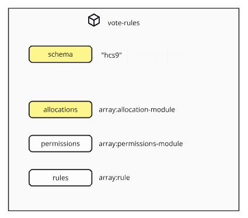

#### [ hcs9 - Poll Metadata Schema ]

The extensibility of the standard is one of the core design features of the hcs9 standard. This section provides guidance and examples on how to extend or create new modules to plug into your polls and add new functionality.

## Open Source Implementation Repo

The github repo (TBD) provides an open source implementation of this specification as a base for projects to build off of.

## Validation

Data is validated off of the schema. It is important to note that the implementation of the schema is different than the specification.

This is because the specification is designed to broadly encompass and support all potential modules. However, an implementation is limited by the modules it supports.

Take the base-poll-schema:

```
{
  "$schema": "https://json-schema.org/draft/2020-12/schema",
  "$id": "https://rockvt.com/schemas/base-poll-schema",
  
  ...
  "actions" : {
    "voteRules": { "$ref": "vote-rules" },
  ...
  
}
```

For reference, here is the structure of the vote-rules module:



The implementation checks that the data it receives matches the vote-rules structure. However, by specification the vote-rules module is a *module*, meaning a project could define a completely unique vote-rules object that has a completely different data structure.

Strictly speaking, the implementation does not implement the specification. However, because the code can only process data that it recognizes, it adheres to the specification on a functional level.

Let's say a project defined a "new-vote-rules.json" module. To support this new module on their platform, the voteRules field in the base-poll-schema.json would be updated to be:

```
    "voteRules": { "oneOf": [
        {
        "$ref": "vote-rules"
        },
        {
        "$ref": "new-vote-rules"
        }
    ]},
```

The more strictly a project adheres to the hcs9 standard, the more other sites will be able to support its features.