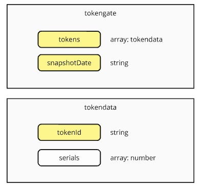

#### [ hcs9 - Poll Metadata Schema ]

Token gates provide the way for poll behaviour to be determined based on what tokens (fungible or non-fungible) a user holds. It's a powerful way to make use of Web3 assets to engage with communities.



the tokengate structure consists of an array of tokendata objects, and a string that holds the UNIX timestamp of the snapshot.

the tokendata structure contains the tokenId which the tokengate checks for. serials is an optional array of numbers, which represent specific serials that the tokengate checks for. This is applicable to NFTs only (since FT's dont have serial numbers). If no serials are provided, all serial numbers are included in the tokengate.

### Allocation Rules

#### unitWeight

This rule explicitly defines the token gate to provide one vote-weight per unit token held, rounding down for fractions. 

If no other rules are specified this is also the default behaviour.

```
{
    "name": "unitWeight"
}
```

#### weighted

This rule applies a scaling factor to the number of tokens held to determine the total votes a user is allotted.
This rule can be applied in situations such as when users hold fungible tokens to balance the amount of weight they receive per fungible token. 

"How much voting weight is one token worth?"

tokensPerVote is the number of tokens required to equal one weight of vote.

By default, the amount of weight allocated is rounded down to the nearest integer.

```
{
    "name": "weighted",
    "tokensPerVote": number
}
```

Example: A user holds 10,000 of a specified token, and tokensPerVote is 1,000. The user receives 10 votes. Another user holds 9,500 of the token. This user receives 9 votes, since partial votes are rounded down.

#### multiplier

"Does the user own at least one token in the token gate?"

Multiplier is a flat multiplier on the user's total weight after adding all the allocations up. For the multiplier to be applied, a user has to hold *at least* one token from the token gate in order to get the multiplier.

This rule can be applied in situations like membership cards or founders tokens where holding one of the tokens grants an overall benefit for the user. Consider setting multiplier in conjunction with a tokensPerWeight of '0' for a membership card, with some other token used to determine the flat amount of weight allocated.

```
{
    "name": "multiplier",
    "multiplier": number
}
```

Example:

A poll is set up with a vote-rules module that defines two allocations:

```
{
    "schema": "hcs9-vote-rules",
    "allocations": [
            {   
                "name": "tokengate",
                ...
                "tokenGate": {
                    "tokens": [ { "tokenId": "0.0.12345" } ]
                }
                "rules": [
                    { "name": "unitWeight" }
                ]
            },
            {   
                "name": "tokengate",
                ...
                "tokenGate": {
                    "tokens": [ { "tokenId": "0.0.22222" } ]
                }
                "rules": [
                    { "name": "weighted", "tokensPerVote": 100 }
                ]
            },
            {   
                "name": "tokengate",
                ...
                "tokenGate": {
                    "tokens": [ { "tokenId": "0.0.67890" } ]
                }
                "rules": [
                    { 
                        "name": "multiplier",
                        "multiplier": 2
                    }
                ]
            }
    ],
    "permissions": [ { "schema":"hcs9", "name": "open" } ]
}
```

The vote-rules are set up such that a user receives 1 vote for every 0.0.12345 token that they hold, and 1 vote for every 20 tokens with id 0.0.22222. These numbers are added up as the 'total number of votes'. Then the total number of votes are multiplied by 2 if they hold at least one token of ID 0.0.67890, resulting in the final number of votes that the user is allotted.