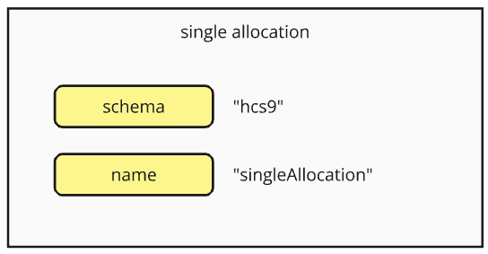
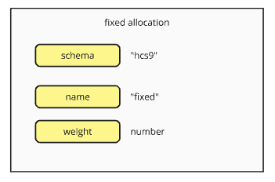
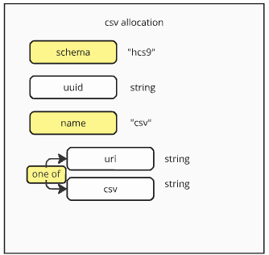
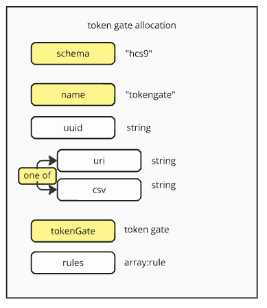

#### [ hcs9 - Poll Metadata Schema ]

This standard implements a number of default modules and rules as a base line set of supported poll voting behaviours.

## Allocations

Allocation modules define the amount of weight that users receive. They work by specifying a range or method of identifying eligible users, as well as the amount of weight that those users receive.

### Default Modules

#### Single Allocation



All users receive one weight.

#### Fixed Allocation



All users received a fixed amount of weight, as specified.

#### CSV Allocation



Users receive weight according to the CSV (comma separated values) data.

CSV data structure is a two column table with accountId and weight as the columns:

```
#uuid,10892339729
accountId,weight
"0.0.12345",5
"0.0.67890",1
```

The following CSV data would allocate 5 weight to account 0.0.12345 and 1 weight to 0.0.67890.

#### Token Gate Allocation



Users receive weight according to the quantity of tokens they hold, per the list of eligible tokens. Each individual token is weighted according to the rules, with the most basic setting being 1 weight per token held. A snapshot of holders of the eligible tokens at a given time to determine the token holdings.

This standard supports a few default [token gate rules](../implementation/token-gate.md).

For practical purposes the snapshot is stored in a CSV file and serves as the final list of eligible accounts and weights. The CSV data is stored in the same format as defined in CSV allocation, and it serves as the final source of truth for the allocation amounts as far as implementation is concerned. Comment lines are prefixed with a '#'. It is recommended that the snapshot date be included in the CSV as a UNIX timestamp.

The CSV has four columns: accountId, tokenId, balance and serials.

-  accountId is a string, which is the account in question

- tokenId is a string, which is a given token that the account holds

- balance is a number, which is the total balance that the account holds of that token 

- serials is a string with comma separated values of all the serials held by that account, if the token is an NFT. This field is blank if the token is not an NFT. 

See the example below, where 0.0.55555 represents and NFT and 0.0.66666 represents an FT. This particular snapshot includes data for both those tokens in the CSV.

```
#snapshotDate: [UNIX Timestamp]
accountId,tokenId,balance,serials
"0.0.12345","0.0.55555",2,"1,12"
"0.0.67890","0.0.66666",5
"0.0.12345","0.0.66666",25
```

See [token gate](./token-gate.md) for more information.

### Rules

Similar to allocation modules, there are several Rules that are supported out of the box. These Rules define behavior that are applied at the end of the calculations for vote permissions and vote weight.

#### allowVoteChanges rule

Setting the allowVoteChanges rule permits users to change their vote. The default behaviour if this rule is not defined is that users cannot change their votes once placed.

```
{
    "name": "allowVoteChanges"
}
```

#### allowMultipleChoice rule

Setting the allowMultipleChoice rule permits users to vote for more than one option. The default behaviour is that users can only vote for one option, even if they have more than 1 vote-weight.

```
{
    "name": "allowMultipleChoice"
}
```

#### singleAllocation rule

Setting the singleAllocation rule means a user will only qualify for one allocation, for polls with multiple allocation-modules. The poll will evaluate each allocation module in the listed order and distribute weight accordingly, but a user can only receive one distribution.

```
{
    "name": "singleAllocation"
}
```