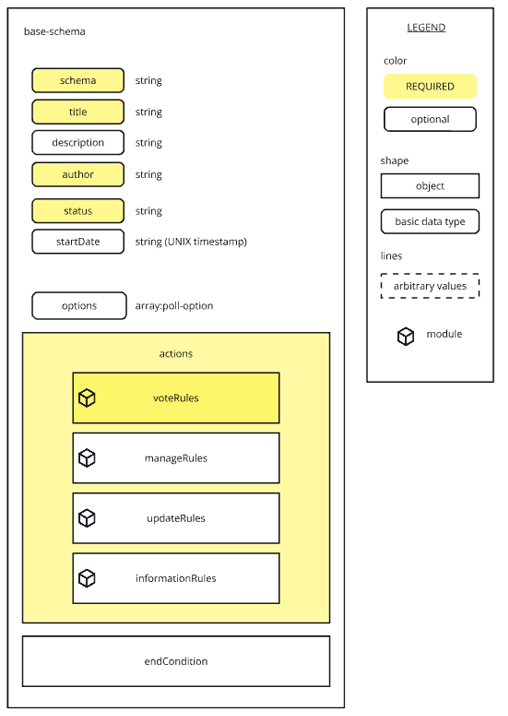

#### [ hcs-9 - Poll Metadata Schema ]

## Base Schema Specification

### Overview

The base schema contains all the data that describes the poll. Broadly speaking it can be broken down into a number of descriptive fields and scope-specific modules. This section goes into detail on each piece.

The definition of the schema as a JSON Schema file is here: [JSON Schema](/assets/schema/base-poll-schema.json)

Below is a summary of each of the fields in the schema:

```
{
  "schema" - Strictly defines the schema. Must be "hcs-9"
  "title" - The title of the poll, the question being asked
  "description" - The description of the poll
  "author" - The author of the poll. For HCS implementations this must be the Hedera account Id of the author
  "status" - The status of the poll. Must be one of several pre-defined states.
  "startDate" - When the poll is scheduled to start
  "options" - An options module, defines the options that are being voted on
  "actions": {
    "voteRules" - A vote-rules module, defines the rules around the vote action
    "manageRules" - A manage-rules module, defines the rules around the manage action
    "updateRules" - A update-rules module, defines the rules around the update action
    "informationRules" - An information-rules module, defines the rules around the information action
  }
  "endConditionRules" - An endConditionRules module, which defines the end condition
}
```



## Fields

### schema

**Tags:** required, case-insensitive

` "schema" : { "type" : "string" }`

The *schema* field defines the schema that is being used. It is any identifiable string about the standard or platform that the data follows. A developer who wishes to implement the schema will use the schema to filter data that they support and process it appropriately.

**Every poll that implements this base schema should define schema as "hcs-9"**

The base schema structure is designed to provide the basic information required to display a poll, even if all the functionality is not supported by a third party. Therefore it is recommended that developers strictly follow the base schema.

### title

**Tags:** required

` "title" : { "type" : "string" }`

The *title* field defines the title of the poll. This is the question that is being asked.

- What is your favourite dessert?
- When should we hold the next meeting?
- Who should be the next guest on the show?

### description

**Tags:** optional

` "description" : { "type" : "string" }`

The *description* field provides more information alongside the title. This can be used by a poll author to provide context to the vote.

- Let's settle the question of who is the king of desserts once and for all!
- The next community meeting is slated for the beginning of next quarter, we would like input on what is the best date and time for the meeting to happen.
- We have a number of guests lined up for our show happening on Friday next week, let us know who you guys want to see!

**Default Behaviour**

When not defined, a platform should not show any description for the poll.

### author

` "author" : { "type" : "string" }`

**Tags:** required

The *author* field is the unique, verifiable identifier for the poll author. This field is used by platforms for validation purposes so should not be user-defined. The server should define this field based on a verified signature (or other similar method) from the user.

In the case of the hcs-8 Standard, the author field is the Hedera account Id used to sign the HCS message, which can be verified on ledger, allowing for trustless identification of the author for the purposes of poll management.

### status

**Tags:** required, case-insensitive

` "status" : { "type" : "string" }`

The *status* field defines the state of the poll at any given time. This standard only recognizes the following states: open, closed, paused, cancelled and inactive.

### startDate

**Tags:** optional

` "startDate" : { "type" : "string" }`

The *startDate* defines the date that the poll is scheduled to start, in UNIX Timestamp format.

The hcs-8 Standard uses HCS messages to manage the state of the poll. For the purposes of the hcs-8 implementation, startDate supercedes the requirement to open a poll via a *manage* operation. Ideally, the platform would automatically post a manage operation to explicitly 'open' the poll at the scheduled start date. However if startDate is set then platforms should recognize that the poll is open even if an explicit call isn't made to open the poll.

Example: 

` "startDate" : "1721597591237" `

evaluates to July 21, 2024 at 9:33:11PM GMT

**Default Behaviour**

When not defined (or if the string is invalid and cannot be converted to a), a platform should show the start date as 'Not Set', 'Undefined' or otherwise indicate that the poll does not have a scheduled start date.


### endConditionRules

**Tags:** optional, module

` "startDate" : { "type" : "string" }`

The *startDate* defines the date that the poll is scheduled to start, in UNIX Timestamp format.


## options

The options field is an array of options modules, which define the options that users vote on for the poll. 

` "options" : { "type": "array", "items": { "$ref": "poll-option" } }`

The poll-option module is described in the following section.


## Actions

There are five actions supported in hcs-9: Register, Vote, Manage, Update and Information. 

The register action establishes the poll by via the base schema, while the remaining four actions are defined in "actions".

The data in each of the four modules describe how apps that implement the poll should behave.

| module | Description |
|---|---|
| vote-rules | Defines all the rules around the vote action. This includes how much weight users have to place on votes, who is allowed to vote, and other rules. |
| manage-rules | Defines the rules around the manage action which changes the status of the poll, and who is allowed to use it |
| update-rules | Defines the rules around the update action which updates the poll settings, and who is allowed to use it |
| information-rules | Defines the rules around the information action which act as informational messages during and after the poll, and who is allowed to use it |

The following sections will describe the scope and structure of each of the modules. 
