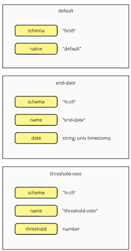

title: end-condition-rules module
sidebar_position: 9
---


#### [ hcs-9 - Poll Metadata Schema ]

The end-condition-rules module defines the rules around how the poll end is determined. 

```
{
    "schema" - the schema that defines the structure of this module
    "rules" - an array of rules that govern the update action
}
```


The JSON Schema file can be found on here: [update-rules.json](/assets/schema/update-rules.json)

## Fields

### schema

**Tags:** required, case-insensitive

` "schema" : { "type" : "string" }`

The *schema* field defines the schema that is being used. It is any identifiable string about the standard or platform that the data follows. A developer who wishes to implement the schema will use the schema to filter data that they support and process it appropriately.

For the hcs-9 standard, the schema is defined as hcs-9-update-rules. 

### rules

**Tags:** optional

Rules is an array of [rules](./rules.md) that define additional behaviours. 

Available rules defined by this standard:

default - The poll only closes when the manage action changes the status to close

end-date - The poll will automatically close at the specified date
- date: string, unix date

threshold-votes - The poll will automatically close when the specified threshold is met.
- threshold: number, when a successful vote actions causes the total votes on the poll to meet or exceed this number of votes the poll is automatically closed.



***Default Behaviour***

If rules is not defined then the poll can only end if a Manage action changes the poll status to Closed.
