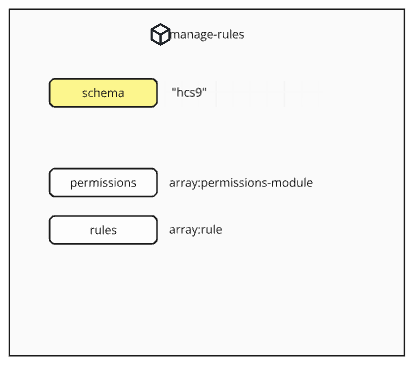

#### [ hcs-9 - Poll Metadata Schema ]

The manage-rules module defines the rules around the manage action. The [manage action](../../hcs-8/operations.md) is defined under hcs-8.

If no manage-rules module is included in a poll, the default behaviour is only the author accountId is allowed to manage the poll (Which allows the author to Open, Close, Cancel, and Pause the poll).

```
{
    "schema" - the schema that defines the structure of this module
    "permissions" - array of permissions-module which defines who is allowed to use the manage action
    "rules" - an array of rules that govern the manage action
}
```



The JSON Schema file can be found on here: [manage-rules.json](/assets/schema/manage-rules.json)

## Fields

### schema

**Tags:** required, case-insensitive

` "schema" : { "type" : "string" }`

The *schema* field defines the schema that is being used. It is any identifiable string about the standard or platform that the data follows. A developer who wishes to implement the schema will use the schema to filter data that they support and process it appropriately.

For the hcs-9 standard, the schema is defined as hcs-9.

### permissions

**Tags:** optional, module

Permissions is an array of modules that define who is allowed to perform the manage action.

Permissions are used for this purpose for every action. This specification implements a number of default permission modules. This is covered in more detail on the [Permissions](./permissions.md) page.

**Default Behaviour**

If permissions is not defined, no user is allowed to manage.

### rules

**Tags:** optional

Rules is an array of [rules](./rules.md) that define additional behaviours. 

No rules have been defined in the default implementation of hcs-9.
