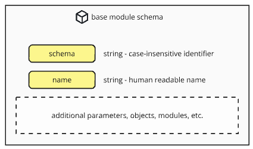

#### [ hcs-9 - Poll Metadata Schema ]

Modules are the modular objects which hold data that define the attributes and behaviours of the poll. Every component in the base schema that describes complex behaviour is represented by a module.

There are only two fields in the module schema:

```
{
    "schema" - a string that serves as the unique identifier for code purposes. 
    "name" - a friendly human-readable name.
}
```




The definition of the schema as a JSON Schema file is here: [Base Module Schema](../../../assets/schema/base-module.json)

## Fields

#### schema

**Tags:** required, case-insensitive

A string that serves as the unique identifier for code purposes. 

For the 'default' modules that are defined in the hcs-9 specification, the names are prefixed with "hcs-9-" as a convention. Other projects may choose to name their modules as they see fit.

#### name

**Tags:** optional

A string that serves as a friendly human-readable name. This field is optional and useful in modules which may be listed for users on the front end, such as modules that define rules.

## Usage

Modules are used to provide robust and flexible behaviour for projects to implement polls according to their needs.

When a poll implements the hcs-9 standard using the included modules, any site that implements the hcs-9 standard will be able to provide their users with the full features of viewing, voting and managing that poll.

When a poll implements a different schema for one of the modules, an app that does not support the schema should recognize the unsupported module and adjust its behaviour appropriately. For example, if a poll has a custom vote-rules module, the app won't be able to determine what an eligible vote looks like, and therefore should not display the vote button. 

If one day the app implements the schema used in that poll (say, another standard that gains popularity), it will be able to provide that functionality for its users.

The standard is designed so that even if every module in the poll is a custom, unsupported schema, a hcs-9 compliant site will be able to display the minimum important information in the poll: The title, the options and the status.

If the poll has a submit key (so that every vote action is assumed to be valid), or if the vote-rules schema used by the poll is supported by the app, then the poll will also be able to display the total votes on each option as well.

### options-module

While nearly all the modules in the hcs-9 standard can be swapped out for project-defined modules, note that to preserve minimum functionality, substitutions for the options-module must also meet the base requirements as laid out in the [options-module section](option-module.md).