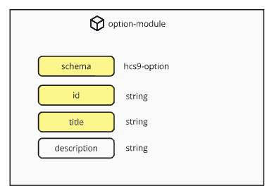

#### [ hcs-9 - Poll Metadata Schema ]

The option-module defines the options on the poll that users can vote for.

```
{
    "schema" - the schema that defines the structure of this module
    "id" - the unique numerical id of the option
    "title" - the title of the option
    "description" - the description of the option
}
```



The JSON Schema file can be found on here: [option-module.json](/assets/schema/option-module.json)

## Fields

### schema

**Tags:** required, case-insensitive

` "schema" : { "type" : "string" }`

The *schema* field defines the schema that is being used. It is any identifiable string about the standard or platform that the data follows. A developer who wishes to implement the schema will use the schema to filter data that they support and process it appropriately.

poll-option modules that follow the exact structure above should use "hcs-9" as the value for schema.

### id

**Tags:** required, unique

The *id* field is a unique number used to specify the specific option, for example in a vote action. It is recommended that the id be used as if it were the index of an array, with the first defined option being assigned '0', and following options incrementing from there.

### title

**Tags:** required

The *title* field is a string that is the main definition of the option being voted on. It is one of the answers to the question posed by the poll.

It is intentional that titles are not strictly required by the schema to be unique, though practically speaking a poll author would likely want them to be unique in most cases.

### description

**Tags:** optional

The *description* field is a string that adds context or describes the option further.

**Default Behaviour**

When not defined, a platform should not show any description for the option.

## Simple Example

A poll with the title: "What is your favourite colour?" might have three options:

| id | title | description |
|---|---|---|
| 0 | red | the colour of fire |
| 1 | blue | the colour of water |
| 1 | green | the colour of grass |

The options array that contains these poll-option modules would look like:

```
"options":[
    {
        "schema":"hcs-9",
        "id":0,
        "title":"red",
        "description":"the colour of fire"
    },
    {
        "schema":"hcs-9",
        "id":1,
        "title":"blue",
        "description":"the colour of water"
    },
    {
        "schema":"hcs-9",
        "id":2,
        "title":"green",
        "description":"the colour of grass"
    }
],
```

## Extension

The option module *can* be extended to add additional parameters and functionality. However note that the required fields of schema, id and title MUST be defined in any new schema.

This is required in order to preserve the basic ability for any hcs-9 compliant app to view and display the status of an hcs-9 poll.
