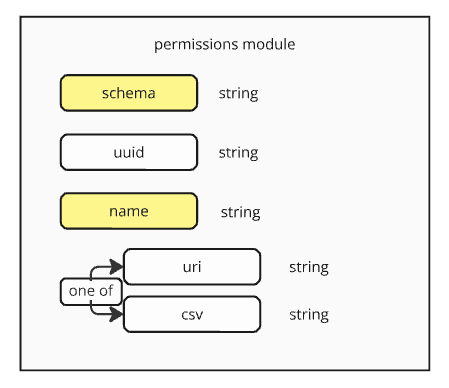
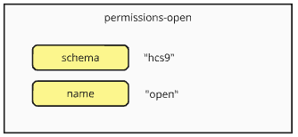
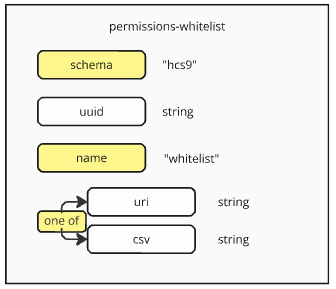
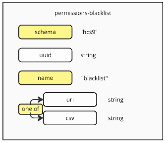
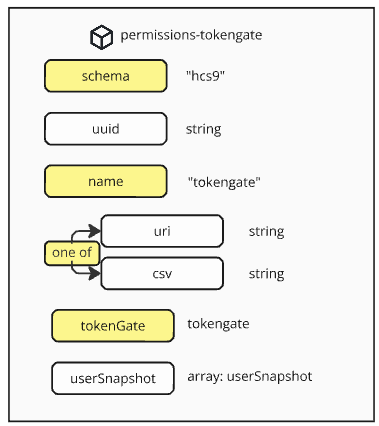

#### [ hcs-9 - Poll Metadata Schema ]

Permissions define lists of users that groups them into categories for use by the poll. This list can be used in different ways - defining which users can vote on a poll, which users can manage a poll, which users get more weight for voting, etc.

```
{
    "schema" - The schema that defines the structure of this module
    "uuid" - The unique identifier for this module
    "name" - The name of the module
    "uri" - the link to the account list, if applicable.
    "csv" - the comma separated account list string, if applicable.
}
```



## Fields

### schema

**Tags:** required, case-insensitive

` "schema" : { "type" : "string" }`

The *schema* field defines the schema that is being used. It is any identifiable string about the standard or platform that the data follows. A developer who wishes to implement the schema will use the schema to filter data that they support and process it appropriately.

For permissions that follow the hcs-9 standard, the schema is defined as hcs-9

### uuid

**Tags:** optional

` "uuid" : { "type" : "string" }`

uuid is the unique identifier that is used to refer to the specific permissions module in the data. For permissions that provide a list of accounts such as csv's or tokengates, the uuid can be included in the list metadata to associate the data with the permissions.

This field is required if the *uri* field is defined.

**Default Behaviour**

None

### name

**Tags:** required

The *name* field is a string that defines the module. It is used to determine what kind of behaviour and data the module provides.

### uri

**Tags:** optional

The *uri* field is a link to the account list data, if applicable. The uri follows the formatting guide laid out in the [formatting guide](../formatting-guide.md).

If *uri* is defined, then *uuid* must also be defined. Also if *uri* is defined, *csv* cannot be defined.

**Default Behaviour**

None

### csv

**Tags:** optional

The *csv* field is the account list data, if applicable. The csv follows the formatting guide laid out in the [formatting guide](../formatting-guide.md).

If *csv* is defined, *uri* cannot be defined.

**Default Behaviour**

None

## Hierarchy of Permissions

Multiple permission modules can be defined for rulesets, allowing for complex behaviour for poll authors to construct their polls exactly how they wish.

When a user is evaluated against a set of permissions, the end result is a 'true' or 'false' boolean of whether or not the user is permitted. The user is evaluated against every permission module, which can set one of four states. From lowest to highest priority they are:

1. Default not permitted
2. Default permitted
3. Permitted
4. Not Permitted

By default every user is 'Default not permitted'. Each permission module sets the user's state, with higher priority states overriding lower priority states.

Once a user has been evaluated across all modules, the highest priority state determines the end result.

## Pre-Defined Modules

hcs-9 defines the following default permissions modules:

1. Open
2. Whitelist
3. Blacklist
4. Token Gate

### Open



This is the simplest permissions scheme and also typically the default permissions scheme if no permissions are specified.

The open scheme sets every user's state to 'Default permitted'.

### Whitelist



The whitelist permissions schema provides a list of accounts that are explicitly allowed to participate. Every account on the list is set to 'Permitted'.

This is done in csv format, which can be provided as a string or linked to with a uri. If a uri is specified, then a uuid must also be provided.

See the [formatting guide](../formatting-guide.md) for more details.


### Blacklist



The blacklist permissions schema provides a list of accounts that are explicitly not allowed to participate. Every account on the list is set to 'Not Permitted'.

This is done in csv format, which can be provided as a string or linked to with a uri. If a uri is specified, then a uuid must also be provided.

See the [formatting guide](../formatting-guide.md) for more details.


### Tokengate



The tokengate permissions schema provides rules for determining if users are allowed to participate based on the tokens held in their account at the time of a snapshot. Every account that is listed in a tokengate snapshot is 'Permitted'.

The tokenGate field contains the rules information, indicating which tokens fall into the tokengate, and what time the snapshot is taken. 