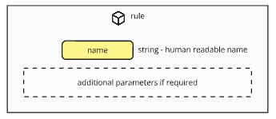

#### [ hcs-9 - Poll Metadata Schema ]

Rules are the simplest building block of the hcs-9 standard. They are used to toggle or specify specific functionality.


```
{
    "name" - A single word identifier for the rule
}
```




The definition of the schema as a JSON Schema file is here: [Rule Schema](/assets/schema/rule.json)

## Fields

#### name

**Tags:** required, case-insensitive

A string that serves as the unique identifier for code purposes, but also should be a human readable name that describes the rule. By convention this should be lowerCamelCase.

Example: allowMultipleVotes, allowVoteChanges

## Usage

A rule at its most basic level is a toggle that directs the behaviour of the poll.

An example of a rule is 'allowMultipleVotes', which is included as one of the supported rules in the hcs-9 specification for voting rules. allowMultipleVotes signals to the poll that users are allowed to vote on multiple options.

The reason why rules are objects and not just strings is to allow for parameters to be passed in with a rule. An example might be an extension of allowMultipleVotes, allowLimitedMultipleVotes, that would allow a user to vote on up to two different options:

```
{
    "name": "allowLimitedMultipleVotes",
    "limit": 2
}
```

In practice a platform must recognize and support all the rules specified in a module. If any rules are unrecognized, the platform should assume it cannot enforce all the rules required and disable any functionality related to the set of rules as a whole.
