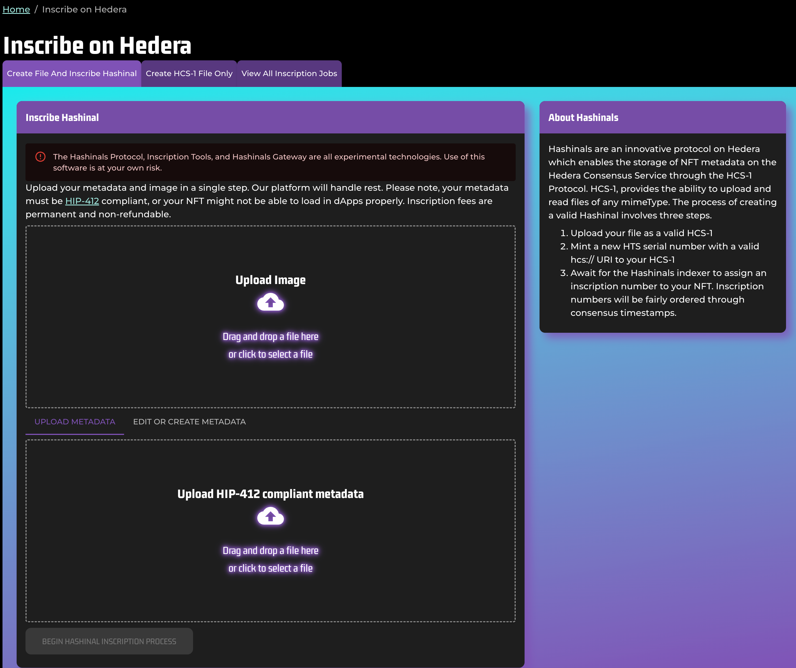
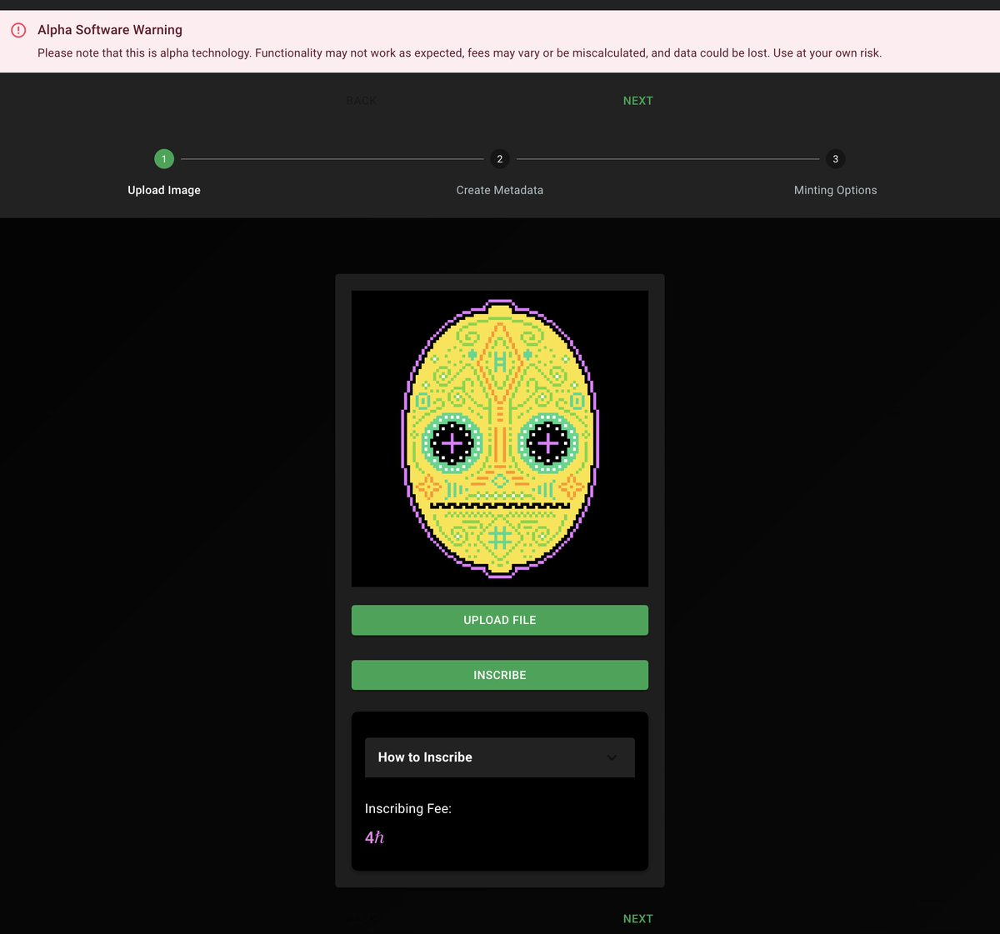
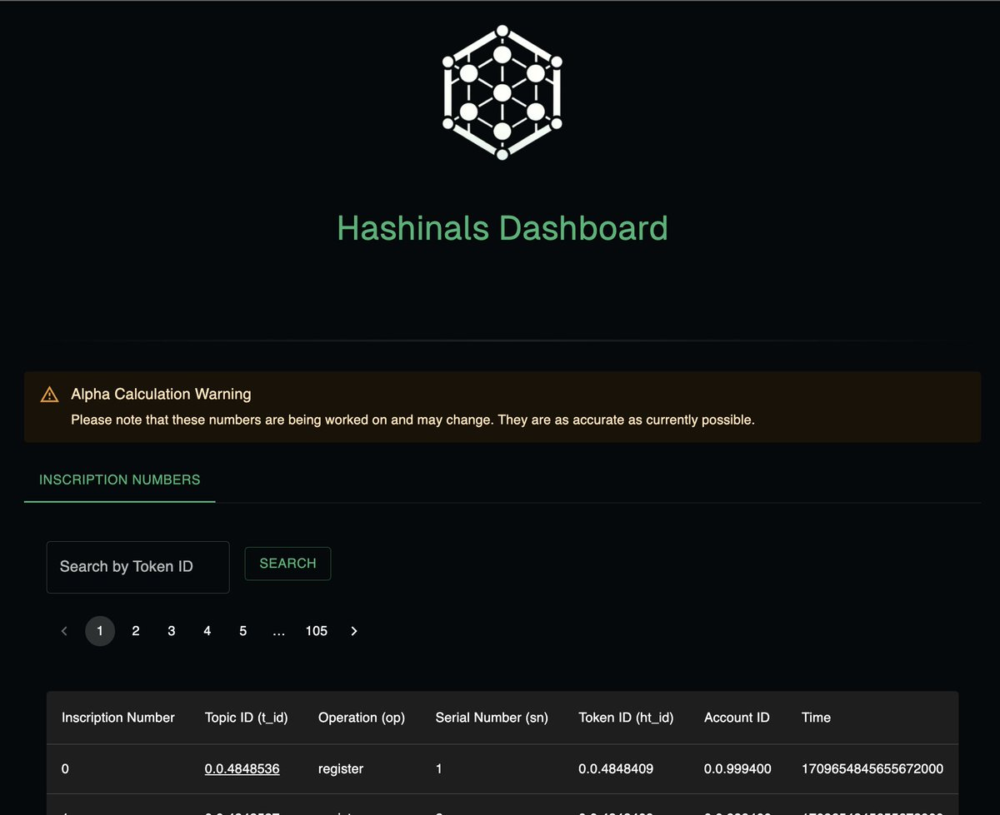
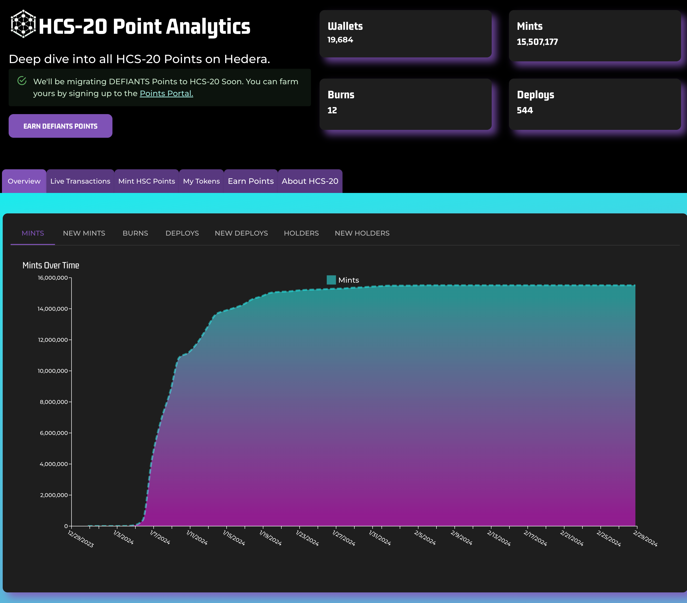

# Tooling

Welcome to the HCS Community Tools page! Here, we showcase innovative tools developed by the community for enhancing your experience with various HCS Protocols. These tools offer a range of functionalities from analytics to API support, designed to enrich your interaction with HCS.

## Tools List

### Tierbot Inscription Tools

- **Description:** A web interface to easily inscribe valid HCS-1 Files and Hashinals on Hedera.
- **Link:** [https://tier.bot/inscribe]()
- **Highlight:** [https://twitter.com/TierBotAI/status/1766626142499606801]()

### Turtlemoon Inscription Tools

- **Description:** A downloadable client to easily inscribe valid HCS-1 Files and Hashinals on Hedera.
- **Link:** [https://patches-1.gitbook.io/hcs-20-auditable-points/download]()
- **Highlight:** [https://twitter.com/TurtleMoonCC/status/1766658087367131627]()

### Hashinals Inscription Portal

- **Description:** A web interface to easily find inscription numbers.
- **Link:** [https://www.hashinals.com]()
- **Highlight:** [https://twitter.com/TurtleMoonCC/status/1766901983204483241]()

### Tierbot Analytics

- **Description:** Advanced analytics for HCS20. Explore balances, transactions, holder number amounts, and more.
- **Link:** [https://tier.bot/advanced-analytics/hedera/hcs20?tab=overview]()
- **Highlight:** [https://twitter.com/Kantorcodes/status/1743629782485536776]()

### TrustEnterprise API

- **Description:** An API for HCS20 inscriptions, offering a robust way to interact with HCS20 on Hedera.
- **Link:** [https://github.com/trustenterprises/core-api/pull/50]()
- **Highlight:** [https://twitter.com/flyinggazelle/status/1743679926207697291]()

These tools represent the vibrant creativity and dedication of our community. Dive in and explore the potential of HCS20 through these innovative applications!