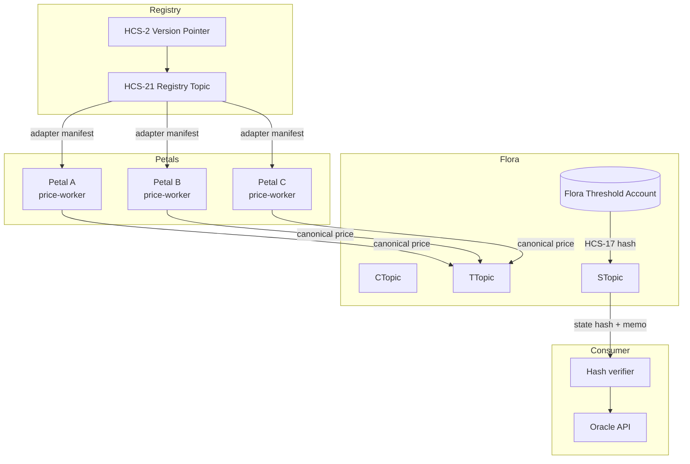

> **Prerequisites:** You completed [Floras · Part 1](./floras.md) and have:
> - A Flora account with `ctopic`, `ttopic`, `stopic`.
> - At least three Petals (HCS‑15) with funded accounts + HCS‑11 profiles.
> - A published `flora.yaml` pointing to the adapter set.

This part stitches everything together by implementing a price oracle similar to `/flora-example`:

1. Author a price-feed adapter manifest.
2. Register it via HCS‑21.
3. Run Petal workers that fetch prices, emit canonical records, and sign ledger challenges.
4. Publish HCS‑17 state hashes each round.
5. Expose a consumer view that reconstructs prices from the state topic.

All snippets rely on the public SDK entrypoints (`@hol-org/standards-sdk`)—no `dist/…` imports.

### Architecture overview



Keep this flow handy while you build; each section below maps to one of these arrows.

> **Pointer recap:** Registry-of-registries entries point to the HCS-2 **version pointer** topic, which only stores the latest HCS-21 registry topic ID. Resolve it before querying/publishing declarations so rotations are transparent.

---

## 1. Price-feed adapter manifest

Create `price-feed-adapter.yml` describing data sources and capabilities:

```yaml
meta:
  spec_version: '1.0'
  adapter_version: '0.5.0'
  generated: 2025-02-25T18:11:00Z
adapter:
  id: npm/@hol-org/flora-price-adapter@0.5.0
  name: Flora Price Adapter
  maintainers:
    - name: Hashgraph Online
      contact: ops@hashgraph.online
  license: Apache-2.0
package:
  registry: npm
  artifacts:
    - url: npm://@hol-org/flora-price-adapter@0.5.0
      digest: sha384-demo-price-digest
runtime:
  platforms: ['node>=20.10.0']
  primary: node
  entry: dist/index.js
capabilities:
  discovery: false
  communication: true
  communication_channels: ['price-feed', 'x402']
  protocols: ['flora-price@1']
  extras:
    sources:
      - coingecko
      - binance
      - kraken
    asset_pairs:
      - HBAR/USD
      - BTC/USD
consensus:
  entity_schema: hcs-21.price-feed@1
  required_fields:
    - asset
    - price
    - timestamp
    - source
  hashing: sha384
```

The `protocols` and `extras.sources` fields let dashboards filter adapters by supported markets.

> **Spec reference:** `capabilities.discovery`, `capabilities.communication_channels`, and `capabilities.extras` map directly to the schema defined in `/docs/standards/hcs-21.md`. Staying within those field names ensures downstream tooling (registry broker UI, CLI) can surface filters correctly.

---

## 2. Inscribe and declare (HCS‑21)

```ts
import fs from 'node:fs';
import yaml from 'js-yaml';
import { HCS21Client } from '@hol-org/standards-sdk';

const hcs21 = new HCS21Client({
  network: process.env.HEDERA_NETWORK || 'testnet',
  operatorId: process.env.HEDERA_OPERATOR_ID!,
  operatorKey: process.env.HEDERA_OPERATOR_KEY!,
});

async function publishPriceAdapter() {
  const doc = yaml.load(
    fs.readFileSync('price-feed-adapter.yml', 'utf8'),
  ) as object;

  const manifestPointer = await hcs21.inscribeMetadata({
    document: doc,
    fileName: 'price-feed-adapter.yml',
  });

  await hcs21.publishDeclaration({
    topicId: process.env.HCS21_REGISTRY_TOPIC_ID!,
    declaration: {
      op: 'register',
      adapterId: 'npm/@hol-org/flora-price-adapter@0.5.0',
      entity: 'price_feed',
      adapterPackage: {
        registry: 'npm',
        name: '@hol-org/flora-price-adapter',
        version: '0.5.0',
        integrity: 'sha384-demo-price-digest',
      },
      manifest: manifestPointer.pointer,
      manifestSequence: manifestPointer.manifestSequence,
      flora: {
        account: process.env.FLORA_ACCOUNT_ID!,
        threshold: '2-of-3',
        ctopic: process.env.FLORA_TOPIC_COMMUNICATION!,
        ttopic: process.env.FLORA_TOPIC_TRANSACTION!,
        stopic: process.env.FLORA_TOPIC_STATE!,
      },
      stateModel: 'hcs-21.price-feed@1',
    },
  });

  console.log('Published price-feed adapter declaration');
}

publishPriceAdapter().catch(console.error);
```

Petals now know which adapter version to run.

---

## 3. Petal worker (price fetch + canonicalization)

Each Petal runs a worker that:

1. Fetches sources (Coingecko, Binance, etc.).
2. Canonicalizes the payload.
3. Posts the record to the Flora transaction topic (`ttopic`).

```ts
import axios from 'axios';
import { TopicMessageSubmitTransaction } from '@hashgraph/sdk';
import { createPetalClient } from './petal-client'; // from Petals tutorial

function canonicalPrice({
  asset,
  price,
  source,
}: {
  asset: string;
  price: number;
  source: string;
}) {
  return JSON.stringify({
    asset,
    price,
    source,
    timestamp: new Date().toISOString(),
  });
}

async function fetchPrice(asset: string) {
  const [coingecko, binance] = await Promise.all([
    axios.get(
      `https://api.coingecko.com/api/v3/simple/price?ids=hedera-hashgraph&vs_currencies=${asset}`,
    ),
    axios.get(
      `https://api.binance.com/api/v3/ticker/price?symbol=HBAR${asset}`,
    ),
  ]);
  return [
    canonicalPrice({
      asset: `HBAR/${asset}`,
      price: coingecko.data['hedera-hashgraph'][asset.toLowerCase()],
      source: 'coingecko',
    }),
    canonicalPrice({
      asset: `HBAR/${asset}`,
      price: Number(binance.data.price),
      source: 'binance',
    }),
  ];
}

export async function submitPrices(asset = 'USD') {
  const { client } = createPetalClient();
  const messages = await fetchPrice(asset);

  for (const message of messages) {
    const tx = await new TopicMessageSubmitTransaction()
      .setTopicId(process.env.FLORA_TOPIC_TRANSACTION!)
      .setMessage(message)
      .execute(client);
    await tx.getReceipt(client);
  }
}
```

Run this worker on each Petal (cron, serverless, etc.). The payload format matches the manifest’s `required_fields`.

To avoid double counting:

1. Store the `consensusTimestamp` returned from `TopicMessageSubmitTransaction` in a local DB.
2. When the Flora controller reads the transaction topic, it should only include messages within the current epoch window (e.g., last minute) and ignore anything already processed.
3. Consider writing the raw payload + timestamp to an off-chain database (e.g., Postgres) so auditors can reproduce median calculations later.

---

## 4. Compute + publish HCS‑17 hashes per round

After collecting a batch (e.g., each minute), run `HCS17Client.computeAndPublish` from the Flora controller or a designated Petal leader:

```ts
import { HCS17Client } from '@hol-org/standards-sdk';

const hcs17 = new HCS17Client({
  network: process.env.HEDERA_NETWORK || 'testnet',
  operatorId: process.env.FLORA_ACCOUNT_ID!,
  operatorKey: process.env.FLORA_PRIVATE_KEY!, // threshold key
});

async function finalizeRound(records: string[]) {
  const { stateHash } = await hcs17.computeAndPublish({
    accountId: process.env.FLORA_ACCOUNT_ID!,
    accountPublicKey: process.env.FLORA_PUBLIC_KEY!,
    topics: [
      process.env.FLORA_TOPIC_COMMUNICATION!,
      process.env.FLORA_TOPIC_TRANSACTION!,
      process.env.FLORA_TOPIC_STATE!,
    ],
    publishTopicId: process.env.FLORA_TOPIC_STATE!,
    memo: `price-oracle:${Date.now()}`,
  });

  console.log('Published round hash:', stateHash);
}
```

This ensures downstream consumers can verify rounds without replaying every message.

---

## 5. Consumer service (reconstruct prices)

A public API or oracle service subscribes to the state topic, replays the referenced messages, and returns an aggregated price. Skeleton:

```ts
import { TopicMessageQuery } from '@hashgraph/sdk';
import { HCS17BaseClient } from '@hol-org/standards-sdk';

const hcs17Base = new HCS17BaseClient({
  network: process.env.HEDERA_NETWORK || 'testnet',
});

async function watchStateTopic() {
  new TopicMessageQuery()
    .setTopicId(process.env.FLORA_TOPIC_STATE!)
    .subscribe(hcs17Base.client, message => {
      const payload = JSON.parse(message.contents?.toString() || '{}');
      // verify payload.state_hash via calculateAccountStateHash
      // then resolve referenced transaction messages to rebuild median price
      console.log('New round', payload.state_hash);
    });
}
```

In `/flora-example`, this consumer computes the median price per asset and exposes an HTTP endpoint.

Implementation tips:

- After verifying the hash, use `TopicMessageQuery` on `ttopic` with a `startTime` equal to the previous round’s timestamp to replay only the messages that contributed to this round.
- Store the reconstructed round as `{ epoch, asset, median, sources[] }` so downstream smart contracts have structured data.
- Expose a REST endpoint (`GET /prices/HBAR-USD`) that reads the most recent verified round, not raw Petal messages.

---

## 6. Putting it all together

1. **Petals** run the worker above, pulling prices and submitting canonical records.
2. **Flora controller** batches rounds, publishes HCS‑17 hashes, and stores round metadata (epoch, price median, etc.).
3. **Consumers** subscribe to the state topic, verify hashes, and serve price data to applications or smart contracts.

### Suggested schedule

| Minute | Action                                 |
| ------ | -------------------------------------- |
| 00:00  | Petals fetch prices, post to `ttopic`. |
| 00:05  | Controller reads all messages for the round, computes median per asset. |
| 00:06  | Controller publishes HCS‑17 hash + summary memo. |
| 00:07  | Consumers fetch summary, verify hash, expose API. |

---

## 7. Reference implementation

Review `/flora-example` in this repo for a full CLI demo:

- `pnpm run flora:create` — sets up Petals, Flora, topics.
- `pnpm run flora:prices` — runs the Petal workers.
- `pnpm run flora:finalize` — computes HCS‑17 hashes and publishes oracle rounds.
- `pnpm run flora:api` — serves the verified prices.

Use that sample as a blueprint but swap in your own adapter manifest, price sources, and aggregation logic.

You now have a Flora-driven price oracle secured by HCS‑15/16/17/21. Extend it with additional adapters (DEX prices, TWAP feeds) or integrate downstream smart contracts that consume the hashed rounds.

---

## Observability & testing

| Tool | Command | Purpose |
| ---- | ------- | ------- |
| Demo runner | `pnpm tsx flora-example/scripts/run-all.ts` | Spins up the entire stack locally (Petals, Flora, API). |
| Topic inspector | `pnpm dlx hedera-cli topic:messages --topic $FLORA_TOPIC_STATE --limit 10` | Inspect state hashes and memos. |
| Petal logger | `pnpm tsx scripts/tail-petal.ts --petal A` | Streams adapter output + ledger challenge events for a single Petal. |
| Integration tests | `pnpm test --testPathPattern=flora-example` | Runs the snapshot tests that assert deterministic price medians. |

Monitoring suggestions:

- Emit structured logs (`{ asset, price, source, consensusTimestamp }`) from each Petal worker and ship them to your logging backend.
- Alert if no HCS-17 state hash is published for more than `2 * roundInterval`.
- Alert if the median price diverges from a reference oracle by more than X%.
