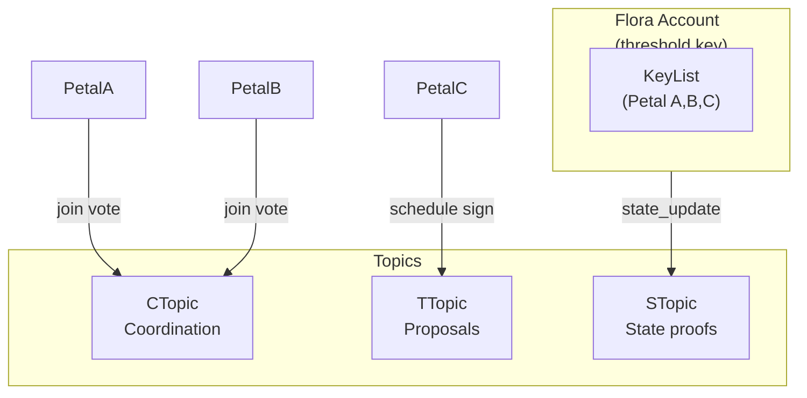

This is part 2 of the Petals/Floras journey. We start where the Petals tutorial ended—multiple Petal accounts already exist—and wire them into a Flora that will power a price oracle (see `/flora-example` in the repo for the full implementation).

---

## 0. Understand HCS-16

HCS-16 extends the HCS-15 Petal world into cooperative formations. Each Flora is:

- A Hedera account with a **threshold KeyList** (e.g., 2-of-3 Petal keys).
- Three topics with predictable memos (`hcs-16:<floraId>:communication|transaction|state`).
- A message schema for join requests, votes, accepted events, and policy updates.

| Component | Purpose | SDK helper |
| --------- | ------- | ---------- |
| Threshold account | Holds shared balance and signs schedules | `buildHcs16CreateAccountTx` |
| Communication topic | Control plane (join requests/votes, policy events) | `buildHcs16CreateFloraTopicTx` (`type=communication`) |
| Transaction topic | Schedules Petal votes or queued transactions | same helper (`type=transaction`) |
| State topic | Receives HCS-17 state updates | same helper (`type=state`) |



Everything in this tutorial uses the public `HCS16Client`, which wraps the transaction builders shown above.

---

## 1. Environment & inputs

```
HEDERA_NETWORK=testnet
HEDERA_OPERATOR_ID=0.0.6001         # coordinator/funder
HEDERA_OPERATOR_KEY=302e02...

# existing Petal accounts
PETAL_A=0.0.7001
PETAL_B=0.0.7002
PETAL_C=0.0.7003
```

Install deps:

```bash
pnpm add @hol-org/standards-sdk @hashgraph/sdk js-yaml
```

---

## 2. Assemble the Flora key list

```ts
// src/flora/create.ts
import { HCS16Client } from '@hol-org/standards-sdk';

const hcs16 = new HCS16Client({
  network: process.env.HEDERA_NETWORK || 'testnet',
  operatorId: process.env.HEDERA_OPERATOR_ID!,
  operatorKey: process.env.HEDERA_OPERATOR_KEY!,
});

const members = [process.env.PETAL_A!, process.env.PETAL_B!, process.env.PETAL_C!];

async function assembleKeyList() {
  const keyList = await hcs16.assembleKeyList({
    members,
    threshold: 2, // 2-of-3 Flora
  });
  return keyList;
}
```

`assembleKeyList` uses the mirror node to load each Petal’s public key.

---

## 3. Create the Flora account + topics

```ts
async function createFlora() {
  const { floraAccountId, topics } =
    await hcs16.createFloraAccountWithTopics({
      members,
      threshold: 2,
      initialBalanceHbar: 5,
    });

  console.log('Flora account:', floraAccountId);
  console.log('Topics:', topics);
  return { floraAccountId, topics };
}

createFlora().catch(console.error);
```

This helper internally:

1. Creates a threshold KeyList (members + threshold).
2. Creates the Flora account (calls `buildHcs16CreateAccountTx`).
3. Calls `buildHcs16CreateFloraTopicTx` three times for the communication, transaction, and state topics (`hcs-16:<floraId>:<type>` memo).

To inspect the result:

```bash
pnpm dlx hedera-cli account:info --account <floraAccountId>
pnpm dlx hedera-cli topic:info --topic <ctopic>
```

---

## 4. Accept Petal join requests (HCS-16)

Each Petal should submit a `flora_join_request` to the communication topic. When enough members vote, finalize with `buildHcs16FloraJoinAcceptedTx`. The SDK exposes helpers for building the join request, vote, and acceptance transactions. Typical flow:

1. Petal D sends `flora_join_request`.
2. Existing members post `flora_join_vote`.
3. Coordinator posts `flora_join_accepted`, which the SDK builds via `buildHcs16FloraJoinAcceptedTx`.

Refer to `demo/hcs-16/flora-e2e-demo.ts` for an end-to-end script.


## 5. Publish `flora.yaml`

`flora.yaml` describes your adapter set and the C/T/S topics. Generate it programmatically:

```ts
import yaml from 'js-yaml';
import fs from 'node:fs';

function writeFloraConfig(floraAccountId: string, topics) {
  const doc = {
    flora: {
      account: floraAccountId,
      threshold: '2-of-3',
      ctopic: topics.communication,
      ttopic: topics.transaction,
      stopic: topics.state,
    },
    adapters: [
      {
        adapter_id: 'npm/@hol-org/example-adapter@1.3.2',
        required: true,
        version_range: '^1.3.0',
      },
    ],
  };
  fs.writeFileSync('flora.yaml', yaml.dump(doc));
}
```

### Publish via HCS-1

```ts
import { inscribeMetadata } from '@hol-org/standards-sdk';

async function publishFloraConfig() {
  const buffer = fs.readFileSync('flora.yaml');
  const inscription = await inscribeMetadata(
    {
      type: 'buffer',
      buffer,
      fileName: 'flora.yaml',
      mimeType: 'text/yaml',
    },
    {
      accountId: process.env.HEDERA_OPERATOR_ID!,
      privateKey: process.env.HEDERA_OPERATOR_KEY!,
      network: process.env.HEDERA_NETWORK || 'testnet',
    },
    { waitForConfirmation: true },
  );
  console.log('flora.yaml pointer:', inscription.pointer);
  return inscription.pointer;
}
```

Include this pointer in:

- HCS-11 Flora profile (`flora.config.uri`)
- HCS-21 declarations (`config.appnet_manifest`)
- Onboarding docs for Petals

---

## 6. Wire Floras + Petals + Adapters

1. **Petals** create accounts (HCS-15) and publish HCS-11 profiles.
2. **Flora** (this tutorial) assembles key list, account, topics, and config.
3. **Adapters** are registered via HCS-21 and referenced from `flora.yaml`.
4. **State proofs** (HCS-17) hash the adapter results and publish to `stopic`.

Once all pieces are in place, any Petal can verify:

- Topic IDs and threshold from `flora.yaml`.
- Adapter manifests from HCS-21.
- State hashes from HCS-17.

---

## 7. Build the price oracle (next step)

With the Flora skeleton in place, continue with **Part 2: Flora Price Oracle** (next tutorial) or jump straight into the `/flora-example` price-oracle demo bundled in this repo. That sample:

1. Registers a price-feed adapter via HCS-21.
2. Has each Petal fetch a price source (Coingecko, Binance, etc.), canonicalize the payload, and submit it to the Flora.
3. Uses HCS-17 to hash each round’s results on the state topic.
4. Publishes an aggregated “price oracle” view that downstream consumers can query.

Use this tutorial’s output (`flora.yaml`, topic IDs, member list) as the foundation for that example. Then head to **Part 2** to wire adapters, publish prices via HCS-21, and hash them with HCS-17.

---

## 8. Validation checklist

- [ ] All Petal account IDs listed in `members`.
- [ ] `threshold` matches the KeyList (e.g., 2-of-3).
- [ ] Flora account memo or description references HCS-16.
- [ ] Communication/transaction/state topics exist with the correct memos.
- [ ] `flora.yaml` stored in an immutable location (HCS-1/IPFS/HTTPS) and linked in HCS-11 + HCS-21.

**CLI smoke tests**

| Command | Purpose |
| ------- | ------- |
| `pnpm tsx demo/hcs-16/flora-e2e-demo.ts` | Runs the entire workflow end-to-end (Petals → Flora → join votes). |
| `pnpm dlx hedera-cli topic:messages --topic <ctopic> --limit 5` | Inspect coordination events. |
| `pnpm tsx demo/hcs-17/state-hash-demo.ts` | Publishes a mock state hash to ensure `stopic` accepts messages. |
