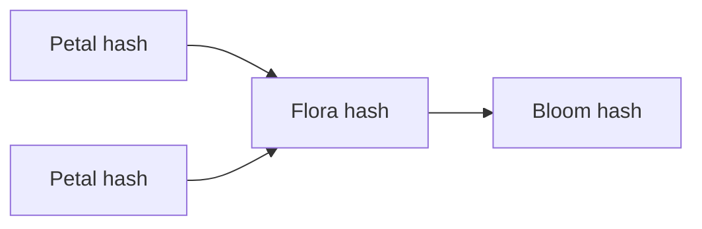

HCS-17 provides deterministic state hashes so Floras can prove what data every Petal agreed on. This tutorial shows how to:

1. Create a dedicated state topic.
2. Canonicalize adapter outputs.
3. Compute + publish the state hash with `HCS17Client`.
4. Verify hashes from the mirror node.

---

## HCS-17 spec primer

- Hashes are SHA-384 strings (96 hex chars) over canonicalized payloads.
- You can hash a **single account** (Petal or Flora) or compose multiple hashes into higher-level formations (Bloom, Meadow).
- Each state message carries `account_id`, `topics[]`, `state_hash`, and optional memo.

| Mode | SDK helper | Usage |
| ---- | ---------- | ----- |
| Account state | `calculateAccountStateHash` | Hashes a single account’s topics. |
| Composite state | `calculateCompositeStateHash` | Hashes `{ accountId, stateHash }[]` for multi-tier formations. |
| Publish | `computeAndPublish` | Fetches running hashes, computes, and submits to the state topic. |



Keep this picture in mind as you wire the SDK calls below.

## 1. Install & configure

```
pnpm add @hol-org/standards-sdk @hashgraph/sdk
```

`.env`:

```
HEDERA_NETWORK=testnet
HEDERA_OPERATOR_ID=0.0.6001
HEDERA_OPERATOR_KEY=302e02...
FLORA_TOPIC_COMMUNICATION=0.0.500001
FLORA_TOPIC_TRANSACTION=0.0.500002
FLORA_TOPIC_STATE=0.0.500003
```

---

## 2. Create (or reuse) the state topic

```ts
import { HCS17Client } from '@hol-org/standards-sdk';

const hcs17 = new HCS17Client({
  network: process.env.HEDERA_NETWORK || 'testnet',
  operatorId: process.env.HEDERA_OPERATOR_ID!,
  operatorKey: process.env.HEDERA_OPERATOR_KEY!,
});

async function ensureStateTopic() {
  if (process.env.FLORA_TOPIC_STATE) {
    return process.env.FLORA_TOPIC_STATE;
  }
  const topicId = await hcs17.createStateTopic({
    ttl: 7 * 24 * 60 * 60, // keep a week of history
  });
  console.log('Created state topic:', topicId);
  return topicId;
}
```

If you already have the state topic (from the Flora tutorial), reuse it.

---

## 3. Canonicalize adapter outputs

Petals should produce deterministic JSON. Example helper:

```ts
type ConsensusRecord = {
  adapterId: number;
  entityId: string;
  payload: Record<string, unknown>;
  timestamp: string; // ISO string
};

function canonicalize(record: ConsensusRecord): string {
  const orderedPayload = Object.keys(record.payload)
    .sort()
    .reduce<Record<string, unknown>>((acc, key) => {
      acc[key] = record.payload[key];
      return acc;
    }, {});

  return JSON.stringify({
    adapterId: record.adapterId,
    entityId: record.entityId,
    timestamp: record.timestamp,
    payload: orderedPayload,
  });
}
```

---

## 4. Compute + publish (`computeAndPublish`)

```ts
async function publishStateHash(records: ConsensusRecord[]) {
  const canonicalRecords = records.map(canonicalize).sort();

  const { stateHash } = await hcs17.computeAndPublish({
    accountId: process.env.FLORA_ACCOUNT_ID!,
    accountPublicKey: process.env.FLORA_PUBLIC_KEY!,
    topics: [
      process.env.FLORA_TOPIC_COMMUNICATION!,
      process.env.FLORA_TOPIC_TRANSACTION!,
      process.env.FLORA_TOPIC_STATE!,
    ],
    publishTopicId: process.env.FLORA_TOPIC_STATE!,
    memo: `epoch:${Date.now()}`,
  });

  console.log('Published HCS-17 hash:', stateHash);
  return stateHash;
}
```

`computeAndPublish` fetches the latest running hash from each upstream topic, derives the account hash, builds the state message, and submits it to the publish topic.

---

## 5. Verify hashes (watcher)

Consumers can rebuild the hash and compare:

```ts
import { HCS17BaseClient } from '@hol-org/standards-sdk';

const hcs17Base = new HCS17BaseClient({
  network: process.env.HEDERA_NETWORK || 'testnet',
});

async function verifyStateHash(message) {
  const input = {
    accountId: message.account_id,
    publicKey: message.public_key,
    topics: message.topics.map((topicId: string) => ({
      topicId,
      latestRunningHash: message.running_hashes[topicId],
    })),
  };

  const calculated = hcs17Base.calculateAccountStateHash(input);
  return calculated.stateHash === message.state_hash;
}
```

Normally you’d subscribe to the state topic via `TopicMessageQuery`, decode `state_hash`, and run the above check.

---

## 6. Composite hashes (Bloom / Meadow)

HCS-17 also supports stacking hashes (e.g., Petal → Flora → Bloom). Use `calculateCompositeStateHash` with a list of `{ accountId, stateHash }` to build the aggregate hash before publishing to your higher-level topic.

---

## 7. Checklist & pitfalls

- [ ] State topic created and memo’ed (`hcs-16:<floraId>:state`).
- [ ] Every Petal uses the same canonicalization helper (sorted keys, ISO timestamps).
- [ ] `computeAndPublish` wired into the end of each round (or once per epoch).
- [ ] Consumers verify `state_hash` via `calculateAccountStateHash`.
- [ ] Composite hashes published when aggregating multiple Floras/Blooms.

**Pitfalls caught in practice**

- **Missing running hash**: If a topic hasn’t produced a message yet, mirror nodes return an empty `running_hash`. Seed the topic with a no-op or wait until the first adapter payload arrives before hashing.
- **Drift between Petals**: Locale-specific parsing (`,` vs `.`) or unsorted JSON keys is the main culprit. Log the canonical JSON string on every Petal and diff when hashes don’t match.
- **Large state messages**: Keep the payload minimal (hash + metadata). If you need to attach full round summaries, store them elsewhere (e.g., IPFS) and reference via memo.
- **Consumer verification gaps**: Persist the running hash alongside every round so verifying services can reconstruct the exact inputs. The `/flora-example` consumer stores `{ round, runningHashes, stateHash }` for this reason.

Next: publish adapter manifests via HCS-21 so everyone knows which adapters contributed to the hash.
