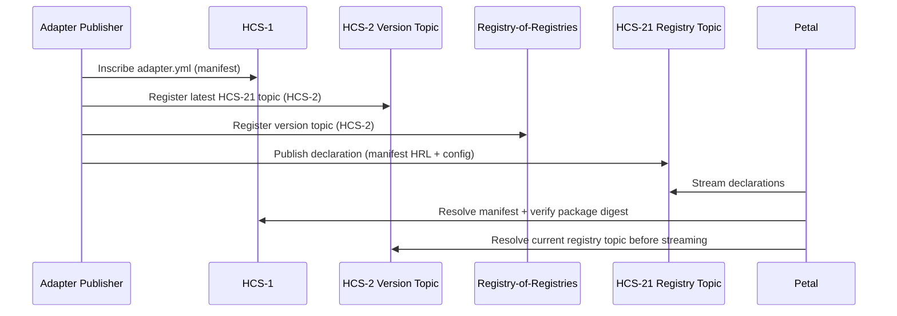

HCS-21 keeps Floras in sync by pairing a manifest (HCS-1) with on-chain declarations. This tutorial covers every step:

1. Draft the manifest and capability metadata.
2. Inscribe it via HCS-1.
3. Wire the layered topics (registry-of-registries → version pointer → HCS-21 registry).
4. Publish the declaration referencing your Flora/adapter config.
5. Query/filter adapters based on capability tags.

---

## HCS-21 spec primer

- **Manifest**: stored via HCS-1/IPFS/Arweave/HTTPS (with integrity). Includes runtime requirements, capability metadata, and consensus schema (`consensus.entity_schema`).
- **Declaration**: small (&lt;1 KB) JSON message on the HCS-21 topic referencing `manifest`, `config` (Flora/appnet), `state_model`, and package integrity.
- **Layered registry**: registry-of-registries entries now point to a **version pointer** topic (HCS-2, non-indexed) which, in turn, points to the active HCS-21 topic. Updating the registry only requires a new pointer message—no changes to the discovery list.
- **Filtering**: Capability metadata (`discovery_tags`, `communication_channels`, `extras`) lets registries surface filters without downloading each manifest.



> **Tip:** Declarations must fit within 1 KB, so keep description fields short and rely on the manifest for longer prose.

---

## 0. Understand the layered registry

Adapter discovery now uses three deterministic layers:

1. **Registry-of-registries topic (HCS-2 indexed)** — the global list of adapter categories.
2. **Version pointer topic (HCS-2 non-indexed)** — only the latest message matters; it points to the current HCS-21 registry topic.
3. **Adapter registry topic (HCS-21)** — stores the declarations.

When rotating a registry, publish a new message to the version pointer topic with the new HCS-21 topic ID; consumers always read the pointer first, so the discovery list stays unchanged.

---

## 1. Draft the manifest (`adapter.yml`)

Build a self-describing manifest that matches the schema in `src/hcs-21/types.ts`. Example:

```yaml
meta:
  spec_version: '1.0'
  adapter_version: '1.3.2'
  generated: 2025-02-12T18:11:00Z
adapter:
  id: npm/@hol-org/example-adapter@1.3.2
  name: Example Adapter
  maintainers:
    - name: Hashgraph Online
      contact: ops@hashgraph.online
  license: Apache-2.0
package:
  registry: npm
  artifacts:
    - url: npm://@hol-org/example-adapter@1.3.2
      digest: sha384-demo-digest
runtime:
  platforms: ['node>=20.10.0']
  primary: node
  entry: dist/index.js
capabilities:
  discovery: true
  discovery_tags: [agents, marketplaces]
  communication: true
  communication_channels: [text, x402]
  protocols: [x402, uaid]
  extras:
    locales: [en, es]
    rate_limit_hpm: 120
consensus:
  entity_schema: hcs-21.entity-consensus@1
  required_fields: [entity_id, registry, state_hash, epoch]
  hashing: sha384
```

These `discovery_tags`, `communication_channels`, and `extras` fields make it easy for front-ends to filter adapters.

---

## 2. Inscribe the manifest (HCS-1)

```ts
import fs from 'node:fs';
import yaml from 'js-yaml';
import { HCS21Client } from '@hol-org/standards-sdk';

const hcs21 = new HCS21Client({
  network: process.env.HEDERA_NETWORK || 'testnet',
  operatorId: process.env.HEDERA_OPERATOR_ID!,
  operatorKey: process.env.HEDERA_OPERATOR_KEY!,
});

async function inscribeManifest() {
  const manifestYaml = fs.readFileSync('adapter.yml', 'utf8');
  const manifest = yaml.load(manifestYaml) as object;

  const pointer = await hcs21.inscribeMetadata({
    document: manifest,
    fileName: 'adapter.yml',
  });

  console.log('Manifest HRL:', pointer.pointer, 'sequence:', pointer.manifestSequence);
  return pointer;
}
```

The pointer is usually `hcs://1/<topicId>`. Keep both the pointer and `manifestSequence` if you want to pin that exact message.

---

## 3. Wire the registry topics

Create (or reuse) the layered topics before publishing adapters:

1. **Adapter registry topic (`type=0`)** — stores HCS-21 declarations.
2. **Adapter category topic (`type=2`)** — registered inside the discovery topic so consumers can find this registry.
3. **Version pointer topic (HCS-2 non-indexed)** — exposes the latest declaration topic for each adapter slug.

```ts
const registryTopicId =
  process.env.HCS21_REGISTRY_TOPIC_ID ||
  (await hcs21.createRegistryTopic({
    ttl: 86400,
    indexed: 0,
    type: HCS21TopicType.ADAPTER_REGISTRY,
    transactionMemo: 'adapter-registry:price',
  }));

const categoryTopicId =
  process.env.HCS21_CATEGORY_TOPIC_ID ||
  (await hcs21.createAdapterCategoryTopic({
    ttl: 86400,
    metaTopicId: process.env.HCS21_REGISTRY_METADATA_POINTER,
    transactionMemo: 'adapter-registry:price:category',
  }));

await hcs21.registerCategoryTopic({
  discoveryTopicId: process.env.HCS21_DISCOVERY_TOPIC_ID!,
  categoryTopicId,
  metadata: process.env.HCS21_REGISTRY_METADATA_POINTER,
  memo: 'adapter-registry:price',
});

const versionTopicId =
  process.env.HCS21_VERSION_POINTER_TOPIC_ID ||
  (await hcs21.createAdapterVersionPointerTopic({
    ttl: 86400,
    memoOverride: 'hcs-2:1:86400',
    transactionMemo: 'adapter-registry:price:pointer',
  }));

await hcs21.publishVersionPointer({
  versionTopicId,
  declarationTopicId: registryTopicId,
  memo: 'adapter:npm/@hol-org/example-adapter',
});

await hcs21.publishCategoryEntry({
  categoryTopicId,
  adapterId: 'npm/@hol-org/example-adapter',
  versionTopicId,
  metadata: process.env.HCS21_REGISTRY_METADATA_POINTER,
});
```

- Rotating to a new registry topic only requires another `publishVersionPointer` call with the new `declarationTopicId`.
- Discovery entries remain stable; consumers always resolve the slug (`adapter:npm/@hol-org/example-adapter`) to discover the pointer before streaming declarations.

---

## 4. Publish the HCS-21 declaration

```ts
async function publishDeclaration() {
  const manifestPointer = await inscribeManifest();
  const pointer = await hcs21.resolveVersionPointer(
    process.env.HCS21_VERSION_POINTER_TOPIC_ID!,
  );
  const registryTopicId =
    process.env.HCS21_REGISTRY_TOPIC_ID || pointer.declarationTopicId;

  await hcs21.publishDeclaration({
    topicId: registryTopicId,
    declaration: {
      op: 'register',
      adapterId: 'npm/@hol-org/example-adapter@1.3.2',
      entity: 'agent',
      adapterPackage: {
        registry: 'npm',
        name: '@hol-org/example-adapter',
        version: '1.3.2',
        integrity: 'sha384-demo-digest',
      },
      manifest: manifestPointer.pointer,
      manifestSequence: manifestPointer.manifestSequence,
      config: {
        account: process.env.FLORA_ACCOUNT_ID!,
        threshold: '2/3',
        ctopic: process.env.FLORA_TOPIC_COMMUNICATION!,
        ttopic: process.env.FLORA_TOPIC_TRANSACTION!,
        stopic: process.env.FLORA_TOPIC_STATE!,
      },
      stateModel: 'hcs-21.entity-consensus@1',
    },
  });

  console.log('Adapter declaration published');
}

publishDeclaration().catch(console.error);
```

If you’re updating an existing adapter, use `op: 'update'`. To deprecate it, set `op: 'delete'`.

---

## 5. Query & filter declarations

Front-ends can use `fetchDeclarations` to pull all adapters for a registry and filter based on capability metadata:

```ts
async function listAdapters() {
  const pointer = await hcs21.resolveVersionPointer(
    process.env.HCS21_VERSION_POINTER_TOPIC_ID!,
  );
  const registryTopicId =
    process.env.HCS21_REGISTRY_TOPIC_ID || pointer.declarationTopicId;
  const messages = await hcs21.fetchDeclarations(
    registryTopicId,
    { limit: 100, order: 'desc' },
  );

  return messages
    .map(({ declaration }) => declaration)
    .filter(declaration => {
      const isNpm = declaration.package.registry === 'npm';
      const matchesFlora =
        declaration.config.account === process.env.FLORA_ACCOUNT_ID;
      return isNpm && matchesFlora;
    })
    .map(declaration => ({
      adapterId: declaration.adapter_id,
      discoveryTags: declaration.capabilities?.discovery_tags ?? [],
      protocols: declaration.capabilities?.protocols ?? [],
    }));
}
```

Build UI filters directly from `capabilities.discovery_tags`, `capabilities.communication_channels`, `capabilities.extras`, etc.

---

## 6. Checklist

- [ ] Manifest matches the schema and includes useful capability metadata.
- [ ] Inscribed via HCS-1; pointer stored alongside adapter code.
- [ ] Version pointer topic registered in the registry-of-registries list and kept up to date.
- [ ] Declaration references the correct Flora topics/threshold via `config`.
- [ ] Front-ends resolve the pointer topic before streaming and filter using capabilities.
- [ ] `flora.yaml` (and HCS-11 profile) include `flora.config.uri` so Petals know where to find adapter requirements.

Your adapter is now discoverable, verifiable, and filterable alongside other Flora-ready components. Next step: keep Petals in sync by running the HCS-17 state proof pipeline.

---

## Notes from production

- **Manifest size**: Keep YAML under 1 MiB. If you need to attach large schemas or docs, store them separately (HCS-1/IPFS) and reference via `extras`.
- **Declaration cap**: The 1 KB limit is strict. Encode only what Petals need to resolve the manifest and Flora context; descriptions belong in the manifest.
- **Flora alignment**: Petals ignore declarations if `config.account/threshold/topics` don’t match their `flora.yaml`. Double-check before publishing updates.
- **Filtering UX**: Populate `capabilities.discovery_tags`, `communication_channels`, and `extras` consistently; registry UIs rely on those fields to offer filters.
