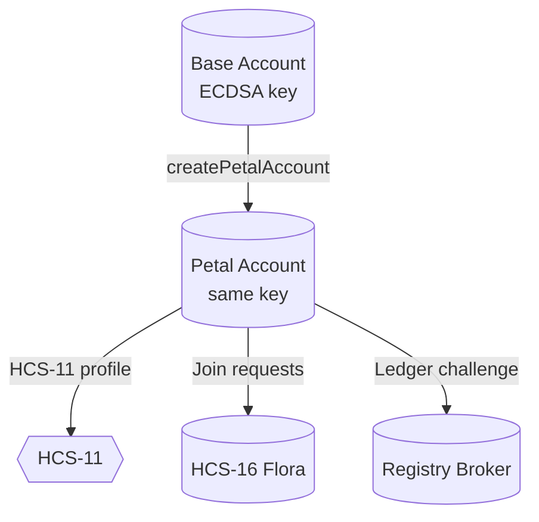

> **Goal:** start with a plain Hedera account and finish with a production-ready Petal that publishes an HCS-11 profile and proves membership via HCS-15.

---

## 0. Understand HCS-15 (Petal accounts)

The HCS-15 spec (see `/docs/standards/hcs-15.md`) is explicit about what makes a Petal “valid.” It’s worth restating the rules because every downstream workflow—HCS-16 thresholds, HCS-17 hashes, HCS-21 adapters—assumes you obey them.

### Canonical requirements

| Requirement | Why it matters |
| ----------- | -------------- |
| **Key reuse** (no alias) | Floras can compare public keys between a base and a Petal to prove membership without extra signatures. |
| **HCS-11 profile** | Discovery services (HCS-18) and registries need a canonical place to read Petal metadata. |
| **Ledger challenge** | Before a Petal is trusted with state updates or escrow, it must prove control of its key (registry broker challenge, schedule sign, etc.). |
| **Discovery announcement** | Not mandatory, but recommended: Petals should announce availability over HCS-18 topics so other Floras can discover ready members. |



All the SDK helpers we’ll use (`HCS15Client`, `HCS11Client`, registry-broker client) exist to satisfy those requirements without hand-coding transactions.

---

## 1. Environment & dependencies

1. Install Node.js ≥ 20 and pnpm ≥ 10.
2. Create a project and install the SDK:
   ```bash
   pnpm add @hashgraphonline/standards-sdk @hashgraph/sdk
   ```
3. Prepare `.env` (never commit secrets):
   ```
   HEDERA_NETWORK=testnet
   HEDERA_OPERATOR_ID=0.0.1234        # base account that funds Petals
   HEDERA_OPERATOR_KEY=302e02...

   # optional: location to cache generated Petal accounts
   PETAL_CACHE=./.petals.json

   # base account + key used for Petal creation
   PETAL_BASE_ACCOUNT_ID=0.0.5678
   PETAL_BASE_KEY=302e02...
   ```
4. Smoke-test the credentials:
   ```bash
   pnpm dlx hedera-cli account:balance --account $HEDERA_OPERATOR_ID --key $HEDERA_OPERATOR_KEY --network $HEDERA_NETWORK
   ```
   You should see the account balance printed without errors before moving on.

---

## 2. Generate/reuse a base key

Petals **must** reuse the base account ECDSA key. If the base account lives in a hardware wallet or custodial setup, export the ECDSA private key first (HIP-32 style) and skip this step. Otherwise generate a fresh one:

```ts
import { PrivateKey } from '@hashgraph/sdk';
import fs from 'node:fs';

const petalBaseKey = PrivateKey.generateECDSA();
fs.writeFileSync('.petal-key.txt', petalBaseKey.toStringDer());
```

Fund the corresponding account with a few HBAR (e.g., via the Hedera Portal faucet) and note the account ID.

> 📝 Tip: the repo includes `demo/hcs-15/petal-accounts-demo.ts`, which will generate the key, fund it via a configured faucet, and persist `.env` entries for you. Run `pnpm tsx demo/hcs-15/petal-accounts-demo.ts` if you prefer the scripted workflow.

---

## 3. Create the Petal account

```ts
// src/petals/create-petal.ts
import { HCS15Client } from '@hashgraphonline/standards-sdk';
import { PrivateKey } from '@hashgraph/sdk';

const operatorId = process.env.HEDERA_OPERATOR_ID!;
const operatorKey = process.env.HEDERA_OPERATOR_KEY!;

const hcs15 = new HCS15Client({
  network: (process.env.HEDERA_NETWORK || 'testnet') as 'testnet' | 'mainnet',
  operatorId,
  operatorKey,
});

async function createPetalAccount() {
  const basePrivateKey = PrivateKey.fromStringECDSA(
    process.env.PETAL_BASE_KEY!,
  );

  const { accountId, profile } = await hcs15.createPetalAccount({
    basePrivateKey,
    initialBalance: 5, // HBAR
    accountMemo: 'HCS-15 Petal',
    profile: {
      baseAccountId: process.env.PETAL_BASE_ACCOUNT_ID!,
      displayName: 'Demo Petal A',
      alias: 'demo-petal-a',
      ttl: 300,
    },
  });

  console.log('Petal created:', accountId);
  console.log('Profile topic:', profile?.profileTopicId);
  return { accountId, basePrivateKey };
}

createPetalAccount().catch(console.error);
```

This executes the `buildHcs15PetalAccountCreateTx` path, so the resulting account automatically shares the base key.

After the transaction settles, you should see:

```
Petal created: 0.0.910001
```

Mirror node verification (next step) will confirm the keys match. If you want deterministic naming, set `accountMemo: 'Flora Demo • Petal A'` and it will appear in Hedera explorers.

---

## 4. Verify the Petal (mirror-node check)

```ts
import { HCS15Client } from '@hashgraphonline/standards-sdk';

async function verifyPetal(petalAccountId: string, baseAccountId: string) {
  const ok = await hcs15.verifyPetalAccount(petalAccountId, baseAccountId);
  if (!ok) {
    throw new Error('Petal verification failed – keys did not match');
  }
  console.log('Petal account verified via mirror node');
}
```

`verifyPetalAccount` fetches both accounts from the mirror node and ensures their public keys are identical.

CLI alternative (uses the same API under the hood):

```bash
pnpm tsx demo/hcs-15/petal-accounts-demo.ts verify --petal 0.0.910001 --base $HEDERA_OPERATOR_ID
```

If verification fails:

| Symptom | Likely cause | Fix |
| ------- | ------------ | --- |
| `Petal verification failed` | The Petal was created with a different key (maybe ED25519) | Re-create the Petal using `PrivateKey.fromStringECDSA` |
| Mirror node error | Account hasn’t propagated yet | Wait ~5s on testnet and retry |
| `NOT_FOUND` | Account ID typo | Double-check `.env` and script arguments |

---

## 5. Confirm the HCS-11 Petal profile

`createPetalAccount` can publish the HCS-11 profile and update the Petal account memo for you (see step 3). You should still confirm the memo is set and resolvable.

Recommended fields for Petal profiles:

| Field | Notes |
| ----- | ----- |
| `display_name` | Human-readable identifier (“Flora Oracle Petal A”). |
| `type` | Use `1` (AI agent) or whichever value you’ve allocated for Petals. |
| `socials` | Provide at least one contact channel (X, Discord, Matrix). |
| `base_account` | Required for Petals; must reference the base account that shares the key. |
| `flora.config.uri` | Points to `flora.yaml` so matchmakers can ensure compatibility. |
| `ledger.challenge` (optional) | Include instructions for ledger challenge endpoints if you run your own. |

To verify the memo + retrieval flow:

```bash
pnpm dlx hedera-cli account:memo --account $PETAL_ACCOUNT
# should show hcs-11:hcs://1/<topic>
```

---

## 6. Pass the ledger authentication challenge

Before a Petal is trusted with registry interactions (credit purchases, encryption key registration, x402 payments), it must prove control of its ledger key. The registry broker exposes a challenge/response flow. Example:

```ts
import { RegistryBrokerClient } from '@hashgraphonline/standards-sdk';

const broker = new RegistryBrokerClient({
  baseUrl: 'https://hol.org/registry/api/v1',
  userAgent: '@hol-org/petal',
});

await broker.authenticateWithLedgerCredentials({
  accountId: petalAccountId,
  network: 'hedera:testnet',
  hederaPrivateKey: process.env.PETAL_BASE_KEY!,
  label: 'petal-auth',
});

console.log('Ledger challenge passed');
```

This is the same utility used in `/demo/hcs-15/petal-accounts-demo.ts`. Run it whenever you rotate keys or migrate to a new registry broker API.

---

## 7. Optional: announce on HCS-18

If you want other Floras to discover your Petal automatically, emit an HCS-18 announcement. The SDK’s `HCS18Client` (see `demo/hcs-18/flora-discovery-demo.ts`) will build the `petal_available` message for you. Minimal example:

```ts
import { HCS18Client } from '@hashgraphonline/standards-sdk';

const hcs18 = new HCS18Client({
  network: process.env.HEDERA_NETWORK || 'testnet',
  operatorId: petalAccountId,
  operatorKey: process.env.PETAL_BASE_KEY!,
});

await hcs18.announce({
  discoveryTopicId: process.env.HCS18_DISCOVERY_TOPIC!,
  data: {
    account: petalAccountId,
    petal: { name: 'Demo Petal A', priority: 500 },
    capabilities: {
      protocols: ['hcs-16'],
      group_preferences: { threshold_ratios: [2 / 3] },
    },
  },
});
```

Downstream Floras can stream that topic and invite Petals that match their adapter set or latency requirements.

---

## 8. CLI workflows (from this repo)

| Command | Description |
| ------- | ----------- |
| `pnpm tsx demo/hcs-15/petal-accounts-demo.ts` | Interactive flow that creates a Petal, publishes the HCS-11 profile, and stores the credentials in `.env`. |
| `pnpm tsx demo/hcs-18/flora-discovery-demo.ts` | End-to-end discovery scenario (Petals announce, Floras respond, join requests exchanged). |
| `pnpm tsx demo/hcs-16/flora-e2e-demo.ts` | Creates multiple Petals, sets up a Flora, and walks through join votes/join acceptance. |

Use these demos both as a learning tool and as regression tests for your own modifications.

---

## 9. Checklist & troubleshooting

- [ ] Base ECDSA key generated and backed up (hardware or `.petal-key.txt`).
- [ ] Petal account created via `HCS15Client#createPetalAccount`.
- [ ] `verifyPetalAccount` returns `true`.
- [ ] HCS-11 profile published (memo = `hcs-11:hcs://…`).
- [ ] Ledger challenge with registry broker passes.
- [ ] Optional: HCS-18 announcement emitted.
- [ ] Subscribed to Flora C/T/S topics and adapters installed.

**Common issues**

| Issue | Fix |
| ----- | --- |
| Petal account creation fails with `KEY_MISMATCH` | Ensure `PrivateKey.fromStringECDSA` (not ED25519) and that the base account is ECDSA-enabled. |
| HCS-11 publish fails (`INVALID_SIGNATURE`) | Make sure `operatorId/operatorKey` correspond to the Petal, not the base operator. |
| Registry broker challenge fails | Petal account needs at least a few HBAR; also ensure the base key is funded and not throttled. |

Once everything passes, proceed to [Floras · Part 1](./floras.md) to wire these Petals into a threshold Flora, then [Floras · Part 2](./floras-price-oracle.md) to build the price oracle.
